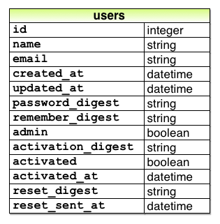
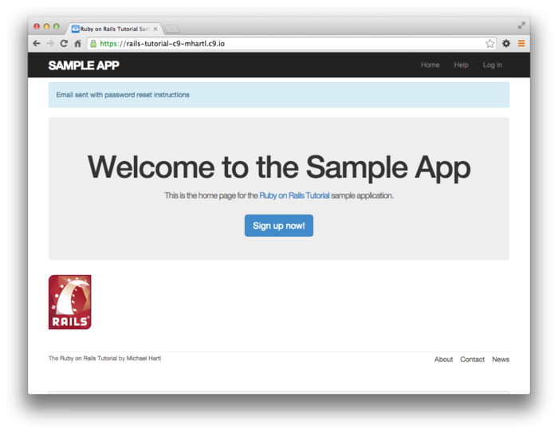

# 제 12장 패스워드의 재설정

[제 11장](Chapter11.md) 에서 account의 유효화를 구현해보았습니다. 유저의 메일주소가 본인의 것이라는 확인도 했습니다. 이것으로 패스워드를 잊어버렸을 때의 *패스워드  재설정* 의 구현을 위한 준비도 되었습니다. 이번 챕터에서 확인할 내용의 대부분은, account 유효화에서 확인해온 내용들과 비슷합니다. 실제로 몇가지 구현은 이미 [11장](Chapter11.md) 에서 본 것들과 같은 흐름으로 개발해볼 것 입니다. 그렇다고는 해도 패스워드를 재설정하는 경우는 뷰를 한 가지 변경할 필요가 있으며 새로운 form이 추가로 2개 (메일 레이아웃용과 새로운 패스워드 송신용) 가 필요할 것 입니다.


코드를 실제로 작성하기 전에, 패스워드 재설정을 상정하는 순서를 목업으로 확인해봅시다. (=스크린샷을 수정한 모형) 우선 sample 어플리케이션의 로그인 form에 "Forgot password" 링크를 추가합니다. 이 "forgot password" 링크를 클릭하면 form이 표시되고 거기서 메일주소를 입력하여 메일을 발신하면, 해당 메일에 패스워드 재설정용의 링크가 기재되어 있습니다. 이 재설정용의 링크를 클릭하면 유저의 패스워드를 재설정해도 되는지 확인하는 form이 표시됩니다.


[제 11장](Chapter11.md) 을 진행하면, 패스워드재설정용의 메일러를 이미 생성했을 것입니다. ([11.2](Chapter11.md#112-account- 유효화의-메일-발신)) 이번 챕터에서는 11장에서 생성한 메일러에 리소스와 데이터 모델을 추가하여, 패스워드의 재설정을 구현해볼 것 입니다. 또한 실제로 구현은 12.3에서부터 진행해볼 것 입니다.


account 유효화 구현할 떄와 많이 비슷합니다. PasswordResets 리소스를 생성하고, 재설정용의 토큰과 그것에 대응하는 Digest를 저장하는 것이 이번 챕터의 목적입니다. 전체적인 흐름은 다음과 같습니다.

1. 유저가 패스워드의 재설정을 리퀘스트하면, 유저가 입력한메일주소를 Key로하여 데이터베이스로부터 유저를 검색한다.
2. 해당 메일주소가 데이터베이스에 존재하는 경우, 재설정용 토큰과 재설정용 Digest을 생성한다.
3. 재설정용 Digest는 데이터베이스에 저장해두고, 재설정용 토큰은 메일주소와 같이 유저에게 발신하는 유효화용 메일의 링크에 같이 보낸다.
4. 유저가 메일 링크를 클릭하면, 메일주소를 Key로 하여 유저를 검색하고, 데이터베이스 내의 저장한 재설정용 Digest와 비교한다 (토큰을 인증한다.)
5. 인증에 성공하면, 패스워드 변경용의 Form을 유저에게 표시한다.


## 12.1 PasswordResets 리소스

세션([8.1](Chapter8.md#81-session)) 이나 Account 유효화([제 11장](Chapter11.md)) 때와 마찬가지로, 일단 PasswordResets 리소스의 모델링부터 시작해봅시다. 이번에도 새로운 모델은 만들지 않고, 대신에 필요한 데이터 (재설정용의 Digest등) 을 User모델에게 추가해나가는 형태로 진행해봅시다.


PasswordResets도 리소스로서 다루어보고자합니다. 우선 표준적인 RESTful한 URL을 준비해봅시다. 유효화를 진행할 때는 `edit` 액션만을 다루었습니다만, 이번에는 패스워드를 재설정하는 Form이 필요하기 때문에, 뷰를 출력하기 위해 `new` 액션과 `edit` 액션이 필요합니다. 또한 각각의 액션에 대응하는 최종적인 RESTful한 라우팅이 필요합니다.


위 변경을 적용하기 전에, 언제나처럼 토픽 브랜치를 생성해봅시다.

`$ git checkout -b password-reset`

### 12.1.1 PasswordResets 컨트롤러

준비가 되었으니, 제일 첫 번째 단계로는 패스워드 재설정용의 컨트롤러를 생성해봅시다. 아까 말씀드렸다시피 이번에는 뷰도 생성하기 때문에, `new` 액션과 `edit` 액션도 같이 생성하고 있는 점을 주의해주세요.

`$ rails genenrate controller PasswordResets new edit --no-test-framework`

위 커맨드에서는 테스트를 생성하지 않는 옵션을 지정하고 있는 점을 확인해주세요. 이것은 컨트롤러의 UnitTest를 하는 대신에 [11.3.3](Chapter11.md#1133-유효화와-테스트의-Refactoring) 에서의 IntegrationTest 로 커버할 것 입니다.


또한 이번 구현에서는 새로운 패스워드를 재설정하기 위한 Form 과 User 모델 내부의 패스워드를 변경하기 위한 Form이 필요하기 때문에, `new`,`create`,`edit`,`update` 의 라우팅도 준비합시다. 이 변경은 저번과 마찬가지로 라우팅 파일의 `resource` 코드에서 구현할 수 있습니다.

```ruby
# confign/routes.rb
Rails.application.routes.draw do
  root   'static_pages#home'
  get    '/help',    to: 'static_pages#help'
  get    '/about',   to: 'static_pages#about'
  get    '/contact', to: 'static_pages#contact'
  get    '/signup',  to: 'users#new'
  get    '/login',   to: 'sessions#new'
  post   '/login',   to: 'sessions#create'
  delete '/logout',  to: 'sessions#destroy'
  resources :users
  resources :account_activations, only: [:edit]
  resources :password_resets,     only: [:new, :create, :edit, :update]
end
```

위 코드는 RESTful의 라우팅을 따릅니다. 예를들어 "forgot password" form으로의 링크 생성 시에, 아래 표에 있는 named root를 사용합니다.

`new_password_reset_path`

| **HTTP Request** | **URL**                       | **Action** | **Named root**                   |
| ---------------- | ----------------------------- | ---------- | -------------------------------- |
| `GET`            | /password_resets/new          | `new`      | `new_password_reset_path`        |
| `POST`           | /password_resets              | `create`   | `password_resets_path`           |
| `GET`            | /password_resets/<token>/edit | `edit`     | `edit_password_reset_url(token)` |
| `PATCH`          | /password_resets/<token>      | `update`   | `password_reset_url(token)`      |

```erb
<!-- app/views/sessions/new.html.erb -->
<% provide(:title, "Log in") %>
<h1>Log in</h1>

<div class="row">
  <div class="col-md-6 col-md-offset-3">
    <%= form_for(:session, url: login_path) do |f| %>

      <%= f.label :email %>
      <%= f.email_field :email, class: 'form-control' %>

      <%= f.label :password %>
    <!-- 수정 -->
      <%= link_to "(forgot password)", new_password_reset_path %>
    <!-- 수정 -->    
      <%= f.password_field :password, class: 'form-control' %>

      <%= f.label :remember_me, class: "checkbox inline" do %>
        <%= f.check_box :remember_me %>
        <span>Remember me on this computer</span>
      <% end %>

      <%= f.submit "Log in", class: "btn btn-primary" %>
    <% end %>

    <p>New user? <%= link_to "Sign up now!", signup_path %></p>
  </div>
</div>
```


##### 연습

1. 이 시점에서 테스트 코드가 전부 통과하는 것을 확인해봅시다.
2. 위 표에서의 named root에서는, `_path` 가 아닌 `_url` 을 사용하도록 기재되어 있습니다. 왜일까요 생각해봅시다. *Hint*: Account 유효화에서 다루어보았던 연습에서의 이유과 같은 이유입니다. ([11.1.1](Chapter11.md#1111-accountactivations-controller))

### 12.1.2 새로운 패스워드의 설정

패스워드 재설정의 데이터모델도, account 유효화의 경우와 닮아있습니다. remember 토큰 ([제 9장](Chapter9.md)) 이나 유효화 토큰 ([제 11장](Chapter11.md)) 의 구현 패턴처럼, 패스워드의 재설정도 토큰용의 가상의 속성과, 그것에 대응하는 Digest를 준비해봅시다. 만약 토큰을 해시화하지 않고 (즉 평문인 채로) 데이터베이스에 저장하면, 공격자가 데이터베이스를 공격하여 토큰을 빼내었을 때, 보안상의 문제가 생깁니다. 즉, 공격자가 유저의 메일 주소로 패스워드 재설정의 리퀘스트를 송신하고, 해당 메일과 훔쳐낸 토큰을 조합하여 공격자가 패스워드 재설정 링크로 접속하면, Account를 해킹할 수 있습니다. 따라서 패스워드의 재설정에는 반드시 Digest를 사용하도록 합시다. 보안상의 주의점은 1가지 더 있습니다. 그것은 재설정용의 링크는 되도록 단시간 (몇 시간 정도)의 시간제한을 설정해야만 합니다. 때문에 재설정 메일의 발신시간도 기록할 필요가 있습니다. 위의 배경을 기반으로하여 `reset_digest` 속성과  `reset_sent_at` 속성을 User 모델에 추가한 결과는 아래와 같습니다.



다음 커맨드를 실행합시다.

`$ rails generate migration add_reset_to_users reset_digest:string reset_sent_at:datetime`

언제나처럼 마이그레이션을 실행해봅시다.

`$ rails db:migrate`

새로운 패스워드 재설정의 화면을 생성하기 위해, 이전에 소개한 방법으로 해보도록 합시다. 즉, 새로운 세션을 생성하기 위해 로그인 Form을 사용해봅시다. 아래 코드를 확인해주세요.

```erb
<!-- app/views/sessions/new.html.erb -->
<% provide(:title, "Log in") %>
<h1>Log in</h1>

<div class="row">
  <div class="col-md-6 col-md-offset-3">
    <%= form_for(:session, url: login_path) do |f| %>

      <%= f.label :email %>
      <%= f.email_field :email, class: 'form-control' %>

      <%= f.label :password %>
      <%= f.password_field :password, class: 'form-control' %>

      <%= f.label :remember_me, class: "checkbox inline" do %>
        <%= f.check_box :remember_me %>
        <span>Remember me on this computer</span>
      <% end %>

      <%= f.submit "Log in", class: "btn btn-primary" %>
    <% end %>

    <p>New user? <%= link_to "Sign up now!", signup_path %></p>
  </div>
</div>
```

새로운 패스워드 재설정 Form은 위 코드와 매우 비슷합니다만, 중요한 차이점으로는 `form_for` 에서 다루는 소스와 URL 이 다른 점과, 패스워드 속성이 생략되어있는 점입니다. 변경을 반영한 결과는 아래와 같습니다.

```erb
<!-- app/views/password_resets/new.html.erb -->
<% provide(:title, "Forgot password") %>
<h1>Forgot password</h1>

<div class="row">
  <div class="col-md-6 col-md-offset-3">
    <%= form_for(:password_reset, url: password_resets_path) do |f| %>
      <%= f.label :email %>
      <%= f.email_field :email, class: 'form-control' %>

      <%= f.submit "Submit", class: "btn btn-primary" %>
    <% end %>
  </div>
</div>
```


##### 연습 

1. 위 코드에서 `form_for` 메소드에서는 어째서 `@password_reset` 이 아닌 `:password_reset` 을 사용하고 있는 걸까요? 생각해봅시다.

### 12.1.3 create 액션에서의 패스워드 재설정

Form 에서 데이터를 송신한 다음, 해당 메일주소를 Key로하여 유저를 데이터베이스에서 검색합니다. 패스워드 재설정용 토큰과 메일 발신시의 타임스탬프에서 데이터베이스의 속성을 업데이트할 필요가 있습니다. 그 다음, 루트URL로 리다이렉트하여 플래시메세지를 유저에게 표시합니다. 발신이 무효한 경우는, 로그인때와 마찬가지로 `new` 페이지를 출력하고 `flash.now` 메세지를 표시합니다. 수정의 결과는 아래와 같습니다.

```ruby
# app/controllers/password_resets_controller.rb
class PasswordResetsController < ApplicationController

  def new
  end

  def create
    @user = User.find_by(email: params[:password_reset][:email].downcase)
    if @user
      @user.create_reset_digest
      @user.send_password_reset_email
      flash[:info] = "Email sent with password reset instructions"
      redirect_to root_url
    else
      flash.now[:danger] = "Email address not found"
      render 'new'
    end
  end

  def edit
  end
end
```

User 모델 내부의 코드는  `before_create` 콜백 내부에서 사용되는 `create_activation_digest` 메소드와 비슷합니다.

```ruby
# app/models/user.rb
class User < ApplicationRecord
  attr_accessor :remember_token, :activation_token, :reset_token
  before_save   :downcase_email
  before_create :create_activation_digest
  .
  .
  .
  # account를 유효화한다.
  def activate
    update_attribute(:activated,    true)
    update_attribute(:activated_at, Time.zone.now)
  end

  # 유효화용 메일을 발신한다.
  def send_activation_email
    UserMailer.account_activation(self).deliver_now
  end

  # 패스워드 재설정용 속성을 설정한다. 
  def create_reset_digest
    self.reset_token = User.new_token
    update_attribute(:reset_digest,  User.digest(reset_token))
    update_attribute(:reset_sent_at, Time.zone.now)
  end

  # 패스워드 재설정용 메일을 발신한다.
  def send_password_reset_email
    UserMailer.password_reset(self).deliver_now
  end

  private

    # 메일 주소를 소문자화한다.
    def downcase_email
      self.email = email.downcase
    end

    # 유효화 토큰과 Digest를 생성 및 대입한다.
    def create_activation_digest
      self.activation_token  = User.new_token
      self.activation_digest = User.digest(activation_token)
    end
end
```

아래 스크린샷처럼 이 시점에서의 어플리케이션은 무효한 메일주소를 입력한 경우에도 정상적으로 동작합니다. 올바른 메일 주소를 입력한 경우에도 어플리케이션은 정상적으로 동작하기 위해서는 패스워드 재설정의 메일러 메소드를 정의할 필요가 있습니다.


#####  연습

1. 시험삼아 유효한 메일주소를 Form에 입력해봅시다. 어떠한 에러 메세지가 표시됩니까?
2. 콘솔에서, 앞서 연습문제에서 입력한 결과 (에러로 표시된 것)에 해당하는 user 오브젝트에는 `reset_digest` 와  `reset_sent_at` 이 있는 것을 확인해봅시다. 각각의 값은 어떻게 되어있나요?


## 12.2 패스워드 재설정의 메일 발신

[12.1](#121-passwordresets-리소스) 의 PasswordResets 컨트롤러에서 `create` 액션이 거의 동작할 수 있는 상태까지 만들어보았습니다. 남은 부분은 패스워드 재설정에 관한 메일을 발신하는 부분입니다.


이미 [11.1](Chapter11.md#111-AccountActivations_Resource) 를 했다면, User mailer (`app/mailers/user_mailer.rb`) 를 생성했을 때 디폴트로  `password_reset` 메소드도 같이 생성했을 것 입니다. 만약 [제 11장](Chapter11.md) 을 건너뛰었다면, 아래 커맨드를 실행시켜서 필요한 파일을 생성해주세요. (`account_activation` 에 관한 메소드는 생성하지 않아도 괜찮습니다.)

```
$ rails generate mailer UserMailer account_activation password_reset
```

### 12.2.1 패스워드 재설정의 메일과 템플릿

[11.3.3](Chapter11.md#1133-유효화와-테스트의-Refactoring) 에서는 User 메일러에 있는 코드를 User 모델로 옮기는 Refactoring을 하였습니다. 비슷한 Refactoring 작업을 패스워드 재설정에 대해서도 해보겠습니다.

`UserMailer.password_reset(self).deliver_now`

위 코드의 구현에 필요한 메소드는, [11.2](Chapter11.md#112-Account-유효화의-메일-발신) 에서 구현한 Account 유효화용 메소드와 거의 같습니다. 제일 처음으로 User 메일러에 `password_reset` 메소드를 작성하고, 이어서 텍스트 메일의 템플릿과 HTML 메일의 템플릿을 각각 정의합니다.

```ruby
class UserMailer < ApplicationMailer

  def account_activation(user)
    @user = user
    mail to: user.email, subject: "Account activation"
  end

  # 수정
  def password_reset(user)
    @user = user
    mail to: user.email, subject: "Password reset"
  end
end
```

```erb
<!-- app/views/user_mailer/password_reset.text.erb -->
To reset your password click the link below:

<%= edit_password_reset_url(@user.reset_token, email: @user.email) %>

This link will expire in two hours.

If you did not request your password to be reset, please ignore this email and
your password will stay as it is.
```

```erb
<!-- app/views/user_mailer/password_reset.html.erb -->
<h1>Password reset</h1>

<p>To reset your password click the link below:</p>

<%= link_to "Reset password", edit_password_reset_url(@user.reset_token,
                                                      email: @user.email) %>

<p>This link will expire in two hours.</p>

<p>
If you did not request your password to be reset, please ignore this email and
your password will stay as it is.
</p>
```

Account 유효화 메일의 경우 ([11.2](Chapter11.md#112-Account-유효화의-메일-발신)) 와 마찬가지로, Rails의 메일 프리뷰 기능으로 패스워드 재설정의 메일을 프리뷰해봅시다. 프리뷰를 코드는 이전 11장에서 봤던 코드와 똑같습니다.

```ruby
# Preview all emails at http://localhost:3000/rails/mailers/user_mailer
class UserMailerPreview < ActionMailer::Preview

  # Preview this email at
  # http://localhost:3000/rails/mailers/user_mailer/account_activation
  def account_activation
    user = User.first
    user.activation_token = User.new_token
    UserMailer.account_activation(user)
  end

  # Preview this email at
  # http://localhost:3000/rails/mailers/user_mailer/password_reset
  #추가
  def password_reset
    user = User.first
    user.reset_token = User.new_token
    UserMailer.password_reset(user)
  end
end
```

위 코드로 인하여 HTML메일과 텍스트 메일을 각각 프리뷰할 수 있게 되었습니다.


올바른 메일 주소로 발신했을 떄의 화면은 아래와 같으며, 해당 메일은 서버 로그에서는 아래 두 번째 내용와 같습니다.



```
Sent mail to michael@michaelhartl.com (66.8ms)
Date: Mon, 06 Jun 2016 22:00:41 +0000
From: noreply@example.com
To: michael@michaelhartl.com
Message-ID: <8722b257d04576a@mhartl-rails-tutorial-953753.mail>
Subject: Password reset
Mime-Version: 1.0
Content-Type: multipart/alternative;
 boundary="--==_mimepart_5407babbe3505_8722b257d045617";
 charset=UTF-8
Content-Transfer-Encoding: 7bit


----==_mimepart_5407babbe3505_8722b257d045617
Content-Type: text/plain;
 charset=UTF-8
Content-Transfer-Encoding: 7bit

To reset your password click the link below:

https://rails-tutorial-mhartl.c9users.io/password_resets/3BdBrXe
QZSWqFIDRN8cxHA/edit?email=michael%40michaelhartl.com

This link will expire in two hours.

If you did not request your password to be reset, please ignore
this email and your password will stay as it is.
----==_mimepart_5407babbe3505_8722b257d045617
Content-Type: text/html;
 charset=UTF-8
Content-Transfer-Encoding: 7bit

<h1>Password reset</h1>

<p>To reset your password click the link below:</p>

<a href="https://rails-tutorial-mhartl.c9users.io/
password_resets/3BdBrXeQZSWqFIDRN8cxHA/
edit?email=michael%40michaelhartl.com">Reset password</a>

<p>This link will expire in two hours.</p>

<p>
If you did not request your password to be reset, please ignore
this email and your password will stay as it is.
</p>
----==_mimepart_5407babbe3505_8722b257d045617--
```

##### 연습

1. 브라우저로부터 발신되는 메일의 프리뷰를 확인해봅시다. "Date" 란의 정보는 어떤가요?
2. 패스워드 재설정 Form에서 유요한 메일 주소로 발신해봅시다. 또한, Rails 서버의 로그를 보고 생성된 발신 메일의 내용을 확인해봅시다.
3. 콘솔에서 방금 전의 연습문제에서의 패스워드 재설정을 한 User 오브젝트를 찾아주세요. 오브젝트를 찾는다면 해당 오브젝트가 가지고 있는 `reset_digest` 와 `reset_sent_at`   의 값을 확인해보세요.

### 12.2.2 발신 메일의 테스트

Account 유효화의 테스트와 마찬가지로 메일러 메소드의 테스트 코드를 작성해봅시다.

```ruby
test/mailers/user_mailer_test.rb
require 'test_helper'

class UserMailerTest < ActionMailer::TestCase

  test "account_activation" do
    user = users(:michael)
    user.activation_token = User.new_token
    mail = UserMailer.account_activation(user)
    assert_equal "Account activation", mail.subject
    assert_equal [user.email], mail.to
    assert_equal ["noreply@example.com"], mail.from
    assert_match user.name,               mail.body.encoded
    assert_match user.activation_token,   mail.body.encoded
    assert_match CGI.escape(user.email),  mail.body.encoded
  end

  test "password_reset" do
    user = users(:michael)
    user.reset_token = User.new_token #추가
    mail = UserMailer.password_reset(user)
    assert_equal "Password reset", mail.subject
    assert_equal [user.email], mail.to
    assert_equal ["noreply@example.com"], mail.from
    assert_match user.reset_token,        mail.body.encoded
    assert_match CGI.escape(user.email),  mail.body.encoded
  end
end
```

이 코드는 테스트가 통과될 것 입니다.

`$ rails test`

#####  연습

1. 메일러의 테스트만 실행해봅시다. 이 테스트는 통과되나요?
2. 2번째 `CGI.escape` 를 삭제하면, 테스트가 실패되는 것을 확인해봅시다.


## 12.3 패스워드를 재설정해보자

무사히 발신 메일을 생성할 수 있게 되었습니다. 다음으로는 PasswordResets 컨트롤러의 `edit` 액션을 구현해봅시다. 또한 [11.3.3](Chapter11.md#1133-유효화와-테스트의-Refactoring) 과 마찬가지로 결합테스트를 사용하여 제대로 동작하고 있는지를 테스트해봅시다.

### 12.3.1 edit 액션에서 재설정

패스워드 재설정의 발신 메일에는 다음과 같은 링크가 포함되어있을 것 입니다.

`https://example.com/password_resets/3BdBrXeQZSWqFIDRN8cxHA/edit?email=fu%40bar.com`


