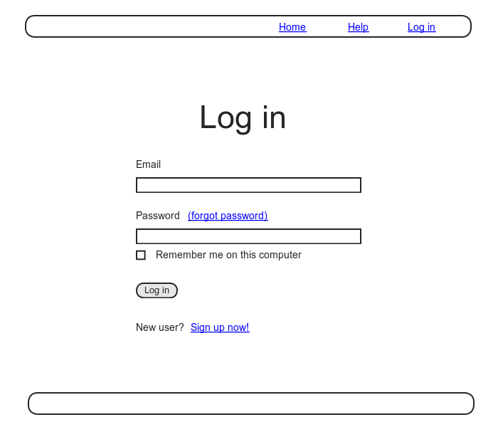
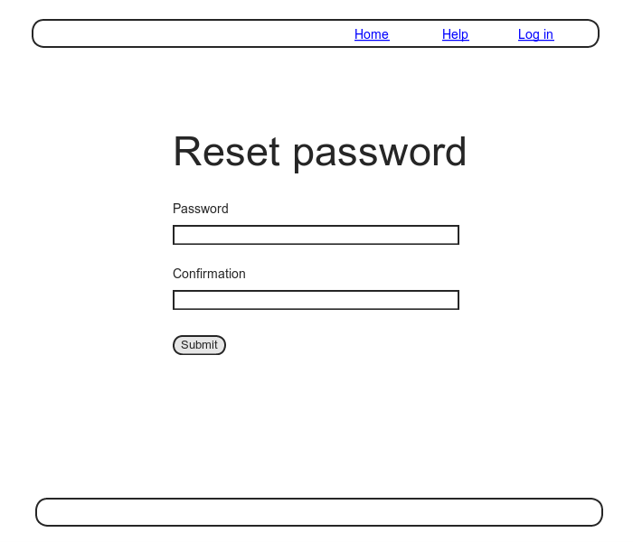
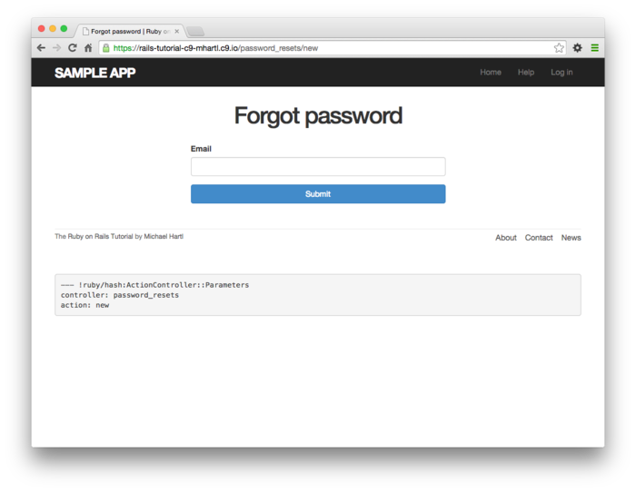
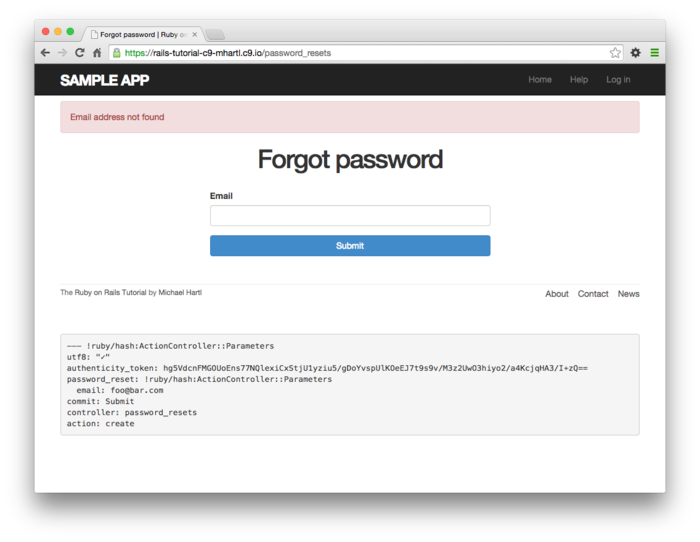
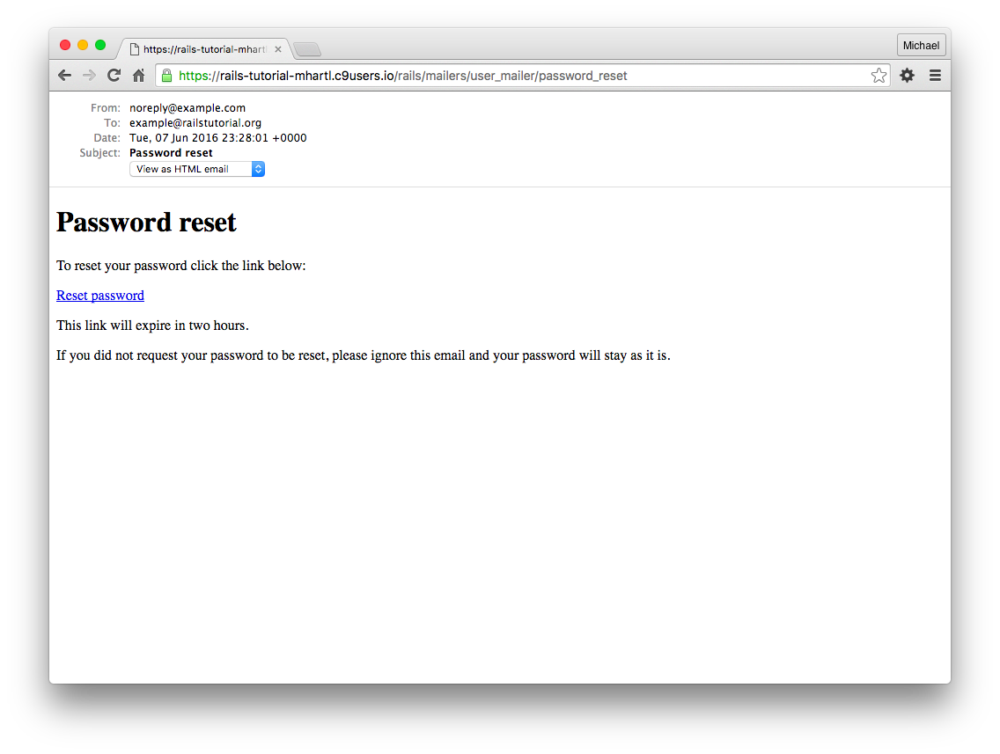
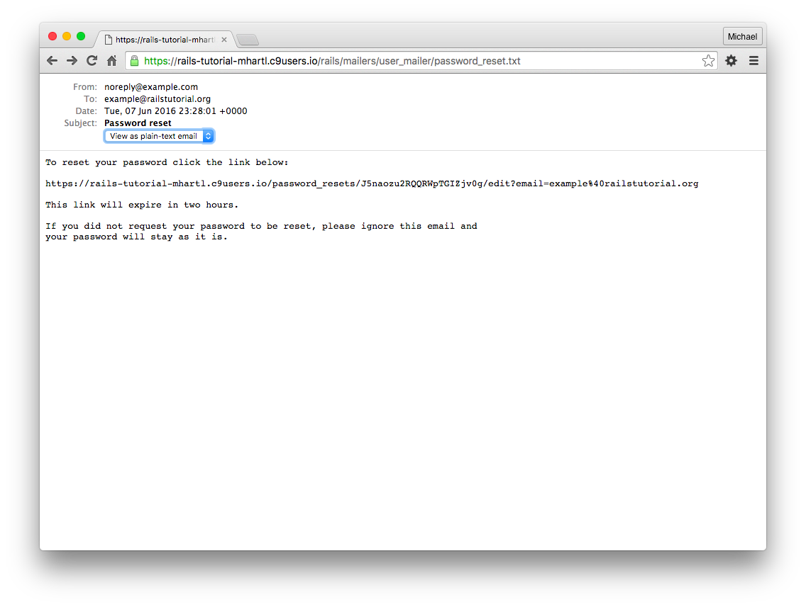
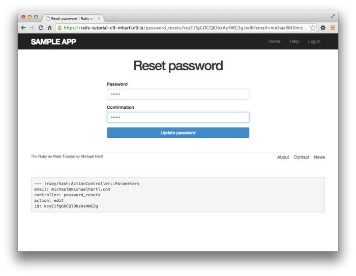
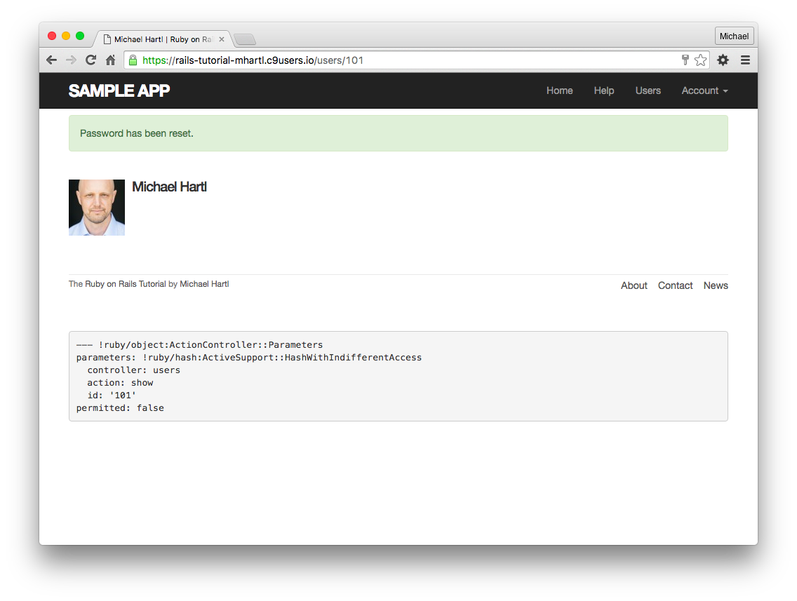
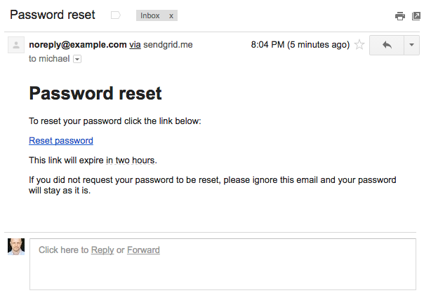

# 제 12장 패스워드의 재설정

[제 11장](Chapter11.md) 에서 account의 유효화를 구현해보았습니다. 유저의 메일주소가 본인의 것이라는 확인도 했습니다. 이것으로 패스워드를 잊어버렸을 때의 *패스워드  재설정* 의 구현을 위한 준비도 되었습니다. 이번 챕터에서 확인할 내용의 대부분은, account 유효화에서 확인해온 내용들과 비슷합니다. 실제로 몇가지 구현은 이미 [11장](Chapter11.md) 에서 본 것들과 같은 흐름으로 개발해볼 것 입니다. 그렇다고는 해도 패스워드를 재설정하는 경우는 뷰를 한 가지 변경할 필요가 있으며 새로운 form이 추가로 2개 (메일 레이아웃용과 새로운 패스워드 송신용) 가 필요할 것 입니다.


코드를 실제로 작성하기 전에, 패스워드 재설정을 상정하는 순서를 목업으로 확인해봅시다. (=스크린샷을 수정한 모형) 우선 sample 어플리케이션의 로그인 form에 "Forgot password" 링크를 추가합니다. 이 "forgot password" 링크를 클릭하면 form이 표시되고 거기서 메일주소를 입력하여 메일을 발신하면, 해당 메일에 패스워드 재설정용의 링크가 기재되어 있습니다. 이 재설정용의 링크를 클릭하면 유저의 패스워드를 재설정해도 되는지 확인하는 form이 표시됩니다.






[제 11장](Chapter11.md) 을 진행하면, 패스워드재설정용의 메일러를 이미 생성했을 것입니다. ([11.2](Chapter11.md#112-account- 유효화의-메일-발신)) 이번 챕터에서는 11장에서 생성한 메일러에 리소스와 데이터 모델을 추가하여, 패스워드의 재설정을 구현해볼 것 입니다. 또한 실제로 구현은 12.3에서부터 진행해볼 것 입니다.


account 유효화 구현할 떄와 많이 비슷합니다. PasswordResets 리소스를 생성하고, 재설정용의 토큰과 그것에 대응하는 Digest를 저장하는 것이 이번 챕터의 목적입니다. 전체적인 흐름은 다음과 같습니다.

1. 유저가 패스워드의 재설정을 리퀘스트하면, 유저가 입력한메일주소를 Key로하여 데이터베이스로부터 유저를 검색한다.
2. 해당 메일주소가 데이터베이스에 존재하는 경우, 재설정용 토큰과 재설정용 Digest을 생성한다.
3. 재설정용 Digest는 데이터베이스에 저장해두고, 재설정용 토큰은 메일주소와 같이 유저에게 발신하는 유효화용 메일의 링크에 같이 보낸다.
4. 유저가 메일 링크를 클릭하면, 메일주소를 Key로 하여 유저를 검색하고, 데이터베이스 내의 저장한 재설정용 Digest와 비교한다 (토큰을 인증한다.)
5. 인증에 성공하면, 패스워드 변경용의 Form을 유저에게 표시한다.


## 12.1 PasswordResets 리소스

세션([8.1](Chapter8.md#81-session)) 이나 Account 유효화([제 11장](Chapter11.md)) 때와 마찬가지로, 일단 PasswordResets 리소스의 모델링부터 시작해봅시다. 이번에도 새로운 모델은 만들지 않고, 대신에 필요한 데이터 (재설정용의 Digest등) 을 User모델에게 추가해나가는 형태로 진행해봅시다.


PasswordResets도 리소스로서 다루어보고자합니다. 우선 표준적인 RESTful한 URL을 준비해봅시다. 유효화를 진행할 때는 `edit` 액션만을 다루었습니다만, 이번에는 패스워드를 재설정하는 Form이 필요하기 때문에, 뷰를 출력하기 위해 `new` 액션과 `edit` 액션이 필요합니다. 또한 각각의 액션에 대응하는 최종적인 RESTful한 라우팅이 필요합니다.


위 변경을 적용하기 전에, 언제나처럼 토픽 브랜치를 생성해봅시다.

`$ git checkout -b password-reset`

### 12.1.1 PasswordResets 컨트롤러

준비가 되었으니, 제일 첫 번째 단계로는 패스워드 재설정용의 컨트롤러를 생성해봅시다. 아까 말씀드렸다시피 이번에는 뷰도 생성하기 때문에, `new` 액션과 `edit` 액션도 같이 생성하고 있는 점을 주의해주세요.

`$ rails genenrate controller PasswordResets new edit --no-test-framework`

위 커맨드에서는 테스트를 생성하지 않는 옵션을 지정하고 있는 점을 확인해주세요. 이것은 컨트롤러의 UnitTest를 하는 대신에 [11.3.3](Chapter11.md#1133-유효화와-테스트의-Refactoring) 에서의 IntegrationTest 로 커버할 것 입니다.


또한 이번 구현에서는 새로운 패스워드를 재설정하기 위한 Form 과 User 모델 내부의 패스워드를 변경하기 위한 Form이 필요하기 때문에, `new`,`create`,`edit`,`update` 의 라우팅도 준비합시다. 이 변경은 저번과 마찬가지로 라우팅 파일의 `resource` 코드에서 구현할 수 있습니다.

```ruby
# confign/routes.rb
Rails.application.routes.draw do
  root   'static_pages#home'
  get    '/help',    to: 'static_pages#help'
  get    '/about',   to: 'static_pages#about'
  get    '/contact', to: 'static_pages#contact'
  get    '/signup',  to: 'users#new'
  get    '/login',   to: 'sessions#new'
  post   '/login',   to: 'sessions#create'
  delete '/logout',  to: 'sessions#destroy'
  resources :users
  resources :account_activations, only: [:edit]
  resources :password_resets,     only: [:new, :create, :edit, :update]
end
```

위 코드는 RESTful의 라우팅을 따릅니다. 예를들어 "forgot password" form으로의 링크 생성 시에, 아래 표에 있는 named root를 사용합니다.

`new_password_reset_path`

| **HTTP Request** | **URL**                       | **Action** | **Named root**                   |
| ---------------- | ----------------------------- | ---------- | -------------------------------- |
| `GET`            | /password_resets/new          | `new`      | `new_password_reset_path`        |
| `POST`           | /password_resets              | `create`   | `password_resets_path`           |
| `GET`            | /password_resets/<token>/edit | `edit`     | `edit_password_reset_url(token)` |
| `PATCH`          | /password_resets/<token>      | `update`   | `password_reset_url(token)`      |

```erb
<!-- app/views/sessions/new.html.erb -->
<% provide(:title, "Log in") %>
<h1>Log in</h1>

<div class="row">
  <div class="col-md-6 col-md-offset-3">
    <%= form_for(:session, url: login_path) do |f| %>

      <%= f.label :email %>
      <%= f.email_field :email, class: 'form-control' %>

      <%= f.label :password %>
    <!-- 수정 -->
      <%= link_to "(forgot password)", new_password_reset_path %>
    <!-- 수정 -->    
      <%= f.password_field :password, class: 'form-control' %>

      <%= f.label :remember_me, class: "checkbox inline" do %>
        <%= f.check_box :remember_me %>
        <span>Remember me on this computer</span>
      <% end %>

      <%= f.submit "Log in", class: "btn btn-primary" %>
    <% end %>

    <p>New user? <%= link_to "Sign up now!", signup_path %></p>
  </div>
</div>
```


##### 연습

1. 이 시점에서 테스트 코드가 전부 통과하는 것을 확인해봅시다.
2. 위 표에서의 named root에서는, `_path` 가 아닌 `_url` 을 사용하도록 기재되어 있습니다. 왜일까요 생각해봅시다. *Hint*: Account 유효화에서 다루어보았던 연습에서의 이유과 같은 이유입니다. ([11.1.1](Chapter11.md#1111-accountactivations-controller))

### 12.1.2 새로운 패스워드의 설정

패스워드 재설정의 데이터모델도, account 유효화의 경우와 닮아있습니다. remember 토큰 ([제 9장](Chapter9.md)) 이나 유효화 토큰 ([제 11장](Chapter11.md)) 의 구현 패턴처럼, 패스워드의 재설정도 토큰용의 가상의 속성과, 그것에 대응하는 Digest를 준비해봅시다. 만약 토큰을 해시화하지 않고 (즉 평문인 채로) 데이터베이스에 저장하면, 공격자가 데이터베이스를 공격하여 토큰을 빼내었을 때, 보안상의 문제가 생깁니다. 즉, 공격자가 유저의 메일 주소로 패스워드 재설정의 리퀘스트를 송신하고, 해당 메일과 훔쳐낸 토큰을 조합하여 공격자가 패스워드 재설정 링크로 접속하면, Account를 해킹할 수 있습니다. 따라서 패스워드의 재설정에는 반드시 Digest를 사용하도록 합시다. 보안상의 주의점은 1가지 더 있습니다. 그것은 재설정용의 링크는 되도록 단시간 (몇 시간 정도)의 시간제한을 설정해야만 합니다. 때문에 재설정 메일의 발신시간도 기록할 필요가 있습니다. 위의 배경을 기반으로하여 `reset_digest` 속성과  `reset_sent_at` 속성을 User 모델에 추가한 결과는 아래와 같습니다.


다음 커맨드를 실행합시다.

`$ rails generate migration add_reset_to_users reset_digest:string reset_sent_at:datetime`

언제나처럼 마이그레이션을 실행해봅시다.

`$ rails db:migrate`

새로운 패스워드 재설정의 화면을 생성하기 위해, 이전에 소개한 방법으로 해보도록 합시다. 즉, 새로운 세션을 생성하기 위해 로그인 Form을 사용해봅시다. 아래 코드를 확인해주세요.

```erb
<!-- app/views/sessions/new.html.erb -->
<% provide(:title, "Log in") %>
<h1>Log in</h1>

<div class="row">
  <div class="col-md-6 col-md-offset-3">
    <%= form_for(:session, url: login_path) do |f| %>

      <%= f.label :email %>
      <%= f.email_field :email, class: 'form-control' %>

      <%= f.label :password %>
      <%= f.password_field :password, class: 'form-control' %>

      <%= f.label :remember_me, class: "checkbox inline" do %>
        <%= f.check_box :remember_me %>
        <span>Remember me on this computer</span>
      <% end %>

      <%= f.submit "Log in", class: "btn btn-primary" %>
    <% end %>

    <p>New user? <%= link_to "Sign up now!", signup_path %></p>
  </div>
</div>
```

새로운 패스워드 재설정 Form은 위 코드와 매우 비슷합니다만, 중요한 차이점으로는 `form_for` 에서 다루는 소스와 URL 이 다른 점과, 패스워드 속성이 생략되어있는 점입니다. 변경을 반영한 결과는 아래와 같습니다.

```erb
<!-- app/views/password_resets/new.html.erb -->
<% provide(:title, "Forgot password") %>
<h1>Forgot password</h1>

<div class="row">
  <div class="col-md-6 col-md-offset-3">
    <%= form_for(:password_reset, url: password_resets_path) do |f| %>
      <%= f.label :email %>
      <%= f.email_field :email, class: 'form-control' %>

      <%= f.submit "Submit", class: "btn btn-primary" %>
    <% end %>
  </div>
</div>
```



##### 연습 

1. 위 코드에서 `form_for` 메소드에서는 어째서 `@password_reset` 이 아닌 `:password_reset` 을 사용하고 있는 걸까요? 생각해봅시다.

### 12.1.3 create 액션에서의 패스워드 재설정

Form 에서 데이터를 송신한 다음, 해당 메일주소를 Key로하여 유저를 데이터베이스에서 검색합니다. 패스워드 재설정용 토큰과 메일 발신시의 타임스탬프에서 데이터베이스의 속성을 업데이트할 필요가 있습니다. 그 다음, 루트URL로 리다이렉트하여 플래시메세지를 유저에게 표시합니다. 발신이 무효한 경우는, 로그인때와 마찬가지로 `new` 페이지를 출력하고 `flash.now` 메세지를 표시합니다. 수정의 결과는 아래와 같습니다.

```ruby
# app/controllers/password_resets_controller.rb
class PasswordResetsController < ApplicationController

  def new
  end

  def create
    @user = User.find_by(email: params[:password_reset][:email].downcase)
    if @user
      @user.create_reset_digest
      @user.send_password_reset_email
      flash[:info] = "Email sent with password reset instructions"
      redirect_to root_url
    else
      flash.now[:danger] = "Email address not found"
      render 'new'
    end
  end

  def edit
  end
end
```

User 모델 내부의 코드는  `before_create` 콜백 내부에서 사용되는 `create_activation_digest` 메소드와 비슷합니다.

```ruby
# app/models/user.rb
class User < ApplicationRecord
  attr_accessor :remember_token, :activation_token, :reset_token
  before_save   :downcase_email
  before_create :create_activation_digest
  .
  .
  .
  # account를 유효화한다.
  def activate
    update_attribute(:activated,    true)
    update_attribute(:activated_at, Time.zone.now)
  end

  # 유효화용 메일을 발신한다.
  def send_activation_email
    UserMailer.account_activation(self).deliver_now
  end

  # 패스워드 재설정용 속성을 설정한다. 
  def create_reset_digest
    self.reset_token = User.new_token
    update_attribute(:reset_digest,  User.digest(reset_token))
    update_attribute(:reset_sent_at, Time.zone.now)
  end

  # 패스워드 재설정용 메일을 발신한다.
  def send_password_reset_email
    UserMailer.password_reset(self).deliver_now
  end

  private

    # 메일 주소를 소문자화한다.
    def downcase_email
      self.email = email.downcase
    end

    # 유효화 토큰과 Digest를 생성 및 대입한다.
    def create_activation_digest
      self.activation_token  = User.new_token
      self.activation_digest = User.digest(activation_token)
    end
end
```

아래 스크린샷처럼 이 시점에서의 어플리케이션은 무효한 메일주소를 입력한 경우에도 정상적으로 동작합니다. 올바른 메일 주소를 입력한 경우에도 어플리케이션은 정상적으로 동작하기 위해서는 패스워드 재설정의 메일러 메소드를 정의할 필요가 있습니다.



#####  연습

1. 시험삼아 유효한 메일주소를 Form에 입력해봅시다. 어떠한 에러 메세지가 표시됩니까?
2. 콘솔에서, 앞서 연습문제에서 입력한 결과 (에러로 표시된 것)에 해당하는 user 오브젝트에는 `reset_digest` 와  `reset_sent_at` 이 있는 것을 확인해봅시다. 각각의 값은 어떻게 되어있나요?


## 12.2 패스워드 재설정의 메일 발신

[12.1](#121-passwordresets-리소스) 의 PasswordResets 컨트롤러에서 `create` 액션이 거의 동작할 수 있는 상태까지 만들어보았습니다. 남은 부분은 패스워드 재설정에 관한 메일을 발신하는 부분입니다.


이미 [11.1](Chapter11.md#111-AccountActivations_Resource) 를 했다면, User mailer (`app/mailers/user_mailer.rb`) 를 생성했을 때 디폴트로  `password_reset` 메소드도 같이 생성했을 것 입니다. 만약 [제 11장](Chapter11.md) 을 건너뛰었다면, 아래 커맨드를 실행시켜서 필요한 파일을 생성해주세요. (`account_activation` 에 관한 메소드는 생성하지 않아도 괜찮습니다.)

```
$ rails generate mailer UserMailer account_activation password_reset
```

### 12.2.1 패스워드 재설정의 메일과 템플릿

[11.3.3](Chapter11.md#1133-유효화와-테스트의-Refactoring) 에서는 User 메일러에 있는 코드를 User 모델로 옮기는 Refactoring을 하였습니다. 비슷한 Refactoring 작업을 패스워드 재설정에 대해서도 해보겠습니다.

`UserMailer.password_reset(self).deliver_now`

위 코드의 구현에 필요한 메소드는, [11.2](Chapter11.md#112-Account-유효화의-메일-발신) 에서 구현한 Account 유효화용 메소드와 거의 같습니다. 제일 처음으로 User 메일러에 `password_reset` 메소드를 작성하고, 이어서 텍스트 메일의 템플릿과 HTML 메일의 템플릿을 각각 정의합니다.

```ruby
class UserMailer < ApplicationMailer

  def account_activation(user)
    @user = user
    mail to: user.email, subject: "Account activation"
  end

  # 수정
  def password_reset(user)
    @user = user
    mail to: user.email, subject: "Password reset"
  end
end
```

```erb
<!-- app/views/user_mailer/password_reset.text.erb -->
To reset your password click the link below:

<%= edit_password_reset_url(@user.reset_token, email: @user.email) %>

This link will expire in two hours.

If you did not request your password to be reset, please ignore this email and
your password will stay as it is.
```

```erb
<!-- app/views/user_mailer/password_reset.html.erb -->
<h1>Password reset</h1>

<p>To reset your password click the link below:</p>

<%= link_to "Reset password", edit_password_reset_url(@user.reset_token,
                                                      email: @user.email) %>

<p>This link will expire in two hours.</p>

<p>
If you did not request your password to be reset, please ignore this email and
your password will stay as it is.
</p>
```

Account 유효화 메일의 경우 ([11.2](Chapter11.md#112-Account-유효화의-메일-발신)) 와 마찬가지로, Rails의 메일 프리뷰 기능으로 패스워드 재설정의 메일을 프리뷰해봅시다. 프리뷰를 코드는 이전 11장에서 봤던 코드와 똑같습니다.

```ruby
# Preview all emails at http://localhost:3000/rails/mailers/user_mailer
class UserMailerPreview < ActionMailer::Preview

  # Preview this email at
  # http://localhost:3000/rails/mailers/user_mailer/account_activation
  def account_activation
    user = User.first
    user.activation_token = User.new_token
    UserMailer.account_activation(user)
  end

  # Preview this email at
  # http://localhost:3000/rails/mailers/user_mailer/password_reset
  #추가
  def password_reset
    user = User.first
    user.reset_token = User.new_token
    UserMailer.password_reset(user)
  end
end
```

위 코드로 인하여 HTML메일과 텍스트 메일을 각각 프리뷰할 수 있게 되었습니다.





올바른 메일 주소로 발신했을 떄의 화면은 아래와 같으며, 해당 메일은 서버 로그에서는 아래 두 번째 내용와 같습니다.


```
Sent mail to michael@michaelhartl.com (66.8ms)
Date: Mon, 06 Jun 2016 22:00:41 +0000
From: noreply@example.com
To: michael@michaelhartl.com
Message-ID: <8722b257d04576a@mhartl-rails-tutorial-953753.mail>
Subject: Password reset
Mime-Version: 1.0
Content-Type: multipart/alternative;
 boundary="--==_mimepart_5407babbe3505_8722b257d045617";
 charset=UTF-8
Content-Transfer-Encoding: 7bit


----==_mimepart_5407babbe3505_8722b257d045617
Content-Type: text/plain;
 charset=UTF-8
Content-Transfer-Encoding: 7bit

To reset your password click the link below:

https://rails-tutorial-mhartl.c9users.io/password_resets/3BdBrXe
QZSWqFIDRN8cxHA/edit?email=michael%40michaelhartl.com

This link will expire in two hours.

If you did not request your password to be reset, please ignore
this email and your password will stay as it is.
----==_mimepart_5407babbe3505_8722b257d045617
Content-Type: text/html;
 charset=UTF-8
Content-Transfer-Encoding: 7bit

<h1>Password reset</h1>

<p>To reset your password click the link below:</p>

<a href="https://rails-tutorial-mhartl.c9users.io/
password_resets/3BdBrXeQZSWqFIDRN8cxHA/
edit?email=michael%40michaelhartl.com">Reset password</a>

<p>This link will expire in two hours.</p>

<p>
If you did not request your password to be reset, please ignore
this email and your password will stay as it is.
</p>
----==_mimepart_5407babbe3505_8722b257d045617--
```

##### 연습

1. 브라우저로부터 발신되는 메일의 프리뷰를 확인해봅시다. "Date" 란의 정보는 어떤가요?
2. 패스워드 재설정 Form에서 유요한 메일 주소로 발신해봅시다. 또한, Rails 서버의 로그를 보고 생성된 발신 메일의 내용을 확인해봅시다.
3. 콘솔에서 방금 전의 연습문제에서의 패스워드 재설정을 한 User 오브젝트를 찾아주세요. 오브젝트를 찾는다면 해당 오브젝트가 가지고 있는 `reset_digest` 와 `reset_sent_at`   의 값을 확인해보세요.

### 12.2.2 발신 메일의 테스트

Account 유효화의 테스트와 마찬가지로 메일러 메소드의 테스트 코드를 작성해봅시다.

```ruby
test/mailers/user_mailer_test.rb
require 'test_helper'

class UserMailerTest < ActionMailer::TestCase

  test "account_activation" do
    user = users(:michael)
    user.activation_token = User.new_token
    mail = UserMailer.account_activation(user)
    assert_equal "Account activation", mail.subject
    assert_equal [user.email], mail.to
    assert_equal ["noreply@example.com"], mail.from
    assert_match user.name,               mail.body.encoded
    assert_match user.activation_token,   mail.body.encoded
    assert_match CGI.escape(user.email),  mail.body.encoded
  end

  test "password_reset" do
    user = users(:michael)
    user.reset_token = User.new_token #추가
    mail = UserMailer.password_reset(user)
    assert_equal "Password reset", mail.subject
    assert_equal [user.email], mail.to
    assert_equal ["noreply@example.com"], mail.from
    assert_match user.reset_token,        mail.body.encoded
    assert_match CGI.escape(user.email),  mail.body.encoded
  end
end
```

이 코드는 테스트가 통과될 것 입니다.

`$ rails test`

#####  연습

1. 메일러의 테스트만 실행해봅시다. 이 테스트는 통과되나요?
2. 2번째 `CGI.escape` 를 삭제하면, 테스트가 실패되는 것을 확인해봅시다.


## 12.3 패스워드를 재설정해보자

무사히 발신 메일을 생성할 수 있게 되었습니다. 다음으로는 PasswordResets 컨트롤러의 `edit` 액션을 구현해봅시다. 또한 [11.3.3](Chapter11.md#1133-유효화와-테스트의-Refactoring) 과 마찬가지로 결합테스트를 사용하여 제대로 동작하고 있는지를 테스트해봅시다.

### 12.3.1 edit 액션에서 재설정

패스워드 재설정의 발신 메일에는 다음과 같은 링크가 포함되어있을 것 입니다.

`https://example.com/password_resets/3BdBrXeQZSWqFIDRN8cxHA/edit?email=fu%40bar.com`

이 링크를 동작하게 하기 위해서는, 패스워드 재설정 Form을 표시할 뷰가 필요합니다. 이 뷰는 유저의 정보 수정 Form과 비슷합니다만, 이번에는 패스워드 입력 필드와 확인용 필드만 있으면 충분합니다.


단, 이번 작업은 조금 귀찮은 부분이 있습니다. 왜냐하면 메일주소를 Key로하여 유저를 검색하기 위해서는, `edit` 와 `update` 액션 양쪽에 메일주소가 필요하기 때문입니다. 위 예시와 같은 메일주소가 들어있는 링크 덕분에, `edit` 액션에서 메일주소를 얻는 것은 문제가 없ㅅ브니다. 그러나 Form의 정보를 한 번 송신해버리면, 이 정보는 삭제되어버리고 맙니다. 해당 값을 어디에 저장해야 좋을까요? 이번에는 이 메일 주소를 저장하기 위해 `hidden field` 를 사용하여 페이지 내부에 저장하는 방법을 사용합니다. 이것으로 Form으로 부터 정보가 송신되었을 때, 다른 정보와 같이 메일주소가 송신되도록 해볼 것 입니다. 실제 코드는 아래와 같습니다.

```erb
<!-- app/views/password_resets/edit.html.erb -->
<% provide(:title, 'Reset password') %>
<h1>Reset password</h1>

<div class="row">
  <div class="col-md-6 col-md-offset-3">
    <%= form_for(@user, url: password_reset_path(params[:id])) do |f| %>
      <%= render 'shared/error_messages' %>

      <%= hidden_field_tag :email, @user.email %>

      <%= f.label :password %>
      <%= f.password_field :password, class: 'form-control' %>

      <%= f.label :password_confirmation, "Confirmation" %>
      <%= f.password_field :password_confirmation, class: 'form-control' %>

      <%= f.submit "Update password", class: "btn btn-primary" %>
    <% end %>
  </div>
</div>
```

위 코드에서 Form 태그 헬퍼를 사용하고 있는 점을 주의해주세요.

`hidden_field_tag :email, @user.email`

지금까지는 다음과 같은 코드를 작성했습니다만, 이번에는 코드가 조금 다릅니다.

`f.hidden_field :email, @user.email`

이것은 재설정용 링크를 클릭하면, 전자 (`hidden_field_tag`) 에서는 메일주소가 `params[:email]` 이 저장되지만, 후자는 `params[:user][:email]` 이 저장되기 때문입니다.


이번에는 이 Form을 표시하기 위해 PasswordResets 컨트롤러의 `edit` 액션 내부의  `@user` 인스턴스 변수를 정의해보겠습니다. Account 유효화의 경우와 마찬가지로, `params[:email]` 의 메일주소에 대응하는 유저를 해당 변수에 저장합니다. 이어서 `params[:id]` 의 재설정용 토큰과,  이전 11장에서 추상화시킨 `authenticated?` 메소드를 사용하여, 이 유저가 정당한 유저인지 (유저가 존재하고, 유효화 되어있고, 인증이 끝난) 확인합니다. `edit` 액션과 `update` 액션 어느쪽이던 정당한 `@user` 가 존재할 필요가 있기 때문에, 몇개의 before 필터를 사용하여 `@user` 의 검색과 validation을 진행합니다.

```ruby
# app/controllers/password_resets_controller.rb
class PasswordResetsController < ApplicationController
  before_action :get_user,   only: [:edit, :update]
  before_action :valid_user, only: [:edit, :update]
  .
  .
  .
  def edit
  end

  private

    def get_user
      @user = User.find_by(email: params[:email])
    end

    # 올바른 유저인지 확인한다.
    def valid_user
      unless (@user && @user.activated? &&
              @user.authenticated?(:reset, params[:id]))
        redirect_to root_url
      end
    end
end
```

여기서는 다음 코드를 사용하고 있습니다.

`authenticated?(:reset, params[:id])`

위 코드를 아래 코드와 비교해봅시다.

`authenticated?(:remember, cookies[:remember_token])`

11장에서 쓰인 코드는 아래와 같습니다.

`authenticated?(:activation, params[:id])`

위 코드가 인증 메소드이며, 이번에 추가한 코드에서 모든 구현이 끝난 것을 의미하기도 합니다.


이것으로 메일의 링크를 클릭하면 패스워드 재설정의 Form이 출력되게 됩니다. 결과는 아래와 같습니다.



##### 연습

1. [12.2.1](#1221-패스워드-재설정의-메일과-템플릿) 의 연습문제에서의 순서를 따라서, Rails의 서버의 로그로부터 발신 메일을 찾아내고, 로그에 기재되어있는 링크를 확인해주세요. 링크를 브라우저에서 열어 확인하면, 위 화면이 출력되는지 확인해봅시다.
2. 앞서 표시한 페이지에서, 실제로 새로운 패스워드를입력해봅시다. 어떻게 되나요?

### 12.3.2 패스워드를 수정해보자.

AccountActivation 컨트롤러의 `edit` 액션에서는 유저의 유효화 상태를 `false` 에서 `true` 로 변경하였습니다. 이번경우에는 Form에서 새로운 패스워드를 입력받아야합니다. 따라서 Form에서 전송되는 정보를 받아들일 `update` 액션이 필요합니다. 이 `update` 액션에서는 다음 4개의 케이스를 고려할 필요가 있습니다.

1. 패스워드 재설정의 유효기간이 남아있는가
2. 무효한 패스워드라면 실패해야한다. (실패하는 이유도 출력)
3. 새로운 패스워드가 빈 문자열인가 (유저 정보 수정에서는 OK이었습니다.)
4. 올바른 패스워드라면 갱신한다.

1과 2와 4는 지금까지의 지식이라면 할만합니다만, 3은 어떻게 대응하면 좋을지 좋은 수가 떠오르지 않습니다. 일단 위 케이스를 하나씩 대응해보도록 합시다.


1에 대해서는 `edit` 와 `update` 액션에 다음과 같은 메소드와 before 필터를 입력하는 것으로 대응할 수 있을 것 같습니다.

`before_action :check_expiration, only: [:edit, :update]    # 1번의 대응책`

이 `check_expiration` 메소드는 유효기한을 체크하는 Private 메소드로서 정의합니다.

```ruby
#  유효기한이 다 되었는지 확인한다.
def check_expiration
  if @user.password_reset_expired?
    flash[:danger] = "Password reset has expired."
    redirect_to new_password_reset_url
  end
end
```

위  `check_expiration` 메소드에서는 유효기간의 상태를 확인하는 인스턴스 메소드 `password_reset_expired?` 를 사용하고 있습니다. 이 새로운 메소드에 대해서는 나중에 설명하도록 하겠습니다. 지금은 위 4가지 케이스에 대해서 우선적으로 생각해봅시다.( 실행결과는 추후 확인합니다.)


우선, 위 before필터에서 보호하고 있는 `update` 액션을 사용하는 것으로 2번과 4번 케이스에 대응할 수 있을 것 같습니다. 예를 들어 2번에 대해서는 패스워드 업데이트에 실패했을 때에, `edit` 뷰가 다시 표시되고, 파셜에 에러메세지를 표시하도록 하게하면 해결될 것 입니다. 4번에 대해서는, 패스워드 업데이트에 성공했을 때, 패스워드를 재설정하고, 그 이후는 로그인에 성공했을 때와 똑같은 처리를 하게하면 문제는 없을 것 같습니다.


지금 조금 어려운 문제점으로는, 패스워드가 빈 문자일 때의 처리입니다. 이전 User모델을 만들 때에, 패스워드가 비어있어도 좋다(10장에서의 `allow_nil`) 는 구현을 했기 때문입니다. 따라서 이 케이스에 대해서는 명시적으로 캐치하는 코드를 추가할 필요가 있습니다. 이것이 앞서 말한 고려해야할 점의 3번에 해당합니다. 이것을 해결하는 방법으로는, 이번에는 `@user` 오브젝트에 에러메세지를 추가하는 방법을 해보겠습니다. 구체적으로는 다음과 같이 `errors.add` 를 사용하여 에러메세지를 추가해보겠습니다.

`@user.errors.add(:password, :blank)`

이렇게 작성하면, 패스워드가 빈 문자열일 때, 빈 문자열에 대하는 디폴트 메세지를 출력하게 될 것 입니다.


위 결과를 정리하면, 1번의 `password_reset_expired?` 의 구현을 제외하면, 모든 케이스에 대응하는 `update` 액션이 완성됩니다.

```ruby
# app/controllers/password_resets_controller.rb
class PasswordResetsController < ApplicationController
  before_action :get_user,         only: [:edit, :update]
  before_action :valid_user,       only: [:edit, :update]
  before_action :check_expiration, only: [:edit, :update]    # 문제 1의 대응

  def new
  end

  def create
    @user = User.find_by(email: params[:password_reset][:email].downcase)
    if @user
      @user.create_reset_digest
      @user.send_password_reset_email
      flash[:info] = "Email sent with password reset instructions"
      redirect_to root_url
    else
      flash.now[:danger] = "Email address not found"
      render 'new'
    end
  end

  def edit
  end

  def update
    if params[:user][:password].empty?                  # 문제 3의 대응
      @user.errors.add(:password, :blank)
      render 'edit'
    elsif @user.update_attributes(user_params)          # 문제 4의 대응
      log_in @user
      flash[:success] = "Password has been reset."
      redirect_to @user
    else
      render 'edit'                                     # 문제 2의 대응
    end
  end

  private

    def user_params
      params.require(:user).permit(:password, :password_confirmation)
    end

    # before 필터

    def get_user
      @user = User.find_by(email: params[:email])
    end

    # 유효한 유저인지 확인한다.
    def valid_user
      unless (@user && @user.activated? &&
              @user.authenticated?(:reset, params[:id]))
        redirect_to root_url
      end
    end
  
    # 토큰이 유효기한 확인
    def check_expiration
      if @user.password_reset_expired?
        flash[:danger] = "Password reset has expired."
        redirect_to new_password_reset_url
      end
    end
end
```

(위 코드는 [7.3.2](Chapter7.md#732-strong-parameter) 를 구현할 떄와 마찬가지로, `user_params`메소드를 사용하여 `password` 와 `password_confirmaion` 속성을 확인하고 있습니다.


이 다음으로는, 위 코드의 남아있는 부분을 구현하면 됩니다. 이번에는 User 모델에다가 코드를 작성하는 것을 전제로하고 다음 코드를 작성해봅시다.

`@user.password_reset_expired?`

위 코드를 동작시키게 하기 위해서는 `password_reset_expired?` 메소드를  User 모델에서 정의해봅시다. [12.2.1](#1221-패스워드-재설정의-메일과-템플릿) 을 참고하여, 이 메소드에서는 패스워드 재설정의 기한을 설정하고, 2시간 이상 패스워드가 재설정되지 않은 경우에는 유효기한이 지났다고 판단하는 처리를 구현해봅시다. 이것을 Ruby로 표현하면 다음과 같이 됩니다.

```
reset_sent_at < 2.hours.ago
```

위 기호를 "~보다 작은" 이라고 읽어버리면, "패스워드 재설정 메일 발신시로부터 경과한 시간이, 2시간보다 작은 경우" 가 되어버려 곤란해질지도 모릅니다. 여기서의 처리는 "직은" 이 아닌 "빠른, 이른" 이라고 이해해야합니다. 즉, `<` 기호를 "~보다 빠른 시간" 이라고 이해해주세요. 이렇게하면 "패스워드 재설정 메일의 발신시간이, 현재 시간보다 2시간 이상 전" 이 됩니다. 이렇게하면 *기대 했던 대로의 조건* 이 됩니다. 따라서 이 조건을 만족하는지 어떤지를 확인하는 `password_reset_expired?` 메소드는 아래와 같이 됩니다. ( 이 비교는 12.6에 부록으로 추가해놓았습니다.)

```ruby
# app/models/user.rb
class User < ApplicationRecord
  .
  .
  .
  #  패스워드 재설정의 유효기한을 확인하여, 유효기한이 지나있으면 true를 리턴.
  def password_reset_expired?
    reset_sent_at < 2.hours.ago
  end

  private
    .
    .
    .
end
```

 위 코드를 사용하면, `update` 액션이 동작하게됩니다. 발신이 무효한 경우와 유효한 경우의 화면은 각각 아래 캡쳐와 같습니다. (확인을 위해 2시간을 기다릴 순 없으니, 테스트는 한 가지 더 분기를 추가해봅니다만, 이것은 12.3.3의 연습문제로 돌립니다.)




##### 연습

1. [12.2.1](#1221-패스워드-재설정의-메일과-템플릿) 에서 얻은 링크(Rails 서버의 로그에서 확인한) 를 브라우저에서 표시하고,  password와 confirmation의 문자열을 일부러 다르게 해봅시다. 어떠한 에러 메세지가 표시됩니까?
2. 콘솔을 기동시킵니다. 패스워드 재설정 정보를 발신한 유저 오브젝트를 확인해주세요. 확인했다면 해당 오브젝트의 `password_digest` 의 값을 확인해봅시다. 그 다음으로 패스워드 재설정 Form으로부터 유효한 패스워드를 입력해봅시다. 패스워드 재설정이 성공한다면, 다시  `password_digest` 의 값을 확인하고 값이 다르게 변했는지 확인해봅시다. *Hint* : `user.reload`를 이용하여 확인해봅시다.

### 12.3.3 패스워드 재설정을 테스트해보자

이번 섹션에서는, `password_resets_controller.rb` 의 2가지 (혹은 3가지)의 분기, 즉 발신에 성공했을 때와 실패했을 떄의 결합테스트 코트를 작성해볼 것 입니다. (앞서 말씀드린대로, 3번째 분기에 대해서는 연습문제로 내겠습니다.) 우선 패스워드 재설정의 테스트파일을 생성해보겠습니다.

```
$ rails generate integration_test password_resets
      invoke  test_unit
      create    test/integration/password_resets_test.rb
```

패스워드 재설정을 테스트해보는 순서는, account 유효화의 테스트와 많은 공통사항이 있습니다만 테스트 첫 시작부분에는 다음과 같은 차이점이 있습니다. 맨 처음에, "forgot password" Form 을 표시하여 무효한 메일 주소를 입력하고, 그 다음으로는 해당 Form에서 유효한 메일 주소를 입력합니다. 후자에서는 패스워드 재설정용 토큰이 생성되고, 재설정용 메일이 발신됩니다. 이어서 메일의 링크를 열어서 무효한 정보를 송신하고, 그 다음으로 해당 링크에서 유효한 정보를 송신하여 각각이 기대했던 대로 동작하는 지를 확인합니다. 작성한 테스트 코드는 아래와 같습니다. 이 테스트는 코드리딩의 좋은 예시가 될 것입니다. 잘 읽어주세요.

```ruby
# test/integration/password_resets_test.rb
require 'test_helper'

class PasswordResetsTest < ActionDispatch::IntegrationTest

  def setup
    ActionMailer::Base.deliveries.clear
    @user = users(:michael)
  end

  test "password resets" do
    get new_password_reset_path
    assert_template 'password_resets/new'
    # 무효한 메일 주소
    post password_resets_path, params: { password_reset: { email: "" } }
    assert_not flash.empty?
    assert_template 'password_resets/new'
    # 유효한 메일 주소
    post password_resets_path,
         params: { password_reset: { email: @user.email } }
    assert_not_equal @user.reset_digest, @user.reload.reset_digest
    assert_equal 1, ActionMailer::Base.deliveries.size
    assert_not flash.empty?
    assert_redirected_to root_url
    # 패스워드 재설정용 Form 테스트
    user = assigns(:user)
    # 무효한 메일 주소
    get edit_password_reset_path(user.reset_token, email: "")
    assert_redirected_to root_url
    # 무효한 유저
    user.toggle!(:activated)
    get edit_password_reset_path(user.reset_token, email: user.email)
    assert_redirected_to root_url
    user.toggle!(:activated)
    # 메일주소는 유효하지만, 토큰이 무효한 경우
    get edit_password_reset_path('wrong token', email: user.email)
    assert_redirected_to root_url
    # 메일주소도 토큰도 유효한 경우
    get edit_password_reset_path(user.reset_token, email: user.email)
    assert_template 'password_resets/edit'
    assert_select "input[name=email][type=hidden][value=?]", user.email
    # 무효한 패스워드와 패스워드 확인 
    patch password_reset_path(user.reset_token),
          params: { email: user.email,
                    user: { password:              "foobaz",
                            password_confirmation: "barquux" } }
    assert_select 'div#error_explanation'
    # 패스워드가 비어있는 상태일때 
    patch password_reset_path(user.reset_token),
          params: { email: user.email,
                    user: { password:              "",
                            password_confirmation: "" } }
    assert_select 'div#error_explanation'
    # 유효한 패스워드와 패스워드 확인
    patch password_reset_path(user.reset_token),
          params: { email: user.email,
                    user: { password:              "foobaz",
                            password_confirmation: "foobaz" } }
    assert is_logged_in?
    assert_not flash.empty?
    assert_redirected_to user
  end
end
```

위 코드를 사용하는 아이디어의 대부분은, 본 튜토리얼에서 이미 나왔던 적이 있습니다. 새로운 요소로는 `input` 요소 정도입니다.

```
assert_select "input[name=email][type=hidden][value=?]", user.email
```

위 코드는 `input` 태그의 올바른 이름, type="hidden", 메일주소가 있는지 없는지를 확인합니다.

```html
<input id="email" name="email" type="hidden" value="michael@example.com" />
```

테스트는 통과할 것 입니다.

`$ rails test`

##### 연습

1. `create_reset_digest` 메소드는  `update_attribute` 를 2번 호출하고 있습니다만, 이것은 각각의 라인에서 한 번씩 데이터베이스로 조회를 하고 있습니다. 아래 첫 번째 코드를 사용하여 `update_attribute` 의 호출을 1번의 `update_columns` 호출로 바꾸어보세요. (이것으로 데이터베이스로의 조회가 한 번으로 줄어들 것 입니다.) 또한 변경 후에 테스트를 실행하여 테스트 통과가되는 것을 확인해주세요. 여담으로, 아래 첫 번째 코드는 11장의 연습문제의 해답도 포함되어 있습니다.
2. 아래 두 번째 코드의 빈칸을 메꾸어서 유효기간이 초과된 패스워드 재설정 처리에서 발생하는 분기를 결합테스트에서 확인해봅시다. (아래 두 번째 코드에 있는 `response.body` 는 해당 페이지의  HTML 본문을 모두 리턴하는 메소드입니다.) 유효기간이 지난 것을 테스트하는 방법은 몇가지가 있습니다만, 두 번째 코드에서 추천하는 방법을 사용해보면, response의 본문에 "expired" 라고 하는 단어가 있는지 없는지를 체크하는 것 입니다. (또한, 대소문자는 구별하지 않습니다.)
3. 2시간이 지나면 패스워드를 재설정하지 못하게 하는 방침은, 보안상으로는 매우 바람직할 것 입니다. 그러나 좀 더 좋게하는 방법은 따로 있습니다. 예를들어 공유된 컴퓨터에서 패스워드 재설정을 한 경우를 생각해보세요. 로그아웃하고 자리를 떠났다고 하더라도, 2시간 이내라면 해당 컴퓨터의 이력으로부터 패스워드 재설정용 Form을 표시시킬 수 있고, 패스워드를 갱신할 수도 있습니다. (게다가 그대로 로그인 기능까지 돌파해버립니다.) 이 문제를 해결하기 위해, 아래 세 번째 코드를 추가하고, 패스워드의 재설정에 성공하면 digest를 `nil` 로 변경하는 변경을 해봅시다.
4. 위 테스트코드에 한 줄을 추가하여, 연습문제에 대한 테스트를 작성해봅시다. *Hint* : `assert_nil` 메소드와 `user.reload` 메소드를 조합하여, `reset_digest` 속성을 직접 테스트해봅시다.

```ruby
# app/models/user.rb
class User < ApplicationRecord
  attr_accessor :remember_token, :activation_token, :reset_token
  before_save   :downcase_email
  before_create :create_activation_digest
  .
  .
  .
  # account를 유효하게 한다. 
  def activate
    update_columns(activated: true, activated_at: Time.zone.now)
  end

  # 유효화용의 메일을 발신한다.
  def send_activation_email
    UserMailer.account_activation(self).deliver_now
  end

  # 패스워드 재설정 속성을 설정한다.
  def create_reset_digest
    self.reset_token = User.new_token
    update_columns(reset_digest:  FILL_IN, reset_sent_at: FILL_IN)
  end

  # 패스워드 재설정용 메일을 발신한다.
  def send_password_reset_email
    UserMailer.password_reset(self).deliver_now
  end

  private

    # 메일주소를 모두 소문자로 한다.
    def downcase_email
      self.email = email.downcase
    end

    # 유효화용 토큰과 Digest를 생성하고 대입한다. 
    def create_activation_digest
      self.activation_token  = User.new_token
      self.activation_digest = User.digest(activation_token)
    end
end
```

```ruby
# test/integration/password_resets_test.rb
require 'test_helper'

class PasswordResetsTest < ActionDispatch::IntegrationTest

  def setup
    ActionMailer::Base.deliveries.clear
    @user = users(:michael)
  end
  .
  .
  .
  test "expired token" do
    get new_password_reset_path
    post password_resets_path,
         params: { password_reset: { email: @user.email } }

    @user = assigns(:user)
    @user.update_attribute(:reset_sent_at, 3.hours.ago)
    patch password_reset_path(@user.reset_token),
          params: { email: @user.email,
                    user: { password:              "foobar",
                            password_confirmation: "foobar" } }
    assert_response :redirect
    follow_redirect!
    assert_match /FILL_IN/i, response.body
  end
end
```

```ruby
# app/controllers/password_resets_controller.rb
class PasswordResetsController < ApplicationController
  .
  .
  .
  def update
    if params[:user][:password].empty?
      @user.errors.add(:password, :blank)
      render 'edit'
    elsif @user.update_attributes(user_params)
      log_in @user
      @user.update_attribute(:reset_digest, nil)
      flash[:success] = "Password has been reset."
      redirect_to @user
    else
      render 'edit'
    end
  end
  .
  .
  .
end
```


## 12.4 실제 배포환경에서의 메일 발신

이 것으로 패스워드 재설정의 구현도 끝냈습니다. 이 다음으로는 앞선 챕터와 마찬가지로, development 환경만 아니라, production 환경에서도 동작하게 하는 것 뿐입니다. 셋업의 순서는 Account 유효화와 완전 똑같습니다. 따라서 이미 이전 챕터에서 셋업을 끝낸 분은, ([11.4](Chapter11.md#114-실제-배포환경에서의-메일-발신)) 이번 섹션의 첫 번째 코드 (production.rb) 를 수정하는 부분까지 스킵하셔도 됩니다.


실제 배포 환경에서 메일 발신하기 위해서, "SendGrid" 라고 하는 Heroku 애드온을 이용하여 account을 검증합니다. (이 애드온을 이용하기 위해서는 Heroku 계정의 신용카드를 설정할 필요가 있으나, 계정 검증할 때에는 요금은 발생하지 않습니다.) 본 튜토리얼에서는 "starter tier" 라는 서비스를 사용해보겠습니다. 이것은 1일 메일 수가 최대 400통까지라는 제한은 있습니다만, 무료로 이용할 수 있습니다. 애드온을 어플리케이션에 추가하기 위해서는 다음 커맨드를 실행합니다.

`$ heroku addons:create sendgrid:starter`

*주의* : heroku 커맨드의 버전이 오래된 버전이라면, 여기서 실패할 수도 있습니다. 그 경우에는 [Heroku Toolbelt](https://toolbelt.heroku.com/) 를 사용하여 최신판으로 업데이트하던지, 조금 옛날 커맨드를 사용해주세요.

`$ heroku addons:add sendgrid:starter`

어플리케이션에서 SendGrid 애드온을 사용하기 위해서는 production 환경의 [SMTP](https://ja.wikipedia.org/wiki/Simple_Mail_Transfer_Protocol) 에 정보를 기입할 필요가 있습니다. 아래와 같이, 실제 배포 Web 사이트의 주소를 `host` 변수에 정의할 필요도 있습니다.

```ruby
# config/environments/production.rb
Rails.application.configure do
  .
  .
  .
  config.action_mailer.raise_delivery_errors = true
  config.action_mailer.delivery_method = :smtp
  host = '<your heroku app>.herokuapp.com'
  config.action_mailer.default_url_options = { host: host }
  ActionMailer::Base.smtp_settings = {
    :address        => 'smtp.sendgrid.net',
    :port           => '587',
    :authentication => :plain,
    :user_name      => ENV['SENDGRID_USERNAME'],
    :password       => ENV['SENDGRID_PASSWORD'],
    :domain         => 'heroku.com',
    :enable_starttls_auto => true
  }
  .
  .
  .
end
```

이전 11장에서의 메일 설정에서는 SendGrid Account의 `user_name` 와 `password` 설정을 기입하는 줄도 있습니다만, 거기에는 기입하지 말고, 반드시 환경변수 "`ENV`" 에 설정하도록 주의해주세요. 실제 배포환경에서 운용하는 어플리케이션에서는 암호화되어있지 않은 ID나 패스워드와 같이 중요한 보안정보는 "절대로" 소스코드에 직접 작성하지 말아주세요. 그러한 정보는 환경변수에 저장하고, 환경변수로부터 어플리케이션으로 읽어들이게할 필요가 있습니다. 이번 경우에는 그러한 변수는 SendGrid 애드온이 자동적으로 설정해줍니다만,  추후 13.4.4에서는 자신이 직접 환경변수를 설정해야할 필요가 있습니다.


이 시점에서 Git의 토픽브랜치를 master에 Merge해봅시다.

```
$ rails test
$ git add -A
$ git commit -m "Add password reset"
$ git checkout master
$ git merge password-reset
```

이어서 리모트 레포지토리에 푸시하여 Heroku에 Deploy해봅시다.

```
$ rails test
$ git push
$ git push heroku
$ heroku run rails db:migrate
```

Heroku에 Deploy가 끝나면, 로그인 페이지의 [forgot password] 링크를 클릭하여, production 환경에서 패스워드의 재설정을 해봅시다. Form에서부터 데이터를 송신하면, 아래 스크린샷처럼 메일이 올 것 입니다. 기재되어져있는 링크를 클릭하여 무효한 패스워드와 유효환 패스워드를 각각 시험해봅시다. 여기서 구현이 제대로 되어있다면, 테스팅에서 확인해보았던 화면처럼 될 것 입니다.



##### 연습

1. production환경에서 유저 등록을 해봅시다. 유저 등록시에 입력한 메일주소로 메일이 왔습니까?
2. 메일을 받았다면, 실제로 메일을 클릭하여 Account를 유효화해봅시다. 또한 Heroku 상의 로그를 알아보고, 유효화에 관한 로그는 어떤지 알아보세요. *Hint* : 터미널에서 `heroku logs` 커맨드를 실행해봅시다.
3. Account가 유효화에 성공했다면, 이번에는 패스워드를 재설정해봅시다. 올바르게 패스워드가 재설정되었습니까?


## 12.5 마지막으로

패스워드 재설정의 구현이 끝났으므로,  Sample 어플리케이션의 유저 등록, 로그인, 로그아웃의 처리는 실제 어플리케이션과 매우 비슷한 레벨까지 구현해보았습니다. *Rails Tutorial* 의 남은 챕터에서는 Twitter와 같은 micropost 기능(제13장) 과, 팔로우 중의 유저의 투고를 표시하는 스테이터스 피드기능 (제14장) 을 구현해볼 것 입니다. 이 챕터에서는 Rails의 강력한 기능 (이미지 업로드, 커스터마이즈한 데이터베이스로의 조회기능, `has_many`, `has_many :through` 등을 사용한 고도의 데이터베이스 모델링)을 다수 소개해볼 예정입니다.

### 12.5.1 12장의 마무리

- 패스워드의 재설정은 Active Record 오브젝트는 아니지만, 세션이나 Account 유효화의 경우와 마찬가지로, 리소스로 모델화할 수 있다.
- Rails에서는 메일 발신에서 다루는 Action Mailer 의 액션과 뷰를 생성할 수 있다.
- Action Mailer 에서는 텍스트 메일과과 HTML 메일 양 쪽 다 사용할 수 있다.
- 메일러 액션에서 정의한 인스턴스 변수는, 다른 액션이나 뷰와 마찬가지로, 메일러의 뷰에서 참조할 수 있다.
- 패스워드를 재설정하기 위해서 생성한 토큰을 사용하여 유일한 URL을 생성한다.
- 보다 더 안전한 패스워드 재설정을 위해 해시화한 토큰(Digest) 를 사용한다.
- 메일러의 테스트와 결합테스트는 양쪽 다 User 메일러의 동작을 확인하는데에 유용하다.
- SendGrid 를 사용하면 Production 환경에서 메일을 송신할 수 있다.


