# 제 13장 유저의 Micropost

sample 어플리케이션의 코어 부분을 개발하기 위해, 지금까지 유저, 세션, Account 유효화, 패스워드 리셋 등 4개의 리소스에 대해 학습했습니다. 그리고 이것 들 중, "유저" 라고 하는 리소스만이 Active Record에 의해 데이터베이스 상의 테이블과 이어져있습니다. 모든 준비를 마친 지금, 유저가 짧은 메세지를 투고할 수 있도록 하기 위해 리소스 "*Micropost*" 를 추가해보겠습니다. [제 2장](Chapter2.md) 에서 간이적인 micropost 등록 form을 핸들링해보았습니다만, 이번 챕터에서는 [2.3](Chapter2.md#23-microposts-리소스) 에서 학습한 Micropost 데이터 모델을 생성하고, User 모델과 `has_many` , `belongs_to` 메소드를 사용하여 관련짓기를 해볼 것 입니다. 게다가 결과를 처리하고 표시하기 위해 필요한 Form과 해당 부품을 작성해보겠습니다. ([13.4](#134-micropost의-image-첨부)에서 이미지의 업로드도 구현해볼 것 입니다.) 제 14장에서는 micropost의 피드를 받기 위해 유저를 팔로우하는 개념을 도입하고, Twitter의 미니클론 버전을 완성시켜보겠습니다.


## 13.1 Micropost Model

우선 Micropost 리소스의 제일 본질적인 부분을 표현하는 Micropost 모델을 생성하는 부분부터 해보겠습니다. [2.3](Chapter2.md#23-microposts-리소스) 에서 생성한 모델과 마찬가지로, 이 새로운 Micropost 모델도 데이터 검증과 User 모델의 관련짓기를 포함하고 있습니다. 이전 모델과는 다르게 이번 micropost 모델은 완전히 테스트되어지고 디폴트의 순서를 가지며, 상위 데이터인 유저가 삭제되는 경우 자동적으로 파기되도록 합니다.


Git으로 버전관리에 사용하고 있는 경우는, 언제나처럼 토픽브랜치를 생성해봅시다.

`$ git checkout -b user-microposts `

### 13.1.1 기본적인 모델

Micropost 모델은 micropost의 내용을 저장할 `content` 속성과 특정 유저와 micropost를 관련짓는 `user_id` 속성의 2개 만을 가집니다. 실행한 결과의 Micropost의 구조는 아래와 같습니다.


위 모델에서는 micropost의 메세지 형태를 `String`이 아닌 `Text` 형태로 사용하고 있는 점을 주목해주세요. 이것은 어느정도의 양의 텍스트를 저장할 때 사용하는 형태입니다. `String` 형태로도 255문자까지는 저장할 수 있기 때문에, `String` 형으로도 [13.1.2](#1312-micropost의-validation)에서 구현하는 140문자 제한을 충족시킬 수는 있으나, `Text` 형이 좀 더 많은 내용의 micropost를 작성할 수 있습니다. 예를 들어 [13.3.2](#1332-micropost를-작성해보자) 에서는 작성 form에서 String 용 텍스트 필드가 아닌, Text용 텍스트 에리어를 사용하고 있기 때문에, 보다 더 자연스러운 작성 Form을 표현할 수 있습니다. 또한 `Text` 형이 유연성을 가지고 있습니다. 예를들어 나중에 국제화로 인한 번역을 할 때, 언어별로 작성내용의 길이를 조절할 수도 있습니다. 게다가 `Text` 형을 사용하여도 실제 배포환경에서 [퍼포먼스의 차이는 없습니다.](http://www.postgresql.org/docs/9.1/static/datatype-character.html) 이러한 이유들로 단점보다는 장점이 많기 때문에, 이번에는 `Text` 형을 채용하겠습니다.


[제 6장](Chapter6.md)에서 User 모델을 생성했던 것과 마찬가지로, Rails의 `generate model` 커맨드를 사용하여 Micropost 모델을 생성해보겠습니다.

`$ rails generate model Micropost content:text user:references `

위 커맨드를 실행하면, 아래와 같은 모델 파일이 생성됩니다. 즉 [6.1.2](Chapter6.md#612-model-파일) 때와 마찬가지로 `ApplicationRecord` 를 계승한 모델이 생성됩니다. 단, 이번에 생성된 모델 내부에는 유저와 1대1의 관계를 나타내는 `belongs_to` 의 코드도 추가됩니다. 이것은 아까 전 커맨드를 실행했을 때의 `user:reference` 라고 하는 파라미터를 포함했기 때문입니다. 자세한 설명에 대해서는 13.1.3에서 하도록 하겠습니다.

```ruby
# app/models/micropost.rb

class Micropost < ApplicationRecord
   belongs_to :user
end
```

이전 6장에서 데이터베이스에 `users` 테이블을 작성할 때 마이그레이션을 생성한 것 과 마찬가지로, 이 `generate` 커맨드는 `microposts`  테이블을 생성하기 위해 마이그레이션 파일을 생성합니다.


User모델과의 제일 큰 차이점은 `references` 형을 이용하고 있다는 점 입니다. 이것을 이용하면, 자동적으로 인덱스와 외부 Key 참조를 하는 `user_id` 컬럼이 생성되어 User와 Microepost을 관련짓는 밑작업을 자동으로 해줍니다. User 모델과 마찬가지로, Micropost 모델의 마이그레이션 파일에도 `t.timestamp` 라고 하는 행 (매직컬럼)이 자동적으로 생성됩니다. 이것으로 [6.1.1](Chapter6.md#611-database) 에서 설명했듯이 `created_at` 과 `updated_at` 이라고하는 컬럼이 추가됩니다. 또한 `created_at` 컬럼은 [13.1.4](#1314-micropost를-개선해보자)의 구현을 진행해나가면서 필요한 컬럼이기도 합니다.

```ruby
# db/migrate/[timestamp]_create_microposts.rb
class CreateMicroposts < ActiveRecord::Migration[5.0]
  def change
    create_table :microposts do |t|
      t.text :content
      t.references :user, foreign_key: true

      t.timestamps
    end
    add_index :microposts, [:user_id, :created_at]
  end
end
```

여기서 위 코드에서 `user_id` 와 `created_at`  컬럼에 인덱스를 추가하고 있는 것에 주목해주세요. 이렇게 함으로 인하여  `user_id` 와 관련된 모든 마이크로 포스트를 생성시간의 역순으로 얻기 쉬워지게 되었습니다.

`add_index :micropost, [:user_id, :created_at]`

또한 `user_id` 와 `created_id`  둘 다 하나의 배열로 묶고 있는 점을 주목해주세요. 이렇게 하는 것으로 Active Record는 양쪽의 key를 동시에 다루는 복합 key index를 생성합니다. [What is a multiple key index?](https://stackoverflow.com/questions/14844780/what-is-a-multiple-key-index)

그러면 위 마이그레이션 파일을 이용하여 데이터베이스를 갱신해봅시다. 

`$ rails db:migrate`

##### 연습

1. Rails 콘솔에서 `Micropost.new` 를 실행하여 인스턴스를 변수 `micropost` 에 대입해보세요. 그 다음, `user_id` 에 제일 첫 번째 유저 id를, `content` 에 "Lorem ipsum" 을 각각 대입해보세요. 이 시점에서 `micropost` 오브젝트의 매직컬럼 (`created_at` 과 `updated_at`) 에는 무엇이 들어있습니까?

2. 앞서 만든 오브젝트를 사용하여 `micropost.user` 실행시켜봅시다. 어떠한 결과가 출력되나요? 또한 `micropost.user.name` 을 실행했을 경우에는 어떠한 결과가 됩니까?

3. 앞서 만든 `micropost` 오브젝트를 데이터베이스에 저장해봅시다. 이 시점에서 한 번 더 매직컬럼의 내용을 확인해봅시다. 이번에는 어떠한 값이 들어있나요?


### 13.1.2 Micropost 의 Validation

기본적인 모델은 작성했습니다. 다음으로는 요구되는 제한사항을 구현하기 위해서, Validation을 추가해봅시다. Micropost 모델을 생성했을 때, micropost는 작성한 유저의 id(`user_id`) 를 데이터로 가지고 있게끔 하였습니다. 이것을 사용하여 관습적으로 올바른 Active Record와의 *관계맺기* 를 구현해볼 것 입니다. 우선 `Micropost` 모델 만을 (테스트 주도 개발로) 동작해보도록 합시다.


Micropost 의 초기 테스트는 User모델의 초기 테스트와 비슷합니다. 우선은 `setup` 단계에서, fixture의  sample 유저와 관련있는 새로운 micropost를 생성하고 있습니다. 다음으로 작성한 마이크로포스트가 유효한지 아닌지를 체크합니다. 마지막으로 모든 micropost는 유저의 id를 가지고 있어야만 하기 때문에 `user_id` 의 존재성의 validation에 대한 테스트를 추가합니다. 이것들을 하나로 묶으면 아래와 같은 코드가 될 것 입니다.

```ruby
# test/models/micropost_test.rb
require 'test_helper'

class MicropostTest < ActiveSupport::TestCase

  def setup
    @user = users(:michael)
    # 이 코드는 관습적으로 올바른 코드가 아닙니다.
    @micropost = Micropost.new(content: "Lorem ipsum", user_id: @user.id)
  end

  test "should be valid" do
    assert @micropost.valid?
  end

  test "user id should be present" do
    @micropost.user_id = nil
    assert_not @micropost.valid?
  end
end
```

`setup` 메소드의 내부의 코멘트처럼, micropost를 생성하는 코드는 동작합니다만 관습적으로는 올바르지 않은 코드입니다. ([13.1.3](#1313-user-micropost의-관계맺기)에서 수정합니다.)


원래부터 존재하는 User 모델의 테스트와 마찬가지로, 위 첫 번째 테스트에서는 *정상적인 상태인지 아닌지를 테스트 (Sanity Test)* 를 하고 있습니다. 두 번째  테스트에서는 `user_id` 가 존재하는지를 (`nil` 은 아닌지) 를 테스트하고 있습니다. 이 테스트를 통과시키기 위해서는 아래와 같이, 존재성의 validation을 추가해봅시다.

```ruby
# app/models/micropost.rb
class Micropost < ActiveRecord::Base
  belongs_to :user
  validates :user_id, presence: true
end
```

여담으로, Rails 5에서는 위 validation을 추가하지 않아도 테스트는 통과할 것 입니다. 그러나 이것은 관습적인 의미에서 올바르지 않은 코드를 작성할 경우에만 발생합니다. 이 부분을 "관습적으로 올바른" 코드로 작성하면, `user_id` 에 대한 존재성의 validation이 기대했던 대로 동작할 것 입니다. 이 부분을 설명하고 싶었기 때문에 앞서 코드에 코멘트를 남겨놓은 것 입니다.


이상으로 위 테스트는 통과할 것 입니다. 확인해봅시다.

`$ rails test:models`

다음으로 micropost의 `content` 속성에 대한 validation을 추가해봅시다. ([2.3.2](Chapter2.md#232-micropost를-micro하게-해보자)에서 소개해드린 방법과 비슷합니다.) `user_id` 속성과 마찬가지로, `content` 속성도 존재할 필요가 있습니다. 게다가 micropost가 140문자보다 긴 문자가 되지 않도록 제한을 걸어보겠습니다. (이것이 micropost가 micro라고 이름이 붙은 이유입니다.)


[6.2](Chapter6.md#62-user를-검증해보자)  에서 User모델에 Validation을 추가했을 때와 마찬가지로, 테스트 주도 개발에서 micropost 모델의 validation을 추가해보겠습니다. 기본적으로는 User모델 때와 비슷한 validation을 추가해볼 것 입니다. 

```ruby
# test/models/micropost_test.rb
require 'test_helper'

class MicropostTest < ActiveSupport::TestCase

  def setup
    @user = users(:michael)
    @micropost = Micropost.new(content: "Lorem ipsum", user_id: @user.id)
  end

  test "should be valid" do
    assert @micropost.valid?
  end

  test "user id should be present" do
    @micropost.user_id = nil
    assert_not @micropost.valid?
  end
#추가
  test "content should be present" do
    @micropost.content = "   "
    assert_not @micropost.valid?
  end

  test "content should be at most 140 characters" do
    @micropost.content = "a" * 141
    assert_not @micropost.valid?
  end
#추가  
end
```

[6.2](Chapter6.md#62-user를-검증해보자) 와 마찬가지로, 위 코드는 micropost의 길이를 테스트하기 위해 문자열의 계산을 이용합니다.

```ruby
$ rails console
>> "a" * 10
=> "aaaaaaaaaa"
>> "a" * 141
=> "aaaaaaaaaaaaaaaaaaaaaaaaaaaaaaaaaaaaaaaaaaaaaaaa
aaaaaaaaaaaaaaaaaaaaaaaaaaaaaaaaaaaaaaaaaaaaaaaaaaaa
aaaaaaaaaaaaaaaaaaaaaaaaaaaaaaaaaaaaaaaaa"
```

이것에 대응하는 어플리케이션에서의 구현은, User의 `name` 용 validation때와 (6장) 똑같습니다. 아래는 결과와 같습니다.

```ruby
app/models/micropost.rb
class Micropost < ApplicationRecord
  belongs_to :user
  validates :user_id, presence: true
  validates :content, presence: true, length: { maximum: 140 }
end
```

이 시점에서, 모든 테스트는 GREEN이 될 것 입니다.

`$ rails test`

##### 연습 

1. Rails 콘솔을 실행시키고, `user_id` 와 `content` 가 비어있는 micropost 오브젝트를 만들어보세요. 이 오브젝트에 대해 `valid?` 를 실행시키면 실패하는 것을 확인해보세요. 또한 생성된 에러메세지에 어떠한 내용이 기재되어 있나요?
2. 콘솔을 실행시키고 이번에는 `user_id`가 비어있고, `content` 가 141문자 이상의 micropost 오브젝트를 생성해보세요. 이 오브젝트에 대해서 `valid?` 를 실행시키면 실패하는 것을 확인해보세요. 또한 생성된 에러메세지에는 어떠한 내용이 있는지 확인해보세요.

### 13.1.3 User/Micropost의 관계맺기

Web 어플리케이션용의 데이터모델을 구축할 때는, 각각의 모델 간의 관계에 대해서 충분히 생각할 필요가 있습니다. 이번 경우에는 [2.3.3](Chapter2.md#233-유저는-많은-마이크로포스트를-가지고-있다) 에서도 해본 적이 있듯, 각각의 micropost는 1명의 유저와 관계를 맺게되고, 각각의 유저는 (잠재적으로) 여러개의 micropost와 관계 맺게됩니다. 이 관계는 아래와 같습니다. 이러한 관계를 구현하기 위한 일환으로, micropost 모델에 대한 테스트코드를 작성하고, 게다가 User모델에 몇가지 테스트를 추가해볼 것 입니다.


이번 섹션에서 정의하는 `belongs_to` / `has_many` 관계를 사용합니다. 위 그림에서 사용하는 메소드를 Rails에서 사용할 수 있게 됩니다. 속성들은 아래의 메소드가 아닌

```ruby
Micropost.create
Micropost.create!
Micropost.new
```

아래 메소드를 사용하고 있는 점을 주의해주세요.

```ruby
user.microposts.create
user.microposts.create!
user.microposts.build
```

이 메소드를 사용하면, 관계를 맺고 있는 유저를 *통해*  micropost를 작성할 수 있습니다. (관습적으로 올바른 방법입니다.) 신규 micropost가 이 방법으로 생성되는 경우, `user_id` 는 자동적으로 올바른 값으로 설정됩니다. 이 방법을 사용하면, 예를 들어 아래와 같은

```ruby
@user = users(:michael)  
# 아래 코드는 관습적으로 올바르지 않습니다.
@micropost = Micropost.new(content: "Lorem ipsum", user_id: @user.id)
```

위와 같은 작성방법이 아래와 같이 다시 쓸 수 있습니다.

```ruby
@user = users(:michael)
@micropost = @user.microposts.build(content: "Lorem ipsum")
```

(`new` 메소드와 마찬가지로, `build` 메소드는 오브젝트를 리턴하는데, 데이터베이스에는 반영하지 않습니다.) 한 번에 올바른 관계를 정의해 놓는다면, `@micropost` 변수의 `user_id` 는 관계를 맺고있는 유저의 id가 자동적으로 설정됩니다.

| 메소드                           | **용도**                                                    |
| -------------------------------- | ----------------------------------------------------------- |
| `micropost.user`                 | Micropost와 관계를 맺고 있는 User 오브젝트를 리턴한다.      |
| `user.microposts`                | User의 Micropost 집합을 리턴한다.                           |
| `user.microposts.create(arg)`    | `user` 관계맺은 micropost를 생성한다.                       |
| `user.microposts.create!(arg)`   | `user`와 관계맺은 micropost를 생성한다. (실패 시 예외 발생) |
| `user.microposts.build(arg)`     | `user` 와 관계맺은 새로운 Micropost 오브젝트를 리턴한다.    |
| `user.microposts.find_by(id: 1)` | `user`와 관계를 맺고 있고 id가 1인 micropost를 검색합니다.  |

`@user.micropost.build` 와 같은 코드를 사용하기 위해, User모델과 Micropost 모델을 각각 수정하고, 관계를 맺을 필요가 있습니다. Micropost 모델에서는 `belongs_to :user` 라고 하는 코드가 필요합니다만, 이것은 아래 코드의 migration에 의해 자동적으로 생성될 것 입니다. 한 편, User모델에서는  `has_many :microposts` 라고 추가할 필요가 있습니다. 여기는 자동적으로 생성되지 않기 때문에, 수동으로 추가해야할 필요가 있습니다.

```ruby
# app/models/micropost.rb
class Micropost < ApplicationRecord
  belongs_to :user # 수정
  validates :user_id, presence: true
  validates :content, presence: true, length: { maximum: 140 }
end
```

```ruby
# app/models/user.rb
class User < ApplicationRecord
  has_many :microposts
  .
  .
  .
end
```

올바르게 관계가 맺어졌다면, `setup` 메소드를 수정하고 관습적으로 올바른 micropost를 생성해봅시다.

```ruby
# test/models/micropost_test.rb
require 'test_helper'

class MicropostTest < ActiveSupport::TestCase

  def setup
    @user = users(:michael)
    @micropost = @user.microposts.build(content: "Lorem ipsum") #Update
  end

  test "should be valid" do
    assert @micropost.valid?
  end

  test "user id should be present" do
    @micropost.user_id = nil
    assert_not @micropost.valid?
  end
  .
  .
  .
end
```

물론 섬세한 리팩토링이기 때문에, 테스트는 아직 통과할 것 입니다.

`$ rails test`

##### 연습 

1. 데이터베이스에 있는 제일 첫 번째 유저를 변수  `user` 에 대입해주세요. 해당 user 오브젝트를 사용하여 `micropost = user.microposts.create(content: "Lorem ipsum")` 을 실행하면 어떠한 결과를 얻을 수 있습니까?
2. 앞서 연습문제에서, 데이터베이스 상에 새로운 micropost가 추가되었을 것 입니다. `user.microposts.find(micropost.id)` 를 실행하여, 정말로 추가되었는지를 확인해봅시다. 또한 앞서 실행한 `micropost.id` 의 부분을 `micropost` 로 바꾸면 어떠한 결과가 생기나요?
3. `user == micropost.user` 를 실행한 결과는 어떻게 되나요? 또한 `user.microposts.first == micropost` 를 실행한 결과는 어떻게 되나요? 각각 확인해봅시다.

### 13.1.4 Micropost를 개선해보자

이번 섹션에서는 User와 Micropost의 관계맺기를 개선해보겠습니다. 구체적으로는 유저의 micropost를 특정 순서로 조회할 수 있다거나, micropost를 유저에게 의존상태로 만들고 유저가 삭제되면 micropost도 자동적으로 삭제되도록 해보겠습니다.

#### Default Scope

`user.microposts`  메소드는 기본으로 조회순서에 대해서 아무것도 보증하지 않습니다만 블로그나 Twitter의 관습에 따라 작성시간의 역순, 즉 제일 최신의 micropost를 제일 처음으로 표시할 수 있게 해봅시다. 이것을 구현하기 위해서는  *default scope* 라고 하는 테크닉을 사용해보겠습니다.


이 기능의 테스트는 겉에서 보이기만하는 결과로 성공했다고 자만할 수 있습니다.  "어플리케이션에서의 구현은 사실 잘못되어있지만 테스트가 성공해버리는" 경우가 있습니다. 올바른 테스트를 작성하기 위해서, 여기서는 테스트 주도 개발로 진행해가겠습니다. 구체적으로는 우선 데이터베이스 상의 제일 첫 번째 micropost가 fixture 내의 micropost(`most_recent`) 와 같은 것을 검증하는 테스트를 작성해봅시다.

```ruby
# test/models/micropost_test.rb
require 'test_helper'

class MicropostTest < ActiveSupport::TestCase
  .
  .
  .
  test "order should be most recent first" do
    assert_equal microposts(:most_recent), Micropost.first
  end
end
```

위 코드는 micropost용의 fixture 파일로부터 sample 데이터를 읽어오고 있습니다. 다음으로 fixture 파일도 필요합니다.

```yml
# test/fixtures/microposts.yml
orange:
  content: "I just ate an orange!"
  created_at: <%= 10.minutes.ago %>

tau_manifesto:
  content: "Check out the @tauday site by @mhartl: http://tauday.com"
  created_at: <%= 3.years.ago %>

cat_video:
  content: "Sad cats are sad: http://youtu.be/PKffm2uI4dk"
  created_at: <%= 2.hours.ago %>

most_recent:
  content: "Writing a short test"
  created_at: <%= Time.zone.now %>
```

여기서 Embeded Ruby를 사용하여 `created_at`  컬럼의 값을 셋팅하고 있는 점을 주목해주세요. 이 컬럼은 Rails에 의해 자동적으로 갱신되기 때문에 기본적으로 수동으로 갱신할 필요는 없습니다만,  fixture 파일 안에서는 갱신이 가능합니다. 이 구조를 사용하여 의도적으로 순서를 변경하고 있습니다. 예를 들어 파일 내의 제일 아래 sample 데이터는 제일 나중에 생성되었기 때문에 최신의 post 가 되도록 수정하는 느낌입니다. 많은 시스템에서 fixture는 위에서부터 순서대로 실행되기 때문에, 파일 내의 제일 아래에 있는 sample 데이터가 제일 마지막에 생성되나, 이러한 동작에 의존한 테스트는 작성할 필요는 없을 것입니다.


여기서 실행순서를 테스트하는 위 두개의 코드를 추가합니다. 이 테스트를 실행하면 일단 실패하게 될 것 입니다.

`$ rails test test/models/micropost_test.rb`

다음으로 Rails 의 `default_scope` 메소드를 사용하여 이 테스트를 성공시켜보겠습니다. 이 메소드는 데이터베이스로부터 데이터를 얻었을 때, 기본 순서를 지정하는 메소드입니다. 특정 순서로 하고 싶은 경우에는 `default_scope` 의 파라미터에 `order` 를 부여합니다. 예를 들어,  `created_at` 컬럼의 순서로 하고 싶은 경우에는 다음과 같이 합니다.

`order(:created_at)`

 단, 아쉽게도 기본 순서가 오름차순 (ascending) 으로 되어있기 때문에, 이대로는 작은 수부터 큰 수의 순으로 정렬되어버립니다. (제일 오래된 내용이 제일 처음에 표시되어버립니다.) 순서를 바꾸기 위해서는, 조금 낮은 레벨의 기술이긴 합니다만 다음과 같이 SQL을 파라미터로 넘길 필요가 있습니다.

`order(created_at: :desc)`

이 코드를 사용하여 Micropost 모델을 수정한 결과는 아래와 같습니다.

```ruby
# app/models/micropost.rb
class Micropost < ApplicationRecord
  belongs_to :user
  default_scope -> { order(created_at: :desc) } #추가
  validates :user_id, presence: true
  validates :content, presence: true, length: { maximum: 140 }
end
```

위 코드에서는 새롭게 람다식 (Stabby lambda) 라고 하는 방식이 쓰이고 있습니다. 이것은 *Proc*  이나 *lambda* (혹은 무명함수) 라고 불리는 오브젝트를 작성하는 방법입니다. `->` 를 사용하는 람다식은, 블록([4.3.2](Chapter4.md#432-블록)) 을 파라미터로 하며 Proc 오브젝트를 리턴합니다. 이 오브젝트는 `call` 메소드가 호출되었을 때, 블록 내의 처리를 평가합니다. 이 문법은 콘솔에서도 확인할 수 있습니다.

```ruby
>> -> { puts "foo" }
=> #<Proc:0x007fab938d0108@(irb):1 (lambda)>
>> -> { puts "foo" }.call
foo
=> nil
```

(Proc은 Ruby에서도 조금 난이도가 높은 주제이기 때문에, 지금 당장 이해할 필요는 없습니다.)


위 모델의 코드를 추가한 것으로, 테스트코드는 성공할 것 입니다.

`$ rails test`

#### Dependent: destory

순서에 대해서는 일단 여기서 마치도록하겠습니다. 이번에는 micropost에 제 2의 요소를 추가해보겠습니다. [10.4](Chapter10.md#104-유저를-삭제해보자) 에서 작성했듯이, 사이트 관리자는 유저를 *파기 할*  권한을 가집니다. 유저가 파기되었을 경우, 유저의 micropost도 같이 파기되어야할 것 입니다.


이러한 동작은  `has_many` 메소드에 옵션을 입력하는 것으로 구현할 수 있습니다.

```ruby
app/models/user.rb
class User < ApplicationRecord
  has_many :microposts, dependent: :destroy #Update
  .
  .
  .
end
```

`dependent: :destory` 라고 하는 옵션을 사용하면, 유저가 삭제되었을 때 해당 유저와 관계를 맺은 (해당 유저가 작성한) micropost도 같이 삭제되게 될 것 입니다. 이것은 관리자가 시스템으로부터 유저를 삭제했을 때, 작성자가 존재하지 않은 micropost가 데이터베이스에 남겨지는 문제를 방지합니다.


다음으로 위 코드가 제대로 동작하는지를 테스트를 통해 User모델을 검증해봅시다. 이 테스트에서는 (id를 관계짓게 하기 위해) 유저를 생성하는 것과, 해당 유저와 관계를 맺고 있는 micropost를 생성할 필요가 있습니다. 그 후, 유저를 삭제하여 micropost의 갯수가 1개 줄어든 것을 확인합니다. 생성한 코드는 아래와 같습니다. 또한 이전에 작성한 [delete] 링크의 통합테스트와 비교해보는 것도 이해하기에 도움이 될 것 입니다.

```ruby
# test/models/user_test.rb
require 'test_helper'

class UserTest < ActiveSupport::TestCase

  def setup
    @user = User.new(name: "Example User", email: "user@example.com",
                     password: "foobar", password_confirmation: "foobar")
  end
  .
  .
  .
  test "associated microposts should be destroyed" do
    @user.save
    @user.microposts.create!(content: "Lorem ipsum")
    assert_difference 'Micropost.count', -1 do
      @user.destroy
    end
  end
end
```

위 코드가 제대로 동작한다면, 테스트는 통과할 것 입니다.

` $ rails test`

##### 연습

1. `Micropost.first.created_at` 의 실행결과와 `Micropost.last.created_at` 의 실행결과를 비교해봅시다.
2. `Micropost.first` 를 실행했을 때 새성되는 SQL은 어떠한 형태인가요? 마찬가지로 `Micropost.last` 의 경우는 어떤 형태인가요? *Hint* : 각각의 코드를 콘솔에서 실행해 보았을 때 표시되는 문자열이 SQL문이 될 것 입니다.
3. 데이터베이스 상의 제일 첫 번째 유저를 변수 `user` 에 대입하세요. 해당 user 오브젝트가 제일 처음으로 작성한 micropost의 id는 몇인가요? 다음으로 `destory` 메소드를 사용하여 해당 user 오브젝트를 삭제해보세요. 삭제하면, 해당 user 와 관계맺고 있던 micropost도 삭제되는 것을, `Micropost.find` 로 확인해보세요.


## 13.2 Micropost를 표시해보자

Web 경유로 Micropost를 작성하는 방법은 현 시점에서는 없습니다만, ([13.3.2](#1332-micropost를-작성해보자)에서부터 작성해봅니다.) Micropost를 표시하는 것과, 테스트하는 것은 가능합니다. 여기서는 Twitter와 같은 독립적인 micropost의 `index` 페이지를 만들지 않고, 아래와 같이 유저의  `show` 페이지에 직접 micropost를 표시시켜보겠습니다. 유저의 프로필에 micropost를 표시시키기 위해, 매우 간단한 ERB 템플렛을 처음으로 작성합니다. 그 다음으로는 [10.3.2](Chapter10.md#1032-sample-user) 의 sample 데이터 생성 태스크에 micropost의 sample을 추가하여 화면에 sample 데이터가 표시되는지를 확인해보겠습니다.


### 13.2.1 Micropost의 표시

이번 섹션에서는 유저의 프로필 화면 (`show.html.erb`) 에서 해당 유저의 micropost를 표시하거나, 지금까지 작성한 micropost의 총 갯수를 표시하는 처리를 구현합니다. 그렇다고 해도, 이번에 필요한 아이디어의 대부분은 [10.3](Chapter10.md#103-모든-유저를-표시해보자) 에서 구현한, 유저를 표시하는 부분과 닮아 있습니다.


연습에서 이미 micropost를 몇 개 정도 작성한 경우에는, 한 번 데이터베이스를 리셋하고 sample 데이터를 재생성해놓으세요.

```ruby
$ rails db:migrate:reset
$ rails db:seed
```

우선, Micropost의 컨트롤러와 뷰를 작성하기 위해서 컨트롤러를 생성해봅시다. 또한 이번에 사용하는 것은 뷰 뿐만이며, Micropost 컨트롤러는 13.3부터 사용합니다.

`$ rails generate controller Microposts`

이번 목적은, 유저별로 모든 Micropost를 표시할 수 있도록 하는 것입니다. [10.3.5](Chapter10.md#1035-partial-refactoring) 에서 본 코드는,

```erb
<ul class="users">
  <%= render @users %>
</ul>
```

`_user.html.erb` 파셜을 사용하여 자동적으로 `@users` 변수 내의 각각의 유저를 출력했었습니다. 그것을 참고하여 `_micropost.html.erb` 파셜을 사용하여 micropost의 컬렉션을 표시해보면 다음과 같이 됩니다.

```erb
<ol class="microposts">
  <%= render @microposts %>
</ol>
```

우선은 순서가 없는 리스트인 `ul` 태그가 아닌, *순서가 있는* 리스트의 `ol` 태그를 사용하고 있는 점을 주목해주세요. 이것은 micropost 가 특정한 순서 (최신순 > 오래된 순) 으로 의존하고 있기 때문입니다. 다음으로 대응하는 파셜은 아래의 코드와 같습니다.

```erb
<!-- app/views/microposts/_micropost.html.erb -->
<li id="micropost-<%= micropost.id %>">
  <%= link_to gravatar_for(micropost.user, size: 50), micropost.user %>
  <span class="user"><%= link_to micropost.user.name, micropost.user %></span>
  <span class="content"><%= micropost.content %></span>
  <span class="timestamp">
    Posted <%= time_ago_in_words(micropost.created_at) %> ago.
  </span>
</li>
```

여기서는 `time_ago_in_words` 라고 하는 헬퍼 메소드를 사용하고 있습니다. 이것은 메소드 이름이 나타내는 대로입니다만, "3분 전에 작성" 이라는 문자열을 출력합니다. 구체적인 효과에 대해서는 [13.2.2](1322-micropost의-sample)에서 설명합니다. 또한 위 코드에서는 각 Micropost에 대하여 CSS의 id를 할당하고 있습니다.

`<li id="micropost-<%= micropost.id %>">`

이 것은 일반적으로 좋다고 평가되는 관습으로, 예를 들어 앞으로 Javascript를 사용하여 각 micropost를 조작하려고 할 때 도움이 됩니다.


다음으로 한 번에 모든 micropost가 표시되어버리는 잠재적인 문제에 대해 대처해봅니다. [10.3.3](Chapter10.md#1033-pagination) 에서는 Pagination을 사용하였습니다만, 이번에도 같은 방법으로 이 문제를 해결해봅니다. 저번과 마찬가지로 `will_paginate` 메소드를 사용하면 다음과 같이 됩니다.

`<%= will_paginate @microposts %>`

이전 10장의 유저 리스트 화면의 코드와 비교해보면 조금은 다릅니다. 이전에는 다음과 같은 단순한 코드였습니다.

`<%= will_paginate %>`

사실은 위 코드는 파라미터가 없이도 동작하고 있었습니다. 이것은 `will_paginate` 가 Users 컨트롤러의 문맥에서, `@users` 인스턴스 변수가 존재하고 있는 것을 *전제* 로 하고 있기 때문입니다. 이 인스턴스 변수는 [10.3.3](Chapter10.md#1033-pagination) 에 서술했던 것 처럼, `ActiveRecord::Relation` 클래스의 인스턴스입니다. 이번 경우에는 Users 컨트롤러의 문맥으로부터, micropost를 pagination하고 싶기 때문에, (즉 문맥이 다르기 때문에), 명시적으로 `@microposts` 변수를 `will_paginate` 에 넘길 필요가 있습니다. 따라서 이와 같이 인스턴스 변수를 Users 컨트롤러의  `show` 액션에서 정의해주어야만 합니다.

```ruby
# app/controllers/users_controller.rb
class UsersController < ApplicationController
  .
  .
  .
  def show
    @user = User.find(params[:id])
    @microposts = @user.microposts.paginate(page: params[:page]) #추가
  end
  .
  .
  .
end

```

`paginate` 메소드의 대단함에 주목해주세요. *micropost* 의 관계를 경유하여 micropost 테이블에 도달하고, 필요한 micropost의 페이지를 끌어내고 있습니다. 


마지막 과제로는, micropost의 작성 수를 표시하는 것입니다만, 이것은 `count` 메소드를 사용하는 것올 해결할 수 있습니다.

`user.microposts.count`

`paginate` 와 마찬가지로, 관계를 통하여 `count` 메소드를 호출하는 것이 가능합니다. 중요한 점은, `count` 메소드에서는 데이터베이스 상의 micropost를 전부 읽어들인 후, 결과의 배열에 대해 `length` 를 호출, 하는 이러한 불필요한 처리는 *하지 않는다는* 점입니다. 그러한 행위를 한다면, micropost의 수가 증가하면 그에 따라 효율이 떨어지게 될 것입니다. 그렇지 않고, (데이터베이스 내의 계산은 고도로 최적화되어 있기 때문에) 데이터베이스에게 대신 계산을 하게 하고, 특정 `user_id` 에 관계맺어져 있는 micropost 의 수를 데이터베이스에 조회합니다. (그럼에도 count 메소드가 어플리케이션의 bottle neck이 되는 경우가 있다면, 좀 더 빠른 [*counter cache*](http://railscasts.com/episodes/23-counter-cache-column) 을 사용하는 것도 가능합니다.)


이것으로 모든 요소는 정리되었습니다. 프로필 화면에 micropost를 표시해봅시다. (이 때, 7장에서와 마찬가지로 `if @user.microposts.any?` 를 사용하여 유저의 micropost가 하나도 없는 경우에는 빈 리스트를 표시하지 않게하는 점도 주목해주세요.)

```erb
<!-- app/views/users/show.html.erb -->
<% provide(:title, @user.name) %>
<div class="row">
  <aside class="col-md-4">
    <section class="user_info">
      <h1>
        <%= gravatar_for @user %>
        <%= @user.name %>
      </h1>
    </section>
  </aside>
  <div class="col-md-8">
    <% if @user.microposts.any? %>
      <h3>Microposts (<%= @user.microposts.count %>)</h3>
      <ol class="microposts">
        <%= render @microposts %>
      </ol>
      <%= will_paginate @microposts %>
    <% end %>
  </div>
</div>
```

여기서 개선한 새로운 프로필 화면을 브라우저에서 확인해봅시다. ...아무것도 표시되지 않는 외로운 페이지네요. micropost가 하나도 없는 건 아닐까요? 그럼 micropost를 추가해봅시다.


##### 연습

1. [7.3.3](Chapter7.md#733-에러-메세지) 에 가볍게 설명드렸듯, 이번 헬퍼 메소드로 사용한 `time_ago_in_words` 메소드는 Rails 콘솔의 `helper` 오브젝트로부터 호출할 수 있습니다. 이 `helper` 오브젝트의 `time_ago_in_words` 메소드를 사용하여 `3.weeks.ago` 나  `6.months.ago` 를 실행해봅시다.
2. `helper.time_ago_in_words(1.year.ago)` 를 실행하면, 어떠한 결과가 보여지나요?
3. microposts 오브젝트의 클래스는 무엇인가요? *Hint* : 위 두 번째 코드에 있듯, 우선  `paginate` 메소드 (파라미터는 `page: nil`) 로 오브젝트를 얻고, 그 다음 `class` 메소드를 호출해봅시다.

### 13.2.2 Micropost의 Sample

[13.2.1](#1321-Micropost의-표시) 의 유저 micropost의 템플릿 생성작업의 결과는 조금은 단순한 결과입니다. [10.3.2](Chapter10.md#1032-sample-user) 의 Sample data 생성 Task에 micropost도 추가하여 이러한 조금 힘빠지는 상황을 수정해봅시다.


_모든_ 유저의 micropost를 추가하려고하면 시간이 걸리기 때문에, `take` 메소드를 사용하여 제일 처음의 6명만 추가해봅시다.

`User.order(:created_at).take(6)`

(이 때, `order` 메소드를 사용하는 것으로, 제일 초반에 생성된 6명의 유저를 명시적으로 호출해낼 수 있습니다.)


이 6명의 유저에 대해서는 1페이지의 표시한계수 (30) 를 넘기기 위해 각각 50여개의 micropost를 추가해보도록 합니다. 또한 각 투고 내용에 대해서는 Faker gem의 Lorem.sentence라고 하는 편리한 메소드가 있기 때문에, 이 메소드를 사용해보겠습니다.  변경한 결과는 아래와 같습니다. (아래 코드의 루프 순서는 위화감이 있을지도 모르겠습니다만, 이것은 14.3에서 스테이터스 피드(타임라인) 을 구현하기 위해 도움이 될 것 입니다. 유저별로 50개분의 micropost를 정리하여 생성해버리면, 스테이터스 피드에 표시되는 투고가 모두 같은 유저가 되어버리고 마니, 시각적으로도 좋지 않을 것 입니다.)

```ruby
# db/seeds.rb
.
.
.
users = User.order(:created_at).take(6)
50.times do
  content = Faker::Lorem.sentence(5)
  users.each { |user| user.microposts.create!(content: content) }
end
```

여기서 언제나처럼 개발환경용의 데이터베이스에 다시 한 번 sample data를 생성합니다.

```
$ rails db:migrate:reset
$ rails db:seed
```

작성이 끝났다면, Rails 서버를 재부팅해보세요.


각각의 micropost가 표시되는 것에 의해, [13.2.1](#1321-micropost의-표시) 의 김빠지는 작업이 드디어 끝났습니다. 실행 결과는 아래와 같습니다.

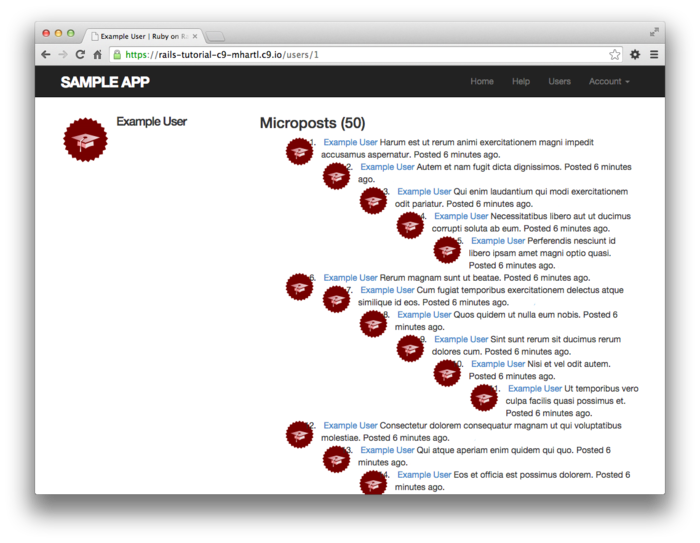

위 페이지에는 micropost 고유의 스타일이 적용되어있지 않기 때문에, 아래의 코드를 추가하여 결과 페이지를 새로고침해봅시다.

```scss
/* app/assets/stylesheets/custom.scss */
.
.
.
/* microposts */

.microposts {
  list-style: none;
  padding: 0;
  li {
    padding: 10px 0;
    border-top: 1px solid #e8e8e8;
  }
  .user {
    margin-top: 5em;
    padding-top: 0;
  }
  .content {
    display: block;
    margin-left: 60px;
    img {
      display: block;
      padding: 5px 0;
    }
  }
  .timestamp {
    color: $gray-light;
    display: block;
    margin-left: 60px;
  }
  .gravatar {
    float: left;
    margin-right: 10px;
    margin-top: 5px;
  }
}

aside {
  textarea {
    height: 100px;
    margin-bottom: 5px;
  }
}

span.picture {
  margin-top: 10px;
  input {
    border: 0;
  }
}
```

아래 첫 번째 유저의 프로필 화면을, 아래 두 번째 화면에서는, 2번째 유저의 프로필 화면을 표시하고 있습니다. 마지막 스크린샷에서는 제일 첫 번째 유저의 2번째 페이지와 제일 밑에 있는 pagination의 링크를 표시하고 있습니다. 각 micropost의 표시에는 3개의 어떠한 경우라도, 생성된 후로의 경과시간 ("1분전에 투고" 등)이 표시되는 것을 주목해주세요. 이것은 이전에 작성한 `time_ago_in_words` 메소드에 의한 것 입니다. 수 분을 기다리고 나서 패이지를 새고로침하면, 이 텍스트는 자동적으로 새로운 시간대로 갱신될 것 입니다.


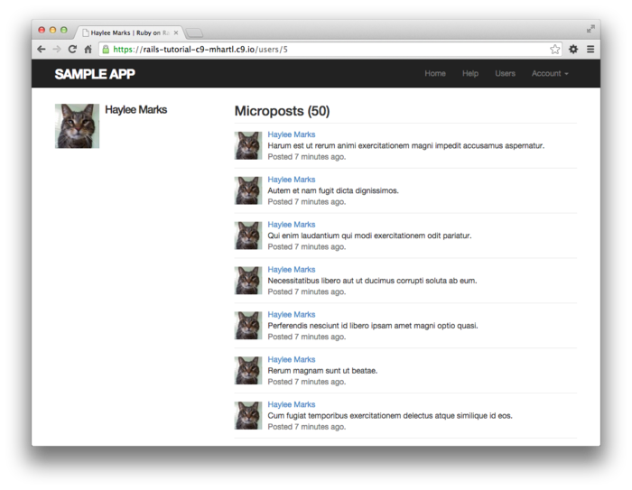

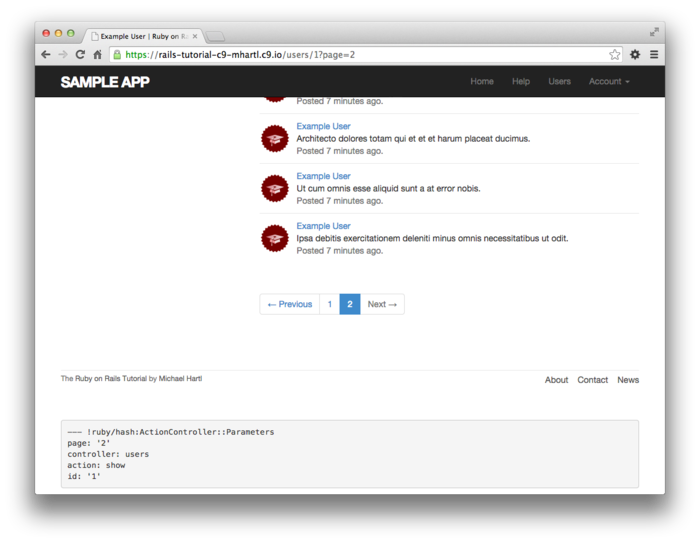

##### 연습

1. `(1..10).to_a.take(6)` 라고 하는 코드의 실행결과를 추측해볼 수 있습니까? 추측한 결과값이 제대로 맞는지 실제로 콘솔에서 확인해봅시다.
2. 방금 전 연습에서 사용한 `to_a` 메소드의 부분은 정말로 필요한 부분인가요? 확인해봅시다.
3. Faker 는 _Lorem ipsum_ 이외에도 매우 다양한 사례에 대응하고 있습니다. [Faker의 문서](https://github.com/stympy/faker) 를 확인하면서 화면의 출력하는 방법을 배우고, 실제로 대학이름이나 전화번호 등을 화면에 출력해봅시다.

### 13.2.3 Profile 화면의 Micropost를 테스트해보자.

이제 막 account를 유효화한 유저는 프로필화면에 리다이렉트되기에, 해당 프로필화면이 제대로 표시되는지는 유닛 테스트를 통해 확인해보았습니다. 이번 섹션에서는 프로필 화면에 표시되는 micropost에 대해 통합 테스트를 작성해보겠습니다. 우선 프로필 화면용의 통합 테스트를 생성해봅시다.

```ruby
$ rails generate integration_test users_profile
      invoke  test_unit
      create    test/integration/users_profile_test.rb
```

프로필화면에 있는 micropost를 테스트하기 위해서는 유저와 관계가 맺어져 있는 micropost의 테스트용 데이터가 필요합니다. Rails의 관습에 따라, 관련 테스트 데이터를 fixture 파일에 추가하면, 다음과 같이 될 것 입니다.

```
orange:
  content: "I just ate an orange!"
  created_at: <%= 10.minutes.ago %>
  user: michael
```

`user` 에 `michael` 이라고 하는 값을 입력하면,  Rails는 fixture 파일 내의 대응하는 유저를 찾아내어 (혹은 발견한다면,) micropost와 관계를 맺어줄 것 입니다.

```
  name: Michael Example
  email: michael@example.com
  .
  .
  .
```

또한 micropost의 pagination을 테스트하기 위해, micropost용의 fixture에 몇가지 테스트 데이터를 추가할 필요가 있습니다만, 이것은 이전 10장에서 유저를 추가했을 때와 마찬가지로, Embeded Ruby코드를 사용하면 간단할 것 입니다.

```
<% 30.times do |n| %>
micropost_<%= n %>:
  content: <%= Faker::Lorem.sentence(5) %>
  created_at: <%= 42.days.ago %>
  user: michael
<% end %>
```

위 코드를 1개로 정리하면, micropost 용의 fixture 파일은 아래와 같이 됩니다.

```yml
# test/fixtures/microposts.yml
orange:
  content: "I just ate an orange!"
  created_at: <%= 10.minutes.ago %>
  user: michael

tau_manifesto:
  content: "Check out the @tauday site by @mhartl: http://tauday.com"
  created_at: <%= 3.years.ago %>
  user: michael

cat_video:
  content: "Sad cats are sad: http://youtu.be/PKffm2uI4dk"
  created_at: <%= 2.hours.ago %>
  user: michael

most_recent:
  content: "Writing a short test"
  created_at: <%= Time.zone.now %>
  user: michael

<% 30.times do |n| %>
micropost_<%= n %>:
  content: <%= Faker::Lorem.sentence(5) %>
  created_at: <%= 42.days.ago %>
  user: michael
<% end %>
```

 테스트데이터는 준비가 되었습니다. 지금부터는 테스트 코드를 작성해보겠습니다만, 이번 테스트는 조금은 단순합니다. 이번 테스트에서는 프로필 화면에 액세스 한 다음, 페이지 타이틀과 유저 이름, Gravatar, micropost의 투고 개수, 그리고 페이지 분할된 micropost 등의 순으로 테스트해볼 것 입니다. 작성한 코드는 아래와 같습니다. (Application 헬퍼를 읽어들인 것으로, `full_title` 헬퍼를 이용할 수 있는 점을 주목해주세요.)

```ruby
# test/integration/users_profile_test.rb
require 'test_helper'

class UsersProfileTest < ActionDispatch::IntegrationTest
  include ApplicationHelper

  def setup
    @user = users(:michael)
  end

  test "profile display" do
    get user_path(@user)
    assert_template 'users/show'
    assert_select 'title', full_title(@user.name)
    assert_select 'h1', text: @user.name
    assert_select 'h1>img.gravatar'
    assert_match @user.microposts.count.to_s, response.body
    assert_select 'div.pagination'
    @user.microposts.paginate(page: 1).each do |micropost|
      assert_match micropost.content, response.body
    end
  end
end
```

위 코드에서는  micropost의 투고 개수를 체크하기 위해서, [제 12장](Chapter12.md) 의 연습 ([12.3.3](Chapter12.md#1233-패스워드-재설정을-테스트해보자) 의 연습문제) 에서 소개한  `response.body` 를 사용하고 있습니다. 이름을 보면 오해할 지도 모르겠습니다만,  `response.body` 에는 해당 페이지의 완전한 HTML이 포함되어 있습니다. (HTML의 body 태그 뿐만 있는 것이 아닙니다.) 따라서 해당 페이지의 _어딘가에는_ micropost의 투고 개수가 존재한다면, 다음과 같이 찾아내어 매치할 수 있을 것 입니다.

```
assert_match @user.microposts.count.to_s, response.body
```

이 것은 `assert_select` 보다도 좀 더 추상적인 메소드입니다. 특히 `assert_select` 에서는 어떠한 HTML 태그를 찾는지 알려주는 것이 필요합니다만,  `assert_match` 메소드에서는 그럴 필요가 없다는 점이 다릅니다.


또한 `assert_select` 의 파라미터에는 좀 더 상세한 문법을 사용하고 있다는 점을 주목해주세요.

`assert_select 'h1>img.gravatar'`

 이렇게 작성하는 것으로 `h1` 태그 (제일 큰 표제 글씨) 의 _안쪽_ 에 있는 `gravatar` 클래스를 가진 `img` 태그가 존재하는지를 체크합니다.


그리고 어플리케이션 측의 코드는 구현해놓았으므로, 이 테스트는 통과할 것 입니다.

`$ rails test`

##### 연습

1. 테스트 코드에 있는 2개의 `h1` 의 테스트가 올바른지 확인하기 위해, 해당 어플리케이션 측의 코드를 코멘트아웃해봅시다. 테스트가 통과하지 않는 것을 확인해봅시다.
2. 테스트 코드를 변경하여, `will_paginate` 가 _1번만_ 표시되는 것을 테스트해봅시다. _Hint_ : 이전 5장의 2번째 `표` 를 확인해주세요.


## 13.3 Micropost를 조작해보자.

데이터 모델링과 micropost 표시 템플릿의 양쪽을 완성시켰습니다. 다음은 Web 경유로 micropost를 생성하기 위한 Interface를 작성해봅시다. 이번 섹션에서는 _Status feed_ (제 14장에서 완성시킵니다.) 의 제일 첫 번째 힌트를 보여드리겠습니다. 마지막으로는 유저가 micropost를 Web 경유로 삭제할 수 있도록 해봅시다.


지금까지의  Rails개발의 연습과 다른 부분이 1군데 있습니다.  Micropost 리소스로의  Interface는 주로 프로필 페이지와 Home 페이지의 컨트롤러를 경유하여 실행되었기 때문에, Micropost 컨트롤러는 `new` 나 `edit` 과 같은 액션은 필요하진 않습니다. 즉, `create` 나 `destroy` 만 있으면 충분합니다. 따라서 Microposts의 리소스는 아래와 같이 됩니다. 그 결과, 아래 코드는 RESTful한 라우팅의 부분집합이 됩니다. 물론 심플하게 되었다는 것은 완성도가 더욱 높아졌다는 증거이며, 퇴화되진 않았습니다. [제 2장](Chapter2.md) 에서 scaffold에 맡기기만했던 시절부터 지금에 이르기까지 머나먼 길이었습니다만, 지금은 scaffold가 생성해주는 복잡한 코드는 거의 필요하지 않게 되었습니다.

```ruby
# config/routes.rb
Rails.application.routes.draw do
  root   'static_pages#home'
  get    '/help',    to: 'static_pages#help'
  get    '/about',   to: 'static_pages#about'
  get    '/contact', to: 'static_pages#contact'
  get    '/signup',  to: 'users#new'
  get    '/login',   to: 'sessions#new'
  post   '/login',   to: 'sessions#create'
  delete '/logout',  to: 'sessions#destroy'
  resources :users
  resources :account_activations, only: [:edit]
  resources :password_resets,     only: [:new, :create, :edit, :update]
  resources :microposts,          only: [:create, :destroy] #new
end
```

| **HTTP Request** | **URL**       | Action    | Named root                  |
| ---------------- | ------------- | --------- | --------------------------- |
| `POST`           | /microposts   | `create`  | `microposts_path`           |
| `DELETE`         | /microposts/1 | `destroy` | `micropost_path(micropost)` |

### 13.3.1 Micropost의 접근제어

Microposts 리소스의 개발에서는, Microposts 컨트롤러 내부의 접근제어부터 시작해봅시다. 관련된 유저들을 통하여 micropost로 접근하기 때문에, `create` 액션이나 `destory` 액션을 이용하는 유저는 이미 로그인되어있는 상태이지 않으면 안됩니다.


로그인되어있는지 아닌지 확인하는 테스트에서는 Users 컨트롤러용의 테스트를 그대로 사용할 수 있습니다. 즉, 올바른 Request를 각 액션으로 실행시켜, Micropost의 수에 변화가 있는지 없는지를 확인하고, Redirect되는지를 확인하면 될 것 같습니다.

```ruby
# test/controllers/microposts_controller_test.rb
require 'test_helper'

class MicropostsControllerTest < ActionDispatch::IntegrationTest

  def setup
    @micropost = microposts(:orange)
  end

  test "should redirect create when not logged in" do
    assert_no_difference 'Micropost.count' do
      post micropost_path, params: { micropost: { content: "Lorem ipsum" } }
    end
    assert_redirected_to login_url
  end

  test "should redirect destroy when not logged in" do
    assert_no_difference 'Micropost.count' do
      delete micropost_path(@micropost)
    end
    assert_redirected_to login_url
  end
end
```

위 테스트 코드에서 테스트에 통과하기 위한 코드를 작성하기 위해서는, 약간의 application에서의 코드를 Refactoring해야할 필요가 있습니다. [10.2.1](Chapter10.md#1021-유저에게-로그인을-요청해보자) 에서는 before 필터의 `logged_in_user` 메소드를 사용하여, 로그인을 요청했던 것을 떠올려주세요. 그 때에는 Users 컨트롤러 내부의 이 메소드가 존재하였기 때문에, before 필터로 지정하였습니다만, 이 메소드는 microposts 컨트롤러에서도 필요합니다. 때문에 각 컨트롤러가 계승하는 Application 컨트롤러의 내부에 이 메소드를 옮겨봅시다. 작성한 코드는 아래와 같습니다.

```ruby
# app/controllers/application_controller.rb
class ApplicationController < ActionController::Base
  protect_from_forgery with: :exception
  include SessionsHelper

  private

    # 유저의 로그인을 확인합니다.
    def logged_in_user
      unless logged_in?
        store_location
        flash[:danger] = "Please log in."
        redirect_to login_url
      end
    end
end
```

코드가 중복하지 않도록, Users컨트롤러부터 `logged_in_user` 를 삭제합시다.

```ruby
# app/controllers/users_controller.rb
class UsersController < ApplicationController
  before_action :logged_in_user, only: [:index, :edit, :update, :destroy]
  .
  .
  .
  private

    def user_params
      params.require(:user).permit(:name, :email, :password,
                                   :password_confirmation)
    end

    # before filter

    # 올바른 유저인지 확인합니다.
    def correct_user
      @user = User.find(params[:id])
      redirect_to(root_url) unless current_user?(@user)
    end

    # 관리자인지 확인합니다.
    def admin_user
      redirect_to(root_url) unless current_user.admin?
    end
end
```

`application_controller.rb` 의 코드에 따라서는, Microposts 컨트롤러로부터도 `logged_in_user` 메소드를 호출할 수 있게 되었습니다. 이것으로 `create` 액션이나 `destroy` 액션에 대한 접근제어를, before 필터로 간단하게 구현할 수 있게 되었습니다.

```ruby
# app/controllers/microposts_controller.rb
class MicropostsController < ApplicationController
  before_action :logged_in_user, only: [:create, :destroy]

  def create
  end

  def destroy
  end
end
```

이 것으로 테스트는 통과할 것 입니다.

`$ rails test`

##### 연습

1. 어째서 Users 컨트롤러 내부에 있는 `logged_in_user` 필터를 남겨둔다면 좋지 않은 것일까요? 생각해봅시다.

### 13.3.2 Micropost를 작성해보자

[제 7장](Chapter7.md) 에서는 HTTP POST Request를 Users 컨트롤러의 `create` 액션으로 발행하는 HTML form을 생성하여 유저의 sign up 을 구현해보았습니다. Micropost 생성의 구현도 비슷합니다. 주된 차이점은 다른 micropost / new 페이지를 사용하는 대신에, Home 화면 (즉, Root path) 에 Form을 설치한다는 것입니다. 아래의 목업을 확인해주세요.

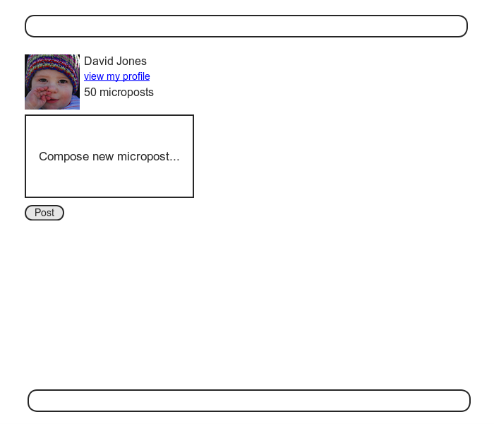

마지막으로 Home 화면을 구현하였을 때, (5장) [Sign up now !] 버튼이 중앙에 있었습니다. Micropost 생성 form은, 로그인되어있는 특정 유저만이 사용할 수 있는 기능이기 때문에, 이 섹션에서의 목표중 하나로는, 유저의 로그인 기능에 대하여 Home 화면에 표시를 변경하는 것입니다. 이것에 대해서는 아래 두 번째 코드에서 구현해봅니다.


다음으로 Micropost의 `create` 액션을 생성해봅시다. 이 액션도 이전 7장에서 구현한 유저용의 액션과 비슷합니다. 차이점으로는 새로운 micropost를 `build` 하기 위해 User/Micropost 관계를 사용하고 있는 것입니다.  `micropost_params` 에서 Strong Parameters 를 사용함으로 인하여, micropost의 `content` 속성만이 Web 경유로 변경가능하게 된 점을 주목해주세요.

```ruby
# app/controllers/microposts_controller.rb
class MicropostsController < ApplicationController
  before_action :logged_in_user, only: [:create, :destroy]

  def create
    @micropost = current_user.microposts.build(micropost_params)
    if @micropost.save
      flash[:success] = "Micropost created!"
      redirect_to root_url
    else
      render 'static_pages/home'
    end
  end

  def destroy
  end

  private

    def micropost_params
      params.require(:micropost).permit(:content)
    end
end
```

 Micropost 생성 Form을 구축하기 위해, 사이트 방문자가 로그인하고 있는지에 따라 변하는 HTML을 제공하는 코드를 사용해봅시다.

```erb
<!-- app/views/static_pages/home.html.erb -->
<!-- new -->
<% if logged_in? %>
  <div class="row">
    <aside class="col-md-4">
      <section class="user_info">
        <%= render 'shared/user_info' %>
      </section>
      <section class="micropost_form">
        <%= render 'shared/micropost_form' %>
      </section>
    </aside>
  </div>
<% else %>
<!-- new -->
  <div class="center jumbotron">
    <h1>Welcome to the Sample App</h1>

    <h2>
      This is the home page for the
      <a href="https://railstutorial.jp/">Ruby on Rails Tutorial</a>
      sample application.
    </h2>

    <%= link_to "Sign up now!", signup_path, class: "btn btn-lg btn-primary" %>
  </div>

  <%= link_to image_tag("rails.png", alt: "Rails logo"),
              'http://rubyonrails.org/' %>
<% end %> <!-- new -->
```

`if-else` 문의 분기에서 코드를 나누고 있는 점이 조금은 번거롭긴 하지만, 이 코드의 Refactoring은 연습문제로 내기로 해봅시다.


위 코드를 동작하게 하기 위해서는 몇가지의 Partial을 생성할 필요가 있습니다. 우선 Home 페이지의 새로운 사이드바부터입니다. 다음 코드와 같습니다.

```erb
<!-- app/views/shared/_user_info.html.erb -->
<%= link_to gravatar_for(current_user, size: 50), current_user %>
<h1><%= current_user.name %></h1>
<span><%= link_to "view my profile", current_user %></span>
<span><%= pluralize(current_user.microposts.count, "micropost") %></span>
```

프로필 사이드바와 마찬가지로, 위 코드의 유저 정보에도 해당 유저가 투고한 micropost의 총 갯수를 표시하고 있는 것에 대해 주목해주세요. 단, 조금 표시하는 방법이 달라집니다. 프로필 사이드바에서는 "Micropost" 을 라벨로 표시하고,  "Micropost(1)" 로 표시하는 것은 문제가 없습니다. 그러나 이번 처럼 "1 micropost" 라고 표시해버리면 영어의 문법상 오류가 발생합니다. 여기서 [7.3.3](Chapter7.md#733-에러-메세지) 소개한 `pluralize` 메소드를 사용하여 "1 micropost" 나 "2 micrposts" 라고 표시할 수 있도록 조정합니다.


다음으로는 micropost생성 form을 정의해보겠습니다. 이것은 유저 등록 form과 비슷합니다. (7장)

```erb
<!-- app/views/shared/_micropost_form.html.erb -->
<%= form_for(@micropost) do |f| %>
  <%= render 'shared/error_messages', object: f.object %>
  <div class="field">
    <%= f.text_area :content, placeholder: "Compose new micropost..." %>
  </div>
  <%= f.submit "Post", class: "btn btn-primary" %>
<% end %>
```

위 코드에서의 form이 동작하게 하기 위해서는, 2가지의 변경이 필요합니다. 하나는 (이전과 마찬가지로) 관계맺기를 이용하여 다음과 같이 `@micropost` 를 정의합니다.

`@micropost = current_user.microposts.build`

생성한 코드는 아래와 같습니다.

```ruby
# app/controllers/static_pages_controller.rb 
# home 액션에 micropost를 인스턴스변수를 추가한다.

class StaticPagesController < ApplicationController

  def home
    @micropost = current_user.microposts.build if logged_in?
  end

  def help
  end

  def about
  end

  def contact
  end
end
```

물론 `current_user`  메소드는 유저가 로그인하고 있을때만 쓸 수 있습니다. 따라서 `@micropost` 변수도 로그인하고 있을때만 정의될 수 있도록 합니다.


위 두번째 코드를 동작하게 하기 위한 다른 하나의 변경점은, 에러 메세지의 partial을 재정의하는 것입니다. 그렇지 않는다면 위 두번째 코드는 동작하지 않을 것 입니다.

`<%= render 'shared/error_messages, object: f.object %>`

7장에서는 에러 메세지 partial이 `@user` 변수를 직접 참조하고 있던 것을 떠올려주세요. 이번에는 그 대신에, `@micropost` 변수를 사용할 필요가 있습니다. 그러한 케이스들을 정리해보면, form 변수 `f` 를, `f.object` 로 선언하는 것으로, 관계맺어져있는 오브젝트에 액세스할 수 있습니다. 따라서,

`form_for(@user) do |f|`

위와 같이 `f.object` 가 `@user` 가 되는 경우와,

`form_for(@micropost) do |f|`

위와 같이 `f.object` 가 `@micropost` 가 되는 경우가 있습니다.


Partial에 오브젝트를 넘기기 위해서, 값이 Object이면서 Key를 Partial에서의 변수명과 같은 해시를 이용합니다. 이것으로 위 두 번째 코드의 2번째줄의 코드가 완성됩니다. 바꿔말하자면, `object: f.object` 와 `error_message` partial 안에서 `object` 라고 하는 변수명을 생성해놓는다면, 이 변수를 사용하여 에러 메세지를 갱신하면 되는 것 입니다.

```erb
<!-- app/views/shared/_error_messages.html.erb -->
<% if object.errors.any? %>
  <div id="error_explanation">
    <div class="alert alert-danger">
      The form contains <%= pluralize(object.errors.count, "error") %>.
    </div>
    <ul>
    <% object.errors.full_messages.each do |msg| %>
      <li><%= msg %></li>
    <% end %>
    </ul>
  </div>
<% end %>
```

이 시점에서 테스트를 실행시키면 테스트는 아직 실패일 것 입니다.

`$ rails test`

어째서 실패하고 있는 것일까요? 힌트는 `error_message` Partial의 다른 사용장소가 문제입니다. 이 partial은 다른 코드에서도 호출되고 있기 때문에, 유저등록, 패스워드 재설정, 그리고 유저 편집의 각각의 view에서 수정을 해줄 필요가 있습니다. 각 view에서 수정한 결과는 아래와 같습니다.

```erb
<!-- app/views/users/new.html.erb -->
<% provide(:title, 'Sign up') %>
<h1>Sign up</h1>

<div class="row">
  <div class="col-md-6 col-md-offset-3">
    <%= form_for(@user) do |f| %>
      <%= render 'shared/error_messages', object: f.object %> <!-- update -->
      <%= f.label :name %>
      <%= f.text_field :name, class: 'form-control' %>

      <%= f.label :email %>
      <%= f.email_field :email, class: 'form-control' %>

      <%= f.label :password %>
      <%= f.password_field :password, class: 'form-control' %>

      <%= f.label :password_confirmation, "Confirmation" %>
      <%= f.password_field :password_confirmation, class: 'form-control' %>

      <%= f.submit "Create my account", class: "btn btn-primary" %>
    <% end %>
  </div>
</div>
```

```erb
<!-- app/views/users/edit.html.erb -->
<% provide(:title, "Edit user") %>
<h1>Update your profile</h1>

<div class="row">
  <div class="col-md-6 col-md-offset-3">
    <%= form_for(@user) do |f| %>
      <%= render 'shared/error_messages', object: f.object %><!-- update -->

      <%= f.label :name %>
      <%= f.text_field :name, class: 'form-control' %>

      <%= f.label :email %>
      <%= f.email_field :email, class: 'form-control' %>

      <%= f.label :password %>
      <%= f.password_field :password, class: 'form-control' %>

      <%= f.label :password_confirmation, "Confirmation" %>
      <%= f.password_field :password_confirmation, class: 'form-control' %>

      <%= f.submit "Save changes", class: "btn btn-primary" %>
    <% end %>

    <div class="gravatar_edit">
      <%= gravatar_for @user %>
      <a href="http://gravatar.com/emails">change</a>
    </div>
  </div>
</div>
```

```erb
<!-- app/views/password_resets/edit.html.erb -->
<% provide(:title, 'Reset password') %>
<h1>Password reset</h1>

<div class="row">
  <div class="col-md-6 col-md-offset-3">
    <%= form_for(@user, url: password_reset_path(params[:id])) do |f| %>
      <%= render 'shared/error_messages', object: f.object %> <!-- update -->

      <%= hidden_field_tag :email, @user.email %>

      <%= f.label :password %>
      <%= f.password_field :password, class: 'form-control' %>

      <%= f.label :password_confirmation, "Confirmation" %>
      <%= f.password_field :password_confirmation, class: 'form-control' %>

      <%= f.submit "Update password", class: "btn btn-primary" %>
    <% end %>
  </div>
</div>
```

이것으로 모든 테스트가 통과할 것 입니다.

`$ rails test`

게다가 이번 챕터에서 생성한 모든 HTML이 적절하게 표시될 것 입니다. 최종적 form은 아래와 첫 번째 스크린샷 처럼, 작성 에러가 표시된 form은 아래 두 번째 스크린샷처럼 될 것 입니다.

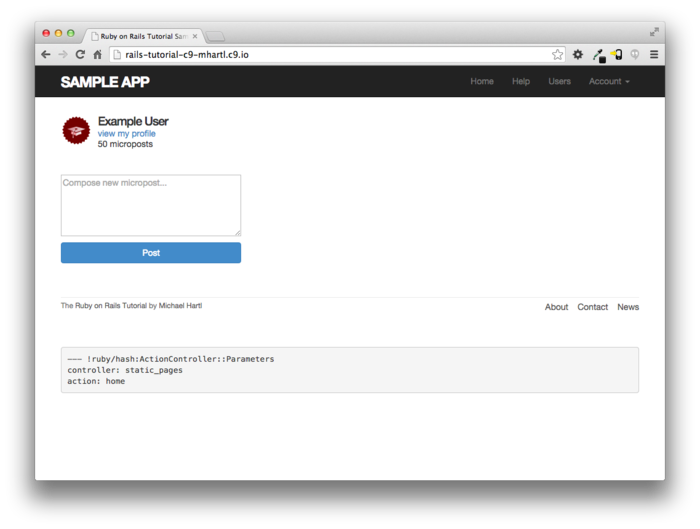

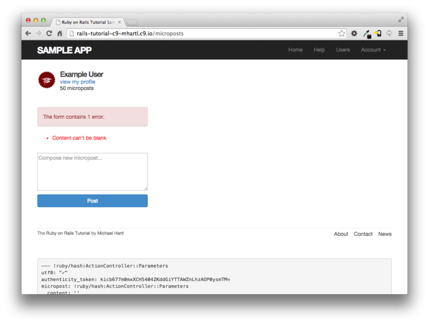

##### 연습

1. Home페이지를 Refactoring 하여 `if-else` 문의 분기를 각각 Partial로 생성해봅시다.

### 13.3.3 Feed의 원형

micropost 작성 form이 동작할 수 있도록 되었습니다만, 지금 단계에서는 작성한 내용을 바로 볼 수는 없습니다. 아직 Home 페이지에 micropost 를 표시하는 부분이 아직 구현되지 않았기 때문입니다.


micropost 작성 form이 제대로 동작하는지 확인하고 싶은 경우, 올바른 형태로 작성한 후, 프로필 페이지로 이동하여 post가 제대로 표시되면 그걸로 다행입니다만, 이 것은 조금 귀찮은 작업이기도 합니다. 아래 목업처럼, 유저 자신의의 post를 포함한, micropost의 feed가 없으면 불편합니다. (제 14장에서는 피드를 범용화하여여 _follow_ 하고 있는 유저들의 micropost도 feed에 표시할 예정입니다.)

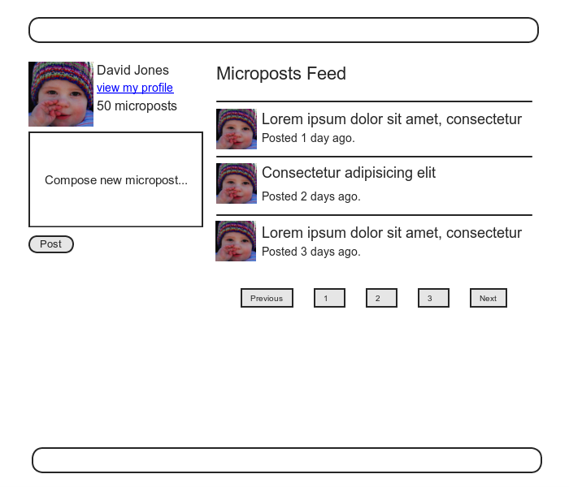

모든 유저가 feed를 가지고 있기에, `feed` 메소드는 User 모델에서 생성하는 것이 자연스럽습니다. Feed의 원형은, 우선 현재 로그인하고 있는 유저의 micropost를 전부 조회합니다. 또한 다음 챕터에서 완전한 feed를 구현하기 때문에, 이번에는 [11.3.3](Chapter11.md#1133-유효화와-테스트의-Refactoring) 에서 소개한 `where` 메소드에서 이것을 구현해볼 것 입니다. `Micropost` 모델에 변경점을 더한 결과는 아래와 같습니다.

```ruby
# app/models/user.rb
class User < ApplicationRecord
  .
  .
  .
  # 
  # 완전한 구현은 다음장의 "유저를 follow해보자" 를 참조해주세요.
  def feed
    Micropost.where("user_id = ?", id)
  end

    private
    .
    .
    .
end
```

다음 코드에서 사용되고 있는 물음표는, 보안상 중요한 역할을 해줍니다.

`Microposts.where("user_id = ?", id)` 

위 물음표가 있는 것으로 인하여, SQL Query에 대입하기 전에 `id`  가 Escape되어지기 때문에, [*SQL인젝션 (SQL Injection)*](https://ja.wikipedia.org/wiki/SQLインジェクション) 이라 불리는 심각한 보안상 문제를 회피할 수 있습니다. 이 경우의 `id` 속성은 단순한 정수 (즉, `self.id` 는 유저의 id) 이 때문에 위험하진 않습니다만, SQL 문에 변수를 대입하는 경우에는 _항상_ Escape하는 습관을 몸에 익혀주시길 바랍니다.


세심한 독자들은 위 코드에서 본질적으로 다음 코드와 같은 것을 알아채렸을 수도 있을 것 같습니다.

```ruby
def feed
  microposts
end
```

위 코드를 사용하지 않고, 일부러 위 2번째 코드를 사용한 것은, 제 14장에서 필요하게되는 완전한 Status feed에서 응용을 해볼 수 있기 때문입니다.


Sample application에 feed기능을 도입하기 위해, 로그인 유저의 feed용으로 인스턴스 변수 `@feed_items` 를 추가하고, Home 페이지에서는 feed용의 Partial을 추가합니다. Home 페이지에 변경을 더한 결과는 아래 세 번째 *app/views/static_pages/home.html.erb* 코드를 확인해주세요. 이 때, 유저가 로그인해있는지 어떤지 확인한 후 if문이 변화하고 있는 점을 주목해주세요. 즉, 아래 코드

```
@micropost = current_user.microposts.build if logged_in?
```

가 다음과 같이 변합니다.

```ruby
 if logged_in?
    @micropost  = current_user.microposts.build
    @feed_items = current_user.feed.paginate(page: params[:page])
  end
```

```ruby
# app/controllers/static_pages_controller.rb
# home 액션에 feed의 인스턴스변수를 추가한다.
class StaticPagesController < ApplicationController

  def home
    if logged_in?
      @micropost  = current_user.microposts.build
      @feed_items = current_user.feed.paginate(page: params[:page])
    end
  end

  def help
  end

  def about
  end

  def contact
  end
end
```

```erb
<!-- app/views/shared/_feed.html.erb -->
<!-- statusfeed의 partial -->
<% if @feed_items.any? %>
  <ol class="microposts">
    <%= render @feed_items %>
  </ol>
  <%= will_paginate @feed_items %>
<% end %>
```

Status Feed의 Partial은 Micropost의 partial과는 다른 점에 주목해주세요.

`<%= render @feed_items %>`

이 때, `@feed_item` 의 각 요소가 `Micropost` 클래스를 가지고 있기 때문에, Rails는 Micropost의 Partial을 호출할 수 있습니다. 이렇게 Rails는 대응하는 이름의 Partial을 넘겨진 리소스의 디렉토리 내부로부터 찾아낼 수 있습니다.

```
app/views/microposts/_micropost.html.erb
```

남은 것은, 언제나처럼 feed partial을 표시하면 Home페이지에 feed를 추가할 수 있습니다. 이 결과는 Home페이지의 Feed로써 표시됩니다.

```erb
<!-- app/views/static_pages/home.html.erb -->
<% if logged_in? %>
  <div class="row">
    <aside class="col-md-4">
      <section class="user_info">
        <%= render 'shared/user_info' %>
      </section>
      <section class="micropost_form">
        <%= render 'shared/micropost_form' %>
      </section>
    </aside>
    <!-- new -->
    <div class="col-md-8">
      <h3>Micropost Feed</h3>
      <%= render 'shared/feed' %>
    </div>
    <!-- new -->
  </div>

<% else %>
  .
  .
  .
<% end %>
```

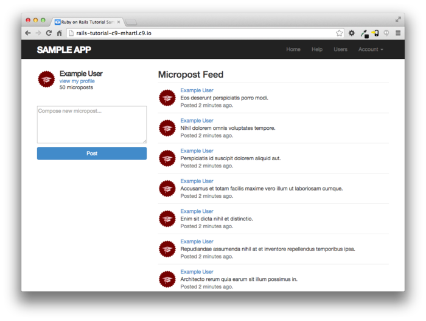

현 시점에서는 새로운 micropost의 작성은 기대했던 대로 동작합니다. 그러나 조금 별거 아닐 수도 있습니다만, micropost의 투고가 _실패_ 하면, Home 페이지는 `@feed_items` 인스턴스 변수를 기다리고 있기 때문에 현재 단계에서는 Exception을 일으키게 되버리고 말 것 입니다. 제일 간단한 해결방법은 아래 코드와 같이 빈 배열을 넘겨두는 것 입니다. 아쉽게도 이 방법으로는 Page가 분할된 feed를 다시 보고싶어도 제대로 동작하지 않습니다. 움직이지 않는 이유를 알아보고 싶으신 분은, 실제로 구현하여 Pagination의 링크를 클릭해보세요.

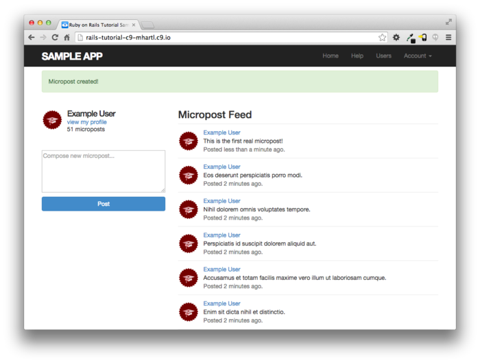

```ruby
# app/controllers/microposts_controller.rb
class MicropostsController < ApplicationController
  before_action :logged_in_user, only: [:create, :destroy]

  def create
    @micropost = current_user.microposts.build(micropost_params)
    if @micropost.save
      flash[:success] = "Micropost created!"
      redirect_to root_url
    else
      @feed_items = [] #빈 배열
      render 'static_pages/home'
    end
  end

  def destroy
  end

  private

    def micropost_params
      params.require(:micropost).permit(:content)
    end
end
```

##### 연습

1. 새롭게 구현한 micropost의 생성 form을 사용하여 실제로 micropost를 투고해봅시다. Rails 서버의 로그 내부에 있는 `INSERT` 문은 어떠한 내용을 데이터베이스로 보내고 있습니까? 확인해봅시다.
2. 콘솔을 실행시키고, `user` 변수에 데이터베이스 상의 제일 첫 번째 유저를 대입시켜봅시다. 그 다음, `Micropost.where("user_id = ?", user.id)` 와 `user.microposts` 그리고 `user.feed` 를 각각 실행시켜보고, 실행결과가 모두 같은 것을 확인해봅시다. _Hint_ : `==` 로 비교하면 결과가 같은지 아닌지를 간단하게 판단할 수 있습니다.


### 13.3.4 Micropost를 삭제해보자

마지막 기능으로는 micropost resource에 post를 삭제하는 기능을 추가해봅니다. 이것은 유저 삭제와 마찬가지로 ([10.4.2](Chapter10.md#1042-destroy액션)) "delete" 링크로 실현해봅시다. 유저의 삭제는 관리자 유저만 가능할 수 있도록 제한한 것에 비해, 이번에는 자신이 작성한 micropost에 대해서만 삭제링크를 동작하도록 해봅시다.


제일 처음으로는 micropost의 partial 에 삭제링크를 추가해봅니다. 생성한 코드는 아래와 같습니다.

```erb
<!-- app/views/microposts/_micropost.html.erb -->
<li id="micropost-<%= micropost.id %>">
  <%= link_to gravatar_for(micropost.user, size: 50), micropost.user %>
  <span class="user"><%= link_to micropost.user.name, micropost.user %></span>
  <span class="content"><%= micropost.content %></span>
  <span class="timestamp">
    Posted <%= time_ago_in_words(micropost.created_at) %> ago.
    <!-- add -->
    <% if current_user?(micropost.user) %>
      <%= link_to "delete", micropost, method: :delete,
                                       data: { confirm: "You sure?" } %>
    <% end %>
    <!-- add -->
  </span>
</li>
```

다음으로는, Microposts 컨트롤러의 `destrory` 액션을 정의해봅시다. 이것 또한 유저의 삭제와 대강 비슷합니다. 큰 차이로는 `admin_user` 필터에서 `@user` 변수를 사용하는 것이 아닌, 관계를 사용하여 micropost를 검색할 수 있다는 점입니다. 이것으로 어떤 유저가 다른 유저의 micropost를 삭제하려고 해도 자동적으로 실패해버릴 것입니다. 구체적으로는 `correct_user` 필터 내에서 `find` 메소드를 호출하는 것으로, 현재 유저가 삭제대상의 micropost를 보유하고 있는지를 확인합니다. 완성된 코드는 아래와 같습니다.

```ruby
# app/controllers/microposts_controller.rb
class MicropostsController < ApplicationController
  before_action :logged_in_user, only: [:create, :destroy]
  before_action :correct_user,   only: :destroy #new
  .
  .
  .
   #new
  def destroy
    @micropost.destroy
    flash[:success] = "Micropost deleted"
    redirect_to request.referrer || root_url
  end

  private

    def micropost_params
      params.require(:micropost).permit(:content)
    end
		#new
    def correct_user
      @micropost = current_user.microposts.find_by(id: params[:id])
      redirect_to root_url if @micropost.nil?
    end
end
```

이 때 위 코드의 `destory` 메소드에서 redirect를 사용하고 있는 점을 주목해주세요.

`request.referrer || root_url`

여기서는 `request.referrer` 라고 하는 메소드를 사용하고 있습니다. 이 메소드는 Friendly forwarding의 `request.url` 변수 ([10.2.3](Chapter10.md#1023-friendly-forwarding)) 와 비슷하게, 바로 이전 URL을 리턴합니다. (이 경우, Home페이지가 될 것 입니다.) 때문에 micropost가 Home페이지에서 삭제된 경우에도 프로필 페이지로부터 삭제된 경우에도, `request.referrer` 를 사용하는 것으로 DELETE Request가 실행된 페이지로 되돌아가기 때문에 매우 편리합니다. 여담으로, 이전으로 돌아가는 URL이 없다고 하더라도, (예를들어 테스트에서는 `nil` 이 리턴되는 경우도 있습니다.) 위 코드에서 `||` 연산자에 의하여 `root_url` 을 디폴트로 설정하고 있기 때문에 괜찮습니다. 


위 코드로 인하여 위에서부터 2번재 micropost 를 삭제하면 아래와 같이 동작할 것 입니다.


##### 연습

1. micropost를 작성하고, 그 다음 작성한 micropost를 삭제해봅시다. 다음으로 Rails 서버의 로그를 확인하여 `DELETE` 문의 내용을 확인해봅시다.
2. `redirect_to request.referrer || root_url`의 행을 `redirect_back(fallback_location: root_url)` 으로 바꾸어도 제대로 동작하는지, 브라우저를 통해 확인해봅시다. (이 메소드는 Rails 5부터 새롭게 추가되었습니다.)

### 13.3.5 Feed 화면의 Micropost 를 테스트해보자

[13.3.4](#1334-micropost를-삭제해보자) 의 코드에서, MIcropost 모델과 해당 인터페이스를 완성시켰습니다. 남은 내용으로는 Micropost 컨트롤러의 허가를 체크하는 짧은 테스트와 그것들을 정리하는 통합테스트 코드를 작성해볼 것 입니다.


우선은 micropost용의 fixture에 제각각의 유저와 연결되어진 micropost를 추가합니다. (지금은 이 중 1개만 사용합니다만 나중에는 다른 micropost도 사용하게 됩니다.)

```yml
# test/fixtures/microposts.yml
.
.
.
ants:
  content: "Oh, is that what you want? Because that's how you get ants!"
  created_at: <%= 2.years.ago %>
  user: archer

zone:
  content: "Danger zone!"
  created_at: <%= 3.days.ago %>
  user: archer

tone:
  content: "I'm sorry. Your words made sense, but your sarcastic tone did not."
  created_at: <%= 10.minutes.ago %>
  user: lana

van:
  content: "Dude, this van's, like, rolling probable cause."
  created_at: <%= 4.hours.ago %>
  user: lana
```

 다음으로 자신 이외의 유저의 micropost 는 삭제를 하려하면 적절하게 redirect하는 처리를 테스트에서 확인해봅시다.

```ruby
# test/controllers/microposts_controller_test.rb
require 'test_helper'

class MicropostsControllerTest < ActionDispatch::IntegrationTest

  def setup
    @micropost = microposts(:orange)
  end

  test "should redirect create when not logged in" do
    assert_no_difference 'Micropost.count' do
      post microposts_path, params: { micropost: { content: "Lorem ipsum" } }
    end
    assert_redirected_to login_url
  end

  test "should redirect destroy when not logged in" do
    assert_no_difference 'Micropost.count' do
      delete micropost_path(@micropost)
    end
    assert_redirected_to login_url
  end

  # new
  test "should redirect destroy for wrong micropost" do
    log_in_as(users(:michael))
    micropost = microposts(:ants)
    assert_no_difference 'Micropost.count' do
      delete micropost_path(micropost)
    end
    assert_redirected_to root_url
  end
end
```

 마지막으로 통합 테스트를 작성해봅니다. 이번 통합테스트에서는 로그인, micropost의 페이지 분할의 확인, 무효한 micropost의 작성, 유효한 micropost의 작성, micropost 삭제, 그리고 다른 유저의 micropost는 "Delete" 링크가 없는 것을 확인 하는 순서로 해봅시다. 언제나 처럼 통합 테스트를 생성해봅시다.

```
$ rails generate integration_test microposts_interface
      invoke  test_unit
      create    test/integration/microposts_interface_test.rb
```

앞의 순서대로 작성한 통합테스트는 아래와 같습니다. 이전에 작성한 코드가 살짝 섞여있는 점을 주의해주세요.

```ruby
# test/integration/microposts_interface_test.rb
require 'test_helper'

class MicropostsInterfaceTest < ActionDispatch::IntegrationTest

  def setup
    @user = users(:michael)
  end

  test "micropost interface" do
    log_in_as(@user)
    get root_path
    assert_select 'div.pagination'
    # 무효한 작성
    assert_no_difference 'Micropost.count' do
      post microposts_path, params: { micropost: { content: "" } }
    end
    assert_select 'div#error_explanation'
    # 유효한 작성
    content = "This micropost really ties the room together"
    assert_difference 'Micropost.count', 1 do
      post microposts_path, params: { micropost: { content: content } }
    end
    assert_redirected_to root_url
    follow_redirect!
    assert_match content, response.body
    # micropost를 삭제
    assert_select 'a', text: 'delete'
    first_micropost = @user.microposts.paginate(page: 1).first
    assert_difference 'Micropost.count', -1 do
      delete micropost_path(first_micropost)
    end
    # 다른 유저의 프로필로의 액세스 (삭제링크가 없는 것을 확인)
    get user_path(users(:archer))
    assert_select 'a', text: 'delete', count: 0
  end
end
```

이미 어플리케이션의 코드는 작성해놓았기 때문에, 이 테스트는 통과될 것 입니다.

`$ rails test`

##### 연습

1. 위 코드의 4개의 코멘트의 각각에 대해 테스트가 제대로 동작하는지를 확인해봅시다. 구체적으로는 대응하는 application 의 코드를 코멘트아웃하고 테스트가 실패하는 것을 확인하고, 원래대로 되돌린 후 테스트가 다시 통과되는지를 확인해봅시다.

2. 사이드 바에 있는 micropost의 합계 작성 개수를 테스트해봅시다. 이 때 단수형(micropost) 와 복수형 (microposts) 가 제대로 표시되는지도 테스트해봅시다. _Hint_ : 위 테스트 코드를 확인해봅시다

   ```ruby
   # test/integration/microposts_interface_test.rb
   require 'test_helper'
   
   class MicropostInterfaceTest < ActionDispatch::IntegrationTest
   
     def setup
       @user = users(:michael)
     end
     .
     .
     .
     # new
     test "micropost sidebar count" do
       log_in_as(@user)
       get root_path
       assert_match "#{FILL_IN} microposts", response.body
       # 아직 micropost를 작성하지 않은 유저
       other_user = users(:malory)
       log_in_as(other_user)
       get root_path
       assert_match "0 microposts", response.body
       other_user.microposts.create!(content: "A micropost")
       get root_path
       assert_match FILL_IN, response.body
     end
   end
   ```


## 13.4 Micropost의 image 첨부

여기까지 micropost에 관한 기본적인 조작은 모두 구현해보았습니다. 이번 섹션에서는 응용편으로써, 이미지를 첨부한 micropost를 작성할 수 있도록 해보겠습니다. 순서로는 일단 개발환경용의 베타판을 구현하고, 그 후 몇가지의 개선을 거쳐 실제 배포환경용의 완성판을 구현해보겠습니다.


이미지 업로드 기능을 추가하기 위해서는 2개의 시각적인 요소가 필요합니다. 하나는 이미지를 업로드하기 위한 form, 또 다른 하나는 작성한 이미지 그 자체입니다. [Upload image] 버튼과 이미지가 첨부되어있는 micropost의 목업은 아래와 같습니다.

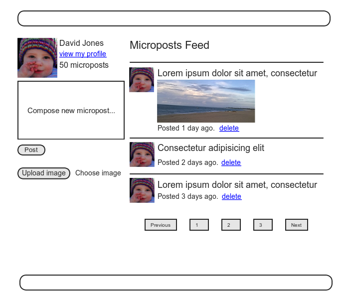


### 13.4.1 기본적인 Image Upload

업로드한 이미지를 다루거나 해당 이미지를 micropost 모델과 관계맺기를 하기 위해서, 이번에는 [CarrierWave](https://github.com/carrierwaveuploader/carrierwave) 라고 하는 Image Uploader를 사용해보겠습니다. 우선 _carrierwave gem_ 을 `Gemfile` 에 추가해봅시다. 이 때, 아래 코드에서는 _mini_magick gem_ 과 _fog gems_ 도 같이 포함되어있는 점을 주목해주세요. 이 gem들은 Resize하거나([13.4.3](#1343-image의-resize)) 실제 배포환경에서 이미지를 업로드하기 위해 사용될 것 입니다. ([13.4.4](#1344-실제-배포환경에서의-image-upload))

```ruby
gem 'rails',                   '5.1.6'
gem 'bcrypt',                  '3.1.12'
gem 'faker',                   '1.7.3'
gem 'carrierwave',             '1.2.2' #new
gem 'mini_magick',             '4.7.0' #new
gem 'will_paginate',           '3.1.5'
gem 'bootstrap-will_paginate', '1.0.0'
.
.
.
group :production do
  gem 'pg',  '0.20.0'
  gem 'fog', '1.42' #new
  end
.
.
.
```

다음으로는 언제나처럼 `bundle install` 을 실행해봅니다.

` $ bundle install`

CarrierWave를 도입하면, Rails의 제네레이터로 이미지 업로더를 생성할 수 있게 됩니다. 다음 커맨드를 실행해봅시다. (이미지를 image라고 하는 것은 너무 평범하기 때문에, `picture` 라고 하겠습니다.)

`$ rails generate uploader Picture`

 CarrierWave로 업로드된 이미지는, Active Record 모델의 속성과 관계를 맺어야할 것 입니다. 관계맺어진 속성에는 이미지의 파일명이 저장되기 때문에 String형으로 해놓습니다. 확장된 micropost의 데이터 모델은 아래와 같습니다.


필요한 `picture` 속성을 Micropost모델에 추가하기 위해, migration 파일을 생성하고, 개발환경의 데이터베이스에 적용합니다.

```
$ rails generate migration add_picture_to_microposts picture:string
$ rails db:migrate
```

CarrierWave에 이미지와 관계지어놓은 모델을 입력하기 위해선, `mount_uploader` 라고 하는 메소드를 사용합니다. 이 메소드는 파라미터에 속성명의 심볼과 생성되어진 업로더의 클래스이름을 취합니다.

`mount_uploader :picture, PictureUploader`

(`picture_uploader.rb` 라고 하는 파일에 `PictureUploader` 클래스가 정의되어 있습니다. 13.4.2에서 수정합니다만, 지금은 디폴트인 상태로도 상관없습니다. ) Micropost 모델에 업로더를 추가한 결과는 아래와 같습니다.

```ruby
# app/models/micropost.rb
# micropost모델에 이미지를 추가한다.
class Micropost < ApplicationRecord
  belongs_to :user
  default_scope -> { order(created_at: :desc) }
  mount_uploader :picture, PictureUploader #new
  validates :user_id, presence: true
  validates :content, presence: true, length: { maximum: 140 }
end
```

시스템에 따라서는 여기서 일단 Rails 서버를 재기동할 필요가 있습니다. 재기동되면 테스트코드를 실행시켜주세요. 일단 통과할 것 입니다. (단, [3.6.2](Chapter3.md#362-guard에-의한-테스트-자동화) 에서 설명한 Guard를 사용한 경우는, 재기동하는 것만으로는 제대로 동작하지 않을 수도 있습니다. 일단 그 경우라면 Terminal에서 일단 종료하고, 새로운  Terminal에서 Guard를 재실행해주세요.)


Home 페이지에 업로더를 추가하기 위해서는 micropost의 form에 `file_field` 태그를 포함할 필요가 있습니다.

```erb
<!-- app/views/shared/_micropost_form.html.erb -->
<%= form_for(@micropost) do |f| %>
  <%= render 'shared/error_messages', object: f.object %>
  <div class="field">
    <%= f.text_area :content, placeholder: "Compose new micropost..." %>
  </div>
  <%= f.submit "Post", class: "btn btn-primary" %>
  <span class="picture">
    <%= f.file_field :picture %> <!-- new -->
  </span>
<% end %>
```

마지막으로는 Web으로부터 추가할 수 있는 허가 리스트에 `picture` 속성을 추가해놓습니다. 추가해놓으면 `micropost_params` 메소드는 아래와 같이 됩니다.

```ruby
# app/controllers/microposts_controller.rb
class MicropostsController < ApplicationController
  before_action :logged_in_user, only: [:create, :destroy]
  before_action :correct_user,   only: :destroy
  .
  .
  .
  private

    def micropost_params
      params.require(:micropost).permit(:content, :picture) # new
    end

    def correct_user
      @micropost = current_user.microposts.find_by(id: params[:id])
      redirect_to root_url if @micropost.nil?
    end
end
```

한 번 이미지를 업로드해놓으면, Micropost partial의 `image_tag` 헬퍼로 해당 이미지를 표시할 수 있게 됩니다. 또한 이미지가 없는 (텍스트만 있는) micropost에서는 이미지를 표시하지않게 하기 위해, `picture?` 라고 하는 논리값을 리턴하는 메소드를 사용하는 점을 주목해주세요. 이 메소드는 이미지용의 속성명에 따라, CarrierWave가 자동적으로 생성해주는 메소드입니다. 수동으로 이미지가 포함된 micropost를 작성해보면 아래 캡쳐와 같이 됩니다. 업로드에 대한 테스트는 연습문제로 내보겠습니다.

```erb
<!-- app/views/microposts/_micropost.html.erb -->
<!-- micropost의 이미지표시를 추가한다. -->
<li id="micropost-<%= micropost.id %>">
  <%= link_to gravatar_for(micropost.user, size: 50), micropost.user %>
  <span class="user"><%= link_to micropost.user.name, micropost.user %></span>
  <span class="content">
    <%= micropost.content %>
    <%= image_tag micropost.picture.url if micropost.picture? %>
  </span>
  <span class="timestamp">
    Posted <%= time_ago_in_words(micropost.created_at) %> ago.
    <% if current_user?(micropost.user) %>
      <%= link_to "delete", micropost, method: :delete,
                                       data: { confirm: "You sure?" } %>
    <% end %>
  </span>
</li>
```

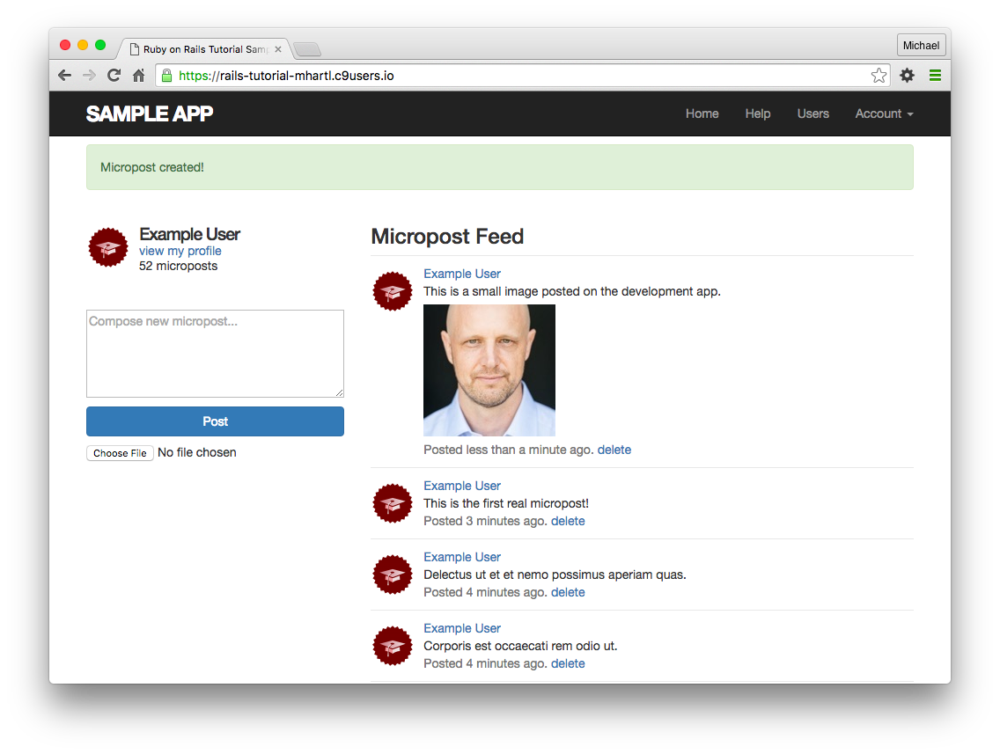

##### 연습

1. 이미지가 있는 micropost를 작성해봅시다. 혹시나 너무나도 큰 이미지를 첨부해버리진 않으셨나요? (걱정하지마세요. 이 문제는 다음 [13.4.3](#1343-image의- resize)에서 대응해봅니다.)
2. 아래 코드의 템플릿을 참고하여, [13.4](#134-micropost의-image-첨부) 에서 구현한 이미지 업로더를 테스트해보세요. 테스트의 준비로서, 먼저 sample 이미지를 fixture를 추가해보세요. (커맨드 : `cp app/assets/images/rails.png test/fixtures/`) 아래 코드에서 추가한 테스트에서는, Home 페이지에 있는 파일 업로드와, 작성에 성공했을 때 이미지가 표시되는지를 체크합니다. 또한 테스트 내부에 있는 `fixture_file_upload` 라고 하는 메소드는, fixture에서 정의된 파일을 업로드하는 특별한 메소드입니다. _Hint_ : `picture` 속성이 유효한지 아닌지를 확인하기 위해서는, [11.3.3](Chapter11.md#1133-유효화와-테스트의-Refactoring) 에서 소개한 `assigns` 메소드를 사용해주세요. 이 메소드를 사용하면 작성 성공한 후, `create` 액션 내의 micropost에 액세스하게 됩니다.

```ruby
# test/integration/microposts_interface_test.rb
# 영상업로드를 테스트하기 위한 템플릿
require 'test_helper'

class MicropostInterfaceTest < ActionDispatch::IntegrationTest

  def setup
    @user = users(:michael)
  end

  test "micropost interface" do
    log_in_as(@user)
    get root_path
    assert_select 'div.pagination'
    assert_select 'input[type=FILL_IN]'
    # 무효한 송신
    post microposts_path, params: { micropost: { content: "" } }
    assert_select 'div#error_explanation'
    # 유효한 송신
    content = "This micropost really ties the room together"
    picture = fixture_file_upload('test/fixtures/rails.png', 'image/png')
    assert_difference 'Micropost.count', 1 do
      post microposts_path, params: { micropost:
                                      { content: content,
                                        picture: FILL_IN } }
    end
    assert FILL_IN.picture?
    follow_redirect!
    assert_match content, response.body
    # 작성한 글을 삭제한다.
    assert_select 'a', 'delete'
    first_micropost = @user.microposts.paginate(page: 1).first
    assert_difference 'Micropost.count', -1 do
      delete micropost_path(first_micropost)
    end
    # 다른 유저의 프로필에 액세스해본다.
    get user_path(users(:archer))
    assert_select 'a', { text: 'delete', count: 0 }
  end
  .
  .
  .
end
```

### 13.4.2 Image의 검증

[13.4.1](#1341-기본적인-image-upload) 의 업로더도 나쁘지는 않습니다만, 몇가지 눈에 띄는 결점이 있습니다. 예를 들어, 업로드된 이미지에 대한 제한이 없기 때문에, 만약 유저가 엄청 큰 파일을 업로드한다거나 무효한 파일을 업로드하면 문제가 발생하게 됩니다. 이런 결점을 보완하기 위해 이미지 용량이나 포맷에 대한 validation을 구현하고 서버용과 클라이언트 (브라우저) 용의 양쪽에 추가해봅시다.


제일 첫 validation에서는 유효한 이미지의 종류를 제한해봅시다. 이것은 CarrierWave의 업로더 안에 힌트가 존재합니다. 생성된 업로더의 안에 주석처리된 코드가 있습니다. 이 주석처리된 코드를 원래대로 되돌리는 것으로, 이미지의 파일명으로부터 유효한 확장자 (PNG/GIF/JPEG 등)을 검증할 수 있게 됩니다.

```ruby
# app/uploaders/picture_uploader.rb
# Image format validation
class PictureUploader < CarrierWave::Uploader::Base
  storage :file

  # Upload파일의 저장폴더는 덮어쓰기 가능
  # 아래는 기본 저장 폴더
  def store_dir
    "uploads/#{model.class.to_s.underscore}/#{mounted_as}/#{model.id}"
  end

  # 업로드가 가능한 확장자의 리스트 
  def extension_whitelist
    %w(jpg jpeg gif png)
  end
end
```

2번째 valiadtion에서는 이미지의 용량을 제한합니다. 이것은 `Micropost` 모델에 추가해보겠습니다. 방금 전 validation과는 다르게, 파일 용량에 대한 validation은  Rails의 기존 옵션 (`presence`나 `length` 등) 에는 없습니다. 따라서 이번에는 수동으로 `picture_size` 라고하는 독자적인 validation을 정의해봅시다. 결과는 아래와 같습니다. 독자적인 validation을 사용하기 위해 지금까지 사용하고 있던 `validates` 메소드가 아닌 `validate` 메소드를 사용하고 있는 점을 주목해주세요.

```ruby
# app/models/micropost.rb
# Add imageSize Validation
class Micropost < ApplicationRecord
  belongs_to :user
  default_scope -> { order(created_at: :desc) }
  mount_uploader :picture, PictureUploader
  validates :user_id, presence: true
  validates :content, presence: true, length: { maximum: 140 }
  validate  :picture_size #new

  private

    # 업로드된 이미지 용량을 validation한다. 
    def picture_size
      if picture.size > 5.megabytes
        errors.add(:picture, "should be less than 5MB")
      end
    end
```

이 `validate` 메소드는 파라미터로 심볼 (`:picture_size`) 를 전달받는다. 이 심볼명에 대응하는 메소드를 호출합니다. 또한 호출된 `picture_size` 메소드에서는 5MB를 상한으로 하여 (문법은 [컬럼 9.1](Chapter9.md#컬럼91-cookies는-지금으로부터-20년후에-만료된다-20.years.from_now) 을 참조) 해당 용량을 넘은 경우에는 커스터마이즈한 에러메세지를 `errors` 컬렉션에 추가합니다. (`errors` 에 대해서는 [6.2.2](Chapter6.md#622-존재성을-검증해보자) 에서 설명했습니다.)


위 두 개의 코드에서 정의한 이미지의 validation을 view에서 구현하기 위해, 클라이언트 측에 2개의 처리를 추가해봅시다. 일단은 format의 validation을 반영하기 위해서는 `file_field` 태그에 `accept` 파라미터를 부여하여 사용합니다.

`<%= f.file_field :picture, accept: 'image/jpeg,image/gif,image/png' %>`

이 때 accept파라미터에서는 위 첫 번째 코드에서 허가한 파일 형식을, [MIME 타입](https://ja.wikipedia.org/wiki/Multipurpose_Internet_Mail_Extensions#Content-Type) 으로 지정할 수 있습니다.


다음으로는 매우 큰 파일 사이즈에 대해 경고를 출력하기 위해, 간단한 JavaScript (정확히는 jQuery) 를 추가해봅니다. 이렇게하는 것으로 너무 긴 업로드 시간을 막을 수 있으며 서버의 부담을 줄일 수 있습니다.

```javascript
$('#micropost_picture').bind('change', function() {
  var size_in_megabytes = this.files[0].size/1024/1024;
  if (size_in_megabytes > 5) {
    alert('Maximum file size is 5MB. Please choose a smaller file.');
  }
});
```

jQuery는 본 튜토리얼의 주제가 아니기 때문에 상세한 설명은 하지 않습니다만, 위 코드에서는 (해시마크 `#` 으로부터 알 수 있듯) CSS id `micropost_picture` 를 포함한 요소를 찾아내어, 해당 요소를 감시합니다. 그리고 이 id를 가진 요소는 micropost form을 지칭합니다. (또한 브라우저 상에서는 화면을 오른쪽 클릭하여 inspector로 요소를 확인할 수 있습니다.) 즉, 이 CSS id를 가진 요소가 변화하였을때, 이 jQuery 함수가 동작합니다. 그리고 만약 파일 사이즈가 너무 큰 경우에는 `alert` 메소드로 경고를 내보냅니다.


이러한 추가적인 체크기능을 정리하자면 아래와 같이 됩니다.

```erb
<!-- app/views/shared/_micropost_form.html.erb -->

<%= form_for(@micropost) do |f| %>
  <%= render 'shared/error_messages', object: f.object %>
  <div class="field">
    <%= f.text_area :content, placeholder: "Compose new micropost..." %>
  </div>
  <%= f.submit "Post", class: "btn btn-primary" %>
  <span class="picture">
    <%= f.file_field :picture, accept: 'image/jpeg,image/gif,image/png' %>
  </span>
<% end %>

<script type="text/javascript">
  $('#micropost_picture').bind('change', function() {
    var size_in_megabytes = this.files[0].size/1024/1024;
    if (size_in_megabytes > 5) {
      alert('Maximum file size is 5MB. Please choose a smaller file.');
    }
  });
</script>
```

이미 눈치챈 독자분들도 있을 수도 있겠습니다만, 위와 같은 코드에서는 큰 파일의 업로드를 완전하게 막을 수 없습니다. 예를 들어, 유저는 alert를 무시하고 업로드를 강행할 수도 있을 것입니다. 만약 본 튜토리얼이 jQuery 튜토리얼이었다면 이 문제점과 해결책을 상냥하게 설명했을 것입니다만, 본 튜토리얼은 Rails 튜토리얼이기 때문에 이번에는 "위와 같은 코드으로는 아직 구현이 불완전하다" 라는 점을 알아놓는다면 충분합니다. 또한 만약 송신 form을 사용하여 작성을 제한할 수 있다하여도, 브라우저의 inspector 기능으로 JavaScript를 뜯어고친다거나 `curl` 을 사용하여 직접 POST 리퀘스트를 송신하는 경우에는 대응할 수 없습니다. 이러한 경우에도 대응할 수 있도록 하기 위해, 서버측 validation은 중요한 것 입니다.

##### 연습

1. 5MB이상의 이미지 파일을 등록하고자 하는 경우에는 어떻게 됩니까?
2. 무효한 확장자의 파일을 등록하고자하는 경우에는 어떻게 됩니까?

### 13.4.3 Image의 Resize

파일사이즈에 대한 Validation ([13.4.2](#1342-image의-검증)) 은 제대로 구현되었습니다. 그러나 이미지 사이즈 (가로세로의 길이)에 대한 제한은 아니기 때문에, 큰 이미지 사이즈가 업로드 되어지면 아래 캡쳐와같이 레이아웃이 깨져버리게 됩니다. 그렇다고는 해도, 유저에게 유저가 가진 이미지의 사이즈를 수정하도록 하는 것은 불편합니다. 그렇기 때문에 이미지를 표시하기 전에 사이즈를 변경하는 (Resize) 처리를 구현해봅시다.

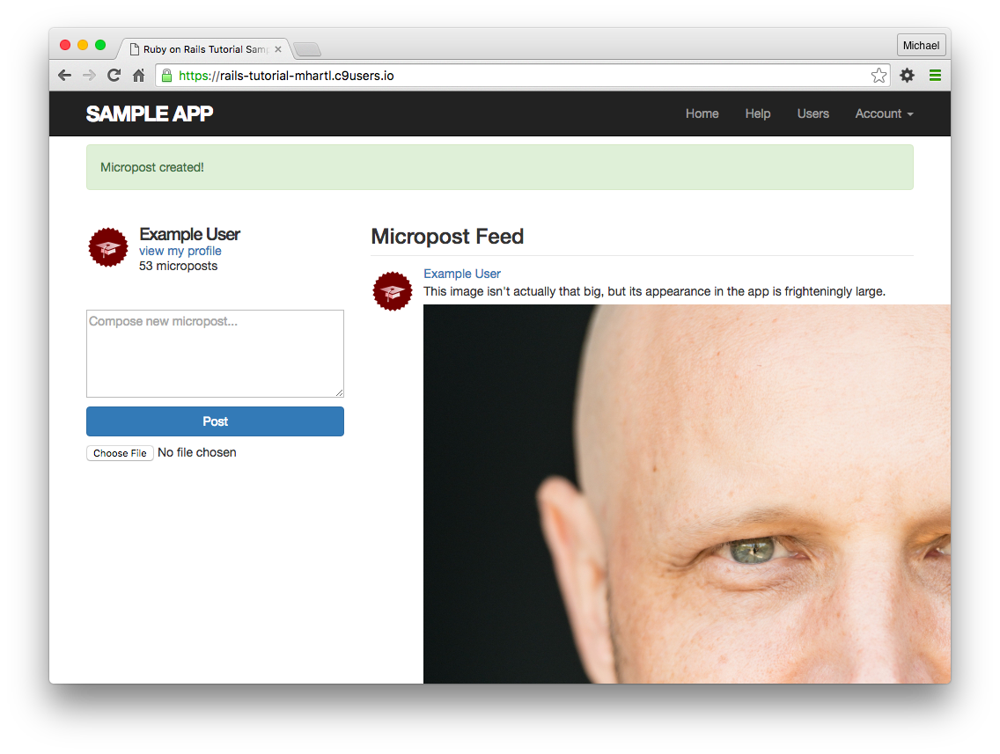

이미지를 리사이즈하기 위해서는 이미지를 조작하는 프로그램이 필요합니다. 이번에는 [ImageMagick](http://www.imagemagick.org/) 라고 하는 프로그램을 사용하기 때문에, 이것을 개발환경에 설치해보겠습니다. ([13.4.4](#1344-실제-배포환경에서의-image-upload)에서도 설명합니다만, 실제 배포환경이 Heroku라면, 이미 배포환경에 ImageMagick을 쓸 수 있도록 준비되어져 있습니다.) Cloud IDE의 경우, 다음 커맨드로 이 프로그램을 설치할 수 있습니다.

```
sudo yum install -y ImageMagick
```

(혹여나 로컬환경에서 개발하고 있는 경우에는, 각각의 환경에 맞추어 ImageMagick를 설치하는 순서가 다릅니다. 예를 들어 Mac이라면, Homebrew를 도입하여 `brew install imagemagick` 커맨드를 사용하여 설치할 수 있습니다. 만약 설치가 제대로 안된다면, 컬럼1.1를 참고해주세요.)


다음으로, [MiniMagick](https://github.com/minimagick/minimagick) 이라고 하는, ImageMagick과 Ruby를 이어주는 gem을 사용하여 이미지를 리사이즈해봅시다. [MiniMagick의 Document](http://www.rdoc.info/github/jnicklas/carrierwave/CarrierWave/MiniMagick) 를 확인하면, 여러가지 방법으로 리사이즈할 수 있는 것을 알 수 있습니다만, 이번에는 `resize_to_limit: [400, 400]` 라고 하는 방법을 사용해봅니다. 이 것은 가로세로 어느쪽이던 400px를 초과할 경우, 적절한 사이즈로 축소하는 옵션입니다. (단, 작은 이미지라고 해도 확대하진 않습니다.) 여담으로, [CarrierWave의 MiniMagick 항목](https://github.com/carrierwaveuploader/carrierwave#using-minimagick) 을 확인해보면, 너무나도 작은 이미지를 _억지로 늘리는_ 방법도 있는 것 같습니다만, 이번에는 사용하지 않겠습니다. 따라서 최종적인 코드는 아래와 같이 됩니다. 이것으로 커다란 이미지 사이즈라도 적절하게 리사이즈될 것 입니다.

```ruby
# app/uploaders/picture_uploader.rb
class PictureUploader < CarrierWave::Uploader::Base
  include CarrierWave::MiniMagick #new
  process resize_to_limit: [400, 400] #new

  storage :file

  # 업로드파일의 저장폴더는 덮어쓰기 가능
  # 아래는 기본 저장 폴더
  def store_dir
    "uploads/#{model.class.to_s.underscore}/#{mounted_as}/#{model.id}"
  end

  # 업로드가능한 확장자 리스트
  def extension_whitelist
    %w(jpg jpeg gif png)
  end
end
```

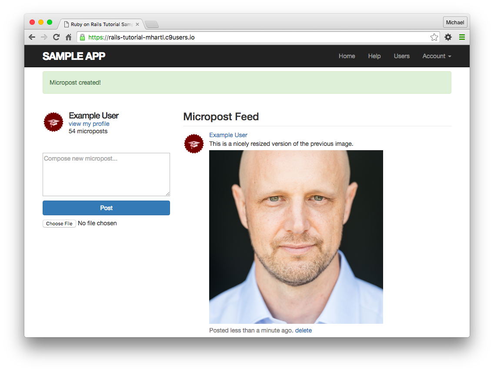

##### 연습

1. 해상도가 높은 이미지를 업로드하고, 리사이즈 되어지는지를 확인해봅시다. 이미지가 직사각형 일 경우, 리사이즈는 제대로 잘 됩니까?
2. 이미 이전에 이미지 사이즈에 대해 테스트를 추가한 경우, 이 시점에서 테스트를 실행하면 에러메세지가 표시될 것 입니다. 이 에러를 없애봅시다. _Hint_ : 아래 설정 파일을 수정하여 테스트 시에는 CarrierWave에 이미지의 리사이즈를 실행시키지 않도록 해봅시다.

```ruby
# config/initializers/skip_image_resizing.rb
if Rails.env.test?
  CarrierWave.configure do |config|
    config.enable_processing = false
  end
end
```

### 13.4.4 실제 배포환경에서의 Image Upload

(이 섹션은 Skip 하여도 됩니다. 제대로 되지않는다면 Skip해도 문제없습니다.)


[13.4.3](#1343-image의-resize) 에서 구현한 이미지 업로더는 개발환경에서 동작시키기에는 문제없습니다만, 실제 배포환경에는 적절하지 않습니다. 이 것은 `picture_uploader.rb`의 `storage :file` 이라고하는 코드에 의해서, 로컬 파일시스템에 이미지를 저장하도록 되어있기 때문입니다. 실제 배포환경에서는 파일 시스템이 아닌 Cloud Storage 서비스에 이미지를 저장하도록 해봅시다.


실제 배포환경에서 cloud storage에 저장하게 하기 위해서는, 아래 코드처럼 `fog` gem 을 사용하면 간단하게 할 수 있습니다.

```ruby
# app/uploaders/picture_uploader.rb
class PictureUploader < CarrierWave::Uploader::Base
  include CarrierWave::MiniMagick
  process resize_to_limit: [400, 400]

  # new
  if Rails.env.production?
    storage :fog
  else
    storage :file
  end

  # 업로드 파일의 저장 디렉토리는 덮어쓰기 가능
  # 아래는 기본 저장 디렉토리
  def store_dir
    "uploads/#{model.class.to_s.underscore}/#{mounted_as}/#{model.id}"
  end

  # 업로드 가능한 확장자의 리스트 
  def extension_whitelist
    %w(jpg jpeg gif png)
  end
end
```

위 코드에서 `production?` 이라고 하는 논리값을 리턴하는 메소드를 사용하고 있습니다. 이 메소드는 컬럼 7.1에서도 소개했습니다만, 이것을 사용하면 환경별로 저장 디렉토리를 바꿀 수 있습니다.

```ruby
if Rails.env.production?
  storage :fog
else
  storage :file
end
```

요즘 시대에는 많은 cloud storage 서비스가 있습니다만, 이번에는 유명하고 신뢰성이 높은 Amazon의 [Simple Storage Service (S3)](http://aws.amazon.com/s3/) 를 사용해보겠습니다. 설치 순서는 다음과 같습니다.

1.  [Amazon Web Services](http://aws.amazon.com/) 의 계정을 생성한다.
2.  [WS Identity and Access Management (IAM)](http://aws.amazon.com/iam/) 에서 유저를 생성하고, Access key 와 Secret key를 생성하고 메모해놓는다.
3.  [AWS Console](https://console.aws.amazon.com/s3) 에서 S3 bucket을 생성하고, ( bucket 이름은 아무거나 상관 없습니다. ) 2에서 생성한 유저에게 Read권한과 Write 권한을 부여한다.

(S3의 설치는 꽤나 어렵습니다. 컬럼1.1를 참고하여 알아봅시다.)


좀 더 자세하게 알고 싶은 경우에는 [S3의 Document](http://aws.amazon.com/documentation/s3/) 를 읽어보거나, Google이나 Stack Overflow에서 검색해봅시다.


S3 Account의 생성과 설정이 끝났다면, CarrierWave의 설정파일을 다음 아래 코드와 같이 수정해봅시다.

```ruby
# config/initializers/carrier_wave.rb
if Rails.env.production?
  CarrierWave.configure do |config|
    config.fog_credentials = {
      # Amazon S3의 설정
      :provider              => 'AWS',
      :region                => ENV['S3_REGION'],     # 예: 'ap-northeast-1'
      :aws_access_key_id     => ENV['S3_ACCESS_KEY'],
      :aws_secret_access_key => ENV['S3_SECRET_KEY']
    }
    config.fog_directory     =  ENV['S3_BUCKET']
  end
end
```

실제 배포환경의 메일설정과 마찬가지로, 위 코드에서는 Heroku의 환경변수 `ENV` 를 사용하여 기밀정보가 누설되지 않도록 하고 있습니다. 11.4나 12.4에서는 SendGrid의 AddOn이 이러한 환경변수를 자동적으로 설정해주었으나, 이번에는 수동으로 설정할 필요가 있습니다. `heroku config:set` 커맨드를 사용하여 다음과 같이 Heroku 상의 환경변수를 설정해주세요.

```
$ heroku config:set S3_ACCESS_KEY="앞서 메모한 Access 키"
$ heroku config:set S3_SECRET_KEY="앞서 메모한 Secret 키"
$ heroku config:set S3_BUCKET="Bucket 이름 입력"
$ heroku config:set S3_REGION="지역 이름 입력"
```

설정이 무사히 끝났다면, 지금까지의 변경을 commit하고 Deploy할 준비가 되었습니다. 단 그전에, `.gitignore` 파일에 아래와 같이 내용을 추가해봅시다. 이것으로 이미지를 저장하는 디렉토리가 Git의 대상으로부터 제외되기 때문에, application과 관계없는 이미지 파일 등은 무시할 수있도록 됩니다.

```
// .gitignore

# 업로드된 테스트 이미지를 무시한다.
/public/uploads
```

그렇다면 지금까지의 변경을 Topic branch에 commit 하고, master branch에 merge해봅시다.

```
$ rails test
$ git add -A
$ git commit -m "Add user microposts"
$ git checkout master
$ git merge user-microposts
$ git push
```

다음으로, Heroku에 Deploy, Database의 Reset, sample data의 생성을 차례대로 실행해봅시다.

```
$ git push heroku
$ heroku pg:reset DATABASE
$ heroku run rails db:migrate
$ heroku run rails db:seed
```

Heroku에는 이미 ImageMagick 이 설치되어있기 때문에, (설정이 제대로 되어있다면,) 이미지 리사이즈나 실제 배포환경에서의 이미지 업로드는 성공할 것 입니다.


##### 연습

1. 실제 배포환경에서 해상도가 높은 영상을 업로드하고, 적절하게 리사이즈되는지를 확인해봅시다. 직사각형의 이미지여도 적절하게 리사이즈됩니까?


## 13.5 마지막으로

Micropost 리소스의 추가로 인하여, Sample Application은 거의 완성되었습니다. 남은 내용으로는 유저를 서로 팔로우할 수 있는 Social기능의 추가입니다. 제 14장에서는 그러한 유저간의 관계 (Relationship) 을 모델링하는 방법에 대해 배우고, Micropost의 피드에 어떻게 관계되는지 알아봅니다.


만약 [13.4.4](#1344-실제-배포환경에서의-image-upload) 를 스킵하였다면, 여기서 지금까지의 변경사항을 커밋하고 merge해봅시다.

```
$ rails test
$ git add -A
$ git commit -m "Add user microposts"
$ git checkout master
$ git merge user-microposts
$ git push
```

준비되었다면 실제 배포환경으로 배포해봅시다.

```
$ git push heroku
$ heroku pg:reset DATABASE
$ heroku run rails db:migrate
$ heroku run rails db:seed
```

또한, 필요한 gem의 설치는 이것으로 끝났습니다. 이후 새로운 gem을 추가할 일은 없습니다. 제일 마지막상태의 `Gemfile` 을 참고해주세요.

```ruby
source 'https://rubygems.org'

gem 'rails',                   '5.1.6'
gem 'bcrypt',                  '3.1.12'
gem 'faker',                   '1.7.3'
gem 'carrierwave',             '1.2.2'
gem 'mini_magick',             '4.7.0'
gem 'will_paginate',           '3.1.6'
gem 'bootstrap-will_paginate', '1.0.0'
gem 'bootstrap-sass',          '3.3.7'
gem 'puma',                    '3.9.1'
gem 'sass-rails',              '5.0.6'
gem 'uglifier',                '3.2.0'
gem 'coffee-rails',            '4.2.2'
gem 'jquery-rails',            '4.3.1'
gem 'turbolinks',              '5.0.1'
gem 'jbuilder',                '2.7.0'

group :development, :test do
  gem 'sqlite3', '1.3.13'
  gem 'byebug',  '9.0.6', platform: :mri
end

group :development do
  gem 'web-console',           '3.5.1'
  gem 'listen',                '3.1.5'
  gem 'spring',                '2.0.2'
  gem 'spring-watcher-listen', '2.0.1'
end

group :test do
  gem 'rails-controller-testing', '1.0.2'
  gem 'minitest',                 '5.10.3'
  gem 'minitest-reporters',       '1.1.14'
  gem 'guard',                    '2.14.1'
  gem 'guard-minitest',           '2.4.6'
end

group :production do
  gem 'pg',   '0.20.0'
  gem 'fog',  '1.42'
end

# Windows환경에서는 아래 gem을 포함시킬 필요가 있습니다.
gem 'tzinfo-data', platforms: [:mingw, :mswin, :x64_mingw, :jruby]
```

### 13.5.1 13장의 정리

- Active Record 모델덕분에, Micropost도 유저와 마찬가지로 Resource로써 다룰 수 있다.
- Rails는 여러개의 Key Index를 지원한다.
- User는 여러개의 Micropost를 가지고 있으며 (`has_many`) Micropost는 1명의 User에게 의존하는 (`belongs_to`) 관계를 모델화한다.
- `has_many` 나 `belongs_to` 를 이용하는 것으로, 관계맺기를 통한 많은 메소드를 사용할 수 있다.
- `user.microposts.build(...)` 라고 하는 코드는, 파라미터로 주어진 유저에게 관계된 micropost를 리턴한다.
- `default_scope` 를 사용하면 기본의 순서를 변경할 수 있다.
- `default_scope` 는 파라미터에 무명함수(->) 를 입력할 수 있다.
- `dependent: :destroy` 옵션을 사용하면, 관계된 오브젝트와 자기자신을 동시에 삭제할 수 있다.
- paginate 메소드나  count 메소드는, 어느쪽이던 관계맺기 행위를 통해 실행되고, 효율적인 데이터베이스로의 조회를 실행하낟.
- fixture는 관계맺기를 사용한 Object의 생성도 지원한다.
- Partial을 호출할 때, 같이 파라미터를 넘길 수 있다.
- `where` 메소드를 사용하면,  Active Record를 통하여 선택 (부분집합을 취하는 것)할 수 있다.
- 의존하고 있는 Object를 생성/삭제할 때는, 항상 관계를 통하여 실행하는 것으로, 보다 더 안전한 조작을 구현할 수 있다.
- CarrierWave를 사용하면 영상 업로드나 영상 리사이즈를 할 수 있다.


