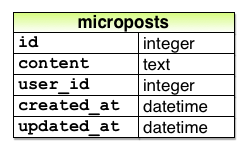

# 제 13장 유저의 Micropost

sample 어플리케이션의 코어 부분을 개발하기 위해, 지금까지 유저, 세션, Account 유효화, 패스워드 리셋 등 4개의 리소스에 대해 학습했습니다. 그리고 이것 들 중, "유저" 라고 하는 리소스만이 Active Record에 의해 데이터베이스 상의 테이블과 이어져있습니다. 모든 준비를 마친 지금, 유저가 짧은 메세지를 투고할 수 있도록 하기 위해 리소스 "*Micropost*" 를 추가해보겠습니다. [제 2장](Chapter2.md) 에서 간이적인 micropost 등록 form을 핸들링해보았습니다만, 이번 챕터에서는 [2.3](Chapter2.md#23-microposts-리소스) 에서 학습한 Micropost 데이터 모델을 생성하고, User 모델과 `has_many` , `belongs_to` 메소드를 사용하여 관련짓기를 해볼 것 입니다. 게다가 결과를 처리하고 표시하기 위해 필요한 Form과 해당 부품을 작성해보겠습니다. (13.4에서 이미지의 업로드도 구현해볼 것 입니다.) 제 14장에서는 micropost의 피드를 받기 위해 유저를 팔로우하는 개념을 도입하고, Twitter의 미니클론 버전을 완성시켜보겠습니다.

## 13.1 Micropost Model

우선 Micropost 리소스의 제일 본질적인 부분을 표현하는 Micropost 모델을 생성하는 부분부터 해보겠습니다. [2.3](Chapter2.md#23-microposts-리소스) 에서 생성한 모델과 마찬가지로, 이 새로운 Micropost 모델도 데이터 검증과 User 모델의 관련짓기를 포함하고 있습니다. 이전 모델과는 다르게 이번 micropost 모델은 완전히 테스트되어지고 디폴트의 순서를 가지며, 상위 데이터인 유저가 삭제되는 경우 자동적으로 파기되도록 합니다.

Git으로 버전관리에 사용하고 있는 경우는, 언제나처럼 토픽브랜치를 생성해봅시다.

`$ git checkout -b user-microposts `

### 13.1.1 기본적인 모델

Micropost 모델은 micropost의 내용을 저장할 `content` 속성과 특정 유저와 micropost를 관련짓는 `user_id` 속성의 2개 만을 가집니다. 실행한 결과의 Micropost의 구조는 아래와 같습니다.

