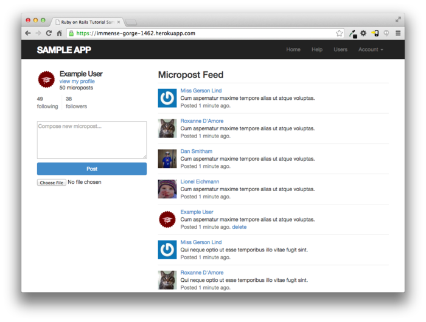

### 14.3.3 Sub Select

앞서 Hint에서 알아채린 분들도 있을거라고 생각합니다만, [14.3.2](#1432-feed를-처음으로-구현해보자) 의 Feed의 구현은, 포스팅된 micropost의 수가 방대하게 된 경우, 제대로 핸들링되지 않습니다. 즉 follow하고 있는 유저가 5천명정도가 된다면, Web서비스 전체가 느려질 가능성이 있습니다. 이번 섹션에서는 Follow하고 있는 유저의 수에 따라 핸들링될 수 있도록 Status Feed를 개선해봅시다.

[14.3.2](#1432-feed를-처음으로-구현해보자) 에서 보여드린 코드의 문제점은, `following_ids` 에서 follow하고 있는 _모든_ 유저를 데이터베이스로부터 조회하고, 게다가 follow하고 있는 유저의 완전한 배열을 만들기 위해 다시 데이터베이스에 조회한다는 점 입니다. `user.rb` 의 `feed` 메소드의 조건에서는 집합에 포함되어져 있는지 없는지만 체크되고 있기 때문에, 이 부분에서 좀 더 효율적인 코드를 작성하지 않으면 안됩니다. 또한 SQL은 본래 이러한 집합의 조작에 최적화되어있습니다. 실제로 이러한 문제는 SQL의 Subselect를 사용하면 해결할 수 있습니다.

우선은 아래의 코드를 약간 수정하여 feed를 Refactoring을 하는 것 부터 시작해봅시다.

```ruby
# app/models/user.rb
class User < ApplicationRecord
  .
  .
  .
  # 유저의 status feed를 리턴한다.
  def feed
    Micropost.where("user_id IN (:following_ids) OR user_id = :user_id",
     following_ids: following_ids, user_id: id)
  end
  .
  .
  .
end
```

위 코드에서는 지금까지의 코드

```ruby
Micropost.where("user_id IN (?) OR user_id = ?", following_ids, id)
```

를 다음과 같이 바꾸었습니다.

```ruby
Micropost.where("user_id IN (:following_ids) OR user_id = :user_id",
    following_ids: following_ids, user_id: id)
```

전자의 물음표를 사용한 문법도 편리합니다만, 같은 변수를 여러 곳에 지정하고 싶을 경우에는 후자의 방법을 사용하는 것이 좀 더 편리합니다.

위 설명에서 암묵적으로 알 수 있듯, 지금부터 SQL Query에 한 가지 더 `user_id` 를 추가합니다. 특히 다음 Ruby 코드는

`following_ids`

아래와 같은 SQL로 바꿀 수 있습니다.

`following_ids = "SELECT followed_id FROM relationships WHERE follower_id = :user_id"`

이 코드를 SQL의 SubQuery로서 사용합니다. 즉 "유저 `1` 이 follow하고 있는 유저 전부를 선택한다." 라는 SQL을 기존의 SQL안에 포함시키는 형태가 되어, 결과적으로 SQL은 아래와 같은 형태가 됩니다.

```sql
SELECT * FROM microposts
WHERE user_id IN (SELECT followed_id FROM relationships
                  WHERE  follower_id = 1)
      OR user_id = 1
```

이 SubSelect는 집합의 로직을 (Rails가 아닌) 데이터베이스 내부에 저장하기 때문에 보다 더 효율적으로 데이터를 조회할 수 있습니다.

이것으로 기초를 다질 수 있었습니다. 아래 코드와 같이 좀 더 효율적인 Feed를 구현해볼 준비가 되었습니다. (여기서 기술되어진 코드는 SQL을 나타내는 문자열이며, `following_ids` 라고 하는 문자열은 Escape되어져있는 것이 아닌, 보기 쉽게 하기 위해 _식전개_ 되어져 있는 점을 유의해주세요.)

```ruby
# app/models/user.rb
class User < ApplicationRecord
  .
  .
  .
  # 유저의 Status feed를 리턴한다.
  def feed
    following_ids = "SELECT followed_id FROM relationships
                     WHERE follower_id = :user_id"
    Micropost.where("user_id IN (#{following_ids})
                     OR user_id = :user_id", user_id: id)
  end
  .
  .
  .
```

이 코드는 Rails와 Ruby와 SQL 코드가 복잡하게 섞여있는 조합이라 조금 조악해보일 수 있으나 제대로 동작합니다.

`$ rails test`

물론 SubSelect를 사용하면 얼마든지 핸들링할 수 있다는 것은 아닙니다. 대규모 Web 서비스에서는 Background 처리를 사용하여 feed를 비동기로 생성한다던지 등의 개선이 필요할 것 입니다. 그러나 Web서비스를 핸들링하는 기술은 매우 고도의 기술이며 섬세한 작업이기 때문에 본 튜토리얼에서는 여기까지만 개선작업을 진행해보겠습니다.

위 코드를 끝으로 Status feed의 구현은 완료하였습니다. [13.3.3](Chapter13.md#1333-feed의-원형) 에서 Home페이지에는 이미 Feed가 추가되어있던 것을 떠올려주세요. [13장](Chapter13.md) 에서는 그저 프로토타입이었습니다만 위 코드의 구현으로 인하여 Home 페이지에서 완전한 Feed를 표시할 수 있는 것을 알게 되었습니다.


이 시점에서 master 브랜치로의 변경사항을 merge하여 봅시다.

```
$ rails test
$ git add -A
$ git commit -m "Add user following"
$ git checkout master
$ git merge following-users
```

코드를 Repository로 push하여 실제 배포환경에 deploy해봅시다.

```
$ git push
$ git push heroku
$ heroku pg:reset DATABASE
$ heroku run rails db:migrate
$ heroku run rails db:seed
```

실제 배포환경에서 동작하는 status feed는 아래와 같습니다.



##### 연습

1. Home페이지에 표시되는 1페이지째의 Feed에 대하여 통합테스트를 작성하여봅시다. 아래 코드는 Template입니다.
2. 아래 코드에서는 기대되어지는 HTML를 `CGI.escapeHTML` 메소드를 사용하여 escape하고 있습니다. (이 메소드는 [11.2.3](Chapter11.md#1123-발신-메일의-테스트) 에서 사용한 `CGI.escape` 와 같은 용도입니다.) 이 코드에서는 어째서 HTML을 Escape할 필요가 있을까요? 생각해봅시다. _Hint_ : 시험삼아 Escape처리를 적용하지않고 얻을 수 있는 HTML의 내용을 주의깊게 확인해주세요. micropost의 내용이 어딘가 이상할 것 입니다. 또한 터미널의 검색기능을 사용하여 "sorry" 를 검색하면 원인규명에 도움이 될 것 입니다.

```ruby
test/integration/following_test.rb
require 'test_helper'

class FollowingTest < ActionDispatch::IntegrationTest

  def setup
    @user = users(:michael)
    log_in_as(@user)
  end
  .
  .
  .
  test "feed on Home page" do
    get root_path
    @user.feed.paginate(page: 1).each do |micropost|
      assert_match CGI.escapeHTML(FILL_IN), FILL_IN
    end
  end
end
```


## 14.4 마지막으로

