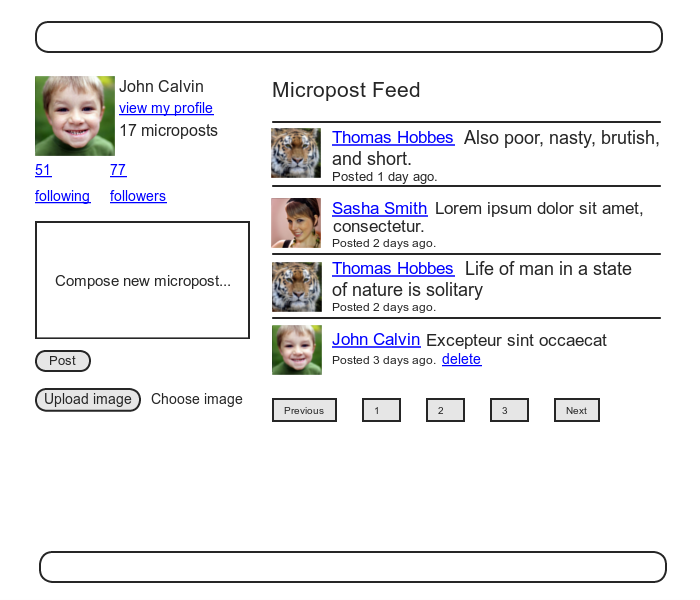
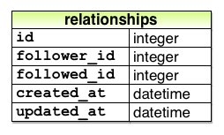

# 제 14장 유저를 Follow해보자

이번 챕터에서는 Sample application의 핵심이되는 부분을 완성시켜봅니다. 구체적으로는 다른 유저를 follow(및 follow 해제)할 수 있는 Social 기능의 추가와, Follow하고 있는 유저의 투고를 Status feed에 표시하는 기능을 추가해봅니다. 우선은 유저간의 관계를 어떻게 모델링할 것인지에 대해 배워봅니다. 그 후 모델링결과에 대응하는 Web Interface를 구현합니다. 그 때, Web Interface의 한 예로서 Ajax라고 하는 것을 소개해보겠습니다. 마지막으로 Status feed의 완성판을 구현해볼 것 입니다.


본 마지막 챕터에서는, 본 튜토리얼에서 가장 난이도가 높은 방법을 몇가지 사용해볼 것이빈다. 그 중에서는 Status Feed의 작성을 위해 Ruby/SQL을 "속이는" 테크닉도 포함됩니다. 이번 챕터의 예시 전체에 걸쳐, 지금까지보다도 복잡한 데이터 모델을 사용하빈다. 여기서 배운 데이터 모델은, 이후 개별적으로 Web Application을 개발할 때 반드시 도움이 될 것 입니다. 또한 본 튜토리얼을 다 끝내고나서 실제로 개발에 투입될 때 도움이될만한 리소스 집에 대해서도 소개해드리겠습니다.


이번 챕터에서 다루는 기법은 본 튜토리얼 전체에서도 제일 난이도가 높기 때문에, 이해를 돕기위하여 코드를 작성하기 전에 일단 멈추고 Interface를 이해해보도록 합시다. 지금까지의 챕터와 마찬가지로, 제일 처음에 목업을 확인해주세요. 페이지 조작의 전체적인 flow는 다음과 같습니다. 어떠한 유저 (John Calvin) 은 자신의 프로필 페이지를 제일 처음 표지하고, Follow하는 유저를 선택하기 위해 User페이지로 이동합니다. Calvin은 2번째 유저 Thomas Hobbles를 표시하고, [Follow] 버튼을 눌러 Follow를 합니다. 이것으로 [Follow]버튼이 [Unfollow] 버튼으로 바뀌고, Hobbes의 [followers] 카운트가 1 증가합니다. Cavin이 Home페이지로 돌아가면, [Following] 카운트가 1명 증가해있고, Hobbes의 마이크로 포스트가 Status Feed에 표시되고 있는 것을 알게 될 것 입니다. 이번 섹션에서는 이후의 Follow의 구현의 전념해봅니다.





## 14.1 Relationshop Model

유저를 follow하는 기능을 구현하는 제일 첫 번째로는, Data modeling 을 구성하는 것 입니다. 단, 이것은 보기와는 달리 단순하진 않습니다. 간단하게 생각한다면 `has_many` (1대다) 의 관계를 이용하여 "1명의 유저가 여러명의 유저를 `has_many` 로 follow를 하고, 1명의 유저에게 여러명의 follower가 있는 것을 `has_many`  로 나타낸다" 라고 하는 방법도 구현가능할 것 같습니다. 그러나 방금 전 설명한 것과 같이 이 방법으로는 당장 뛰어넘기 어려운 벽과 마주하게 될 것 입니다. 이것을 해결하기 위해서 `has_many through` 에 대해서 나중에 설명해보겠습니다.


Git유저는 지금까지와 마찬가지로 새로운 Topic branch를 생성해주세요.

`$ git checkout -b following-users`

### 14.1.1 DataModel의 문제 (및 해결책)

유저를 follow하는 DataModel의 구성을 위한 첫 걸음으로써, 전형적인 경우를 검토해봅시다. 어떤 유저가 다른 유저를 follow하고 있다는 것을 가정해봅시다. 구체적인 예를 든다면, Calvin은 Hobbes를 follow하고 있습니다. 이것을 역으로 생각해본다면, Hobbes는 Calvin으로부터 Follow를 당하고 있습니다. Calvin은 Hobbes으로부터 보면 follower이며, Calvin이 Hobbes를 followed한 것이 됩니다. Rails에서의 Default적인 복수형의 관습을 따르면, 어떤 유저를 follow하고 있는 모든 유저의 집합은 `followers` 가 되며, `user.followers` 는 이것들의 유저의 배열을 지칭하는 것이 됩니다. 그러나 안타깝게도, 이러한 이름은 역으로 생각할때는 잘 동작하지 않습니다. (Rails보단 영어의 문제입니다만,) 어떤 유저가 follow하고 있는 모든 유저의 집합은, 이대로는 `followeds` 가 되어버리며, 영어의 문법으로부터 제외되는 매우 볼썽사나운 형태가 되어버립니다. 여기서 Twitter의 관습을 보고 배워, 본 튜토리얼에서는 `following` 이라는 호칭을 채용해봅시다. (예: "50 following, 75 followers") 따라서 어떤 유저가 follow하고 있는 모든 유저의 집합은 `calvin.following` 이 됩니다.


이것으로, 아래와 같이 `following` 테이블과 `has_many` 관계를 이용하여 follow하고있는 유저의 모델을 작성해보았습니다. `user.following` 은 유저의 집합이지 않으면 안되기 때문에, `following` 테이블의 각각의 데이터는, `followed_id` 로 식별가능한 유저이지 않으면 안됩니다. (이것은 `follower_id` 의 관계에 대해서도 마찬가지 입니다.) 게다가 각각의 데이터는 유저이기 때문에, 이 유저에게 이름이나 패스워드 등의 속성도 추가할 필요가 있습니다.


위 데이터모델에서의 문제점은, 매우 불필요한 점이 많다는 것 입니다. 각 데이터에는 follow하고 있는 유저의 id뿐만 아니라, 이름이나 메일주소까지 있습니다. 이것은 어디까지나 `users` 테이블에 이미 존재하고 있는 정보입니다. 게다가 안좋게도 `followers` 의 모델링을 할 때에도 비슷하게, 불필요한 점이 많은 `followers` 테이블을 별도로 생성하지 않으면 안될 것 입니다. 결론적으로는 이 데이터모델은 유지보수의 관점으로부터 볼때는 매우 좋지 않습니다. 유저 이름을 변경할 때마다 `users` 테이블의 해당 레코드 뿐만 아니라, `following` 과 `followers` 테이블 양쪽에 대해서도 _해당 유저를 포함한 모든 레코드_ 를 갱신하지 않으면 안됩니다.

이 문제의 근본적인 원인은, 필요한 추상화를 진행하지 않았다는 점 입니다. 올바른 모델을 찾아내는 방법 중 하나로는, Web Application에서의 `following` 동작을 어떻게 구현할 것인지를 가만히 생각해보는 것 입니다. [7.1.2](Chapter7.md#712-user-resource) 에 있어서, REST Architecture 는 생성하거나 삭제하는 리소스에 관련되어있다는 것을 떠올려주세요. 여기서부터 2가지의 의문점이 생길 것 입니다. 

1. 어떤 유저가 다른 유저를 follow할 때, 어떠한 것이 생성되는가.
2. 어떤 유저가 다른 유저를 follow_해제_ 할 때, 어떠한 것이 삭제되는가.

이 점을 생각해보면, 이 경우 application에 의해서 생성 혹은 삭제되는 것은 2명의 유저 간의 "_관계(Relationship)_" 이라는 것을 알 수 있을 것 입니다. 즉, 1명의 유저는 1대다의 관계를 가질 수 있으며, 게다가 유저는 Relationship을 경유하여 많은 `following` (혹은 `followers`) 와 관계를 맺을 수 있는 것입니다.

이 DataModel에는 다른 부분에도 해결해야만하는 문제가 있습니다. Facebook과 같은 우호관계 (Friendships) 에서는 본질적으로 좌우대칭의 DataModel이 성립합니다만, Twitter와 같은 Follow관계에서는 _좌우비대칭_ 의 성질이 있습니다. 즉, Calvin은 Hobbes를 follow하여도, Hobbes는 Calvin을 follow하고있지 않은 관계가 성립하는 것 이빈다. 이러한 좌우비대칭적인 관계를 구분하기 위해, 각각을 _능동적 관계(Active Relationship)_ 와 _수동적 관계(Passive Relationship)_ 이라 부르고자 합니다. 예를들어 앞서의 사례와 같은, Calvin이 Hobbes를 follow하지만, Hobbes는 Calvin을 follow하고 있지 않은 경우에는, Calvin은 Hobbes에 대해 "능동적 관계" 인 것이 됩니다. 반대로 Hobbes는 Calvin에 대해 "수동적 관계"가 됩니다. 

우선은, follow하고 있는 유저를 생성하기 위해, 능동적 관계에 초점을 맞춰 진행해보겠습니다. (수동적 관계에 대해서는 14.1.5 에서 다뤄보겠습니다.) 앞서 모델링은 구현에 대한 힌트가 되었습니다. follow하고 있는 유저는 `followed_id` 가 있으면 식별할 수 있기 때문에, 앞서 `following` 테이블을 `active_relationship` 테이블이라고 칭해보겠습니다. 단, 유저정보는 필요 없기 때문에, 유저 id이외의 정보는 삭제합니다. 그리고 `followed_id` 를 통해 `users` 테이블에서 follow되어진 유저를 찾아내봅시다. 이 데이터모델링을 도식화하면 아래와 같이 됩니다.


능동적 관계도, 수동적 관계도, 최종적으로는 데이터베이스의 같은 테이블을 쓰게 될 것 입니다. 따라서 테이블이름으로는 "관계" 를 뜻하는 "**Relationship**" 을 사용하겠습니다. 모델이름은 Rails의 관습에 따라, Relationship으로 합니다. 생성한 Relationship DataModel은 아래와 같습니다. 1개의 relationship 테이블을 사용하여 2개의 모델 (능동적 관계, 수동적 관계)를 시뮬레이션하는 방법은, 14.1.4에서 설명하겠습니다.



이 DataModel을 구현하기 위해, 우선 위 모델링에 대응한 migration을 생성합니다.

```
$ rails generate model Relationship follower_id:integer followed_id:integer
```

이 Relationship은 이후에 `follower_id` 와 `followed_id` 에서 빈번하게 검색하게 될 것입니다. 아래와 같이 각가의 컬럼에 인덱스를 추가합시다.

```ruby
# db/migrate/[timestamp]_create_relationships.rb
class CreateRelationships < ActiveRecord::Migration[5.0]
  def change
    create_table :relationships do |t|
      t.integer :follower_id
      t.integer :followed_id

      t.timestamps
    end
    add_index :relationships, :follower_id
    add_index :relationships, :followed_id
    add_index :relationships, [:follower_id, :followed_id], unique: true
  end
end
```

위 코드에서 복합 key index가 있는 것을 주목해주세요. 이것은 `follower_id` 와 `followed_id` 의 조합이 반드시 Unique한 것을 보증하기 위한 형태입니다. 이것으로 어떠한 유저가 같은 유저를 2회이상 follow하는 것을 막을 수 있을 것 입니다. (이전 6장에서 메일주소의 unique서을 보증하거나, 13장에서 사용한 복합 key index와 비교해보세요.) 물론, 이러한 중복 (2회이상 follow하는 것) 이 일어나지 않도록, interface 측의 구현도 주의하지않으면 안됩니다. (14.1.4) 그러나, 유저가 어떠한 방법으로 (예를 들면, `curl` 등의 command line tool을 이용하여) Relationship의 데이터를 조작하는 일도 충분히 일어날 수 있습니다. 이러한 경우에도 Unique한 index를 추가해놓는다면, 에러를 발생시켜 중복되는 일을 막을 수 있습니다.

`relationship` 테이블을 생성하기 위해, 언제나처럼 database의 migration을 진행합니다.

`$ rails db:migrate`

##### 연습

1. 위 두 번째 그림(능동적 관계 모델 Diagram)에서 id=`1` 의 유저에 대해 `user.following.map(&:id)` 를 실행하면, 결과는 어떻게 될 것 같습니까? 상상해보세요. _Hint_: [4.3.2](Chapter4.md#432-블록) 에서 소개해드린 `map(&:method_name)` 의 패턴을 떠올려주세요. 예를들어 `user.following.map(&:id)` 의 경우, id를 배열로 리턴합니다.
2. 위 두 번쨰 그림(능동적 관계 모델 Diagram)을 참고하여 id=`2` 의 유저에 대해 `user.following` 을 실행하면 결과는 어떻게 될까요? 또한 같은 유저에 대해 `user.following.map(&id)` 을 실행하면 결과는 어떻게 될까요? 상상해보세요.

### 14.1.2 User/Relationship의 관계

Follow하고 있는 유저와 Follower를 구현하기 전에, User와 Relationship의 관계맺기를 진행합니다. 1명의 유저에게는 `has_many` (1대다)의 Relationship이 있으며, 이 Relationship은 2명의 유저 사이의 관계를 나타내기 때문에, follow하고 있는 유저와 follower 양쪽에 속합니다. (`belongs_to`)

[13.1.3](Chapter13.md#1313-user-micriopost의-관계맺기) 의 micropost 때와 마찬가지로, 다음과 같이 유저의 관계를 이용한 코드를 사용하여 새로운 Relationship을 생성해봅시다.

`user.active_relationships.build(followed_id: ...)`

이 시점에서 Application에서는 [13.1.3](Chapter13.md#1313-user-micriopost의-관계맺기) 처럼 되는것이 아니냐고 예측하는 사람이 있을지도 모릅니다. 실제로도 비슷합니다만 2가지의 매우 큰 차이점이 있습니다.

우선 첫 번째에 대해서입니다. 이전 유저와 micropost가 관계를 맺었을 때에는 아래와 같이 작성하였습니다.

```ruby
class User < ApplicationRecord
  has_many :microposts
  .
  .
  .
end
```

파라미터의 `:micropost` 심볼으로부터, Rails는 이것에 대응하는 Micropost 모델을 찾아낼 수 있습니다. 그러나 이번 케이스에서 똑같이 작성하게 된다면

`has_many :active_relationships`

로 되어버립니다. (ActiveRelationship모델을 검색하게 되어버립니다.) Relationship 모델을 찾을 수가 없게될 것 입니다. 그렇기 때문에 이번 케이스에서는 Rails에게 찾아내주었으면 하는 모델의 클래스이름을 명시적으로 선언해줄 필요가 있습니다.

두 번째 차이점은, 방금 전 말한 것의 반대 케이스입니다. 이전에는 Micropost 모델에

```ruby
class Micropost < ApplicationRecord
  belongs_to :user
  .
  .
  .
end
```

 이렇게 작성하였습니다. `micropost` 테이블에는 `user_id` 속성이 있기 때문에, 이것을 거꾸로 쫓아가면 대응하는 소유자(유저)를 특정할 수 있었습니다. ([13.1.1](Chapter13.md#1311-기본적인-모델)) 데이터베이스의 2개의 테이블을 연결할 때, 이러한 id는 외부키 (_Foreign Key_) 라고 부릅니다. 즉, User모델로 연결하는 외부키가 Micropost의 `user_id` 속성이라는 것이빈다. 이 외부키의 이름을 사용하여 Rails는 관계를 추측하는 것 입니다. 구체적으로는 Rails에서 default는 외부키의 이름을 `<class>_id` 라는 패턴으로 이해하며, `<class>` 에 해당하는 부분에서 클래스 이름 (정확하게는 소문자로 변환된 클래스이름) 을 추측합니다. 단, 방금전에는 유저를 예로 들었습니다만 이번 경유에는 follow하고 있는 유저를 `follower_id` 라고 하는 외부키를 사용하여 특정하지 않으면 안됩니다. 또한 follower 라고 하는 클래스 이름은 존재하지 않기 때문에, 여기서도 Rails에게 올바른 클래스이름을 명시적으로 알려줘야할 필요가 생깁니다.

위에서의 설명을 코드로 정리해보자면, User와 Relationship의 관계는 아래 두 코드와 같이 됩니다.


```ruby
# 능동적 관계에 대하여 1대다(has_many) 의 관계로 구현
# app/models/user.rb
class User < ApplicationRecord
  has_many :microposts, dependent: :destroy
  # new
  has_many :active_relationships, class_name:  "Relationship",
                                  foreign_key: "follower_id",
                                  dependent:   :destroy
  .
  .
  .
end
```

(유저를 삭제하면, 유저의 Relationship도 동시에 삭제되어야할 필요가 있습니다. 때문에 관계구성에 `dependent: :destroy` 를 추가합니다.)


```ruby
# Relationship / Follower에 대해 belongs_to 관계를 추가.
# app/models/relationship.rb
class Relationship < ApplicationRecord
  belongs_to :follower, class_name: "User"
  belongs_to :followed, class_name: "User"
end
```

또한 `follower`의 관계에 대해서는 14.1.4를 시작하기 전까지는 다루지 않습니다. 그러나 follower와 followed를 대칭적으로 구현해놓는 것으로써 구조에 대해서는 이해하기 쉬워질 것 입니다.

위 두 개의 코드에서 정의한 관계대로, 아래 표에서 이전 소개한 것과 같은 많은 메소드를 사용할 수 있게 되었습니다. 이번에 사용할 수 있게 된 메소드는 아래와 같습니다.

| **메소드**                                                   | **용도**                                                     |
| ------------------------------------------------------------ | ------------------------------------------------------------ |
| `active_relationship.follower`                               | Follower를 리턴합니다.                                       |
| `active_relationship.followed`                               | フォローしているユーザーを返します                           |
| `user.active_relationships.create(followed_id: other_user.id)` | `user`와 관계를 맺는 능동적 관계를 생성/등록합니다.          |
| `user.active_relationships.create!(followed_id: other_user.id)` | `user`와 관계를 맺는 능동적 관계를 생성/등록합니다.(실패시 에러를 출력) |
| `user.active_relationships.build(followed_id: other_user.id)` | `user`관계를 맺은 새로운 Relationship object를 리턴합니다.   |

##### 연습

1. 콘솔을 실행하여 위 표의 `create` 메소드를 사용하여 ActiveRelationship을 작성해보세요. 데이터베이스 상의 2명 이상의 유저를 준비하고, 제일 첫 유저가 2번째의 유저를 follow하도록 상태를 만들어보세요.
2. 방금 전 연습을 끝냈다면, `active_relationship.followed` 의 값과 `active_relationship.follower` 의 값을 확인하고, 각각의 값이 올바른지를 확인해보세요.

### 14.1.3 Relationship의 Validation

진행하기에 앞서, Relationship 모델의 검증을 추가하여 완전한 모델로 만들어놓겠습니다. 테스트 코드와 Application 코드는 생각보다 소박합니다. 단, User용의 Fixture 파일과 마찬가지로, 생성된 Relationship용의 fixture는 migration으로 제약이 걸려있는 unique 성질을 충족할 수 없습니다. 때문에 유저의 경우와 마찬가지로, 지금 시점에서는 생성된 Relationship용의 fixture 파일도 일단 비워놓읍시다.


```ruby
# Relationship 모델의 Validation을 테스트한다.
# test/models/relationship_test.rb
require 'test_helper'

class RelationshipTest < ActiveSupport::TestCase

  def setup
    @relationship = Relationship.new(follower_id: users(:michael).id,
                                     followed_id: users(:archer).id)
  end

  test "should be valid" do
    assert @relationship.valid?
  end

  test "should require a follower_id" do
    @relationship.follower_id = nil
    assert_not @relationship.valid?
  end

  test "should require a followed_id" do
    @relationship.followed_id = nil
    assert_not @relationship.valid?
  end
end
```

```ruby
# Relationship Model에 대해서 validation을 추가한다.
# app/models/relationship.rb
class Relationship < ApplicationRecord
  belongs_to :follower, class_name: "User"
  belongs_to :followed, class_name: "User"
  validates :follower_id, presence: true
  validates :followed_id, presence: true
end
```

```
# test/fixtures/relationships.yml

# 빈 상태로 작성해놓습니다.
```

이 시점에서, 테스트는 통과할 것 입니다.

`$ rails test`

##### 연습

1. 위 `relationship.rb` 의 코드의 validation을 코멘트아웃하여도 테스트가 성공하는지를 확인해봅시다. (이전의 Rails 버전에서는 이 validation이 필수였습니다만, Rails 5부터 필수가 아니게 되었습니다. 이번에는 follow기능의 구현을 우선적으로 합니다만, validation의 구현을 빼먹으실 수도 있으니, 유의하시고 꼭 구현해보세요.)

### 14.1.4 Follow하고 있는 유저

드디어 Relationship의 관계의 핵심인, `following` 과 `followers` 를 구현해보겠습니다. 이번에는 `has_many through` 를 사용합니다. 이전 모델링 Diagram과 마찬가지로, 1명의 유저에게는 여러가지의 "follow하는" 혹은 "following하는" 관계가 생깁니다. (이러한 관계성을 "다대다" 관계라고 부릅니다.) default의 `has_many through` 라고하는 관계에서는, Rails의 모델이름(단수명)에 대응하는 외부 키를 찾습니다. 즉 다음 코드에서는

`has_many :followeds, through: :active_relationship`

Rails은 "followeds" 라고 하는 심볼을 확인하고, 이것을 "followed" 라고하는 단수형으로 바꾸고 `relationship` 테이블의 `followed_id` 를 사용하여 대상 유저를 조회합니다. 그러나 [14.1.1](#1411-datamodel의-문제-및-해결책) 에서 지적한 바와 같이, `user.followeds` 라고 하는 이름은, 영어로서는 부적절합니다. 대신에 `user.following` 이라고 하는 이름을 사용합시다. 그러기 위해서는, Rails의 default기능을 덮어쓰기해야할 필요가 있습니다. 여기서는 `:source` 파라미터를 사용하여 "`following` 배열의 소스는 `followed_id` 의 집합이다" 라는 것을 명시적으로 Rails에서 선언합시다.

``` ruby
# app/models/user.rb
class User < ApplicationRecord
  has_many :microposts, dependent: :destroy
  has_many :active_relationships, class_name:  "Relationship",
                                  foreign_key: "follower_id",
                                  dependent:   :destroy
  has_many :following, through: :active_relationships, source: :followed
  #new
  .
  .
  .
end
```

