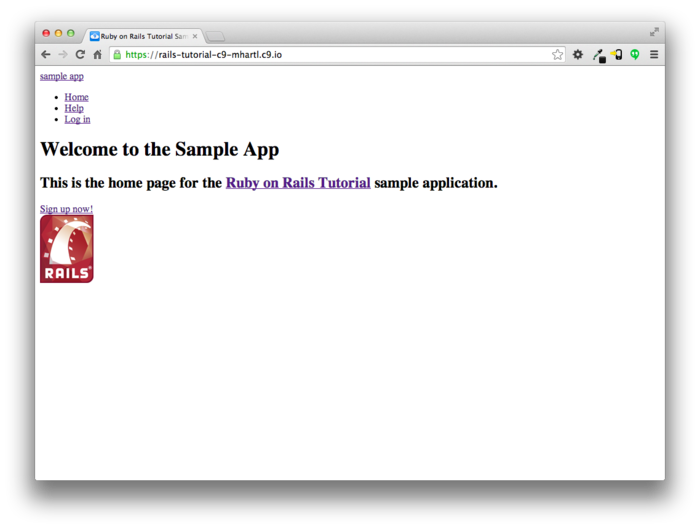
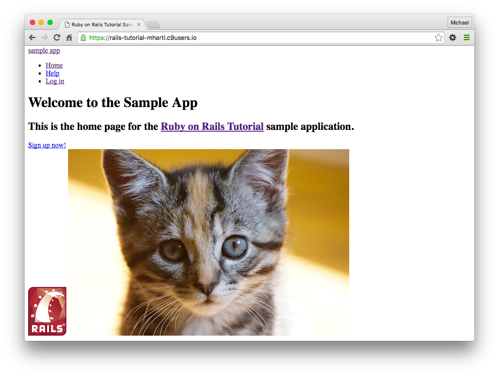
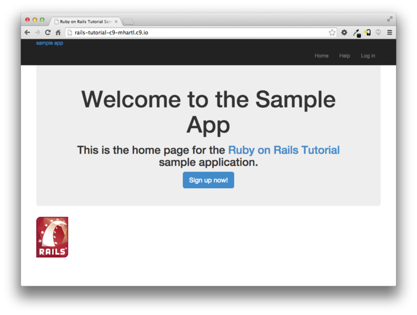
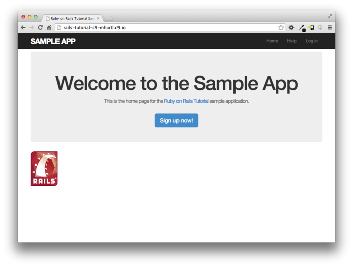
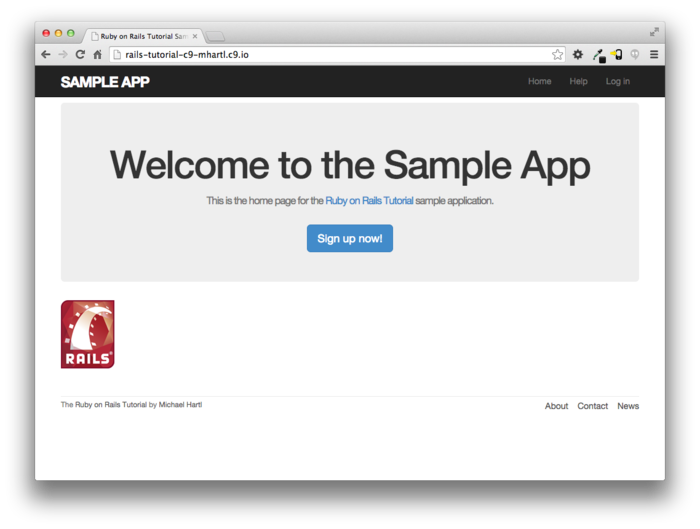

# 제 5장 레이아웃의 작성

[제 4장](Chapter4.md) 에서의 간단한 Ruby투어에서는, *Sample* 어플리케이션에 어플리케이션 스타일 시트를 적용하는 방법을 배워보았습니다.([4.1](Chapter4.md#41-작성동기)) 그러나 [4.3.4](Chapter4.md#434-다시-한-번-CSS) 에서 지적한 바와 같이, 해당 스타일시트는 아직 아무것도 작성되어있지 않은 상태입니다. 이번 챕터에서는 어플리케이션에 Bootstrap 프레임워크를 적용하고, 커스텀 스타일을 추가해볼 것입니다. 또한 지금까지 작성한 페이지(Home이나 About)등에 링크를 레이아웃에 추가해보겠습니다(5.1) 도중에 파셜(*Partial*) , Rails의 라우팅, Asset Pipeline에 대해 배워 볼 것이며, Sass에 대해서도 소개하는 시간을 가지겠습니다.(5.2) 이번 장의 마지막 부분에는 유저를 사이트에 로그인시키기 위한 중요한 작업을 진행해볼 것입니다.(5.4)


이번 장에서는, Sample 어플리케이션에 레이아웃을 추가하거나, 수정하는 등의 부분을 중점적으로 소개하겠습니다. 또한 레이아웃에 대해서는 테스트주도개발을 한다거나, 모든 테스트 케이스를 작성하지 않는 부분도 있습니다.(테스트를 작성하는 것과 작성하지 않는 것에 대한 가이드라인에 대해서는 [컬럼3.3](Chapter3.md#컬럼-33-결국-테스트는-언제-하는-것이-좋은가) 에서 말씀드리고 있습니다.) 때문에 이번 장에서는 텍스트에디터에 의한 수정과 브라우저에 의한 확인이 대부분의 작업이 될 것입니다. 테스트 주도 개발을 하는 유일한 부분은, 5.3.1의 Contact페이지를 추가하는 부분정도입니다. 마지막으로 새로운 테스트방법인 "통합 테스트(혹은 결합테스트, *Integration Test*)" 에 대해 소개하고자 합니다.(5.3.4) 통합 테스트를 통하여 최종적으로 레이아웃이나 링크가 제대로 움직이는지를 체크해볼 것입니다.


## 5.1 구조를 추가해보자

*Rails Tutorial* 은, Web 개발을 위한 책이며, Web디자인을 위한 책은 아닙니다. 그러나 그렇다고해서 *아무런 스타일도 없는* 쓸쓸한 디자인의 어플리케이션으로 언제까지나 작업하고 있을 수도 없는 노릇이빈다. 이번 장에서는 레이아웃에 몇가지 구조와 CSS를 추가하여 최소한의 스타일을 추가해볼 것입니다. 커스텀 CSS룰 이외에도, Twitter에 의한 오픈소스 Web 디자인 프레임워크로 공개되어있는 [*Bootstrap*](http://getbootstrap.com/) 을 이용해볼 것입니다. 또한 코드 그 자체에도 스타일을 적용해볼 것입니다. 즉, 여기저기 붙여넣은 레이아웃 코드를, 파셜(*Partial*) 기능을 사용하여 정리해나가는 그러한 과정을 진행해볼 것입니다.


Web 어플리케이션을 작성할 때, 유저인터페이스의 개념을 되도록 빠른 단계에서 파악해놓는 것이 좋습니다. 본 튜토리얼에서는 목업(Web의 문맥에서는 와이어프레임 이라고도 불립니다.) 이라고 하는, 개발 후의 어플리케이션의 디자인을 스케치해볼 것입니다. 또한 본 챕터에서는 주로 [3.2](Chapter3.md#32-정적인-페이지) 소개한 사이트로고, 네이게이션 헤더, 사이트 푸터를 포함한 정적페이지를 개발해볼 것입니다.  제일 중요한 Home페이지의 목업은 아래와 같습니다. 목업을 기반으로 작성한 최종 결과는 본 장의 마지막 부분에서 확인해볼 수 있을 것입니다. 목업과 최종결과물을 확인해본다면, 세부적인 부분이 조금 다른 것을 알 수 있습니다. (예를 들어, 실제로는 마지막에 Rails 로고를 페이지에 추가합니다.) 그러나 목업은 어디까지나 목업이기 때문에 정확하게 만들 필요는 없습니다.

​                


Git의로 버전관리를 하고 있는 경우라면, 지금까지와 마찬가지로 지금 시점에서 새로운 브랜치를 작성하는 것이 좋을 것 같습니다.

`$ git checkout -b filling-in-layout`


### 5.1.1 네비게이션

제일 첫 번째로,  Sample 어플리케이션에 링크와 스타일을 추가하기 위해, 사이트의 레이아웃 파일 `application.html.erb` 에 HTML 구조를 추가하고, 레이아웃파일을 수정해봅시다. 이번 수정은 영역(div태그)의 추가, CSS클래스의 추가, 사이트 네비게이션의 기점이 되는 영역의 추가도 포함됩니다. 완전한 파일은 아래의 코드와 같습니다. 이어서 해당 파일을 구성하고 있는 많은 코드들에 대해 해설하겠습니다. 

```erb
<!-- app/views/layouts/application.html.erb -->
<!DOCTYPE html>
<html>
  <head>
    <title><%= full_title(yield(:title)) %></title>
    <%= csrf_meta_tags %>
    <%= stylesheet_link_tag    'application', media: 'all',
                               'data-turbolinks-track': 'reload' %>
    <%= javascript_include_tag 'application',
                               'data-turbolinks-track': 'reload' %>
    <!--[if lt IE 9]>
      <script src="//cdnjs.cloudflare.com/ajax/libs/html5shiv/r29/html5.min.js">
      </script>
    <![endif]-->
  </head>
  <body>
    <header class="navbar navbar-fixed-top navbar-inverse">
      <div class="container">
        <%= link_to "sample app", '#', id: "logo" %>
        <nav>
          <ul class="nav navbar-nav navbar-right">
            <li><%= link_to "Home",   '#' %></li>
            <li><%= link_to "Help",   '#' %></li>
            <li><%= link_to "Log in", '#' %></li>
          </ul>
        </nav>
      </div>
    </header>
    <div class="container">
      <%= yield %>
    </div>
  </body>
</html>
```

위 코드에서 새로운 코드를 확인해봅시다. [3.4.1](Chapter3.md#341-타이틀을-테스트해보자-Red) 에서도 간단히 설명했습니다만, Rails은 기본으로 HTML5를 지원하고 있습니다. (`<!DOCTYPE html>` 이라고 쓰여져 있는 것이 HTML5라는 것을 선언하고 있는 것입니다.) 그렇지만, HTML5은 비교적 새로운 기술이며, 일부 브라우저 (특히 Internet Explorer) 에서는 HTML5의 지원이 제대로 되지 않을 수가 있습니다. 그 때문에 다음과 같은 JavaScript 코드(일명 [HTML5 shim (or shiv)](https://github.com/aFarkas/html5shiv) )를 사용하여 문제를 해결하고 있습니다.

```html
<!--[if lt IE 9]>
  <script src="//cdnjs.cloudflare.com/ajax/libs/html5shiv/r29/html5.min.js">
  </script>
<![endif]-->
```

위 코드는 조금은 신기해보이는 코드가 있습니다.

`<!--[if lt IE 9]>`

위 코드는 Microsoft Internet Explorer (IE) 의 버전이 9보다 낮을 경우, (`if It IE 9`) 실행되는 코드입니다. 조금 신기해보이는 이 `if It IE 9` 는, Rails의 일부는 *아닙니다.* 위 코드는 [조건 코멘트](https://ja.wikipedia.org/wiki/条件付きコメント) 라는 것으로, 이번과 같은 상황을 위해 Internet Explorer 에서 특별하게 지원해주고 있습니다. 이것으로 Firefox, Chrome, Safari등의 다른 브라우저에 영향을 주지 않으면서도 IE의 버전이 9미만일 경우만, HTML5 shim 을 읽어들이는, 매우 편리한 녀석입니다.


그 다음 이어지는 부분에서는, 사이트의 로그를 표시하는 `header`(`div` 태그에 의한) 몇몇개의 영역태그, 네비게이션 링크의 리스트가 있습니다. 

```erb
<header class="navbar navbar-fixed-top navbar-inverse">
  <div class="container">
    <%= link_to "sample app", '#', id: "logo" %>
    <nav>
      <ul class="nav navbar-nav navbar-right">
        <li><%= link_to "Home",   '#' %></li>
        <li><%= link_to "Help",   '#' %></li>
        <li><%= link_to "Log in", '#' %></li>
      </ul>
    </nav>
  </div>
</header>
```

`header` 태그는 페이지 윗부분에 와야할 요소들을 포함하고 있습니다. `header` 태그에는, `navbar`, `navbar-fixed-top`, `navbar-inverse` 라고 하는 세 가지 CSS 클래스가 스페이스로 구분지어져 적용되고 있습니다.

```html
<header class="navbar navbar-fixed-top navbar-inverse">
```

모든 HTML태그는, 클래스와 *id* 둘 다 지정할 수 있습니다. 단순한 라벨로써, CSS에서 스타일을 지정하기 위할 때 편리하게 사용할 수 있습니다. 클래스와 id의 차이점으로는, 클래스는 페이지 내부에서 몇번이고 중복해서 사용할 수 있는 것에 반해,  id는 단 한 번만 사용할 수 있습니다. 위 예제와 같은 경우, 모든 navbar 클래스에는 , 5.1.2 에서 인스톨하는 Bootstrap 프레임워크에 의해 특별한 의미가 부여됩니다.


`header` 태그 안쪽에는 `div` 태그가 있습니다.

`<div class="container">` 

`div` 태그는 일반적으로 표시영역(범위) 를 나타내며, 세부 요소(태그)를 각각의 개별부품으로 나눌때에도 사용합니다. 특히 조금 오래된 스타일의 HTML에서는, `div` 태그는 사이트 내부에서 거의 모든 범위에서 사용해왔습니다. 그러나 HTML5부터는 자주 쓰이는 범위마다 세분화할 수 있게 되었습니다. 구체적으로는 `header`태그, `nav` 태그, `section`태그 가 새롭게 사용할 수 있게 되었습니다. 또한 `header` 태그의 클래스와 마찬가지로, `div` 태그 에도 CSS클래스(`container`) 가 적용되고 있습니다만, 이 클래스도 Bootstrap에 있어서 특별한 의미를 가지고 있습니다.


div 태그 다음에는 erb Ruby코드가 등장합니다.

``` erb
<%= link_to "sample app", '#', id: "logo" %>
<nav>
  <ul class="nav navbar-nav navbar-right">
    <li><%= link_to "Home",   '#' %></li>
    <li><%= link_to "Help",   '#' %></li>
    <li><%= link_to "Log in", '#' %></li>
  </ul>
</nav>
```

여기서는 링크를 생성하기 위해서, Rails 헬퍼의 `link_to` 를 사용합니다. ([3.2.2](Chapter3.md#322-Static-Page를-편집해보자) 에서 본 앵커태그 `a` 가 생성됩니다.) `link_to` 의 첫 번째 파라미터로는 링크 텍스트, 두 번째 파라미터로는 URL 이 입력됩니다. 이 URL은 5.3.3에서 *Named Routes* 로 변환됩니다만, 지금은 Web디자인에서 일반적으로 사용되는 스터브용(더미 링크) URL인 `#` 을 입력합니다. 세 번째 파라미터로는 옵션해시로써, Sample 어플리케이션의 링크에서 CSS id `logo` 를 지정하고 있습니다. ( 다른 세 개의 링크에는 옵션해시가 지정되어있지 않습니다만, 필수가 아니기때문에 상관없습니다.)  Rails 헬퍼는, 이러한 옵션해시를 자주 사용하고 있으며, Rails 코드를 사용하면서, 임의의 HTML 옵션을 유연하게 추가할 수 있습니다.


div의 안쪽 태그 2번째 요소는 리스트아이템 태그 `li` 와 순번이 없는 리스트 태그 `ul` 에 의해 생성된 네비게이션 링크 리스트가 있습니다.

```erb
<nav>
  <ul class="nav navbar-nav navbar-right">
    <li><%= link_to "Home",   '#' %></li>
    <li><%= link_to "Help",   '#' %></li>
    <li><%= link_to "Log in", '#' %></li>
  </ul>
</nav>
```

정확하게는 여기서는 불필요합니다만, `nav` 태그 에는 "`nav` 태그 안쪽이 네비게이션 링크이다" 라고 하는 의미를 명시적으로 나타내기 위한 기능이 있습니다. 게다가 `ul` 태그에 적용되어 있는 `nav` 나 `navbar-nav`, `navbar-right` 클래스도 Bootstrap에 있어서 특별한 의미를 가지고 있습니다. 따라서 5.1.2에서 Bootstrap의 CSS를 추가했을 때, 위 태그에 스타일이 자동적으로 적용될 것입니다. 브라우저에서 소스코드를 확인하면 알 수 있을 것입니다만, Rails가 erb코드를 확인하고, 레이아웃을 출력한다면, 위 코드는 아래와 같이 바뀔 것입니다.

```html
<nav>
  <ul class="nav navbar-nav navbar-right">
    <li><a href="#">Home</a></li>
    <li><a href="#">Help</a></li>
    <li><a href="#">Log in</a></li>
  </ul>
</nav>
```

이 것이 Rails에서 브라우저에게 전달되는 HTML입니다.

레이아웃의 마지막 부분에는 메인컨텐츠용의 `div` 가 있습니다.

```erb
<div class="container">
  <%= yield %>
</div>
```

마찬가지로, `container` 클래스도 Bootstrap 에 있어서 특별한 의미를 가지고 있습니다. [3.4.3](Chapter3.md#343-레이아웃과-html에-직접-쓰는-Ruby-Refactor-연습) 에서 확인한 것과 마찬가지로, `yield` 메소드는  Web사이트의 레이아웃에 각각의 페이지의 내용을 출력합니다.


5.1.3에서 추가하는 사이트푸터를 제외하고는, 이것으로 레이아웃이 완성되었습니다. Home페이지에 접속하여 표시결과를 확인할 수 있습니다. 이후 스타일 요소를 이용하기 위해서는 `home.html.erb` 뷰 파일에 특별한 요소를 몇가지 추가합니다.

```erb
<!-- app/views/static_pages/home.html.erb -->
<div class="center jumbotron">
  <h1>Welcome to the Sample App</h1>

  <h2>
    This is the home page for the
    <a href="https://railstutorial.jp/">Ruby on Rails Tutorial</a>
    sample application.
  </h2>

  <%= link_to "Sign up now!", '#', class: "btn btn-lg btn-primary" %>
</div>

<%= link_to image_tag("rails.png", alt: "Rails logo"),
            'http://rubyonrails.org/' %>
```

제 7장에서 사이트에 유저를 추가할 때를 대비하여, 첫 번째 `link_to` 를 이용하여 다음과 같은 임시 링크를 작성합니다.

` <a href="#" class="btn btn-lg btn-primary">Sign up now!</a>` 

위 코드 중에서 `div` 태그의 CSS클래스 `jumbotron` 이나 signup버튼의 `btn`, `btn-lg`, `btn-primary` 클래스는 전부 Bootstrap에서의 제공하는 특별한 클래스들입니다.


2번째의 `link_to` 에서는 파라미터로 이미지파일의 경로와 임의의 옵션해시를 사용하는 `image_tag` 헬퍼를 사용하고 있습니다.이 헬퍼는, 심볼을 사용하여 `alt` 속성등을 설정할 수 있습니다. 이미지 파일을 표시하기 위해서는 `rails.png` 라고 하는  Rails의 로고 이미지파일을 추가할 필요가 있습니다. Ruby on Rails의 공식 페이지 https://www.railstutorial.org/rails.png 에서 파일을 다운로드하고, `app/assets/images` 디렉토리에 저장해주세요. 클라우드IDE나 Unix계열의 OS(Linux, maxOS 등) 를 사용하는 경우에는, 다음과 같이 `curl` 커맨드를 사용하여 간단히 다운로드받는 것이 가능합니다. (`curl` 커맨드에 대해서는 [Command Line Tutorial](https://www.learnenough.com/command-line-tutorial#sec-downloading_a_file) 를 참고해주세요)

`$ curl -o app/assets/images/rails.png -OL railstutorial.jp/rails.png`

`image_tag` 헬퍼를 사용하고 있기 때문에, Rails는 해당 이미지 파일을 에셋파이프라인을 이용하여 `app/assets/images/` 디렉토리 안에서 찾아 표시합니다. (에셋 파이프라인에 대해서는 5.2에서 설명합니다.)


이제 준비는 끝났습니다. 환경에 따라서는 여기서 Rails 서버를 한 번 재부팅 할 필요가 있으니, 필요한 경우에는 ([컬럼 1.1](Chapter1.md#컬럼-11-숙련이라고-하는-것은)) 재부팅하시길 바랍니다. 지금까지의 과정이 제대로 적용되었다면, 아래와 같은 화면이 되어있을 것입니다.



`image_tag` 의 효과를 확인하기 위해, 브라우저에서 HTML을 확인해보도록 합시다. (개발자 도구를 사용하세요!)

``

파일명이 겹치지 않도록 하기 위해, `9308b8f92fea4c19a3a0d8385b494526` 이라고 하는 문자열 (실제 문자열은 시스템마다 다릅니다.)을  Rails가 추가한 것을 알 수가 있습니다. 이것은 이미지파일을 새로운 이미지로 수정했을 때, 브라우저내부에 보존되어있는 캐시에 의도적으로 중첩되지 않기 위한 장치입니다. 또한 `src` 속성에는 `"image"` 라고 하는 디렉토리이름이 *포함되어 있지 않은 것* 에 대해 주목해주세요. 이것은 `assets` 디렉토리 내부의 다른 디렉토리 (image나 javascript, stylesheets등) 도 똑같습니다. 이 기능은 파일 고속화를 하기 위한 기능으로, Rails에서는 `assets` 디렉토리 바로 아래의 이미지파일을 `app/assets/images` 디렉토리에 있는 파일과 연결짓습니다. 이것으로 인하여 브라우저의 입장에서 본다면 모든 파일이 같은 디렉토리에 있는 것 처럼 보이게됩니다. 그리고 이러한 평범하고 단순한 디렉토리 구성으로 인하여 파일을 보다 더 빠르게 브라우저에게 전달할 수 있게 되는 것입니다. 마지막으로 `alt` 속성은, 이미지가 없는 경우를 대신하여 표시되는 문자열입니다. 예를들면 시각장애가 있는 유저가 사용하는 스크린리더 등은, 여기서의 `alt` 속성을 읽어들이는 것으로 해당 장소에 이미지 파일이 있다는 것을 표현합니다.


드디어 여기가지의 성과를 확인해보았습니다. 디자인이 생각한 것 보다는 심심하지 않으신가요? 그러나 이번 HTML 요소에 클래스를 적용한 덕분에, CSS를 사용하여 스타일을 추가할 수 있게 되었습니다.

##### 연습

1. Web페이지에는 고양이 영상이 매우 많습니다. 아래의 커맨드를 사용하여 고양이 사진을 다운로드해보세요.
2. `mv` 커맨드를 사용하여 다운로드한 `kitten.jpg` 파일을 적절한 에셋디렉토리에 이동시켜보세요.
3. `image_tag` 를 사용하여, `kitten.jpg` 영상을 출력해보세요.


` curl -OL cdn.learnenough.com/kitten.jpg`





### 5.1.2 Bootstrap 과 커스텀 CSS

[5.1.1](#511-네비게이션) 에서는 많은 HTML요소(태그) 에 CSS클래스를 적용해보았습니다. 이렇게 해놓음으로써 CSS베이스의 레이아웃을 구성할 때 유연하게 대처할 수 있습니다.  [5.1.1](#511-네비게이션) 에서 말씀드렸다시피, 이러한 클래스들은 Twitter 에서 만든 프레임워크 [Bootstrap](http://getbootstrap.com/) 가 제공하는 특별한 클래스입니다. Bootstrap을 사용하여 깔끔한 Web 디자인과 유저인터페이스 요소를 간단하게 HTML5 어플리케이션에 추가할 수 있습니다. 이번 섹션에서는 Sample 어플리케이션에 스타일을 추가하기 위해 커스텀CSS 규칙과 Bootstrap을 조합하여 사용해볼 것입니다. 주목해야할 부분은, Bootstrap을 사용하는 것으로 인해 어플리케이션을 [*반응형 디자인 (Responsive Design)*](https://ja.wikipedia.org/wiki/レスポンシブウェブデザイン) 으로 만들 수 있다는 것입니다. 이렇게하면 어떤 장치에서라도 적절한 디자인으로 어플리케이션을 사용할 수 있게 됩니다.


제일 처음으로는, 아래의 코드에서 나타낸 것과 같이 Bootstrap을 추가해봅시다. `bootstrap-sass` gem을 이용하여 Rails 어플리케이션에 적용해봅시다. Bootstrap 프레임 워크는, 동적인 스타일 시트를 생성하기 위해 [LESS CSS](http://lesscss.org/) 라는 언어를 사용하고 있습니다만, Rails의 Asset Pipeline 에서는 기본적으로 (LESS와 매우 닮아있는) Sass를 지원합니다.(5.2) 그렇기 때문에, `bootstrap-sass` 는 LESS를 Sass로 변환하여, 필요한 Bootstrap 파일을 현재 어플리케이션에서 제대로 사용할 수 있게 해줍니다.

```ruby
# Gemfile #
source 'https://rubygems.org'

gem 'rails',          '5.1.6'
gem 'bootstrap-sass', '3.3.7' #(번역자 : 튜토리얼에서 소개되는 내용은 약간 오래전의 내용입니다.)
.
.
.
```

언제나처럼 `bundle install` 을 실행하여  Bootstrap을 인스톨합니다.

`$ bundle install`

여담으로, `rails generate` 커맨드를 실행하는 것으로, 컨트롤러별로 나뉘어져 있는 CSS파일을 자동적으로 만들 수 있습니다만, 이러한 파일을 올바른 순서로 읽어들이는 것은 매우 어려운 것입니다. 본 튜토리얼에서는 (간결하게 하기 위해) 모든 CSS를 하나의 파일에 작성하도록 하겠습니다. 커스텀 CSS를 적용하기 위해, 커스텀 CSS파일을 생성해봅시다.

`touch app/assets/stylesheets/custom.scss`

(여기서는 [3.3.3](Chapter3.md#333-Green) 의 중간에서 소개한 `touch` 커맨드를 사용하고 있습니다만, 파일을 작성할수만 있다면 [새로운 파일 생성] 이라던지, 다른 커맨드를 사용하여도 문제없습니다.) 해당 디렉토리의 이름과 파일이름은, 매우 중요합니다. 다음 디렉토리

`app/assets/stylesheets`

는 Asset Pipeline(5.2) 의 일부이기도 하며, 위 디렉토리에 저장되어있는 스타일시트는 `application.css` 의 일부로써 Web사이트의 레이아웃에 적용됩니다. 게다가 파일명 `custom.scss` 에는 `.scss` 라고 하는 확장자가 포함되어 있습니다. 이 확장자는 "Sass (Sassy CSS)" 이라고 불리는, CSS를 확장한 언어로, 에셋파이프라인은 이 파일의 확장자를 확인하고, SCSS를 처리할 수 있게 해줍니다. (Sass는 5.2.2까지 등장하지 않습니다만, `bootstrap-sass` gem )이 동작하기 위한 마술같은 것입니다.)


커스텀 CSS용의 파일을 작성했다면, 다음의 코드처럼, `@import` 를 사용하여 Bootstrap(과 그것과 관련된 Sprockets) 를 읽어들일 수 있게 합시다.

```ruby
# app/assets/stysheets/custom.scss #
@import "bootstrap-sprockets";
@import "bootstrap";
```


위 파일의 3번째 행에는, Bootstrap CSS의 프레임워크를 읽어들이고 있습니다. import한 후, Web서버를 재부팅하면, 어플리케이션에 적용할 수 있습니다. ([1.3.2](Chapter1.md#132-rails-server) 에서 말씀드린대로, Ctrl+C를 눌러서 Web서버를 정지시킨 후, `rails server` 커맨드를 입력하여 Web 서버를 부팅시켜주세요.) 제대로 적용되었다면, 아래와 같은 결과가 될 것입니다. 텍스트의 배치는 지금은 그저 그렇고, 로고에는 스타일도 없습니다만 색의 적용과 signup 버튼은 그나마 좀 괜찮은 디자인이 되었습니다.


다음으로는, 아래의 코드처럼, Web사이트 전체에 걸쳐 레이아웃과 각각의 페이지에 스타일을 적용하기 위한 CSS를 추가해봅니다. 테스트의 결과는 아래의 캡쳐와 같습니다. 아래 코드에는 많은 코딩규약이 있습니다. CSS의 규약을 파악하기 위해서는 확인해보고 싶은 부분을 코멘트처리하여 출력되는 결과를 확인해보는 방법을 추천합니다. CSS에서는 `/* ... */` 으로 코멘트처리를 할 수 있습니다. 알아보고 싶은 코드를 이것으로 감싸주고 Web 어플리케이션의 출력이 어떻게 바뀌는지 확인해보세요.

```css
/* app/assets/stylesheets/custom.scss */
@import "bootstrap-sprockets";
@import "bootstrap";

/* universal */

body {
  padding-top: 60px;
}

section {
  overflow: auto;
}

textarea {
  resize: vertical;
}

.center {
  text-align: center;
}

.center h1 {
  margin-bottom: 10px;
}
```



우리가 적용한 CSS의 형식은 일정합니다. CSS 규약에서는 보통 클래스, id, HTML태그 혹은 이 것들의 조합으로 HTML요소들을 지정할 수 있습니다. 그리고 그 다음 스타일링을 지정할 수 있습니다. 예를 들어 다음의 코드는 

```css
body {
  padding-top: 60px;
}
```

페이지 위쪽에 60픽셀만큼의 여백을 추가합니다. `header` 태그의 `navbar-fixed-top` 클래스가 적용되어 있기 때문에, Bootstrap에서 네비게이션바를 페이지 위쪽에 고정하고, 네비게이션바의 아래에 여백을 주어 주요부분으로부터 분리시킵니다. (기본적으로 navbar의 색은 Bootstrap 2.0에서 변경되었기 때문에, 현재 예제의 잿빛 대신, 검은색으로 하고 싶은 경우에는 `navbar-inverse` 클래스를 적용할 필요가 있습니다.) 또한 이 다음 CSS는

```css
.center {
  text-align: center;
}
```

`center` 클래스에 `text-align: center` 값을 적용하고 있습니다. `.center` 에서의 `.` 은 클래스에 스타일을 적용한다는 의미입니다. 또한 조금 나중에 나오겠습니다만, 기호 `#` 으로 시작하는 경우에는 id값에 대해 스타일을 적용한다는 의미입니다. 이번 경우에는 `center` 클래스가 적용되어있는 (`div` 등) 요소의 내부 요소를 모두 가운데 정렬한다는 의미입니다.


Bootstrap에서 깔끔한 타이포그래피를 이용하는 CSS가 있습니다만, 여기서는 거기에 덧붙여 아래와 같은 커스텀 CSS를 추가하여 텍스트의 모양을 조금 바꾸어봅시다.  이번에 추가하는 스타일은, Home페이지의 모든 요소에 적용된다고는 말씀드릴 수 없습니다만, Sample 어플리케이션의 다른 페이지에서도 사용될 것입니다. 아래의 코드의 결과는 아래 그림과 같습니다.

```scss
/* app/assets/stylesheets/custom.scss */
@import "bootstrap-sprockets";
@import "bootstrap";
.
.
.
/* typography */

h1, h2, h3, h4, h5, h6 {
  line-height: 1;
}

h1 {
  font-size: 3em;
  letter-spacing: -2px;
  margin-bottom: 30px;
  text-align: center;
}

h2 {
  font-size: 1.2em;
  letter-spacing: -1px;
  margin-bottom: 30px;
  text-align: center;
  font-weight: normal;
  color: #777;
}

p {
  font-size: 1.1em;
  line-height: 1.7em;
}
```


마지막으로, 몇가지 스타일을 로고에 추가해보겠습니다. 이 사이트 로고는 "sample app" 만 표시하는 심플한 로고입니다. 아래의 CSS는, 텍스트를 대문자로 바꾸고 사이즈, 색, 배치를 바꿉니다. (사이트로고가 페이지 내부 다른 곳에 쓰이지 않는 것을 전제로하여 CSS id를 사용하고 있습니다만, 이 대신에 클래스에 적용하여도 괜찮습니다.)

```scss
/* app/assets/stylesheets/custom.scss */
@import "bootstrap-sprockets";
@import "bootstrap";
.
.
.
/* header */

#logo {
  float: left;
  margin-right: 10px;
  font-size: 1.7em;
  color: #fff;
  text-transform: uppercase;
  letter-spacing: -1px;
  padding-top: 9px;
  font-weight: bold;
}

#logo:hover {
  color: #fff;
  text-decoration: none;
}
```

위 코드에서 `color: #fff` 는, 로고 색을 하얀색으로 바꿉니다. HTML의 색은 16진수 의 3개의 숫자의 조합으로 표현되며 빨강, 파랑, 녹색의 3원색을 코드로 바꾸어 표현할 수 있습니다. 원래는 `#ffffff` 이라고 작성하고 세 가지 색 모두 최대로 할 필요가 있습니다만, 위 코드에서 `#fff` 라고하는 `#ffffff` 라는 축약형을 사용하고 있습니다. CSS표준에서는 [HTML색에는 별칭](https://www.w3schools.com/colors/colors_names.asp) 을 많이 사용합니다. 예를들어 방금전 `#fff` 은 `white` 라고 바꾸어 쓸 수 있습니다. 아무튼 위 코드를 적용하면 아래와 같이 바뀔 것입니다.




##### 연습

1. 아래의 코드를 참고하여 [5.1.1](#511-네비게이션) 에서의 고양이 이미지 파일을 코멘트처리해보세요. 브라우저의 개발자도구를 사용하여 코멘트처리한 HTML소스코드가 제대로 출력되지 않는 것을 확인해보세요.
2. 아래 두번째 코드를 `custom.scss` 에 추가하여 모든 이미지 파일을 출력하지 않도록 해보세요. 제대로 적용된다면 Rails의 로고 이미지가 Home페이지에서 표시되지 않을 것입니다. 아까와 마찬가지로 개발자도구를 사용하여 HTML 소스코드는 남아있지만, 이미지가 표시되지 않는 것을 확인해보세요.

```erb
<!-- erb코드를 코멘트처리 해봅니다. -->
<%#= image_tag("kitten.jpg", alt: "Kitten") %>
```

```css
/*  모든 이미지를 표시하지 않는 CSS 스타일 */
img {
  display: none;
}
```


### 5.1.3 파셜 (Partial)

레이아웃의 코드는 해당 목적을 달성하였습니다. 하지만 아직해야 할 일이 남아있습니다. 예를 들어, IE 고유의 설정을 위한 HTML shim 코드가 3줄이나 차지하고 있습니다. 이 코드를 어떻게든 잘 해서 숨길 수가 있다면 얼마나 좋을까요? 또한 HTML헤더는 논리적 단위로 나뉘어져있기 때문에, 한 곳으로 모아서 처리하는 것이 더욱 좋습니다. Rails에서는 *파셜 (partial)*이라고 하는 기능으로 이러한 문제를 해결할 수 있습니다. 일단 파셜을 정의하면 레이아웃이 어떻게 변하는지 확인해봅시다.

```erb
<!-- app/views/layouts/application.html.erb -->
<!-- 레이아웃 파일에 shim과 header 파셜 파일을 추가한다 -->
<!DOCTYPE html>
<html>
  <head>
    <title><%= full_title(yield(:title)) %></title>
    <%= csrf_meta_tags %>
    <%= stylesheet_link_tag    'application', media: 'all',
                               'data-turbolinks-track': 'reload' %>
    <%= javascript_include_tag 'application',
                               'data-turbolinks-track': 'reload' %>
    <%= render 'layouts/shim' %>
  </head>
  <body>
    <%= render 'layouts/header' %>
    <div class="container">
      <%= yield %>
    </div>
  </body>
</html>
```

위 코드에서는 다음과 같이 `render` 라는 Rails 헬퍼를 사용하여 HTML shim 코드를 대체하고 있습니다.

`<%= render 'layouts/shim' %>`

위 코드는 `app/views/layouts/_shim.html.erb` 라고하는 파일을 찾아, 그 안의 내용을 확인하고, 뷰에 삽입합니다. ( <%= ... %> 는 템플릿 내부에서 Ruby의 문법을 확인하기 위한 erb문법인 것을 기억하고 계시나요? 읽어들인 erb코드를 변환하여 템플릿에 삽입합니다.) 파일이름 `_shim.html.erb` 의 앞에 오는 언더바는, 파셜에서 사용하는 보편적인 명명규칙이며, Rails에서 이 것이 파셜파일이라는 것을 알 수 있게해줍니다.


물론 파셜이 동작하기 위해서는 그것에 대응하는 파일과 컨텐츠를 작성하지 않으면 안됩니다. shim 파셜의 경우, 3줄의 shim코드만 존재합니다. 작성한 코드는 아래와 같습니다.

```html
<!-- app/views/layouts/_shim.html.erb -->
<!--[if lt IE 9]>
  <script src="//cdnjs.cloudflare.com/ajax/libs/html5shiv/r29/html5.min.js">
  </script>
<![endif]-->
```

마찬가지로 헤더의 정보도 아래와 같이 파셜파일로 분리하여 `render` 를 이용하여 레이아웃 파일에 삽입할 수 있습니다. (파셜은 자동생성하지말고 텍스트에디터를 사용하여 수동으로 작성하는 것이 일반적입니다.)

```erb
<!-- app/views/layouts/_header.html.erb -->
<!-- header용의 파셜 -->
<header class="navbar navbar-fixed-top navbar-inverse">
  <div class="container">
    <%= link_to "sample app", '#', id: "logo" %>
    <nav>
      <ul class="nav navbar-nav navbar-right">
        <li><%= link_to "Home",   '#' %></li>
        <li><%= link_to "Help",   '#' %></li>
        <li><%= link_to "Log in", '#' %></li>
      </ul>
    </nav>
  </div>
</header>
```

이것으로 파셜의 작성방법을 알게되었습니다. 다음으로는 헤더에 대응하는 푸터를 같은 방법으로 작성해봅시다. 여기까지 오셨다면, 파일이름은 `_footer.html.erb` 라는 것과, layouts디렉토리 안에 저장하면 되는 것 정도는 아실 겁니다.

```erb
<!-- app/views/layouts/_footer.html.erb -->
<!-- footer용의 파셜 -->
<footer class="footer">
  <small>
    The <a href="https://railstutorial.jp/">Ruby on Rails Tutorial</a>
    by <a href="http://www.michaelhartl.com/">Michael Hartl</a>
  </small>
  <nav>
    <ul>
      <li><%= link_to "About",   '#' %></li>
      <li><%= link_to "Contact", '#' %></li>
      <li><a href="http://news.railstutorial.org/">News</a></li>
    </ul>
  </nav>
</footer>
```

헤더의 경우와 마찬가지로, 푸터 안에도 `link_to` 메소드를 사용하여 About페이지와 Contact 페이지로의 내부 링크를 추가하고 있습니다. 일단 URL 은 `'#'`  로 해둡시다. (`header` 태그와 마찬가지로, `footer` 태그도 HTML5 에서 새롭게 추가된 요소입니다. )


footer파셜은, 스타일시트나 header파셜과 마찬가지로 레이아웃 파일 내부에 추가합니다.

```erb
<!-- app/views/layouts/application.html.erb -->
<!DOCTYPE html>
<html>
  <head>
    <title><%= full_title(yield(:title)) %></title>
    <%= csrf_meta_tags %>
    <%= stylesheet_link_tag    'application', media: 'all',
                               'data-turbolinks-track': 'reload' %>
    <%= javascript_include_tag 'application',
                               'data-turbolinks-track': 'reload' %>
    <%= render 'layouts/shim' %>
  </head>
  <body>
    <%= render 'layouts/header' %>
    <div class="container">
      <%= yield %>
      <%= render 'layouts/footer' %> <!-- 추가한 footer partial -->
    </div>
  </body>
</html>
```

이대로 footer를 표시하게 된다면 디자인이 썩 좋지 않기 때문에, 스타일을 약간 추가해보도록 하겠습니다. 스타일을 추가한 결과는 아래와 같습니다.

```css
/* app/assets/stylesheets/custom.css */
.
.
.
/* footer */

footer {
  margin-top: 45px;
  padding-top: 5px;
  border-top: 1px solid #eaeaea;
  color: #777;
}

footer a {
  color: #555;
}

footer a:hover {
  color: #222;
}

footer small {
  float: left;
}

footer ul {
  float: right;
  list-style: none;
}

footer ul li {
  float: left;
  margin-left: 15px;
}
```




##### 연습

1. Rails가 기본적으로 생성하는 `head` 태그의 부분을 아래의 코드와 같이 `render`로 바꾸어봅시다. *Hint*: 단순히 삭제해버리면 파셜을 작성할 때 전부 새로 작성해야할 수도 있기 때문에, 삭제하기 전에 어딘가 옮겨적어놓습니다. (메모장 등)
2. 아래 코드처럼 파셜을 아직 만들지 않았기 때문에, 테스트는 RED (테스트 실패) 인 상태일 것입니다. 실제로 테스트를 실행해서 확인해봅시다.
3. `layouts` 디렉토리에 `head` 태그용 파셜을 작성하고, 아까전 메모장에 옮겼던 코드를 다시 붙여넣은 후, 테스트가 제대로 통과되는지 (GREEN) 확인해봅시다.

```erb
<!-- app/views/layouts/application.html.erb -->
<!DOCTYPE html>
<html>
  <head>
    <title><%= full_title(yield(:title)) %></title>
    <%= render 'layouts/rails_default' %>
    <%= render 'layouts/shim' %>
  </head>
  <body>
    <%= render 'layouts/header' %>
    <div class="container">
      <%= yield %>
      <%= render 'layouts/footer' %>
    </div>
  </body>
</html>
```


## 5.2 Sass와 에셋 파이프라인

최근에 Rails에 추가된 기능 중 하나로, 대서특필할만한 기능 중 하나는, CSS, Javascript, 이미지파일 등의 정적 컨텐츠의 생산성과 관리를 큰 폭으로 향상시킬 수 있는 *에셋 파이프라인 (Asset Pipeline)* 입니다. 이번 섹션에서는, 에셋파이프라인의 개요와 멋진 CSS생성 도구인 "Sass" 에 대해 설명하겠습니다.


### 5.2.1 에셋 파이프라인

Rails 개발자의 관점에서는, 에셋 디렉토리, 매니페스트 파일, 프리프로세서 엔진이라고 하는 세 가지의 주요한 기능을 이해할 필요가 있습니다. 하나씩 살펴 보겠습니다.

#### 에셋 디렉토리

Rails의 에셋파이프라인에는 정적파일을 사용하는 용도별로 분류하는 세 개의 표준적인 디렉토리가 있습니다.

- `app/assests` : 현재의 어플리케이션의 고유한 에셋
- `lib/assets` : 다른 개발팀에서 작성된 라이브러리용 에셋
- `vender/assets`: 서드파티용의 에셋

위 디렉토리에는 각각의 에셋클래스용의 서브디렉토리가 존재합니다. 예를 들어 app/assets의 경우, 다음과 같이 그림파일용, JavaScript용, CSS용의 서브 디렉토리가 있습니다.

```
$ ls app/assets/
images/  javascripts/  stylesheets/
```

위 설명을 다시 본다면, [5.1.2](#512-Bootstrap-과-커스텀-CSS) 에서 언급한 커스텀 CSS가 저장되어있는 곳과 그 이유에 대해 이해할 수 있을 것입니다. 즉, `custom.css` 는 sample 어플리케이션 고유의 에셋이기 때문에, `app/assets/stylesheets` 에 저장한 것입니다.

#### 매니페스트 파일

정적 파일(에셋)을 위 디렉토리에 각각 배치해놓는다면, *매니페스트 파일* 을 사용하여 정적파일들을 하나의 파일로 어떻게 정리할지를 Rails에 알려주는 것이 가능합니다. 여기서, 실제로 에셋을 정리하는 처리를 하는 것이 [Sprockets](https://github.com/rails/sprockets) 라고 하는 gem입니다. 또한 매니페스트 파일은 CSS와 JavaScript에는 적용됩니다만, 이미지 파일에는 적용되지 않습니다. 하나의 구체적인 예로, 어플리케이션의 CSS용 매니페스트 파일을 확인해봅시다.

```css
/* app/assets/stylesheets/application.css */

/*
 * This is a manifest file that'll be compiled into application.css, which
 * will include all the files listed below.
 *
 * Any CSS and SCSS file within this directory, lib/assets/stylesheets,
 * vendor/assets/stylesheets, or vendor/assets/stylesheets of plugins, if any,
 * can be referenced here using a relative path.
 *
 * You're free to add application-wide styles to this file and they'll appear
 * at the bottom of the compiled file so the styles you add here take
 * precedence over styles defined in any styles defined in the other CSS/SCSS
 * files in this directory. It is generally better to create a new file per
 * style scope.
 *
 *= require_tree .
 *= require_self
 */
```

위에서 중요한 부분은, 실제로 CSS 코멘트 안에 있습니다. 코멘트내부의 다음 부분은 Sprockets가 적절한 파일을 읽어들이기 위해 사용합니다.

```
/*
 .
 .
 .
 *= require_tree .
 *= require_self
*/
```

예를 들어 다음 코드는

```
 *= require_tree .
```

`app/assets/stylesheets` 디렉토리 (서브 디렉토리를 포함한) 안의 모든 CSS 파일이 어플리케이션 CSS에 포함되도록 처리하고 있습니다. 또한 다음 코드는

```
 *= require_self
```

CSS를 읽어들이는 대상에 `application.css` 자기 자신도 포함시키고 있습니다.


Rails에는 실용적인 기본 매니페니스트 파일이 포함되어 있기 때문에, *Rails Tutorial* 에서는 수정할 필요가 없습니다만, 혹시나 수정할 경우에는 Rails 가이드 [에셋 파이프라인](http://railsguides.jp/asset_pipeline.html) 를 참고해주세요.

#### 프리 프로세서 엔진

필요한 에셋을 디렉토리에 저장하고 정리한 다음, Rails는 여러가지 프리 프로세서 엔진을 이용하여 에셋들을 실행하고, 브라우저에게 송신할 수 있도록 매니페스트 파일을 사용하여 하나로 묶은 다음, 사이트 템플릿용으로 준비합니다. Rails는 어떠한 프리 프로세서를 사용할지를 파일 이름의 확장자를 확인한 후 처리합니다. 제일 일반적인  확장자는 Sass용의 `.scss ` , CoffeeScript용의 `.coffee` , Erb용의 `.erb` 입니다. [3.4.3](Chapter3.md#343-레이아웃과-html에-직접-쓰는-Ruby-Refactor-연습) 에서는 제일 처음에 Erb를, [5.2.2] 에서는 Sass를 사용했습니다. (또한 본 튜토리얼에서는 상세히 설명하진 않습니다만, CoffeeScript는 고급지고 간결한 언어로써, JavaScript로 컴파일해주는 JavaScript의 확장 언어입니다.)

프리 프로세서 엔진은, 연결하여 실행하는 것이 가능합니다.

`footer.js.coffee`

위의 확장자의 경우, CoffeeScript 프로세서를 경유하여 실행됩니다.

`footer.js.erb.coffee`

위 확장자의 경우는, CoffeeScript와 Erb 양쪽의 프로세서를 경유합니다. (코드의 오른쪽에서 왼쪽으로 실행되기 때문에, 이 코드에서는 CoffeeScript가 제일 처음 실행됩니다.)

#### 실제 배포환경에서의 효율성

Asset Pipeline 의 제일 큰 메리트 중 하나는, 실제 배포환경에서의 어플리케이션에서 효율적인 퍼포먼스를 위해 최적화된 에셋을 자동적으로 생성해주는 것입니다. 이전에는 CSS와 JavaScript를 하나로 합치기 위해, 기능을 각각의 파일로 분할한 후, 읽기 쉬운 포맷으로 정리하였습니다. 프로그래머에게 있어서는 편리한 방법이었습니다만, 실제 배포 환경에서는 비효율적입니다. 게다가 최소단위로 나뉘어져있지 않은 CSS나 JavaScript파일을 여러개로 쪼개면, 페이지를 읽어들이는 시간이 눈에띄게 늦어집니다. (읽어들이는 시간은, UX에 매우 안좋은 영향을 끼칩니다.) Asset Pipeline를 사용하면 이러한 "개발효율과 읽어들이는 시간 중 어느 쪽을 택해야할까" 라는 문제에서 벗어나게 해줍니다. 개발환경에서는 프로그래머에 있어서 읽기쉽게 정리해놓고, 실제 배포환경에서는 Asset Pipeline을 사용하여 파일을 최소화하면 되는 것입니다. 구체적으로는 Asset Pipeline이 모든 스타일시트를 하나의 CSS파일 (`application.css`) 으로 정리하고, 모든 JavaScript파일을 하나의 JS파일 (`javascripts.js`) 로 정리해줍니다. 게다가 해당 파일 전부에 대해 불필요한 공백이나 들여쓰기를 정리해주는 처리도 해주기 때문에, 파일사이즈를 최소화시켜줍니다. 결과적으로 개발환경과 실제 배포환경이라고 하는, 상반된 상황에 대해 최적의 환경을 제공해줍니다.


### 5.2.2 멋진 문법과 준비된 스타일시트

*Sass* 는 스타일시트를 표현하기 위한 언어이며, CSS와 비교하여 많은 점에서 향상된 기능을 제공합니다. 이번 섹션에서는 Sass가 지원하는 2가지 중요한 기능, *네스트* 와 *변수* 에 대해 소개하고자 합니다. (세 번째의 중요한 기능인 *Mix-in* 에 대해서는 7.1.1 에서 소개합니다.)


[5.1.2](#512-Bootstrap과-커스텀-CSS) 에서도 간단히 설명드렸습니다만, Sass는 SCSS라고하는 포맷에 대응하는 언어입니다. (`.scss` 라고 하는 확장자는 SCSS라고 하는 것을 나타냅니다.) SCSS는 엄밀히 말하면 CSS본체를 추상화한 포맷입니다. 즉 SCSS는 CSS에 *새로운 기능을 추가* 한 것으로, 완전히 새로운 언어를 정의한 것은 아닙니다. 때문에 사용할 수 있는 CSS파일은 전부 SCSS파일로도 사용할 수 있습니다. Rails의 에셋파이프라인은, `.scss` 라고하는 확장자를 가진 파일을 Sass를 사용하여 자동적으로 처리해줍니다. 때문에 `custom.scss` 파일은 Sass 프리 프로세서에 의해 처리 후, 브라우저로 보내질때 패키지화되어 보내집니다.

#### 네스트(*Nest*)

스타일시트 안에서의 공통의 패턴을 가진 경우, 요소를 네스트시킬 수 있습니다. 아래의 코드를 확인해주세요. `.center` 와 `.center h1` 양쪽에 대해 어떠한 스타일이 정의되어져 있습니다.

```scss
.center {
  text-align: center;
}

.center h1 {
  margin-bottom: 10px;
}
```

위 코드를 Sass를 사용하여 다음과 같이 바꿀 수 있습니다.

``` scss
.center {
  text-align: center;
  h1 {
    margin-bottom: 10px;
  }
}
```

위 코드에서는 네스트의 안쪽에 있는 `h1` 요소는, `.center` 의 스타일을 상속받고 있습니다.


이번에는 조금 다른 스타일에 대해 네스트기능을 사용하는 예를 봅시다. 아래의 코드를 확인해주세요.

```css
#logo {
  float: left;
  margin-right: 10px;
  font-size: 1.7em;
  color: #fff;
  text-transform: uppercase;
  letter-spacing: -1px;
  padding-top: 9px;
  font-weight: bold;
}

#logo:hover {
  color: #fff;
  text-decoration: none;
}
```

 위 코드에서는 `#logo` 라고 하는 id가 2번 사용되고 있습니다. 첫 번째는 로고 자신을 정의하기 위한 것이고, 두 번째는 `hover` 속성에 대해 정의하기 위해 사용되고 있습니다. (`hover` 속성은 해당하는 어떠한 요소 위에 마우스를 올려놓고 있을 때의 표시되는 속성입니다.) 2개의 스타일을 네스트하기 위해선, 부모 속성인 `#logo` 를 참조할 필요가 있습니다. 이 경우, SCSS에서는 다음과 같이 `&` 기호를 이용하여 표현할 수 있습니다.

```scss
#logo {
  float: left;
  margin-right: 10px;
  font-size: 1.7em;
  color: #fff;
  text-transform: uppercase;
  letter-spacing: -1px;
  padding-top: 9px;
  font-weight: bold;
  &:hover {
    color: #fff;
    text-decoration: none;
  }
}
```

Sass는, SCSS를 CSS로 변환할 때, `&:hover` 를 `#logo:hover` 로 변환합니다.


이러한 네스트 기능을, 푸터 CSS에도 적용할 수 있습니다. 푸터에서 사용된 CSS코드는, SCSS를 사용하여 다음과 같이 수정해볼 수도 있습니다.

```scss
footer {
  margin-top: 45px;
  padding-top: 5px;
  border-top: 1px solid #eaeaea;
  color: #777;
  a {
    color: #555;
    &:hover {
      color: #222;
    }
  }
  small {
    float: left;
  }
  ul {
    float: right;
    list-style: none;
    li {
      float: left;
      margin-left: 15px;
    }
  }
}
```

푸터의 CSS코드를 직접 변환하는 작업은 좋은 SCSS의 좋은 공부방법이 될 것입니다. (실제로 이번 챕터의 조금 뒤에가서 적용하게 됩니다.) 변환 후에도 CSS가 적절히 동작하고 있는 것을 확인할 수 있을 것입니다.

