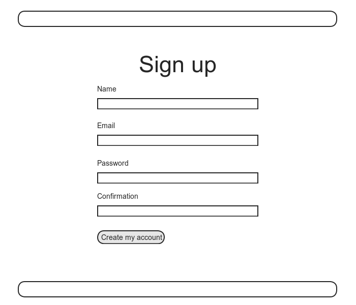

# 제 6장 유저의 모델을 작성해보자 

[제 5장](Chapter5.md) 에서는 새로운 유저를 작성하기 위한 더미용 웹페이지를 작성한 후 끝내었습니다. ([5.4](Chapter5.md#54-User의-등록-첫-테스트)) 이제부터 6개의 챕터에 걸쳐서 유저 등록용 페이지를 작성해볼 것 입니다. 이번 챕터에서는 제일 중요한 부분인 유저의 *데이터 모델* 의 작성과, 데이터를 저장하기 위한 수단을 확보하는 것에 대해 배워볼 것입니다. 제 7장에서는 유저가 사이트에 등록할 수 있도록 하고 유저의 프로필 작성을 위한 페이지를 만들 것입니다. 유저 등록이 가능하게 되면, 로그인이나 로그아웃을 할 수 있는 처리를 구현해보고, (제 8장과 제 9장) 제 10장부터는 해킹 등의 악질적인 접근 등을 막기 위한 방법에 대해 배워볼 것입니다. (10.2.1) 마지막에 제 11장과 제 12장에서는 메일주소를 활용한 ID의 유효화 방법과 패스워드를 재설정하는 방법에 대해 배웁니다. 정리하자면 제 6장부터 제 12장에 걸쳐 Rails의 로그인과 인증시스템을 개발해볼 것입니다. 이미 알고 계신 분들도 계시겠지만, Rails에서는 이미 여러가지 인증 방법이 구현되어 있어서 쉽게 사용해볼 수 있습니다. 컬럼 6.1에서는 적어도 한 번은 자신이 직접 인증 시스템을 만들어 보는 이유에 대해서 설명하고 있습니다.

###### 컬럼 6.1 직접 만들어보는 인증 시스템

> 사실상, 모든 Web 어플리케이션은 어떠한 로그인/인증 시스템을 필요로 하고 있습니다. 때문에, 많은 Web 프레임워크에서는 이러한 로그인/인증 시스템을 구현하기 위한 많은 선택지를 제공하고 있습니다. Rails도 예외는 아닙니다. 인증(*authentication*) 과 허가(*authorization*) 시스템을 예로 들어보자면, [Clearance](https://github.com/thoughtbot/clearance), [Authlogic](https://github.com/binarylogic/authlogic), [Devise](https://github.com/plataformatec/devise), [CanCan](http://railscasts.com/episodes/192-authorization-with-cancan) 등이 있습니다. (Rails만의 aplication이라면, [OpenID](https://ja.wikipedia.org/wiki/OpenID) 이나 [OAuth](https://ja.wikipedia.org/wiki/OAuth) 를 이용하여 구축해보는 방법도 있습니다.) 어째서 이미 구현되어있는 시스템을 처음부터 다시 만드는 가. 라는 질문을 할 수도 있습니다. 자신이 일부러 만들지 않아도, 언제든지 편하게 쓸 수 있는 방법을 그냥 이용하면 안되는 걸까요?

> 어떤 실제적인 실험에 의하면, 많은 사이트의 인증시스템은 방대한 커스터마이즈를 필요로하기 때문에, 서드파티 제품을 변경해서 도입하는 경우에는 시스템을 제로부터 만드는 것보다 더 많은 양의 작업을 요한다는 결과가 있습니다. 게다가 기존의 시스템은 내부 구조를 파악하기 힘든 경우가 많습니다. 자신이 직접 구현한 시스템이라면, 내부 구조를 매우 잘 파악하고 있을 것입니다. 게다가 최근의 Rails의 변경으로 인해 커스텀 인증 시스템을 쉽고 편하게 개발할 수 있게 되었습니다. 그리고 혹여나 서드파티의 인증시스템을 도입한다고 해도, 자기 자신이 인증시스템을 구축한 경험이 있다면, 서드파티 제품을 이해하고 변경하는 것이 꽤나 손쉬운 작업이 될 수도 있습니다.

## 6.1 User 모델

여기부터 3개의 챕터에 걸친  최종 목표로는 유저 등록용 페이지를 작성하는 것입니다만, 지금 상태로는 새로운 유저의 정보가 입력되어도 그것을 저장할 곳이 없기 때문에, 당장 페이지를 작성할 수도 없습니다. 유저 등록 기능을 구현할 때에는 일단 유저의 정보를 저장할 수 있기 위해, 데이터 구조를 만들 필요가 있습니다.



Rails에서는, 데이터모델로 사용하기 위한 기본 데이터구조를 모델 (*Model*) 이라고 합니다. ([1.3.3](Chapter1.md#133-Model---View--Controller-MVC) 에서의 MVC의 M입니다.) Rails에서는 데이터를 저장하기 위한 기본 해결책으로써 데이터베이스를 사용하여 데이터를 장기저장 할 수 있습니다. 또한 데이터베이스와 통신을 하는 Rails 기본 라이브러리는 *Active Record* 라고 부릅니다. Active Record는, 데이터 오브젝트의 생성/저장/검색을 위한 메소드를 가지고 있습니다. 메소드를 사용할 때에는 [관계형 데이터베이스](https://ja.wikipedia.org/wiki/関係データベース) 에서 다루는 SQL (*Structured Query Language*) 를 의식할 필요가 없습니다. 게다가 Rails에는 마이그레이션(*Migration*) 이라고 하는 기능이 있습니다. 데이터의 정의를 Ruby로 작성할 수가 있으며, SQL의 DDL (*Data Definition Language*)를 새롭게 배울 필요도 없습니다. 즉, Rails는 데이터베이스의 세부적인 부분을 거의 완전하게 숨기고 있습니다. 실제로 본 튜토리얼에서는 SQLite를 개발환경에서 사용할 것이며, PostgreSQL를 (Heroku를 이용한) 실제 배포환경에서 사용할 것입니다([1.5](Chapter1.md#15-배포해보자)) 만, 실제 배포환경의 데이터 저장방법에 대해서는 고민할 필요가 거의 없습니다.


Git으로 버전관리를 하고 있다면, 이 대목에서 유저를 모델링하기 위해, 토픽브랜치를 생성합시다.

`$git checkou -b modeling-users`

### 6.1.1 Database

[4.4.5](Chapter4.md#445-User-Class) 에서 다루었던 커스텀 클래스 `User` 를 떠올려보세요. 이 클래스는 `name` 과 `email` 을 속성으로 가지는 유저 오브젝트였습니다. 이 클래스는, 해당 섹션을 이해하기 위한 목적을 가지고 제공되었습니다만, Rails에서 매우 중요한 부분인, 영속성(*Persistence*) 에 대한 요소가 빠져있었습니다. Rails콘솔에서 User클래스의 오브젝트를 생성하여도, 콘솔에서 exit하ㄴ 해당 오브젝트는 바로 삭제되었습니다. 이번 섹션에서의 목적은, 간단하게 삭제되지 않는 유저의 모델을 구축해볼 것입니다.


[4.4.5](Chapter4.md#445-User-Class) 의 유저클래스와 마찬가지로, `name`과 `email` 의 2개의 속성을 가진 유저를 모델링하는 부분부터 시작해봅시다. email를 유니크한( 단 하나밖에 없는) 유저이름으로써 사용해보겠습니다. (패스워드를 위한 속성은 6.3에서 다룹니다.) 이전 4장에서의 코드는 아래처럼 Ruby의 `attr_accessor` 메소드를 사용하였습니다.

```ruby
class User
  attr_accessor :name, :email
  .
  .
  .
end
```

