# 제 7장 유저를 생성해보자

User모델이 완성되었습니다. 드디어 유저 생성(등록) 기능을 추가해봅시다. 7.2에서는 HTML입력폼을 사용하여 Web어플리케이션에 등록정보를 송신해봅니다. 이어서 7.4에서는 유저를 신규작성하고, 그 정보를 데이터베이스에 저장합니다. 유저 생성의 마지막은 생성된 유저의 신규 프로필을 표시할 수 있게 하기 위해, 유저를 표시하기위한 페이지를 작성하고, 유저용의 REST 아키텍처를 구현해볼 것입니다. ([2.2.2](Chapter2.md#222-MVC의-처리)) 더불어서 [5.3.4](Chapter5.md#534-링크의-테스트) 에서 구현한, 간단하면서도 매우 뛰어난 통합 테스트 코드에 대해 몇가지 케이스를 추가해볼 것입니다.


이번 챕터에서는 [제 6장](Chapter6.md) 에서 작성한 User모델의 검증 테스트를 믿고, 유효한 메일주소를 가지고 있는 (가능성이 있는) 신규 유저를 추가해볼 것입니다. 제 11장에서는 메일주소가 *정말로* 유효한 것인지 확인해보기 위해, *고객 ID를 유효화하는* 기능을 신규 유저 등록 시에 동작할 수 있도록 추가해보겠습니다.


본 튜토리얼은 프로레벨의 내용을 다루면서도, 되도록이면 간단하게 설명할 수 있도록 노력하고 있습니다만, 그럼에도 불구하고 Web개발이라고 하는 것은 복잡하면서 어려운 주제임에는 틀림없습니다. 실제로 이번 [7장](Chapter7.md) 부터는 난이도가 조금씩 올라갑니다. 그렇기 때문에 이번 챕터부터는 지금까지 공부해왔던 것 그 이상으로 시간을 더욱 투자해서 천천히 읽어보세요. 필요하다면 복습도 하시길 바랍니다. (일부 독자들은 각 챕터를 최소 2번이상 읽고 있을텐데, 그것도 좋은 방법이라고 생각합니다.) 혹은, 만일 Rails 튜토리얼을 진행해나가는 중에 기초지식이 모자라다고 느낄 때에는 다음의 자료들을 읽어보시는 것도 도움이 되실 겁니다.

- [Learn Enough Society](http://learnenough.com/story) 구독
- [*Learn Enough Ruby to Be Dangerous*](http://learnenough.com/ruby-tutorial)
- [*Learn Enough Sinatra to Be Dangerous*](http://learnenough.com/sinatra-tutorial)
- [*Learn Enough Rails to Be Dangerous*](http://learnenough.com/ruby-on-rails-tutorial)


## 7.1 유저를 표시해보자

이번 섹션에서는, 일단 유저의 이름과 프로필 사진을 표시하기 위한 페이지를 작성해볼 것입니다. 목업의 이미지는 아래 첫 번째 이미지와 같습니다. 유저 프로필 페이지의 최종적인 목표는 아래 두 번째 페이지와 같은 유저의 프로필 사진과 기본 유저 데이터, 마이크로포스트의 리스트를 표시하는 것입니다. (두 번쨰 이미지에서는, 유명한 lorem ipsum 더미 텍스트를 사용하고 있습니다. 이 텍스트의 탄생과정에는 [재미있는 에피소드](http://www.straightdope.com/columns/read/2290/what-does-the-filler-text-lorem-ipsum-mean) 가 있으니 시간이 괜찮으시면 읽어보세요.) 이 페이지를 작성한 후, 제 14장의 샘플 어플리케이션에서 본격적으로 사용해볼 것입니다.


버전관리를 하고 있으니, 언제나처럼 토픽 브랜치를 생성해봅시다.

`$ git checkout -b sign-up`

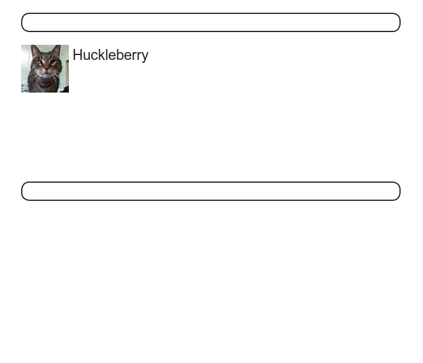


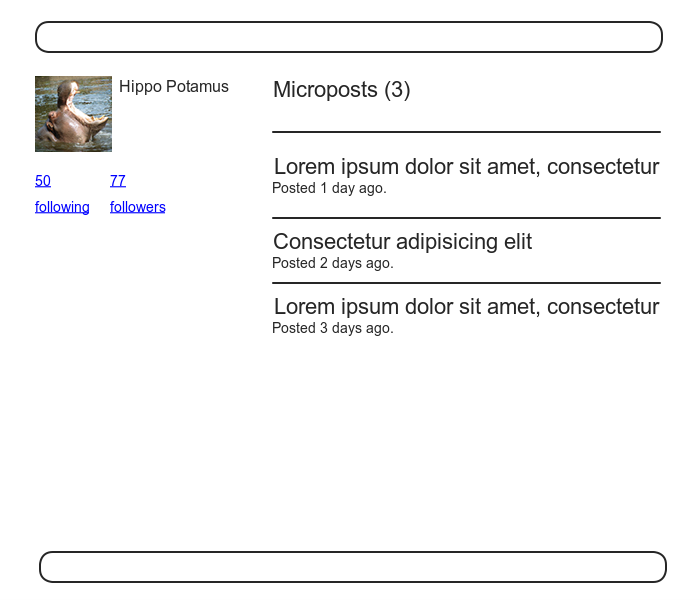


### 7.1.1 Debug와 Rails 환경

이번 섹션에서 생성하는 프로필은, 우리의 어플리케이션에서의 첫 동적인 페이지가 될 것입니다. 뷰 그 자체는 한 페이지의 코드입니다만, 어플리케이션의 데이터베이스로부터 얻은 정보를 사용하여 각 프로필의 표시를 커스터마이즈할 것입니다. Sample 어플리케이션에 동적인 페이지를 추가하는 준비작업으로써, 여기서는 Web사이트의 레이아웃에 디버그 정보를 추가해보도록 하겠습니다. 이것으로, Rails에서 기본으로 제공하는 `debug` 메소드와 `params` 변수를 사용하여, 각 프로필 페이지의 디버그용의 정보를 표시할 수 있게 되었습니다. (자세한 설명은 7.1.2에서 설명하겠습니다.)

```erb
<!-- app/views/layouts/application.html.erb -->

<!DOCTYPE html>
<html>
  .
  .
  .
  <body>
    <%= render 'layouts/header' %>
    <div class="container">
      <%= yield %>
      <%= render 'layouts/footer' %>
      <%= debug(params) if Rails.env.development? %> <!-- 추가한 코드 -->
    </div>
  </body>
</html>
```

실제 배포 환경에서 전개한 어플리케이션은 디버그 정보를 표시하게 하고싶진 않습니다. 그렇기 때문에 위 코드에서는 아래와 같은 표현을 하고 있습니다.

`if Rails.env.development?`

이렇게 해놓으면, 디버그정보는 Rails의 세 가지의 디폴트 환경 중, *개발환경(Development)* 에서만 표시될 것입니다.(컬럼 7.1) 특히 `Rails.env.development?` 가 `true` 일 경우는 개발 환경일 때만 이기때문에 다음의 Ruby 코드는

`<%= debug(params) if Rails.env.development? %>`

실제 배포환경 어플리케이션이나 테스트에서 사용할 수는 없습니다. ( 테스트 환경에서 디버그 정보가 표시되어도 문제될 것은 없습니다만, 그렇다고 좋을 것도 없습니다. 디버그 정보는 개발환경 이외에서는 표시해선 안되는 것입니다.)

###### 컬럼 7.1 Rails의 3가지 환경

> Rails에서는 테스트환경(test), 개발환경(development), 실제 배포환경(production) 의 세 가지 환경이 기본으로 준비되어있습니다. Rails console의 기본 환경은 development입니다.
>
> $ rails console
> Loading development environment
>
> ​	Rails.env
> ​	  => "development"
> ​	Rails.env.development?
> ​	  => true
> ​	Rails.env.test?
> ​	  => false
>
> 
>
> 위와 같이, Rails에서는 `Rails` 라고 하는 오브젝트가 존재하며, 해당 오브젝트의 환경의 논리값을 다루는 `env` 라는 속성이 있습니다. 예를 들어 `Rails.env.test?` 라고 하면 테스트 환경에서는 `true` 를 리턴하고, 그 외의 환경에서는 `false` 를 리턴합니다.
>
> 테스트 환경에서의 디버그 등, 다른 환경에서 console을 실행하는 필요가 생겼을 때는 환경을 파라미터로써 console 스크립트에 직접 입력할 수 있습니다.
>
> $ rails console test
> Loading test environment
>
> ​	Rails.env
> ​	  => "test"
> ​	Rails.env.test?
> ​	  => true
>
> 마찬가지로, Rails 서버도 기본 옵션으로는 `development` 가 사용되고 있습니다만, 다음과 같은 다른 환경을 명시적으로 실행하는 것도 가능합니다.
>
> `$ rails server --environment production`
>
> 어플리케이션을 실제 배포환경에서 실행하는 경우, 배포환경의 데이터베이스를 이용하지 않으면 어플리케이션을 실행할 수 없습니다. 때문에 `rails db:migrate` 를 배포환경에서 실행하여 배포환경 데이터베이스를 생성합니다.
>
> `$ rails db:migrate RAILS_ENV=production`
>
> (console, server, migrate의 세 가지 커맨드는, 기본이외의 환경을 지정하는 방법이 제각각 다르기 때문에 혼동스러울 수 있습니다. 때문에 세 가지의 경우의 모든 방법을 칼럼에서 설명했습니다. 또한 `RAILS_ENV=<env>` 를 커맨드의 앞 부분에 놓아도 상관 없습니다. 예를 들면, `RAILS_ENV=production rails server` 등의 문장을 입력해도 됩니다.)
>
> Sample 어플리케이션을 기존에 Heroku 상에 배포(디플로이) 한 경우에는, `heroku run rails console` 이라고 하는 커맨드를 입력하여 실제 배포환경을 확인해볼 수 있습니다.
>
> `$ heroku run rails console`
>
> ​	Rails.env
> ​	  => "production"
> ​	Rails.env.production?
> ​	  => true
>
> 당연한 이야기지만, Heroku는 실제 배포용 플랫폼이기 때문에, 실행되는 어플리케이션은 모두 실제 배포환경입니다.

디버그출력을 예쁘게하기 위해, [제 5장](Chapter5.md) 에서 생성한 커스텀 스타일 시트를 아래와 같이 추가합니다.

```scss
/* app/assets/stylesheets/custom.scss */

@import "bootstrap-sprockets";
@import "bootstrap";

/* mixins, variables, etc. */

$gray-medium-light: #eaeaea;

@mixin box_sizing {
  -moz-box-sizing:    border-box;
  -webkit-box-sizing: border-box;
  box-sizing:         border-box;
}
.
.
.
/* miscellaneous */
.debug_dump {
  clear: both;
  float: left;
  width: 100%;
  margin-top: 45px;
  @include box_sizing;
}
```

여기서 Sass의 Mix_in 기능 (여기서는 `box_sizing` )을 사용하고 있습니다. mix_in기능을 사용함으로써 CSS의 그룹을 패키지화하여 여러개의 요소에 적용할 수 있습니다. 다음의 코드는

```scss
.debug_dump {
  .
  .
  .
  @include box_sizing;
}
```

아래와 같이 변환됩니다.

```scss
.debug_dump {
  .
  .
  .
  -moz-box-sizing:    border-box;
  -webkit-box-sizing: border-box;
  box-sizing:         border-box;
}
```

mix_in은 7.2.1에서도 사용합니다. 이번 경우에는 아래의 그림과 같이 될 것 입니다.

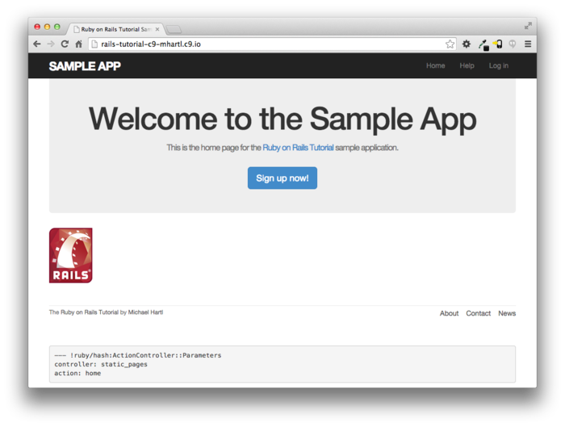

위 그림에서 디버그 출력은, 화면에 표시되는 페이지의 상태를 파악하기 위해 도움이 될 정보를 가지고 있습니다.

```
controller: static_pages
action: home
```

이것은  `params` 가 가지고 있는 내용으로써, `YAML` 이라고 하는 형식으로 작성되어져 있습니다. YAML은 기본적으로 해시의 형태이며 컨트롤러와 페이지의 액션을 유니크하게 지정합니다. 7.1.2에서는 다른 형식의 예시도 소개하겠습니다.

##### 연습

1. 브라우저로부터 /about에 접속하여 디버그정보가 표시되는 것을 확인해주세요. 해당 페이지를 표시할 때, 어떠한 컨트롤러와 액션이 사용되었습니까? `params` 의 내용으로부터 확인해보세요.
2. Rails의 콘솔을 동작시키고, 데이터베이스로부터 제일 처음의 유저정보를 조회하여 변수 `user`에 저장해보세요. 그 후, `puts user.attributes.to_yaml`을 실행하면 어떠한 내용이 표시됩니다. 여기서 표시된 결과와, `y` 메소드를 사용한 `y user.attributes`의 실행결과를 비교해봅시다.


### 7.1.2 User Resource

유저 프로필 페이지를 생성하기 위해서는 그 전에, 데이터베이스에 유저를 등록해놓을 필요가 있습니다. 이것은 이른바 "달걀이 먼저냐 닭이 먼저냐" 의 문제입니다. 이 Web사이트에서는 등록페이지가 없는 상태에서 어떻게하면 유저를 생성할 수 있을까요? 다행히도 이 문제는 이미 해결한 적이 있습니다. [6.3.4](Chapter6.md#유저의-생성과-인증) 에서 Rails 콘솔을 사용하여 유저 레코드를 등록해놓았습니다. 따라서 데이터베이스 안에는 한 명의 유저가 존재할 것 입니다.

```ruby
$ rails console
>> User.count
=> 1
>> User.first
=> #<User id: 1, name: "Michael Hartl", email: "mhartl@example.com",created_at: "2016-05-23 20:36:46", updated_at: "2016-05-23 20:36:46",password_digest: "$2a$10$xxucoRlMp06RLJSfWpZ8hO8Dt9AZX...">
```

(만약, 아직 데이터베이스에 유저가 한 명이라도 없는 경우에는, [6.3.4](Chapter6.md#유저의-생성과-인증) 으로 돌아가 작성해주세요.) 방금전 콘솔의 출력결과로부터, 유저의 ID가 `1` 이라는 것을 확인하였습니다. 그 다음 목표로는 이러한 유저 정보를 Web 어플리케이션 상에서 표시하는 것입니다. 여기서는 Rails 어플리케이션에서 권장되고 있는 REST 아키텍쳐 ([컬럼 2.2](Chapter2.md#컬럼-22-REpresentational-State-Transfer-REST) )의 습관을 따르도록 합니다. 즉, 데이터의 생성, 표시, 수정, 삭제를 *리소스 (Resource)* 로써 다룬다는 것입니다. [HTTP표준](https://ja.wikipedia.org/wiki/Hypertext_Transfer_Protocol) 에서는 위 리소스에 대응하기 위한 4가지의 기본 조작 (POST, GET, PATCH, DELETE) 가 정의되어 있습니다. 이러한 기본 조작들을 각 액션에 할당하여 사용해봅니다.([컬럼 3.2](Chapter3.md#컬럼-32-GET이나-그-외-다른-HTTP-메소드에-대해)) 


REST의 원칙을 따르는 경우, 리소스로의 참조는 리소스의 이름과 유니크한 ID를 사용하는 것이 일반적입니다. 유저를 리소스라고 가정할 경우, id=`1` 의 유저를 참조한다는 것은 /users/1 이라고 하는 URL에 대해 GET 리퀘스트를 발행한다는 의미입니다. 여기서 `show` 라고 하는 액션은, *암묵* 의 리퀘스트입니다. Rails의 REST 기능이 유효한 경우라면, GET 리퀘스트는 자동적으로 `show` 액션으로써 다뤄질 것입니다


[2.2.1](Chapter2.md#221-Users-화면을-움직여보자) 에서 설명한 것 처럼, id=`1` 의 데이터에 접근하기 위한 페이지의 URL은 /users/1 입니다. 단 현 시점에서는 이 URL을 사용해도 에러가 출력될 것입니다. 


/users/1의 URL을 유효하게 하기 위해, routes파일 (`config/routes.rb`) 에 다음 한 줄을 추가합니다.

`resources :users`

작성한 코드는 아래와 같습니다.

```ruby
# config/routes.rb

Rails.application.routes.draw do
  root 'static_pages#home'
  get  '/help',    to: 'static_pages#help'
  get  '/about',   to: 'static_pages#about'
  get  '/contact', to: 'static_pages#contact'
  get  '/signup',  to: 'users#new'
  resources :users
end
```

지금 작성하는 간단하고 학습용도로의 Web페이지 상에서의 유저를 표시하는 것이긴 하지만, `resources :users` 라고 하는 줄은, 유저정보를 표시하는 URL(/users/1) 를 추가하기 위한 것만은 아닙니다. Sample 어플리케이션에 이 한 줄을 추가하는 것으로, 유저의 URL 을 생성할 때에 여러개의 이름이 붙어있는 루트 ([5.3.3](Chapter5.md#533-이름이-붙은-Path)) 와 더불어 RESTful적인 Users리소스에서 필요한 모든 액션을 이용할 수 있게 됩니다. 이 코드 한 줄에 대응하는 URL 이나 액션, 이름이 붙은 루트는 아래의 표와 같습니다. 다음 3개의 챕터에 걸쳐 아래 표의 다른 항목도 이용하여 User리소스를 완전한 RESTful한 리소스로 만들기 위해 필요한 액션을 모두 작성해볼 것입니다.

| HTTP 리퀘스트 | **URL**       | **액션**  | **Named Root**         | **용도**                                    |
| ------------- | ------------- | --------- | ---------------------- | ------------------------------------------- |
| `GET`         | /users        | `index`   | `users_path`           | すべてのユーザーを一覧するページ            |
| `GET`         | /users/1      | `show`    | `user_path(user)`      | 特定のユーザーを表示するページ              |
| `GET`         | /users/new    | `new`     | `new_user_path`        | ユーザーを新規作成するページ (ユーザー登録) |
| `POST`        | /users        | `create`  | `users_path`           | ユーザーを作成するアクション                |
| `GET`         | /users/1/edit | `edit`    | `edit_user_path(user)` | `id= 1`의 유저를 수정하는 페이지            |
| `PATCH`       | /users/1      | `update`  | `user_path(user)`      | 특정 유저를 수정하는 액션                   |
| `DELETE`      | /users/1      | `destroy` | `user_path(user)`      | ユーザーを削除するアクション                |

위 코드를 사용하면, 라우팅이 유효하게 됩니다. 그러나 라우팅을 하여 접속하려는 페이지가 아직 존재하지 않습니다. 이 문제를 해결하기 위해선 7.1.4에서 최소한의 프로필을 표시하는 페이지를 작성해볼 예정입니다.

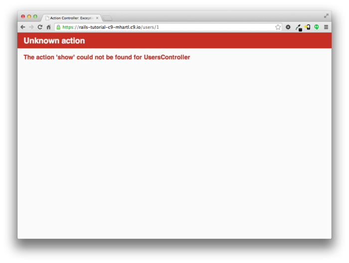

유저를 표시하기 위해 표준적인 Rails의 기능을 사용해보도록 합시다. Rails에서의 표준 출력 기능이란 `app/views/users/show.html.erb` 를 의미합니다. 그러나 `rails generate controller Users new` 로 생성했을 때와는 다르게, (`new.html.erb` 뷰를 생성했을 때와는 달리)이번에는 제네레이터를 사용하지 않고 `show.html.erb` 를 생성할 필요가 있습니다. 때문에 `app/views/users/show.html.erb` 파일을 수동으로 생성하고, 아래의 코드를 붙여 넣어주세요.

```erb
<!-- app/views/users/show.html.erb -->

<%= @user.name %>, <%= @user.email %>
```

이 뷰에서 루비코드를 작성하여 유저이름과 메일 주소를 표시해봅니다. 인스턴스 변수 `@user` 가 존재한다는 것을 전제로 합니다. 물론 유저표시페이지의 최종적인 상태는 이것과는 매우다르며, 해당 메일주소가 그대로 일반에 공개되도록 하진 않을 것이빈다.


유저표시용 뷰가 정상적으로 동작하기 위해서는, Users컨트롤러내의 `show` 액션에 대응하는 `@user` 변수를 정의할 필요가 있습니다. 상상하시는 대로, 여기서는 User모델의 `find` 메소드를 사용하여 데이터베이스로부터 유저를 조회합니다. 아래와 같이 수정해보세요.

```ruby
# app/controllers/users_controller.rb

class UsersController < ApplicationController

  def show
    @user = User.find(params[:id])
  end

  def new
  end
end
```

유저의 id를 읽어들일 때에는 `params`를 사용합니다. Users 컨트롤러에 리퀘스트가 정상적으로 송신되면, `params[:id]` 부분은 유저 아이디의 1이 입력될 것입니다. 즉 이 부분은 [6.1.4](Chapter6.md#614-User-Object를-검색해보자) 에 배운 `find` 메소드의 `User.find(1)` 과 같은 결과가 될 것입니다. (*기술적인 보충설명*: `params[:id]` 는 문자열형태의 `"1"` 입니다만, `find` 메소드에서는 자동적으로 정수형으로 변환됩니다.)


유저의 뷰와 액션을 정의했습니다. /users/1 은 완전하게 동작할 것입니다. 이 때, 만일 bcrypt gem을 추가하고 나서 한 번도 Rails 서버를 동작하지 않은 경우라면, 여기서 재부팅을 해보세요. ([컬럼 1.1](Chapter1.md#컬럼-11-숙련이라고-하는-것은)) 재부팅을 하면 /users/1에 접속하여 디버그정보로부터 `params[:id]` 의 값을 확인할 수 있을 겁니다.

```
---
action: show
controller: users
id: '1'
```

이 `id: '1'` 는 /users/`:id` 로부터 얻은 값입니다. 이 값을 사용하여

```ruby
User.find(params[:id])
```

위 코드에 id=1 의 유저를 검색할 수 있는 구조가 된 것입니다.

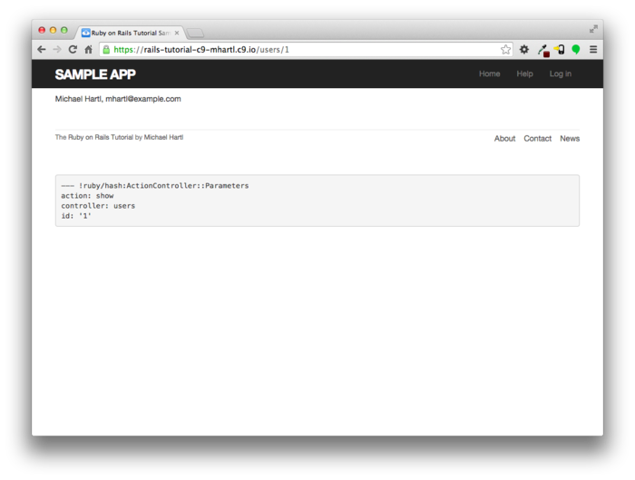

##### 연습

1. `.erb` 의 루비코드를 사용하여, 매직컬럼 (`created_at`과 `updated_at`) 의 값을 show페이지에 출력해봅시다.
2. `.erb` 의 루비코드를 사용하여 `Time.now` 의 결과를 show 페이지에 출력해봅시다. 페이지를 새로고침하면 그 결과가 어떻게 되는지도 확인해봅시다.

### 7.1.3 Debugger 메소드

[7.1.2](Chapter7.md#712-User-Resource), 어플리케이션의 동작을 이해하기 위해 `debug` 메소드가 도움이된다는 것을 배워보았습니다. 그러나 좀 더 직접적인 디버그를 하는 방법이 있습니다. `byebug` gem 을 설치하면 사용할 수 있는 `debugger` 메소드입니다. 어떻게 디버그할 수 있냐하면, `debugger` 메소드를 실제로 어플리케이션에 작성하여 확인해볼 수 있습니다.

```ruby
# app/controllers/users_controller.rb

class UsersController < ApplicationController

  def show
    @user = User.find(params[:id])
    debugger #추가한 코드
  end

  def new
  end
end
```

`debugger` 메소드를 작성하면 브라우저에서 /users/1 에 접속하여 Rails 서버를 기동할 시에 터미널을 확인해봅시다. `byebug` 프롬프트가 표시될 것입니다.

`(byebug)`

이 프롬프트에서는 Rails 콘솔에서처럼 커맨드를 출력하는 것이 가능하며, 어플리케이션의 `debugger` 가 호출되었을 순간의 상태를 확인할 수 있습니다.

```
(byebug) @user.name
"Example User"
(byebug) @user.email
"example@railstutorial.org"
(byebug) params[:id]
"1"
```

또한 Ctrl+D 를 누르면, 프롬프트로부터 텍스트를 얻을 수 있습니다. 디버그가 끝나면 `show` 액션 내부의 `debugger` 메소드는 삭제해줍시다.

```ruby
# app/controllers/users_controller.rb

class UsersController < ApplicationController

  def show
    @user = User.find(params[:id])
  end

  def new
  end
end
```

앞으로 Rails 어플리케이션에서 내부를 알고 싶거나 궁금한 부분이 있다면, 위와 같이 `debugger`메소드를 사용해봅시다. 트러블이 발생할 것 같은 코드 가까이에 작성해놓는다면 매우 좋을 것입니다. byebug gem 을 사용하여 시스템의 상태를 조사할 때는 어플리케이션 내부의 에러를 추적하거나 디버그를 할 때에 매우 도움될 것입니다.

##### 연습

1. `show` 액션 내부에 `debugger` 를 작성하고, 브라우저에서 /users/1 에 접속해봅시다. 그 다음 콘솔에서 `puts` 메소드를 사용하여 `params` 해시의 내부를 *YAML 형식* 으로 표현해봅시다. *Hint* : [7.1.1](Chapter7.md#711-Debug와-Rails환경) 의 연습문제를 참고해봅시다. 해당 연습문제에서는 `debug` 메소드를 표시한 디버그 정보를 어떻게 YAML형식으로 표시했었나요?
2. `new` 액션의 내부에 `debugger` 를 작성하고, /users/new에 접속해봅시다. `@user` 의 내용은 어떻게 되어 있습니까? 확인해봅시다.

### 7.1.4 Gravatar 이미지와 사이드 바

이전 섹션에서 기본적인 유저 페이지의 정의를 해보았습니다. 이번에는 각 유저의 프로필 사진을 간단하게라도 표시할 수 있도록 해보고, 사이드바도 만들어 보겠습니다. 여기서는 [Gravatar (Globally Recognized AVATAR)](http://gravatar.com/) 를 프로필에 도입해보겠습니다. Gravatar는 무료서비스이며 프로필 사진을 업로드하여 지정한 메일주소와 관련지을 수 있습니다. 그 결과, Gravatar는 프로필사진을 업로드할 때 귀찮은 작업이나 사진을 빼먹는 등의 오류, 이미지의 저장소 등의 고민을 해결할 수 있습니다. 애당초 유저의 메일주소를 사용한 Gravatar전용의 이미지 주소를 구성하는 것만으로도 Gravatar의 이미지가 자동적으로 표시됩니다. (커스텀 이미지를 사용하는 방법에 대해서는 13.4에서 다룹니다.)


여기는 아래의 코드와 같이, `gravatar_for` 헬퍼 메소드를 사용하여 Gravatar의 이미지를 이용해볼 수 있습니다.

```ruby
# app/views/users/show.html.erb

<% provide(:title, @user.name) %>
<h1>
  <%= gravatar_for @user %>
  <%= @user.name %>
</h1>
```

기본적으로는 헬퍼파일에서 정의하는 메소드는 자동적으로 모든 뷰 파일 내부에서 이용할 수 있습니다. 여기서는 편의성을 생각하여 `gravatar_for` 를 User 컨트롤러에 대응되어있는 헬퍼파일에 작성해봅시다. [Gravatar의 홈페이지](http://ja.gravatar.com/site/implement/hash/) 에도 기술되어 있듯, Gravatar의 URL은 유저의 메일주소를 [MD5](https://ja.wikipedia.org/wiki/MD5) 라고하는 구조로 해시화합니다. Ruby에는 `Digest` 라이브러리의 `hexdigest` 메소드를 사용하면, MD5의 해시화를 구현할 수 있습니다.

```ruby
>> email = "MHARTL@example.COM"
>> Digest::MD5::hexdigest(email.downcase)
=> "1fda4469bcbec3badf5418269ffc5968"
```

메일 주소는 대문자와 소문자를 구별하지 않습니다만, ([6.2.4](Chapter6.md#624-포맷을-검증해보자)) MD5 해시에서는 대문자와 소문자를 구별합니다. Ruby의 `downcase` 메소드를 사용하여 `hexdigest` 의 파라미터를 소문자로 변환합니다. (본 튜토리얼에서는 [6.2.5](Chapter6.md#625-유니크성을-검증해보자) 에서의 콜백처리에서 소문자변환을 한 메일주소를 사용하기 때문에, 여기서 소문자변환을 하지 않아도 결과는 똑같습니다. 단, 추후 `gravatar_for` 메소드가 다른 장소에서부터 호출될 가능성을 고려한다면, 여기서 소문자변환을 해주는 것도 좋다고 생각합니다.) 

`gravatar_for` 헬퍼를 작성한 결과는 아래와 같습니다.

```ruby
# app/helpers/users_helper.rb

module UsersHelper

  # 파라미터로 주어진 유저의 Gravatar 이미지를 리턴합니다.
  def gravatar_for(user)
    gravatar_id = Digest::MD5::hexdigest(user.email.downcase)
    gravatar_url = "https://secure.gravatar.com/avatar/#{gravatar_id}"
    image_tag(gravatar_url, alt: user.name, class: "gravatar")
  end
end
```

위 코드는, Gravatar 이미지태그에 `gravatar` 클래스와 유저이름의 alt 텍스트를 추가한 것을 리턴합니다. (alt 텍스트를 추가하면, 시각장애가 있는 유저들에게 스크린리더를 사용할 수 있게해줍니다.)


프로필 페이지는 아래와 같이 됩니다. 여기서 기본 Gravatar이미지를 출력하고 있으나, 이것은 기본 메일주소 `user@example.com` 이 진짜 메일주소가 아니기 때문입니다. (example.com 이라는 도메인이름은, 예제로써 사용하기 때문에 특별한 도메인입니다.)


어플리케이션에서 Gravatar를 이용할 수 있게 하기 위해서는 일단 `update_attributes`([6.1.5](Chapter6.md#615-User-Object를-수정해보자)) 사용하여 데이터베이스 상의 유저 정보(메일주소) 를 갱신해봅시다.

```ruby
$ rails console
>> user = User.first
>> user.update_attributes(name: "Example User",
?>                        email: "example@railstutorial.org",
?>                        password: "foobar",
?>                        password_confirmation: "foobar")
=> true
```

여기서 유저의 메일주소에 `example@railstutorial.org` 를 사용하였습니다. Gravatar상의 이 메일주소와 Rails Tutorial의 로고를 이미 연결시켜놓았기 때문에, 위와 같은 정보 수정을 하면 아래와 같이 출력됩니다.

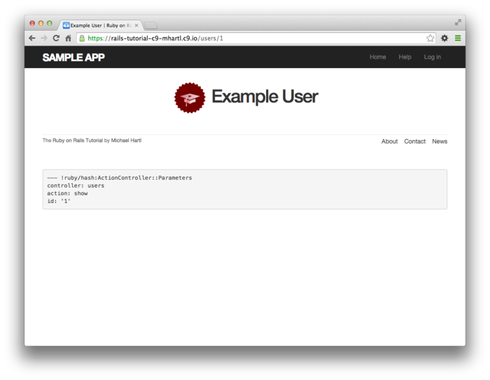

목업 이미지 파일과 비슷하게 만들기 위해, 유저의 사이드바의 첫 버전을 만들어봅시다. 여기서는 `aside` 태그를 사용하여 구현하고 있습니다. 이 태그는 사이드바 등의 보완 컨텐츠를 표시하기 위해 사용합니다만, 단독으로 출력하는 것도 가능합니다. `row` 클래스와 `col-md-4` 클래스를 추가해놓습니다. 이 클래스들은 Bootstrap의 일부입니다. 유저 표시페이지를 변경한 결과는 아래와 같습니다.

```erb
<!-- app/views/users/show.html.erb -->

<% provide(:title, @user.name) %>
<div class="row">
  <aside class="col-md-4">
    <section class="user_info">
      <h1>
        <%= gravatar_for @user %>
        <%= @user.name %>
      </h1>
    </section>
  </aside>
</div>
```

HTML 요소와 CSS 클래스를 추가한 덕분에 프로필 페이지(와 사이드바와 Gravatar) 에 SCSS로 아래의 스타일을 적용할 수 있게 되었습니다. (테이블 CSS의 계층구조로 되어있습니다만, 이게 가능한 경우는 Asset Pipline에서 SASS 엔진이 사용되는 경우에만 한합니다.) 페이지의 변경의 결과는 아래의 그림과 같습니다.

```scss
/* app/assets/stylesheets/custom.scss */

/* sidebar */

aside {
  section.user_info {
    margin-top: 20px;
  }
  section {
    padding: 10px 0;
    margin-top: 20px;
    &:first-child {
      border: 0;
      padding-top: 0;
    }
    span {
      display: block;
      margin-bottom: 3px;
      line-height: 1;
    }
    h1 {
      font-size: 1.4em;
      text-align: left;
      letter-spacing: -1px;
      margin-bottom: 3px;
      margin-top: 0px;
    }
  }
}

.gravatar {
  float: left;
  margin-right: 10px;
}

.gravatar_edit {
  margin-top: 15px;
}
```


##### 연습

1. (임의) Gravatar에서 아이디를 작성하고, 여러분의 메일주소와 적당한 이미지를 연결시켜보세요. 메일주소를 MD5 해시화하여 연결지은 이미지가 제대로 표시되는지 확인해보세요.
2. [7.1.4](Chapter7.md#714-Gravatar-이미지와-사이드-바) 에서 정의한 `gravatar_for` 헬퍼를 아래의 코드와 같이 변경하여 `size` 를 옵션 파라미터로 받을 수 있도록 해봅시다. 제대로 변경이 된다면,  `gravatar-for user, size: 50` 과 같은 호출이 가능합니다. *중요* : 여기서 수정한 헬퍼를 10.3.1에서 실제로 사용합니다. 잊지말고 꼭 구현해봅시다.
3. 옵션 파라미터는 지금도 Ruby 커뮤니티에서 일반적으로 사용되고 있습니다만,   Ruby 2.0에서부터 도입된 신기능 "*키워드 파라미터(Keyword Arguments)*" 에서도 구현할 수 있습니다. 앞서 변경한 아래 첫 번째 코드를, 아래 두 번째 코드와 같이 수정하여 제대로 동작하는지를 확인해봅시다. 이 두 가지 구현방법은 어떠한 차이점이 있는 것일까요?

```ruby
# app/helpers/users_helper.rb
module UsersHelper

  def gravatar_for(user, options = { size: 80 })
    gravatar_id = Digest::MD5::hexdigest(user.email.downcase)
    size = options[:size]
    gravatar_url = "https://secure.gravatar.com/avatar/#{gravatar_id}?s=#{size}"
    image_tag(gravatar_url, alt: user.name, class: "gravatar")
  end
end
```

```ruby
# app/helpers/users_helper.rb
module UsersHelper

  def gravatar_for(user, size: 80)
    gravatar_id = Digest::MD5::hexdigest(user.email.downcase)
    gravatar_url = "https://secure.gravatar.com/avatar/#{gravatar_id}?s=#{size}"
    image_tag(gravatar_url, alt: user.name, class: "gravatar")
  end
end
```


## 7.2 유저 등록 Form

지금까지 유저 프로필 페이지를 동작되도록 작업을 해보았습니다. 이번에는 유저 등록용 폼을 작성해보겠습니다. 아래 그림과 같이, 유저 등록 페이지는 아직 공백인 상태이기 때문에, 이대로는 유저를 신규생성할 수는 없습니다. 이번 섹션에서는 아무것도 없는 휑한 페이지를 목업과 비슷한 디자인으로 수정해보겠습니다.

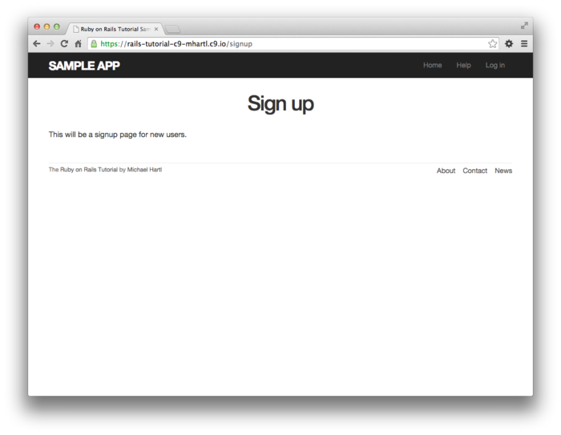


### 7.2.1 Form_for를 사용해보자

유 등록용 페이지에서 중요한 점은, 유저 등록에서 빠질 수 없는, 정보를 입력하기 위한 *form* 입니다. Rails에서는  `form_for` 헬퍼메소드를 사용합니다. 이 메소드는 Active Record의 오브젝트를 사용하여 해당 오브젝트의 속성을 사용하여 폼을 구축합니다.


유저 등록용 페이지 /signup 의 라우팅은, User 컨트롤러의 `new` 액션에 이미 연결되어있다는 것을 떠올려주세요. ([5.4.2](Chapter5.md#542-User-등록용-URL)) 따라서 다음 스텝으로는 `form_for` 의 파라미터로 필요한 User 오브젝트를 생성해야합니다. 필요한 `@user` 변수의 정의는 아래의 코드와 같습니다.

```ruby
# app/controller/users_controller.rb
class UsersController < ApplicationController

  def show
    @user = User.find(params[:id])
  end

  def new
    @user = User.new #추가된 코드
  end
end
```

폼 그 자체는 아래의 코드에 표시되어있습니다. 7.2.2에서 좀 더 자세히 다루겠습니다만, 일단 아래 두 번째 코드의  SCSS에서 디자인을 다듬어놓습니다. `box_sizing` 믹스인을 이전 코드로부터 재사용하고 있습니다. 해당 CSS가 적용되면 유저 등록 페이지는 아래의 캡쳐처럼 됩니다.

```erb
<!-- app/views/users/new.html.erb -->

<% provide(:title, 'Sign up') %>
<h1>Sign up</h1>

<div class="row">
  <div class="col-md-6 col-md-offset-3">
    <%= form_for(@user) do |f| %>
      <%= f.label :name %>
      <%= f.text_field :name %>

      <%= f.label :email %>
      <%= f.email_field :email %>

      <%= f.label :password %>
      <%= f.password_field :password %>

      <%= f.label :password_confirmation, "Confirmation" %>
      <%= f.password_field :password_confirmation %>

      <%= f.submit "Create my account", class: "btn btn-primary" %>
    <% end %>
  </div>
</div>
```

```scss
/* app/assets/stylesheets/custom.scss */
.
.
.
/* forms */

input, textarea, select, .uneditable-input {
  border: 1px solid #bbb;
  width: 100%;
  margin-bottom: 15px;
  @include box_sizing; // 재사용 코드
}

input {
  height: auto !important;
}
```

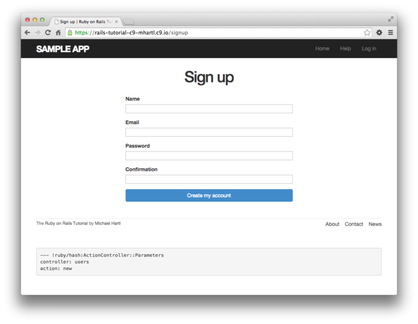

##### 연습

1. 시험삼아 위 첫 번째 코드에서 `:name`을 `:none` 으로 바꾸어봅시다. 어떠한 에러메세지가 출력됩니까?
2. 시험삼아, 블록의 변수 `f` 를 모두 `foobar` 로 바꾸어보고 결과가 바뀌지 않는 것을 확인해보세요. 분명히 결과는 바뀌지 않습니다만, 변수명을 `foobar` 로 바꾸는 것은 확실히 좋은 수정은 아닌 것 같습니다. 그 이유에 대해 생각해보세요.

### 7.2.2 Form HTML

위 첫 번째 코드에서 정의한 폼을 이해하기 위해, 작은 부분으로 나누어서 봅시다. 일단 erb에서의 Ruby 코드가 사용되고 있는 `form_for` 에서 `end` 까지 바깥 구조를 확인해봅시다.

```erb
<%= form_for(@user) do |f| %>
  .
  .
  .
<% end %>
```

`do` 키워드는,  `form_for` 가 1개의 변수를 가진 블록을 다루는 것을 의미합니다. 변수 `f` 는 "form" 의 `f` 입니다.


보통 Rails 헬퍼를 사용하는 경우, 실제 구현된 코드에 대해서는 자세히 알 필요는 없습니다. 그러나 *f* 라는 오브젝트가 **무엇을 하는 오브젝트인지는 알 필요가 있습니다.** *f* 오브젝트는 [HTML form 요소](http://www.w3schools.com/html/html_forms.asp) (텍스트필드, 라디오버튼, 패스워드 필드 등)에 대응하는 메소드가 호출 될 때, *@user* 속성을 설정하기 위해, 특별하게 설계된  HTML을 리턴합니다. 즉 다음 코드를 실행하면 

```erb
<%= f.label :name %>
<%= f.text_field :name %>
```

User모델의 `name` 속성을 설정하는, 라벨이 달린 텍스트필드 요소를 작성하는 데에 있어 필요한 HTML을 작성합니다.


생성된 폼의 HTML을 보고싶은 경우에는, 브라우저상에서 표시화면을 오른쪽 클릭하여, 표시된 팝업항목의 안쪽에서 [소스를 표시] 라고하는 항목을 클릭해주세요. Web페이지의 HTML 소스는 아래와 같습니다. HTML소스의 내부에서 폼을 형성하는 HTML 구조에 주목해주세요.

```html
<form accept-charset="UTF-8" action="/users" class="new_user"
      id="new_user" method="post">
  <input name="utf8" type="hidden" value="&#x2713;" />
  <input name="authenticity_token" type="hidden"
         value="NNb6+J/j46LcrgYUC60wQ2titMuJQ5lLqyAbnbAUkdo=" />
  <label for="user_name">Name</label>
  <input id="user_name" name="user[name]" type="text" />

  <label for="user_email">Email</label>
  <input id="user_email" name="user[email]" type="email" />

  <label for="user_password">Password</label>
  <input id="user_password" name="user[password]"
         type="password" />

  <label for="user_password_confirmation">Confirmation</label>
  <input id="user_password_confirmation"
         name="user[password_confirmation]" type="password" />

  <input class="btn btn-primary" name="commit" type="submit"
         value="Create my account" />
</form>
```

일단 위 HTML 소스의 내부구조에 대해 설명하겠습니다. 다음 erb Ruby코드는

```erb
<%= f.label :name %>
<%= f.text_field :name %>
```

다음과 같은 HTML을 생성하는 것을 알 수 있습니다.

```html
<label for="user_email">Email</label>
<input id="user_email" name="user[email]" type="email" />
```

마찬가지로 다음 코드는

```erb
<%= f.label :password %>
<%= f.password_field :password %>
```

다음의 HTML을 생성합니다.

```html
<label for="user_password">Password</label>
<input id="user_password" name="user[password]" type="password" />
```

아래의 화면캡쳐처럼, 텍스트 필드 (`type="text"` 와 `type="email"`) 는 내용을 그대로 표시하고 있습니다만, 패스워드 필드(`type="password"`)에서는 보안을 위해 문자를 안보이게 처리하고 있습니다. (email 필드와  text필드는 같은 것 처럼 보이지만, 세부적인 점이 다릅니다. 예를 들어  `type="email"` 로 되어있는 경우, 모바일 단말기에서 입력폼을 탭하면, 메일주소에 최적화된 특별한 키워드가 표시됩니다.)

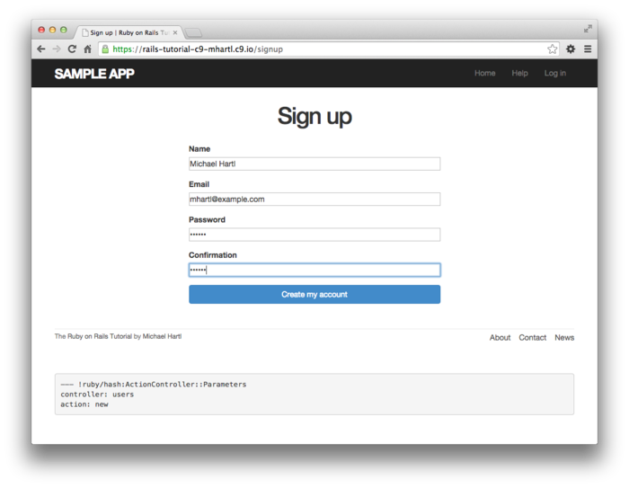

7.4에서도 설명드리겠습니다만, 유저 작성에서 중요한 것은 `input` 마다 있는 특수한 `name` 속성입니다.

```html
<input id="user_name" name="user[name]" - - - />
.
.
.
<input id="user_password" name="user[password]" - - - />
```

Rails는 `name` 을 사용하여 초기화한 해시(`params` 변수 경유)로 구성합니다. 이 해시는 입력된 값을 기반으로하여 유저를 생성할 때 사용됩니다. (상세히는 7.3에서 설명합니다.)


다음으로 중요한 요소는, `form` 태그입니다. Rails에서 `form` 태그를 작성할 때에는 `@user` 오브젝트를 사용합니다. 모든 Ruby 오브젝트는 자신의 클래스 정보를 가지고 있기 때문에 ([4.4.1](Chapter4.md#441-Constructor)) Rails는 `@user` 의 클래스가 User라는 것을 이미 알고 있습니다. 또한 `@user` 는 *새로운* 유저이기 때문에, Rails는 `post` 메소드를 사용하여 폼을 구축해야한다고 판단합니다. 새로운 오브젝트를 작성하기 위해 필요한 HTTP 리퀘스트는 POST이기 때문에, 해당 메소드는 RESTful 아키텍쳐로써 올바른 리퀘스트입니다.([컬럼 3.2](Chapter3.md#컬럼-32-GET이나-그-외-다른-HTTP-메소드에-대해)) 

```HTML
<form action="/users" class="new_user" id="new_user" method="post">
```

이 때, 위 코드에서의 `class`와 `id` 속성은 아키텍쳐로써의 기본적으로 관계없습니다. 여기서 중요한 속성은 `action="/users"` 와 `method="post"` 두 개입니다. 이 두 가지 속성은 /user에게 HTTP의 POST 리퀘스트를 보내는 지시를 내립니다.


`form` 태그 내부에 다음과 같은 HTML이 생성되어있는 것을 눈치채셨나요?

```html
<input name="utf8" type="hidden" value="&#x2713;" />
<input name="authenticity_token" type="hidden"
       value="NNb6+J/j46LcrgYUC60wQ2titMuJQ5lLqyAbnbAUkdo=" />
```

이 코드는 브라우저상에서는 아무것도 하지 않습니다만, Rails의 내부에서 사용되는 특별한 코드입니다. 따라서 어떠한 의도로 생성되었는지는 현 시점에서 알 필요가 없없습니다. ([컬럼 1.1](Chapter1.md#컬럼-11-숙련이라고-하는-것은)) 간단히 정리하자면, Unicode 문자의 "`&#x2713`"(체크 마크) 를 사용하여 브라우저가 제대로된 문자코드를 송신하고 있는지, 혹은 *Cross-Site Request Forgery (CSRF)* 을 호출하는 공격을 막기 위해 신뢰할 수 있는 토큰을 포함하거나 합니다.

##### 연습

1. [*Learn Enough HTML to Be Dangerous*](http://learnenough.com/html-tutorial) 에서 HTML을 모두 수동으로 작성하고 있습니다. 어째서 `form` 태그를 사용하지 않은 것일까요?


## 7.3 유저 등록 실패

폼의 HTML이 어떻게 되어있는지 간단히 설명해보았습니다. 폼을 이해하기 위해선 *유저 등록(생성)을 실패할 때* 가 제일 효과적입니다. 이번 섹션에서는 무효한 데이터송신을 받는 유저 등록폼을 작성하고, 유저 등록 폼을 수정하여 에러 리스트를 표시해보겠습니다. 에러 리스트를 표시하는 디자인은 아래의 목업과 같습니다.

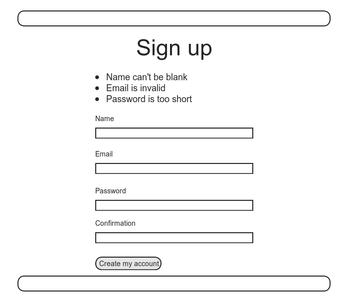

### 7.3.1 올바른 Form

[7.1.2](#712-User-Resource) 에서 `resouces :user` 를 `routes.rb` 파일을 추가하여 자동적으로 Rails 어플리케이션이 특정 RESTful URI로 매칭되도록 한 것을 기억하고 계시나요? 특히 /user로의 POST 리퀘스트는 `create` 액션으로 보내집니다. 이번 설명에서는 `create` 액션에서 Form의 데이터를 수신받고, `User.new` 를 사용하여 새로운 유저 오브젝트를 생성한 후, 유저를 저장 (혹은 저장에 실패) 하고, 다시 리퀘스트 송신용 유저 등록 페이지를 표시하는 방법으로 기능을 구현하고자 합니다. 일단 유저 등록용 폼의 코드를 다시 확인해봅시다.

`<form action="/users" class="new_user" id="new_user" method="post">`

[7.2.2](#722-Form-HTML) 에서 설명드린 것 처럼, 위 HTML은 POST 리퀘스트를 /user 라고하는 URL에 보냅니다.


유저 등록 폼을 동작시키기 위해, 우선 아래의 코드를 추가해봅시다. 이 코드는 [5.1.3](Chapter5.md#513-파셜-Partial) 의 "Partial" 에서 사용한 `render` 메소드를 또 다시 사용하고 있습니다. `render` 는 컨트롤러의 액션 안에서도 정상적으로 동작합니다. 여기서 예전에 설명한 `if-else` 분기구조를 떠올려보세요. if문을 사용하여 저장해 성공했는지의 여부에 따라 `@user.save` 의 값이 `true` 나 `false` ([6.1.3](Chapter6.md#613-User-Object-를-검색해보자)) 이 될 때, 각각 성공시의 처리와 실패시의 처리를 나눌 수 있습니다.

```ruby
# app/controllers/users_controller.rb
class UsersController < ApplicationController

  def show
    @user = User.find(params[:id])
  end

  def new
    @user = User.new
  end

  def create
    @user = User.new(params[:user])    # 아직 구현이 끝나지 않았습니다.
    if @user.save
      # 저장 성공 시의 결과를 여기에 작성합니다.
    else
      render 'new'
    end
  end
end
```

코멘트를 보면 알 수 있듯이, 위 코드는 아직 구현이 완려되지 않았기 때문에 주의해주세요. 그러나 구현의 출발점으로서는 충분합니다. 최종적인 구현은 7.3.2에서 완료합니다.


위 코드의 동작을 이해하기 위한 제일 좋은 방법으로는, 실제로 무효한 유저 등록용 데이터를 송신(*submit*) 해보는 것입니다. 송신해본다면 결과는 아래와 같이 됩니다. 또한 이 때의 정보는 아래 두 번째 캡쳐와 같습니다.

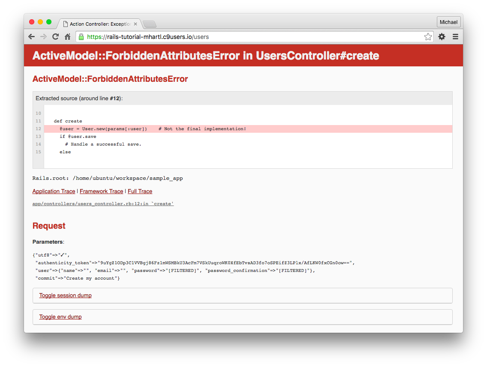


Rails가 리퀘스트를 핸들링하는 방법을 보다 더 깊게 이해하기 위해서는 디버그 정보에서의 파라미터 해시의 `user` 부분을 상세히 확인해볼 필요가 있습니다.

```ruby
"user" => { "name" => "Foo Bar",
            "email" => "foo@invalid",
            "password" => "[FILTERED]",
            "password_confirmation" => "[FILTERED]"
          }
```

이 해시는 User 컨트롤러에 `params` 로써 입력됩니다. [7.1.2](#712-User-Resource) 에 설명드린 것과 같이, `params` 해시에는 각 리퀘스트의 정보가 포함되어 있습니다. 유저 등록 정보의 리퀘스트의 경우, `params` 에 여러개의 해시에 대한 해시(*hash-of-hashes* : 부모와 자식관계의 해시) 가 포함되어 있습니다. (또한 [4.3.3](Chapter4.md#433-Hash와-Symbol) 에서는 hash-of-hashes의 설명과 함께 콘솔세션에서 사용하기 위해 일부러 `params` 라고 하는 이름의 변수를 사용했습니다.) 위 디버그 정보에는 폼의 리퀘스트 송신 결과가, 송신된 값에 대응하는 속성과 함께 `user` 해시에 저장되어 있습니다. 이 해시의 키가 `input` 태그에 있는 `name` 속성의 값입니다.([7.2.2](#722-Form-HTML) 에서 보여드린 HTML 코드를 확인해주세요.) 예를 들어 다음과 같이

`<input id="user_email" name="user[email]" type="email" />`

`"user[email]"` 라고하는 값은 `user` 해시의 `:email` 키의 값과 일치합니다.

해시 키의 형태는, 디버그 정보에서는 문자열의 형태입니다만 Rails에서는 문자열이 아닌, `params[:user]`와 같이 "심볼" 로써 Users 컨트롤러에 입력되고 있음을 주의해주세요. 이 성질에 의해, [4.4.5](Chapter4.md#445-User-Class) 나 위 `create` 액션의 코드에서 처럼, `User.new` 의 파라미터에서 필요한 데이터와 완전히 일치합니다. 즉 지금까지 봐온 다음과 같은 코드는

`@user = User.new(params[:user])`

실제로는 아래와 같은 코드와 같다고 할 수 있습니다.

`@user = User.new(name: "Foo Bar", email: "foo@invalid", password: "foo", password_confirmation: "bar")`

단, 이전 버전에서의 Rails에서는 다음의 코드여도 동작했습니다만,

`@user = User.new(params[:user])`

실제로는, 나쁜 뜻이 있는 유저에 의해 어플리케이션의 데이터베이스를 해킹당할 수도 있기 때문에, 신중하게 대책을 세울 필요가 있습니다. 게다가 그 대책이 다른 에러를 일으킬 위험성도 있기 때문입니다. 그리하여 Rails 4.0 이후에서는 위 코드를 에러를 일으키는 것으로 보안성을 강화하고, *Strong Parameter* 라고 하는 기술을 표준으로 삼았습니다.

### 7.3.2 Strong Parameters

[4.4.5](Chapter4.md#445-User-Class) 에서 아래의 코드를 간단히 설명한 적이 있습니다. 해시를 사용하여 Ruby의 변수와 초기화합니다.

`@user = User.new(params[:user])    # 구현이 아직 끝난 것이 아닙니다.`

위 코드는 최종적인 형태는 아닙니다. 그 이유는 `params` 해시 전체를 초기화하는 행위는 보안상 매우 위험하기 때문입니다. 유저가 보낸 데이터 전체를 `User.new` 에 전달하고 있는 것입니다. 여기서 User모델에 `admin` 속성이라고 하는 것이 있다고 해봅시다. 이 속성은 Web사이트의 관리자인지 아닌지를 나타내는 값입니다. (사실 이 속성을 구현하는 것은 10.4.1 에서 구현합니다.) `admin='1'` 이라고 하는 값을 `params[:user]` 의 일부와 함께 넘긴다면, 이 속성을 `true` 로 하는 것이 가능합니다. 이것은 *curl* 등의 커맨드를 사용하면 간단하게 실현할 수 있습니다. `params` 해시값 전체를 `User.new` 에 넘겨버리면, 어떤 유저라도 `admin='1'` 을 Web 리퀘스트에 같이 포함하는 것으로 Web 사이트의 관리자 권한을 뺏을 수 있게 되어버립니다.


이전 버전의 Rails에서는 모델에서 *attr_accessible* 메소드를 사용하는 것으로 위와 같은 위험을 방지할 수 있었습니다만, Rails 4.0 이후에서는 컨트롤러층에서 *Strong Parameter* 라는 기술을 사용할 것이 권장되고 있습니다. Strong Parameter 를 사용하는 것으로 *필수* 의 파라미터와 *허가받은* 파라미터를 지정할 수 있습니다. 게다가 위와같이 `params` 해시를 전부 한 번에 넘기면 에러가 발생할 수 있습니다. 때문에 Rails에서는 디폴트 옵션으로 위와 같은 구현을 하게 된 것입니다.


이 경우, `params` 해시는 `:user` 속성을 필수로하고, 이름, 메일주소, 비밀번호, 비밀번호의 확인 속성을 각각 허가하고, 그 외의 값은 허가하지 않으려 할때, 다음과 같이 기술합니다.

`params.require(:user).permit(:name, :email, :password, :password_confirmation)`

이 코드의 리턴값은 허가된 속성만을 포함한 `params` 의 해시값입니다. (`:user` 속성이 없는 경우에는 에러가 발생합니다.)


위 파라미터들을 사용하기 쉽게 하기위해, `user_params` 라고 하는 외부 메소드를 사용하는 것이 관습입니다. 이 메소드는 적절히 초기화한 해시값을 리턴하여 `params[:user]` 대신 사용할 수 있게 해줍니다.

`@user = Uesr.new(user_params)`

이 `user_params` 메소드는 Users 컨트롤러 내부에서만 실행되고, Web 경유로 외부 유저로 하여금 실행시킬 필요가 없기 때문에, 아래와 같이 Ruby의 `private` 키워드를 사용하여 *외부에서는 사용할 수 없게* 합니다. (`private` 키워드는 11.1.2에서 자세히 소개합니다.)

```ruby
# app/controllers/users_controller.rb
class UsersController < ApplicationController
  .
  .
  .
  def create
    @user = User.new(user_params)
    if @user.save
      # 保存の成功をここで扱う。
    else
      render 'new'
    end
  end

  private

    def user_params # 추가한 코드
      params.require(:user).permit(:name, :email, :password,
                                   :password_confirmation)
    end
end
```

여담으로, `private` 키워드 이후의 코드를 강조하기 위해, `user_params` 의 들여쓰기를 1단계 더 깊게 들여쓰고 있습니다. (경험적으로는 이것은 현명한 판단이라고 생각합니다. 클래스 내부에 많은 메소드가 있는 경우, `private` 메소드의 위치를 간단히 파악할 수 있기 때문입니다. 들여쓰기가 없는 경우와 비교해보면 어디서부터 `private` 처리가 되는지 고민할 필요가 없어질 것입니다.)


이 시점에서 (송신버튼을 눌러도 에러가 출력되지 않는다는 의미로) 유저 등록 폼은 동작할 수 있게 되었습니다. 단, 아래의 캡쳐와 같이 (개발자용의 디버그 영역을 제외하고) 잘못된 정보를 송신해도 어떠한 피드백이 돌아오지 않습니다. 이것은 유저가 당황하는 원인이 됩니다. 또한 유효한 유저 정보를 송신해도 새로운 유저가 실제로 작성되었는지 알 방법이 없습니다. 전자의 경우를 7.3.3에서, 후자의 경우를 7.4에서 해결해보겠습니다.


##### 연습

1. /signup?admin=1 에 접속하여 `params` 내부에 `admin` 속성이 포함되어 있는지 디버그 정보로부터 확인해봅시다.

### 7.3.3 에러 메세지

유저 등록에 실패한 경우, 제일 마지막 수단으로서, 문제가 발생해서 유저 등록이 안되었다는 것을 유저에게 아릭 쉽게 전달하기 위한 에러메세지를 추가해보도록 합시다. Rails에서는 이러한 메세지를 User모델의 검증 시에 자동적으로 생성해줍니다. 예를 들어, 유저 정보의 메일주소가 무효하고, 패스워드의 길이가 너무 짧은 상태에서 저장하려고 해봅시다.

```ruby
$ rails console
>> user = User.new(name: "Foo Bar", email: "foo@invalid",
?>                 password: "dude", password_confirmation: "dude")
>> user.save
=> false
>> user.errors.full_messages
=> ["Email is invalid", "Password is too short (minimum is 6 characters)"]
```

[6.2.2](Chapter6.md#622-존재성을-검증해보자) 에서 살짝 다루어본 `error.full_messages` 오브젝트는, 에러메세지의 배열을 가지고 있습니다.


위 콘솔세션에서 표시되고 있는 것 처럼, 저장(등록)이 실패하게되면, `@user` 오브젝트에 관련된 에러메세지의 리스트가 생성됩니다. 이 메세지를 브라우저에 표시하기 위해서는 유저의 `new` 페이지에서 에레머세지의 파셜(*partial*) 을 출력해봅시다. 이 때, `form-control` 이라고하는 CSS 클래스도 같이 추가하여 Bootstrap이 제대로 동작하는지 확인해봅시다. 수정 결과는 아래와 같습니다. 여기서 사용하고 있는 에러메세지의 파셜은, 어디까지나 시작품인 것을 알아주세요. 최종버전은 13.3.2 에서 다룹니다.

```erb
<!-- app/views/users/new.html.erb -->

<% provide(:title, 'Sign up') %>
<h1>Sign up</h1>

<div class="row">
  <div class="col-md-6 col-md-offset-3">
    <%= form_for(@user) do |f| %>
      <%= render 'shared/error_messages' %>

      <%= f.label :name %>
      <%= f.text_field :name, class: 'form-control' %>

      <%= f.label :email %>
      <%= f.email_field :email, class: 'form-control' %>

      <%= f.label :password %>
      <%= f.password_field :password, class: 'form-control' %>

      <%= f.label :password_confirmation, "Confirmation" %>
      <%= f.password_field :password_confirmation, class: 'form-control' %>

      <%= f.submit "Create my account", class: "btn btn-primary" %>
    <% end %>
  </div>
</div>
```

여기서는 `'shared/error_messages'` 라고 하는 파셜을 `render` 하고 있는 점을 주목해주세요. Rails 전반의 관습으로서 여러개의 뷰에서 사용하는 파셜은 전용 디렉토리 `shared` 에 놓는 관습이 있습니다. (실제로 이 파셜은 10.1.1 에서도 사용합니다.) 단, 지금은 아직 `app/views/shared` 라고 하는 디렉토리는 만들지 않았기 때문에, 이전에 소개해드린 `mkdir` 커맨드를 사용하여 새로운 디렉토리를 작성할 필요가 있습니다.

` $ mkdir app/views/shared`

또한 언제나처럼 텍스트 에디터를 사용하여 파셜 (`_error_messages.html.erb`) 도 작성합니다. 파셜의 내용은 아래와 같습니다.

```erb
<!-- app/views/shared/_error_messages_html.erb -->
<!-- form 송신시의 에러메세지를 표시하기 위한 파셜 -->

<% if @user.errors.any? %>
  <div id="error_explanation">
    <div class="alert alert-danger">
      The form contains <%= pluralize(@user.errors.count, "error") %>.
    </div>
    <ul>
    <% @user.errors.full_messages.each do |msg| %>
      <li><%= msg %></li>
    <% end %>
    </ul>
  </div>
<% end %>
```

파셜에 의하여 Rails와 Ruby에는 Rails 에러 오브젝트용의 2개의 메소드를 포함하는 많은 결과물들이 도입되었습니다. 첫 번째로는 `count` 메소드를 소개하겠습니다. 이것은 에러의 개수를 리턴합니다.

```ruby
>> user.errors.count
=> 2
```

다른 메소드로는 `any?` 메소드가 있습니다. 이것은 `empty?` 메소드와 서로 보완적인 관계입니다.

```ruby
>> user.errors.empty?
=> false
>> user.errors.any?
=> true
```

[4.2.3](Chapter4.md#423-오브젝트-메세지의-송수신) 에서는 문자열에 대해 `empty?` 메소드를 사용했습니다. Rails의 에러 오브젝트에 대해서도 사용할 수 있습니다. 오브젝트가 비어있을 경우에는 `true`, 그 외에는 `false` 를 리턴합니다. `any?` 메소드는 `empty?` 와는 반대의 동작을 합니다. 내용이 하나도 하나라도 있는 경우에는 `true`, 그렇지 않으면 `false` 를 리턴합니다. (또한 `count, empty?, any?` 메소드는 Ruby의 배열에 대해서도 그대로 사용할 수 있습니다. 13.2에서 응요할 예정입니다.)


게다가 `pluralize` 라고하는 영어전용 텍스트헬퍼가 새롭게 등장하고 있습니다. 이 것은 `helper` 오브젝트를 통하여 Rails 콘솔에서도 사용해 볼 수 있습니다.

```ruby
>> helper.pluralize(1, "error")
=> "1 error"
>> helper.pluralize(5, "error")
=> "5 errors"
```

`pluralize` (복수형으로 나타내다)의 첫 번째 파라미터에 정수가 입력되면, 첫 번째 파라미터에 기반하여 두 번째 파라미터의 영단어를 복수형으로 변경한 것을 리턴해줍니다. 이 메소드의 동작 배경으로는 강력한 *인플렉터* (활용형생성) 이 있으며, 불규칙동사를 포함한 다양한 단어를 복수형으로 만드는 것이 가능합니다.

```ruby
>> helper.pluralize(2, "woman")
=> "2 women"
>> helper.pluralize(3, "erratum")
=> "3 errata"
```

`pluraize` 를 사용하면, 코드는 다음과 같이 됩니다.

```erb
<%= pluralize(@user.errors.count, "error") %>
```

위 코드는, `"0 errors"`, `"1 error"`, `"2 errors"` 와 같이, 에러의 수에 맞게 단어를 리턴합니다. `"1 errors"` 처럼, 영어의 문법에 맞지 않은 문자열을 피하는 것도 가능합니다. (이것은 Web상에서도 자주 볼 수 있는 에러입니다.)


위 파셜 코드에서는 에러 메세지에 스타일을 부여하기 위해 CSS id `error_explanation` 을 포함하고 있는 것을 주목해주세요. ([5.1.2](Chapter5.md#512-Bootstrap과-커스텀-CSS) 의 CSS에서 스타일id에 "#" 기호를 사용한 것을 떠올려주세요.) 더욱이 Rails는, 무효한 내용의 송신에 의하여 원래 페이지에 이동되면 CSS 클래스 `field_with_errors` 를 가진 `div` 태그로 에러 표시장소를 자동적으로 감싸줍니다. 이 라벨을 사용하는 것으로 아래와 같이 에러메세지를  SCSS의 형태로 만들 수 있습니다. 여기서는 Sass의 `@extend` 함수를 사용하여 Bootstrap의 `has-error` 라는 CSS 클래스를 적용해보겠습니다.

```scss
/* app/assets/stylesheets/custom.scss */
.
.
.
/* forms */
.
.
.
#error_explanation {
  color: red;
  ul {
    color: red;
    margin: 0 0 30px 0;
  }
}

.field_with_errors {
  @extend .has-error;
  .form-control {
    color: $state-danger-text;
  }
}
```

Form코드와 파셜코드, SCSS의 위 코드를 조합하는 것으로, 무효한 유저등록정보를 송신했을 때의 에러메세지를 알기 쉽게 만들어보았습니다. 이 메세지는 모델의 검증시의 생성되기 때문에, 메일주소의 스타일이나 패스워드의 최소문자열 등을 변경하면 메세지도 자동적으로 변경됩니다.


이 때, `presence: true` 라고 하는 검증(validation) 과 `has_secure_password` 에 의한 검증 모두 빈 패스워드 (`nil`) 를 체크해버리기 때문에, 유저 등록 폼에서 빈 패스워드를 입력하면 두개의 같은 에레메시지가 표시되어버리고 맙니다. 물론, 이러한 에러 메세지는 직접 수정하는 것도 가능합니다만, 운좋게도 이번 경우에는 나중에 추가할  `allow_nil: true` 라는 옵션으로 이 문제를 해결할 수 있습니다.

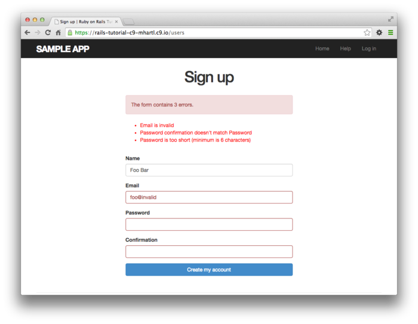

##### 연습

1. 최소문자수를 `5` 로 변경하면, 에러메세지도 자동적으로 갱신되는 것을 확인해봅시다.
2. 송신하지 않은 유저 등록 폼의 URL과, 송신이 끝난 유저 등록폼의  URL을 비교해봅시다. 어째서 URL이 다른 것일까요?


### 7.3.4 등록 실패 시의 테스트

테스트 기능을 갖춘 강력한 Web 프레임워크가 없던 시절에는, 개발자는 입력Form의 테스트를 매번 수동으로 해볼 필요가 있었습니다. 예를 들어, 만약 유저 등록페이지를 수동으로 테스트해야만 한다면, 브라우저에서 해당 페이지를 표시하고, 유효한 데이터와 무효한 데이터를 서로 입력하여 어떤 경우에도 어플리케이션이 정상적으로 동작하는 것을 확인하지 않으면 안되었습니다. 게다가 어플리케이션에 변경사항이 발생할 때마다 똑같은 테스트를 반복해야만 했습니다. 이러한 프로세스는 매우 고통스러운 것이며, 버그를 놓치기도 쉽습니다.

매우 다행스럽게도, Rails에서는 Form용의 테스트 코드를 작성할 수 있으며, 이러한 프로세스를 자동하하는 것이 가능합니다. 이번 섹션에서는 무효한 데이터를 송신했을 때, 올바른 동작을 하는 경우에 대해 테스트 코드를 작성해보겠습니다. 7.4.4에서는 마찬가지 방법으로, 유효한 데이터를 송신했을 때의 올바른 동작을 테스트하는 테스트 코드를 작성해보겠습니다.


우선 신규 유저 등록용의 통합테스트 케이스를 작성하는 것부터 시작하겠습니다. 컨트롤러의 관습인 "리소스의 이름은 복수형" 을 따라, 통합테스트 코드의 파일이름은 `users_signup` 으로 만들어 보겠습니다.

```
$ rails generate integration_test users_signup
      invoke  test_unit
      create    test/integration/users_signup_test.rb
```

(7.4.4 에서 작성하는 테스트코드도, 여기서 생성한 파일을 사용합니다.)


이번 테스트에서는 유저 등록 버튼을 눌렀을 때 (유저 정보가 무효한 데이터이기 때문에), 유저가 *생성되지 않는 것을* 확인합니다. (또한, 에러메세지를 확인하는 테스트코드는 7.3.4의 연습문제에서 확인해보도록 하겠습니다.) 이 테스트 케이스를 확인하기 위해, 유저의 수를 카운트(*count*) 합니다. 이번 테스트 코드에서 동작하는 `count` 메소드는, `User` 를 포함한 모든 Active Record 클래스에서 사용할 수 있습니다.

```ruby
$ rails console
>> User.count
=> 1
```

[6.3.4](Chapter6.md#634-유저의-생성과-인증) 에서 데이터베이스를 리셋하고 있습니다. 현 시점에서 `User.count` 는 `1` 로 되어있을 것입니다. (도중에 시험삼아 유저의 추가나 삭제를 했기 때문에, 결과값이 다를 수도 있습니다만 신경쓸 필요는 없습니다.) [5.3.4](Chapter5.md#534-링크의-테스트) 에서 처럼, `assert_select` 를 사용하여 관련 페이지의 HTML 요소를 테스트해보겠습니다. 이것으로 이후 깜빡하여 HTML 태그를 변경해도 알아차릴 수 있게 될 것입니다.


일단 `get` 메소드를 사용하여 유저 등록 페이지에 접근해봅시다.

`get signup_path`

Form 송신을 테스트하기 위해서는, *user_path* 에 대해 `POST` 리퀘스트를 송신할 필요가 있습니다. 이것은 다음과 같이 `post` 메소드를 사용하여 구현이 가능합니다.

```ruby
assert_no_difference 'User.count' do
  post users_path, params: { user: { name:  "",
                                     email: "user@invalid",
                                     password:              "foo",
                                     password_confirmation: "bar" }
    												}
end
```

`create` 액션의 `User.new`에서 기대하는 데이터를, `params[:user]` 라는 해시에 정리하여 입력하고 있습니다. Rails 4.2 이전에는 `params` 를 암묵적으로 생략하여도 (`user` 해시만 하여도) 테스트는 통과하였습니다만, Rails 5.0부터는 추천하지 않게 되었습니다. `params` 해시를 명시적으로 선언하는 것을 추천합니다.


`assert_no_difference` 메소드의 블록 내부에서 `post` 를 사용하고 메소드의 파라미터에는 `'User.count'`  를 넘기도록 합니다. 이것은 `assert_no_difference` 의 블록을 실행하기 전후로 파라미터의 값 (`User.count`) 가 변하지 않는 것을 테스트하는 것입니다. 즉, 이 테스트는 유저의 수를 기억한 후에 데이터를 등록하여보고, 유저수가 변하지 않는 것을 검증하는 테스트입니다. 따라서 다음 코드와 같은 움직임을 하게 되는 것입니다.

```ruby
before_count = User.count
post users_path, ...
after_count  = User.count
assert_equal before_count, after_count
```

위 코드들은 똑같은 테스트를 합니다만, `assert_no_difference` 를 사용하는 것이 명료하고 Ruby의 관습적인 측면에서 보았을 때도 올바르다고 할 수 있습니다.


또한, 위 코드에서는 `get` 메소드를 사용하지 않는 것을 확인해주세요. 이 것은 각 메소드에 기술적은 관련성이 없으며, 유저 등록 페이지에 접근하지 않아도 직접 `post` 메소드를 호출하여 유저 등록을 할 수 있다는 것을 의미합니다. 개인적으로는 컨셉을 명확히 한다는 의미와, 유저 등록 페이지를 더블체크한다는 의미도 겸하여 (실제 순서에 따라서) `get` 과 `post` 를 서로 호출하는 방법이 좋다고 생각합니다.


위 아이디어를 코드로 옮긴다면, 아래와 같이 됩니다. 또한 데이터 송신시에 실패했을 때, `new` 액션이 실행될 것이기 때문에 `assert_template` 를 사용한 테스트도 포함하고 있는 것을 확인해주세요. 에러 메세지가 올바르게 표시되는지 안되는지는 연습문제에서 확인해보겠습니다.

```ruby
# test/integration/users_signup_test.rb

require 'test_helper'

class UsersSignupTest < ActionDispatch::IntegrationTest

  test "invalid signup information" do
    get signup_path
    assert_no_difference 'User.count' do
      post users_path, params: { user: { name:  "",
                                         email: "user@invalid",
                                         password:              "foo",
                                         password_confirmation: "bar" } }
    end
    assert_template 'users/new'
  end
end
```

어플리케이션 코드는 이미 실행이 끝나있습니다. 이번 통합테스트를 포함하여 모든 테스트 케이스가 GREEN이 될 것입니다.

```
$ rails test
```

##### 연습

1. 화면에서의 에러메세지에 대한 테스트 코드를 작성해보세요. 어느정도 만큼 상세히 테스트할 것인지는 전적으로 맡기겠습니다. 아래 첫 번째 코드를 템플릿으로써 준비했으니 참고해주세요.
2. 유저 등록 Form의 URL은 /signup 입니다만, 무효한 유저 등록용 데이터를 송신했을 때의 URL 이 /users 로 변하고 있습니다. 이것은 이전 5장에서 추가한 Named Route(/signup) 과 RESTful 한 라우팅의 디폴트설정과의 차이에 의해 발생한 결과입니다. 아래 두 번째, 세 번째 코드의 내용을 참고하여 이 문제를 해결해보세요. 제대로 된다면 양쪽의 URL이 모두 /signup 이 될 것입니다. 이상하게도 테스트는 GREEN의 결과로 될 것 같은데..왜그런지 생각해보세요.
3. 아래 첫 번째 코드에서의 `post`  부분을 변경하여 2번에서 생성한 새로운 URL(/signup) 에 맞춰보도록 합시다. 테스트가 아직 통과하고 있다는 것을 확인해주세요.
4. 아래 세 번째 코드에서의 Form을 이전 상태로 되돌려보고, 테스트가 역시나 통과하고 있다는 점을 확인해보세요. 이것은 문제가 있습니다. 왜냐하면 현재 post가 송신되는 URL은 올바른 값이 아니기 때문입니다. `assert_select` 를 사용한 테스트를 아래 첫 번째 코드에 추가하고, 해당 버그를 찾아내게끔 해보세요. (테스트를 추가하여 실패한다면 성공입니다.) 이 후, 변경후의 Form(아래 세 번째 코드) 로 수정하여 테스트가 통과하는 것을 확인해보세요. *Hint*: Form에서부터 송신되어 테스트하는 것이 아닌, `form[action="/signup"]` 이라고 하는 부분이 존재하는지에 대하여 테스트해봅시다.

```ruby
# test/integration/users_signup_test.rb
require 'test_helper'

class UsersSignupTest < ActionDispatch::IntegrationTest

  test "invalid signup information" do
    get signup_path
    assert_no_difference 'User.count' do
      post users_path, params: { user: { name:  "",
                                         email: "user@invalid",
                                         password:              "foo",
                                         password_confirmation: "bar" } }
    end
    assert_template 'users/new'
    assert_select 'div#<CSS id for error explanation>'
    assert_select 'div.<CSS class for field with error>'
  end
  .
  .
  .
end
```

```ruby
# config/routes.rb

Rails.application.routes.draw do
  root 'static_pages#home'
  get  '/help',    to: 'static_pages#help'
  get  '/about',   to: 'static_pages#about'
  get  '/contact', to: 'static_pages#contact'
  get  '/signup',  to: 'users#new'
  post '/signup',  to: 'users#create' #추가하는 코드
  resources :users
end
```

```erb
<!-- app/views/users/new.html.erb -->

<% provide(:title, 'Sign up') %>
<h1>Sign up</h1>

<div class="row">
  <div class="col-md-6 col-md-offset-3">
    <%= form_for(@user, url: signup_path) do |f| %> <!-- 수정한 코드 -->
      <%= render 'shared/error_messages' %>

      <%= f.label :name %>
      <%= f.text_field :name, class: 'form-control' %>

      <%= f.label :email %>
      <%= f.email_field :email, class: 'form-control' %>

      <%= f.label :password %>
      <%= f.password_field :password, class: 'form-control' %>

      <%= f.label :password_confirmation, "Confirmation" %>
      <%= f.password_field :password_confirmation, class: 'form-control' %>

      <%= f.submit "Create my account", class: "btn btn-primary" %>
    <% end %>
  </div>
</div>
```


## 7.4 유저 등록 성공

무효한 데이터의 송신을 핸들링할 수 있게 되었습니다. 드디어 신규 유저를 실제로 데이터베이스에 저장할 수 있도록, (물론 데이터가 유효한 경우에만 입니다.) 유저 등록 Form을 완성해봅시다. 우선, 유저를 저장할 수 있게 합니다. 저장에 성공하면, 유저정보는 자동적으로 데이터베이스에 등록됩니다. 다음으로는 브라우저의 표지를 *리다이렉트* 하여 등록된 유저의 프로필을 표시합니다. 겸사겸사 웰컴페이지도 표시해봅시다. 목업은 아래와 같습니다. 저장에 실패한 경우에는 [7.3](#73-유저-등록-실패) 에서 개발한 동작이 실행될 것입니다.

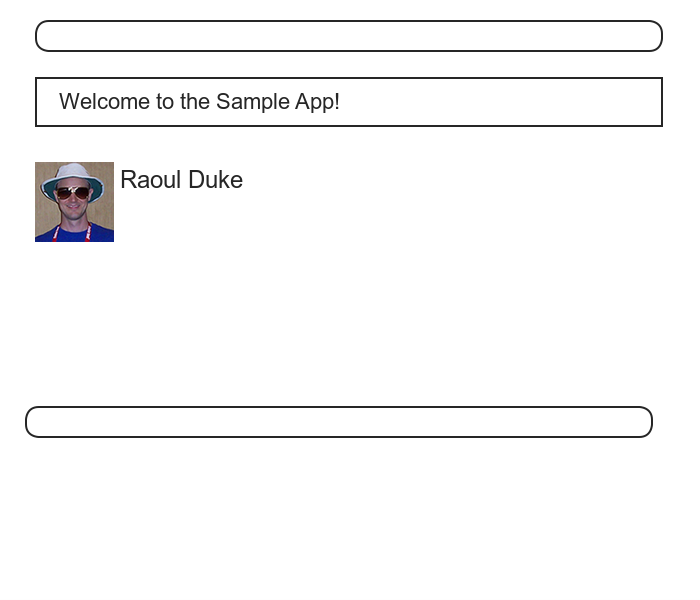

### 7.4.1 등록 Form의 완성

유저 등록 Form을 완성하기 위해 `user_contorller.rb` 에서 `create` 액션의 `if`  문 내부를 구현해보도록 합시다. 지금 시점에서는 환경에 따라 세세한 차이는 있을 수 있지만, 기본적으로는 유효한 정보를 송신했을때 에러를 발생시키고 있습니다. 이것은  Rails에서의 디폴트 액션에 대응하는 뷰를 표시하려고 하고있지만, `create` 액션에 대응하는 뷰의 템플릿이 없기 때문입니다.

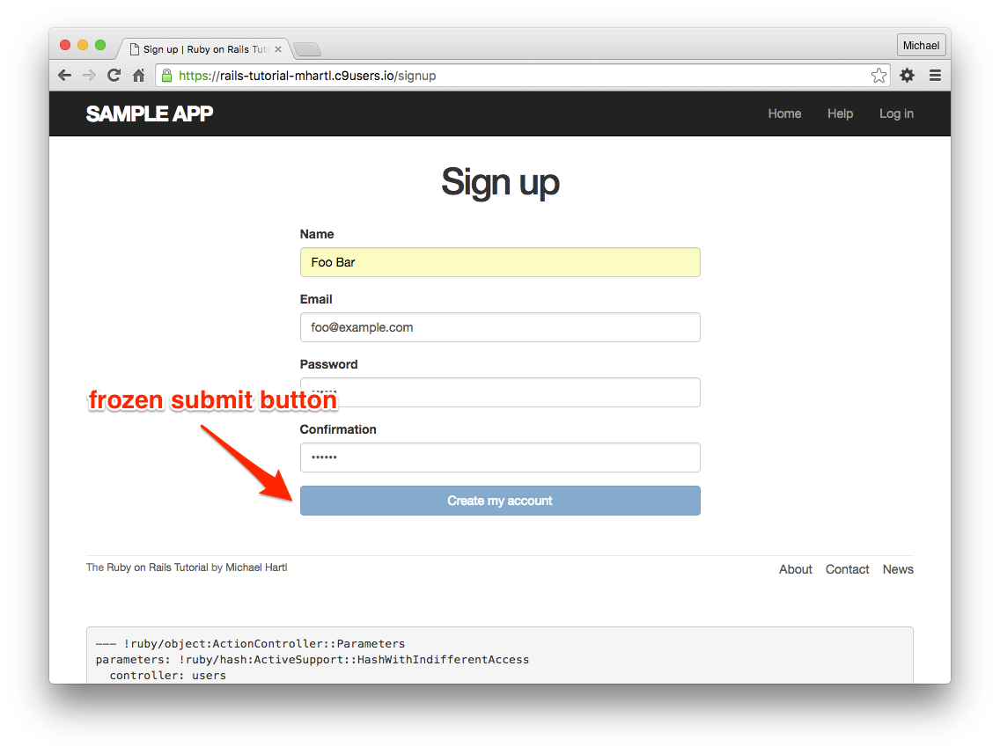

(버튼이 동작하질 않습니다.)


(create 액션의 뷰템플릿이 존재하지 않는 것을 알 수 있습니다.)


물론, `create` 액션에 대응하는 템플릿을 작성할 수도 있습니다만,  Rails의 일반적인 관습에 따라, 유저 등록에 성공했을 경우는 페이지를 표시하지않고, 다른 페이지로 *리다이렉트 (Redirect)* 하게끔 설정해줍니다. 구체적으로는 새롭게 생성된 유저의 프로필 페이지로 리다이렉트하고자합니다. (경우에 따라서는 루트URL로 리다이렉트하는 것도 하나의 선택지라고 할 수 있습니다.) 실제 어플리케이션 코드는 아래와 같습니다. (`redirect_to` 메소드에 주목해주세요.)

```ruby
# app/controllers/users_controller.rb
class UsersController < ApplicationController
  .
  .
  .
  def create
    @user = User.new(user_params)
    if @user.save
      redirect_to @user #추가된 코드
    else
      render 'new'
    end
  end

  private

    def user_params
      params.require(:user).permit(:name, :email, :password,
                                   :password_confirmation)
    end
end


```

여기서

`redirect_to @user`

라는 코드가 있습니다만, 이 코드는 다음 코드와 같은 동작을 합니다.

`redirect_to user_url(@user)`

위 코드는 `redirect_to @user` 라는 코드 (Rails 엔지니어가)로 부터 `user_url(@user)` 라고 하는 코드를 실행하고 싶다는 것을 Rails가 제멋대로 해석한 결과인 것입니다.

##### 연습

1. 유한 정보를 송신하여, 유저가 실제로 작성되는 것을  Rails 콘솔을 사용하여 확인해봅시다.
2. 위 코드를 수정하여, `redirect_to user_url(@user)` 와 `redirect_to @user` 가 같은 결과를 나타내는 것을 확인해봅시다.

### 7.4.2 flash

위 코드에 의해 유저 등록 Form이 실제로 동작하게 되었습니다. 이것으로 브라우저에서부터 올바른 유저 정보를 등록할 수 있게 되었습니다만, 그 전에 Web 어플리케이션에서 상식적으로 구현해놓고 있는 기능을 추가해봅시다. 유저 생성 완료 후에 표시되는 페이지에 메세지를 표시 (이 경우는 신규 유저로의 웰컴 페이지)하고, 2번째 이후에는 해당 페이지에 메세지를 표시하지 않도록 해봅시다.


Rails에서 이러한 정보를 표시하기 위해서는, *flash* 라고하는 특수한 변수를 사용합니다. 이 변수는, 해시처럼 다룹니다. Rails의 일반적인 관습에 따라, `:success` 라고 하는 키에는 성공시의 메세지를 대입해봅시다.

```ruby
# app/controllers/users_controller.rb
class UsersController < ApplicationController
  .
  .
  .
  def create
    @user = User.new(user_params)
    if @user.save
      flash[:success] = "Welcome to the Sample App!"
      redirect_to @user
    else
      render 'new'
    end
  end

  private

    def user_params
      params.require(:user).permit(:name, :email, :password,
                                   :password_confirmation)
    end
end
```

`flash` 변수에 대입한 메세지는, 리다이렉트한 직후의 페이지에 표시할 수 있게 됩니다. 이번에는 `flash` 내부에 존재하는 키의 여부를 알아보고, 만약 키가 존재한다면 해당 값(메세지)를 전부 표시하도록 레이아웃을 수정해봅시다. [4.3.3](Chapter4.md#433-Hash와-Symbol) 때, 콘솔에서 실행한 예를 떠올려주세요. 그 때는 일부러 `flash` 라 이름붙인 변수를 사용하여, 해시값을 표시해보았습니다.

```ruby
# 콘솔에서 flash 해시를 반복하여 출력해봅시다.
$ rails console
>> flash = { success: "It worked!", danger: "It failed." }
=> {:success=>"It worked!", danger: "It failed."}
>> flash.each do |key, value|
?>   puts "#{key}"
?>   puts "#{value}"
>> end
success
It worked!
danger
It failed.
```

위에서 표시한 패턴에 따라,  flash변수의 내용을  Web사이트 전체에 걸쳐 표시할 수 있게하기 위한 코드는 다음과 같습니다.

```erb
<% flash.each do |message_type, message| %>
  <div class="alert alert-<%= message_type %>"><%= message %></div>
<% end %>
```

또한, 이 코드에서는,  HTML과 ERB코드가 서로 섞여있습니다만, 이것을 깔끔하게 하는 작업은 연습문제에서 해보도록 하겠습니다. 다음으로 ERB 코드에서는

```erb
alert-<%= message_type %>	
```

적용하는 CSS 클래스를 메세지의 종류에 따라 변경되도록 하고 있습니다. 이것으로 인하여 예를 들어 `:success` 키의 메세지가 표시될 겨우에 적용되는 CSS클래스는 다음과 같이 됩니다.

`alert-success`

이 때, `:success` 키는 심볼입니다만, 템플렛 내부에서 반영할 때에는  ERB코드가 자동적으로  `"success"` 라고하는 문자열로 변환하는 점을 주의해주세요. 이 성질을 이용하여 키의 내용에 따라 다른 CSS 클래스를 적용할 수 있으며, 메세지의 종류에 따라 스타일을 동적으로 변경할 수 있습니다. 예를들어 8.1.4에서는 `flash[:danger]` 를 사용하여 로그인에 실패했을 때 나타내는 메세지를 표시합니다. (실제로, 이미 `alert-danger` 라고 하는 CSS클래스를 사용하여, 에러 메세지의 스타일을 div태그로 지정하고 있습니다.) Bootstrap CSS는 이러한 flash의 클래스용의 4개의 스타일을 가지고 있습니다. (`success, info, warning, danger`) 또한 본 튜토리얼의 sample 어플리케이션에서는 이 flash 클래스를 경우에 따라 사용해나갈 것입니다. (11.2에서는 `info`, 8.1.4에서는 `danger` 를 사용합니다.)


템플릿 내부의 flash메세지가 표시되기 때문에, 다음 코드는

`flash[:success] = "Welcome to the Sample App!"`

최종적으로는 아래와 같은 HTML로 변환됩니다.

`<div class="alert alert-success">Welcome to the Sample App!</div>`

앞서 말씀드린 ERB를 레이아웃에 반영한 결과는 아래와 같습니다.

```erb
<!-- app/views/layouts/application.html.erb -->
<!DOCTYPE html>
<html>
  .
  .
  .
  <body>
    <%= render 'layouts/header' %>
    <div class="container">
 <!-- flash code -->
      <% flash.each do |message_type, message| %>
        <div class="alert alert-<%= message_type %>"><%= message %></div>
      <% end %>
 <!-- flash code -->
      <%= yield %>
      <%= render 'layouts/footer' %>
      <%= debug(params) if Rails.env.development? %>
    </div>
    .
    .
    .
  </body>
</html>
```

##### 연습

1. 콘솔에서, 문자열 내부의 식전개 ([4.2.2](Chapter4.md#422-문자열)) 로 심볼을 호출해봅시다. 예를들어  `"#{:success}"`라 하는 코드를 실행하면 어떠한 결과가 리턴됩니까?
2. 1번의 결과를 참고하여 콘솔상에서의 flash는 어떠한 결과가 되는지 생각해봅시다.

### 7.4.3 실제 유저 등록

여기까지의 코드의 수정이 제대로 되었는지를 확인하기 위해, 실제로 sample 어플리케이션에서 유저 등록을 해봅시다. 단, 지금까지 몇번인가 Form을 이용하여 실험을 했기 때문에 Users 컨트롤러의 `user.save` 의 코드 한 줄이 실행되어, 유저의 수가 본 튜토리얼의 독자마다 조금씩 다를 가능성이 있습니다. 그렇기 때문에 유저 등록을 시험해보기 전에 다음 커맨드를 실행하여 데이터베이스의 내용을 리셋해봅시다.

`$ rails db:migrate:reset`

환경에 따라서는, 여기서 Web서버를 재부팅할 필요가 있습니다. 필요에 따라서 Ctrl+C등을 사용하여 재부팅해주세요.([컬럼 1.1](Chapter1.md#컬럼-11-숙련이라고-하는-것은))


준비 되었으면, 제일 첫 유저를 등록해봅시다. 이번에는 이름을 "Rails Tutorial", 메일주소를 "example@railstutorial.org" 로 하여 등록해봅시다. Form으로부터 등록하면 유저등록의 성공을 나타내는 웰컴페이지가, `success` 클래스가 있는 녹색의 배경으로 표시될 것입니다. 이 클래스는 [5.1.2](Chapter5.md#512-Bootstrap-과-커스텀-CSS) 에서 추가한 Bootstrap CSS 프레임워크에 의해 준비된 것입니다. 그리고 유저 표시 페이지를 새로고침한다면, 이번에는 flash 메세지는 표시되지 않게 될 것입니다.

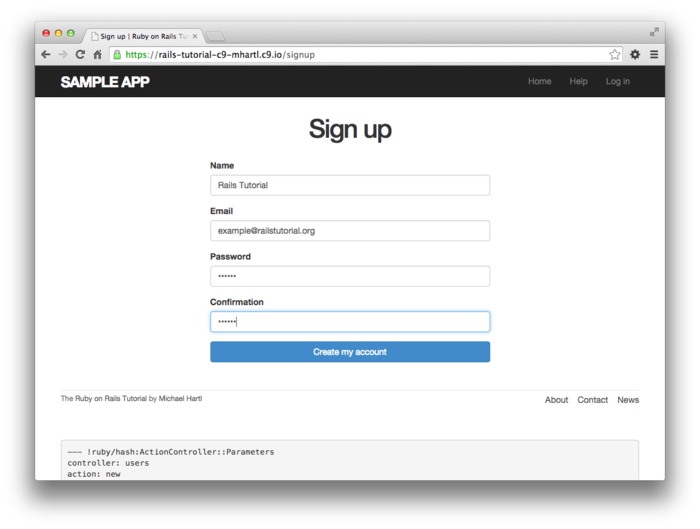

(첫 화면)

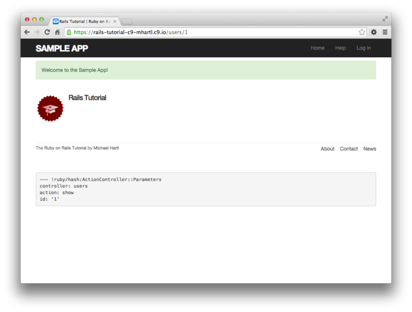

(유저 등록에 성공하여 flash 메세지가 표시된다.)

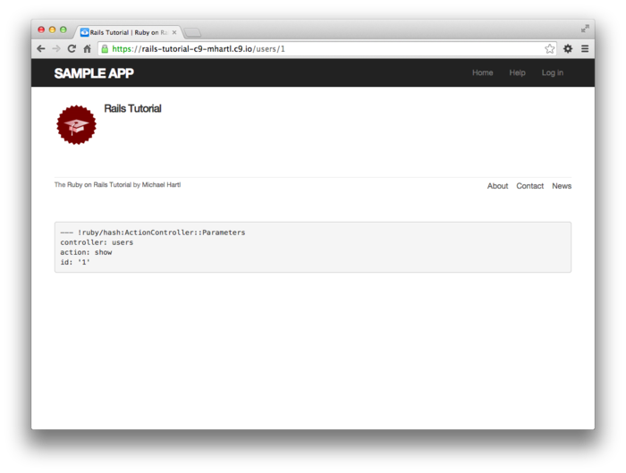

(페이지를 새로고침하면 flash메세지가 사라진다.)

##### 연습

1. Rails 콘솔을 사용하여 새로운 유저가 정말로 생성되었는지 한 번 더 체크해봅시다. 결과는 아래와 같이 될 것입니다.
2. 자신의 메일 주소를 등록해봅시다. 이미 Gravatar에 등록해있는 경우, 적절한 영상이 표시되는지 확인해봅시다.

```ruby
$ rails console
>> User.find_by(email: "example@railstutorial.org")
=> #<User id: 1, name: "Rails Tutorial", email: "example@railstutorial.org", created_at: "2016-05-31 17:17:33", updated_at: "2016-05-31 17:17:33",password_digest: "$2a$10$8MaeHdnOhZvMk3GmFdmpPOeG6a7u7...">
```

### 7.4.4 유저 등록 성공 시의 테스트

다음 단계로 진행하기 전에, 여기서 일단 유효한 데이터를 송신할 때의 테스트 코드를 작성해봅시다. 이것으로 어플리케이션의 동작을 검증하고 만일 추후 버그가 생긴다면 그것을 파악할 수 있을 것입니다. [7.3.4](#734-실패-시의-테스트) 에서 작성한 무효한 데이터 송신에 대한 테스트와 마찬가지로, 이번의 목적은 데이터베이스의 내용이 올바른지 검증하는 것입니다. 즉, 유효한 정보를 송신하여 유저가 *작성되었다*라는 것을 확인하는 것입니다. 이전 테스트 코드는 다음과 같이 작성했습니다만,

```ruby
assert_no_difference 'User.count' do
  post users_path, ...
end
```

이번에는 `assert_difference` 라는 메소드를 사용하여 테스트 코드를 작성합니다.

```ruby
assert_difference 'User.count', 1 do
  post users_path, ...
end
```

`assert_no_difference` 와 마찬가지로, 이 메소드는 첫 번째 파라미터로 문자열 (`'User.count'`) 를 받고, `assert_difference` 블록 내의 처리를 실행하는 직전과, 실행한 직후의 `User.count` 의 값을 비교합니다. 두 번째 파라미터는 옵션입니다만, 여기서는 비교한 결과의 차이(이번 경우에는 1) 를 넘깁니다.


이전 위에서 작성한 테스트 코드 파일에 `assert_difference` 를 사용한 테스트 코드를 추가하면, 아래와 같이 됩니다. 여기서 `user_path` 에 POST 리퀘스트를 송신한 다음, `follow_redirect!` 라는 메소드를 사용하고 있는 것을 확인해주세요. 이 메소드는, POST 리퀘스트를 송신한 결과를 확인한 후, 지정된 리다이렉트 URL로 이동하는 메소드입니다. 따라서 이 코드의 직후에는 `'users/show'` 템플릿이 표시될 것입니다. 덧붙여서 여기서 flash 테스트도 추가해봅시다. 이 것은 연습문제로 남겨두겠습니다.

```ruby
# test/integration/users_signup_test.rb
# 유효한 유저 등록을 테스트하는 코드
require 'test_helper'

class UsersSignupTest < ActionDispatch::IntegrationTest
  .
  .
  .
  test "valid signup information" do
    get signup_path
    assert_difference 'User.count', 1 do
      post users_path, params: { user: { name:  "Example User",
                                         email: "user@example.com",
                                         password:              "password",
                                         password_confirmation: "password" } }
    end
    follow_redirect!
    assert_template 'users/show'
  end
end
```

위 코드에서는 유저 등록에 성공한 후, 어떤 템플릿이 표시되는지 검증하고 있는 것을 확인해주세요. 이 테스트를 성공시키기 위해선 User의 라우팅과 User의 `show` 액션, 그리고  `show.html.erb` 뷰가 각각 정상적으로 동작하고 있어야할 필요가 있습니다. 마지막으로,

```ruby
assert_template 'users/show'
```

위 코드에서는 유저 프로필에 관한 거의 모든 (예를 들어 페이지에 접속하면 어떠한 이유로 에러가 발생하지 않는다던가 등)을 테스트할 수 있는 것을 주목해주세요. 이런 종류의 end-to-end 테스트는, 어플리케이션의 중요한 기능을 커버해줍니다. 이러한 이유가 통합테스트가 편리하다고 불리는 이유인 것입니다.

##### 연습

1. [7.4.2](#742-flash) 에서 구현한 flash 에 대한 테스트 코드를 작성해보세요. 얼마나 세세히 작성할 지의 여부는 맡기겠습니다. 아래 첫 번째 코드에 최소한의 템플릿을 준비했으니 참고해주세요. (`FILL_IN` 의 부분을 채워주세요) 텍스트에 대한 테스트는 잘 통과하지 않을 수 있습니다. 짧은 flash키라고 해도 마찬가지입니다. 필자의 경우, flash가 비어있는지 아닌지의 여부만 체크하는 경우가 많습니다.
2. 본문중에서도 지적했습니다만, flash용의 HTML은 읽기 어렵습니다. 읽기 쉽게 아래 두 번재 코드로 수정해봅시다. 수정이 끝나면 테스트 코드를 실행하여 정상적으로 동작하는지를 확인해주세요. 이 코드에서는 Rails의 `content_tag` 라는 헬퍼를 사용하였습니다.
3. `users_controller.rb` 에서, 유저 데이터가 저장에 성공했을 시의 `redirect_to` 문을 코멘트아웃했을 때, 테스트가 실패한 것을 확인해주세요.
4. `users_controller.rb` 에서 `@user.save` 부분을 `false` 로 바꾸어 보세요. (버그가 발생하였다고 가정해봅시다.) 이 때, `assert_difference` 의 테스트에서는 어떻게 이 버그를 확인할 수 있습니까? 테스트 코드를 확인하고 생각해보세요.

```ruby
require 'test_helper'
  .
  .
  .
  test "valid signup information" do
    get signup_path
    assert_difference 'User.count', 1 do
      post users_path, params: { user: { name:  "Example User",
                                         email: "user@example.com",
                                         password:              "password",
                                         password_confirmation: "password" } }
    end
    follow_redirect!
    assert_template 'users/show'
    assert_not flash.FILL_IN #테스트 케이스
  end
end
```

```erb
<!-- app/views/layouts/application.html.erb -->
<!-- content_tag 를 사용하여 레이아웃 안에 flash를 작성합니다. -->
<!DOCTYPE html>
<html>
      .
      .
      .
      <% flash.each do |message_type, message| %>
        <%= content_tag(:div, message, class: "alert alert-#{message_type}") %>
      <% end %>
      .
      .
      .
</html>
```


## 7.5 프로의 배포

유저 등록 페이지가 제대로 동작되었기 때문에, 이 어플리케이션을 배포하여 실제 배포환경에서도 제대로 동작하는지 확인해봅시다. [제 3장](Chapter3.md) 에서 배포를 하고 있습니다만, 실제로 데이터를 *조작* 할 수 있는 배포는 처음입니다. 그렇기 때문에 이번 기회에 프로 레벨의 배포방법에 대해 설명하겠습니다. 구체적으로는 유저 등록을 안전하게 하기 위해 실제 배포 환경용의 어플리케이션에 중요한 기능을 추가해보겠습니다. 그 다음, 기본 Web 서버를 실제 세계에서 사용하는 Web 서버로 바꾸어보겠습니다.


배포 준비를 하기 위해, 우선 이 시점까지의 수정사항을 `master` 브랜치에 머지해주세요.

```
$ git add -A
$ git commit -m "Finish user signup"
$ git checkout master
$ git merge sign-up
```

### 7.5.1 실제 배포 환경에서의 SSL

이번 챕터에서 개발한 유저 등록 Form에 데이터를 송신하면, 이름과 메일주소, 패스워드와 같은 데이터가 네트워크를 통해 서버로 전송됩니다. 사실은 이러한 네트워크에 실리는 데이터는 도중에 변할 수 있기 때문에, 매우 조심스럽게 다루어야합니다. 이것은  sample 어플리케이션의 본질적인 보안상의 결함입니다. 그리고 이러한 결함을 수정하기 위해 [Secure Sockets Layer (SSL)](https://ja.wikipedia.org/wiki/Transport_Layer_Security) 를 사용합니다. 이것은 로컬 서버로부터 네트워크에 데이터를 보내기 전에, 정보를 암호화하는 기술입니다. 이번에는 유저 등록 페이지만을 위해 SSL를 도입합니다만, 이것은 Web사이트 전체에 적용할 것입니다. 제 8장에서 구현하는 로그인 기능을 좀 더 안전하게 만들거나, 9.1에서 설명할 세션 하이잭킹(Session Hijacking) 의 위험성에 대해서도 많은 이점을 가지고 있습니다.


SSL을 유효하게 하는 것은 간단합니다. `production.rb` 라고 하는 실제 배포환경용 설정파일에 코드 한 줄 수정하는 것만으로도 끝납니다. 구체적으로는 `config` 에 "실제 배포 환경에서 SSL을 사용한다." 라는 설정을 하는 것 뿐입니다.


Heroku에서는 기본 설정에서도 SSL를 사용할 수 있습니다만, SSL의 사용을 브라우저에서 강제하는 것은 아닙니다. 그렇기 때문에 유저가 https가 아닌 http로 접속해버리면, Web사이트와 유저간의 커뮤니케이션이 안전하게 이루어지지 않게됩니다. (신경쓰이시는 분은 브라우저의 주소창의 URL을 https에서 http로 변경해봅시다.) Rails는 매우 감사하게도, 실제 배포환경용의 설정파일인 `production.rb` 의 코드를 겨우 한 줄만 변경하는 것만으로 SSL을 강제하여 https에 의한 안전한 통신을 할 수 있게 해줍니다. 구체적으로는 아래 코드처럼 `config.force_ssl` 을 `true` 을 설정하는 것으로 설정이 끝납니다.

```ruby
# config/environments/production.rb
Rails.application.configure do
  .
  .
  .
  # Force all access to the app over SSL, use Strict-Transport-Security,
  # and use secure cookies.
  config.force_ssl = true
  .
  .
  .
end
```

다음으로, 원격 서버의 SSL을 준비해봅시다. 실제 배포환경용의 Web사이트에서 SSL을 사용할 수 있게 하기 위해서는, 도메인별로 *SSL 증명서* 를 구입하여 설정할 필요가 있습니다. 이것은 매우 많은 작업이 필요합니다만 매우 운이 좋게도 그러한 번거로운 작업을 하지 않아도 됩니다. Heroku상에서 sample 어플리케이션을 동작하여 Heroku의 SSL 증명서를 사용하는 방법이 있기 때문입니다. (독자적인 도메인을 사용하는 경우에는 SSL증명서를 구입할 필요가 있습니다.) [7.5.2](#752-실제-배포환경용의-Web서버) 에서 어플리케이션의 배포가 끝나면, 자동적으로 SSL이 유효화될 것입니다. 만일, www.example.com등의 독자 도메인으로 SSL을 사용하고 싶은 경우에는, [Heroku의 SSL에 관한 도큐멘트](http://devcenter.heroku.com/articles/ssl)를 참고해주세요.

### 7.5.2 실제 배포환경용의 Web서버

SSL를 도입하였습니다. 다음은 어플리케이션의 설정을 변경하여 실제 배포환경에 맞는 Web 서버를 사용해봅시다. Heroku의 기본 설정은, Ruby만으로 구현된 WEBrick 이라는 Web서버를 사용하고 있습니다. WEBrick은 간단하게 설치할 수 있으며 동작시킬 수 있는 것이 특징입니다만, 많은 트래픽을 핸들링하기에는 무리가 있습니다. 즉 WEBrick은 [실제 배포환경에 적합한 Web서버가 아닙니다.](https://devcenter.heroku.com/articles/ruby-default-web-server) 따라서 이번에는 [WEBrick을 Puma라는 Web서버로 바꾸어봅시다.](https://devcenter.heroku.com/articles/deploying-rails-applications-with-the-puma-web-server) Puma는 다수의 리퀘스트를 핸들링하는데에 적합한 Web서버입니다.


새로운 Web서버를 추가하기 위해, [Heroku의 Puma문서](https://devcenter.heroku.com/articles/deploying-rails-applications-with-the-puma-web-server)에 따라 설치해봅시다.


제일 첫 단계로는, *puma gem* 을 `Gemfile` 에 추가하는 것입니다만, Rails 5에서 Puma는 기본설정으로 사용할 수 있게 되어있습니다. 따라서 제일 첫 단계는 스킵해도 무방합니다. (즉, Rails 4.2 이전에는 `config/puma.rb` 파일을 작성하고, 아래와 같은 설정을 하였습니다.) 다음 단계로는 [Heroku의 Puma문서](https://devcenter.heroku.com/articles/deploying-rails-applications-with-the-puma-web-server) 에 따라 설정을 변경해봅시다. 설정을 변경한다고는 해도 이번에는 문서의 코드를 그 대로 인용한 것뿐이기 때문에 내용은 이해하지 않아도 괜찮습니다. ([컬럼 1.1](Chapter1.md#컬럼-11-숙련이라고-하는-것은))

```ruby
# config/puma.rb

workers Integer(ENV['WEB_CONCURRENCY'] || 2)
threads_count = Integer(ENV['RAILS_MAX_THREADS'] || 5)
threads threads_count, threads_count

preload_app!

rackup      DefaultRackup
port        ENV['PORT']     || 3000
environment ENV['RACK_ENV'] || 'development'

on_worker_boot do
  # Worker specific setup for Rails 4.1+
  # See: https://devcenter.heroku.com/articles/
  # deploying-rails-applications-with-the-puma-web-server#on-worker-boot
  ActiveRecord::Base.establish_connection
end
```

 마지막으로, `Procfile` 이라고 불리는, Heroku에서의 Puma의 프로세스를 동작시키는 설정파일을 작성합니다. 또한 이 `Procfile` 은 루트 디렉토리 (`Gemfile` 과 같은 디렉토리)에 놓을 필요가 있으니, 파일의 저장장소를 확인해주세요.

```
# ./Procfile

web: bundle exec puma -C config/puma.rb
```

### 7.5.3 실제 배포환경으로의 배포

이상으로 실제 배포환경용의 Web서버의 설정을 끝냈습니다. 위 수정내용을 커밋하고, 배포해봅시다.

```
$ rails test
$ git add -A
$ git commit -m "Use SSL and the Puma webserver in production"
$ git push
$ git push heroku
$ heroku run rails db:migrate
```

유저 등록 Form이 무사히 동작하면 성공입니다. 성공하면 아래 캡쳐처럼 될 것입니다. 이 때, URL이 https:// 로 변경되어 있고, 주소창에 자물쇠 아이콘이 표시되는 것을 확인해주세요. 이것은 방금 전 설정한 SSL이 제대로 동작하고 있는 것을 나타냅니다.


#### Ruby의 버전 번호

여기서 잠깐, Heroku에 배포할 때, 다음과 같은 경고메세지를 보았을 지도 모르겠습니다.

```
###### WARNING:
       You have not declared a Ruby version in your Gemfile.
       To set your Ruby version add this line to your Gemfile:
       ruby '2.1.5'
```

(이것은 "Ruby의 버전을 명시적으로 지정해주세요" 라는 메시지 입니다만,) 경험적으로 본 튜토리얼과 같은 연습레벨에서는 명시적으로 지정하지 않는 편이 오히려 별 문제없이 진행되는 경우가 많기 때문에, 이 경고는 지금 시점에서는 무시해도 상관없을 것입니다. 애당초 sample 어플리케이션에서 Ruby의 버전을 항상 최신으로 유지한다면, 큰 문제없이 진행할 수 있을 것입니다. 또한 본 튜토리얼의 sample 어플리케이션에 있어서, 로컬에서 사용하는 버전과 실제 배포환경에서의 버전이 다르다고 하여도 차이가 생기는 일은 거의 없을 것입니다. 이렇게 말은 해도, 다음 내용은 머리 한 구석에 넣어두시는 것도 좋을 것 같습니다. 업무 상 Heroku를 사용한 어플리케이션을 동작시키는 경우에는, `Gemfile` 에서 Ruby의 버전을 명시적으로 지정하는 것이 현명할 것입니다. 이것은 개발환경과 실제 배포환경의 상호관계성을 최대한 높이는 것이 가능하기 때문입니다. (버전 차이에 의한 오작동이나 에러를 방지하기 위해)

##### 연습

1. 브라우저에서 실제 배포환경(Heroku) 에 접속하여, SSL의 자물쇠 마크가 제대로 표시되는지, URL이 `https` 로 되어있는지 확인해봅시다.
2. 실제 배포환경에서 유저를 등록해봅시다. Gravatar 의 이미지는 제대로 표시됩니까?


## 7.6 마지막으로

유저 등록(생성) 기능의 구현은 sample 어플리케이션에 있어서 꽤나 큰 목표 중 하나 였습니다. 이 시점에서 sample 어플리케이션은 꽤나 실용적으로 변했습니다만, 아직 중요한 기능이 몇가지 남아있습니다. 제 8장과 제 9장에서는 인증(authentication) 시스템을 도입하여 유저가 로그인과 로그아웃할 수 있게 할 것입니다. ([remember me] 라는 발전적인 기능도 구현해볼 것입니다.) 이어서 제 10장에서는 어떠한 유저라도 자신의 아이디 정보를 수정할 수 있도록하고, Web 사이트의 관리자가 유저를 삭제할 수 있도록 해봅니다. 그리하여 Users 리소스의 RESTful한 기능은 전부 구현할 수 있게 될 것입니다.

### 7.6.1 7장의 정리

- `debug` 메소드를 사용하여 디버그 정보를 표시할 수 있습니다.
- Sass의 mixin 기능을 사용하면, CSS의 내용을 한 꺼번에 정리하여 다른 부분에서 재이용할 수 이씃ㅂ니다.
- Rails에는 표준적인 3개의 환경을 지원하며, 각각 `개발환경 (development), 테스트환경 (test), 실제 배포환경 (production)` 이라 부릅니다.
- 표적인 RESTful 한 URL을 통해, 유저 정보를 리소스로써 다룰 수 있습니다.
- Gravatar를 사용하면, 유저의 프로필 영상을 간단하게 표시할 수 있습니다.
- `form_for` 헬퍼는, Active Record 오브젝트에 대응한 Form을 생성합니다.
- 유저 등록에 실패한 경우에는 new뷰를 다시 표시하게 하였습니다. 그 때 Active Record가 자동적으로 확인하고 에러메세지를 출력합니다.
- `flash` 변수를 사용하면, 일시적인 메세지를 표시할 수 있습니다.
- 유저 등록에 성공한 경우에는, 데이터베이스 상에 유저가 추가되고, 프로필페이지로 리다이렉트 후, 웰컴 메세지 표시하는 순으로 처리가 진행됩니다.
- 통합 테스트 기능을 사용함으로써 데이터 송신 Form의 동작을 검증하고, 버그가 있는지 확인할 수 있습니다.
- 안전한 통신과 높은 퍼포먼스를 확보하기 위해, 실제 배포환경에서는 SSL과 Puma를 도입했습니다.

